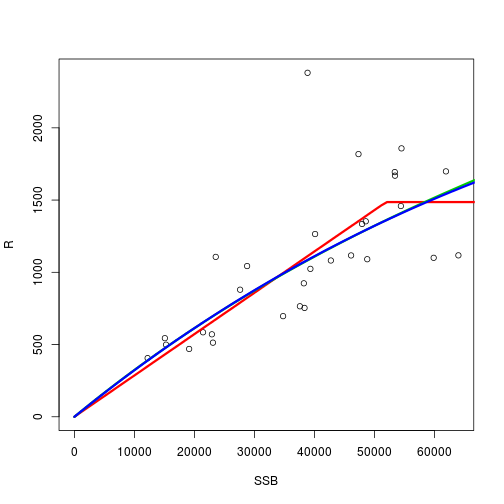
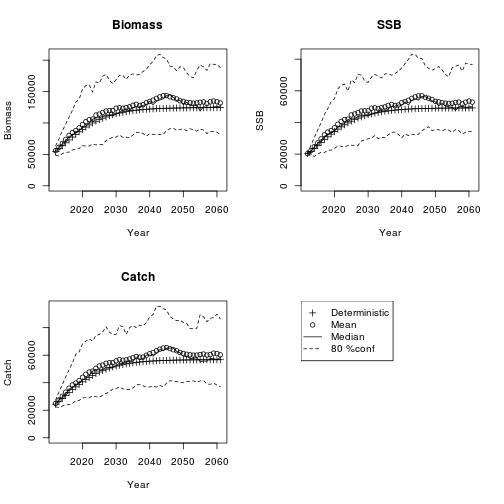
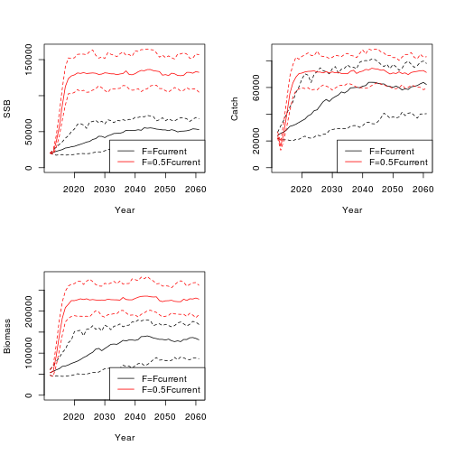
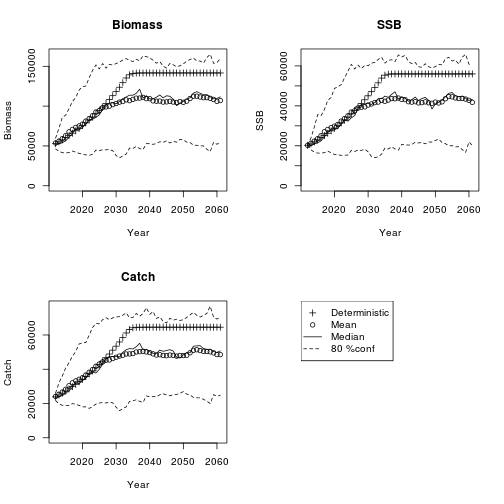
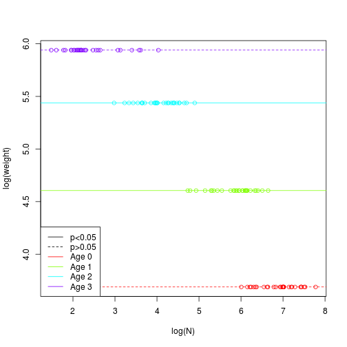
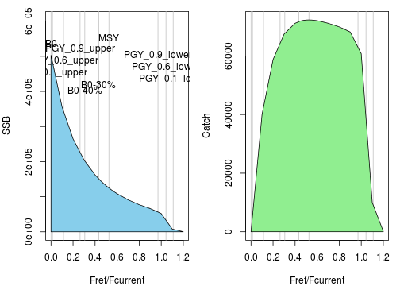
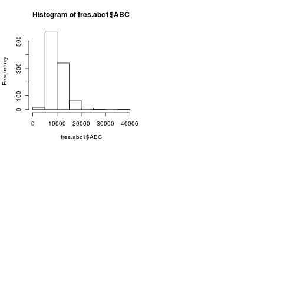
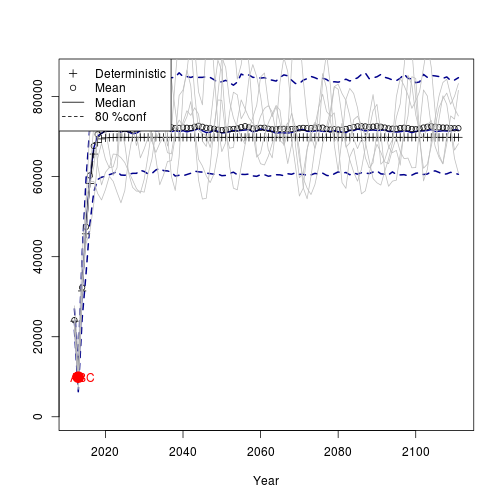
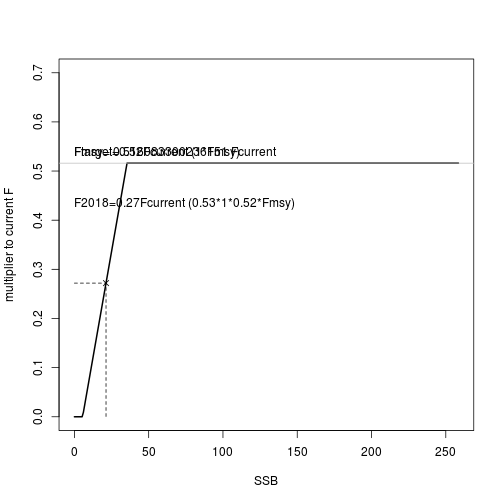

## 0. 更新情報：HP公開版とのちがい

2018/10/11

- 以前からあったout.vpa(VPA等の結果をcsvファイルに出力する)に加えて、read.vpa(特定の書式のcsvファイルにおけるVPA結果を読んで,future.vpaやest.MSY2で使えるvpa結果のオブジェクトにする)を追加
- future.vpaのwaa.funオプションにおけるバグを修正（→以前のバージョンでは、将来予測の１年目のweight at ageの計算にミスがありました）
- その他、future.vpaでpre.catch, new.recオプションを使っている場合、est.MSY2がうまく動かない問題を修正

2018/9/28

- 将来予測関数はfuture2.1.rに更新
- 再生産関係推定の関数をfit.HS, fit.BH, fit.RIから、一括して同じ関数で推定するfit.SRに移行
- MSY推定関数をest.MSYからest.MSY2へ（est.MSY2では近年の自己相関を考慮した管理基準値が計算できます）
- HCRにおけるβを推定する関数 calc.betaを追加
- ABC計算までのRコードを追加

## 1. 事前準備
- データの読み込み，RVPA関数の読み込みなど
- ここで使う関数とデータへのリンク
<!---    - <a href="rvpa1.9.2.r" download="rvpa1.9.2.r">rvpa1.9.2.r</a>  --->
<!---    - <a href="future1.11.r" download="future1.11.r">future1.11.r</a>     --->
    - <a href="http://cse.fra.affrc.go.jp/ichimomo/fish/rvpa1.9.2.r">rvpa1.9.2.r</a>   
    - <a href="https://www.dropbox.com/s/rjpqks8zpuzeqwy/future2.1.r?dl=0">future2.1.r</a>   
    - [例データ](http://cse.fra.affrc.go.jp/ichimomo/fish/data.zip) (展開して作業フォルダにデータを置く)


```r
# 関数の読み込み →  warningまたは「警告」が出るかもしれませんが，その後動いていれば問題ありません
source("../program/rvpa1.9.2.r")
source("../program/future2.1.r")

# データの読み込み
caa <- read.csv("caa_pma.csv",row.names=1)
waa <- read.csv("waa_pma.csv",row.names=1)
maa <- read.csv("maa_pma.csv",row.names=1)
dat <- data.handler(caa=caa, waa=waa, maa=maa, M=0.5)
names(dat)
```

```
## [1] "caa"        "maa"        "waa"        "index"      "M"         
## [6] "maa.tune"   "waa.catch"  "catch.prop"
```


## 2. VPAによる資源量推定

今後はvpa関数の返り値，res.pmaを使って将来予測計算をおこなっていくので，そのためにvpaを実施します．(この辺はあまり詳しく解説しません．)


```r
# VPAによる資源量推定
res.pma <- vpa(dat,fc.year=2009:2011,rec=585,rec.year=2011,tf.year = 2008:2010,
               term.F="max",stat.tf="mean",Pope=TRUE,tune=FALSE,p.init=1.0)
```


```r
res.pma$Fc.at.age # 将来予測やMSY計算で使うcurrent F (fc.yearのオプションでいつのFの平均かが指定される)
```

```
##         0         1         2         3 
## 0.5436309 1.1766833 1.3059521 1.3059519
```

```r
plot(res.pma$Fc.at.age,type="b",xlab="Age",ylab="F",ylim=c(0,max(res.pma$Fc.at.age)))
```


## <font color="Red"> 2.5 VPA結果を外部から読み込む場合(2018/10/11追加) </font>

以下のようにread.vpa関数を使って下さい。
サンプルとなる"out.csv"は<a href="http://cse.fra.affrc.go.jp/ichimomo/fish/out.csv"> こちら </a> にあります。


```r
 res.pma2 <- read.vpa("out.csv")
```


## 3. 再生産関係を仮定しない管理基準値の計算
- ref.F関数を使います
- %SPRやFmaxなど、再生産関係を仮定しない管理基準値を計算します
- 計算結果はrres.pmaに格納されます
- YPR, SPR曲線とFcurrent (```res.pma$Fc.at.a```に入っている値です), Fmax, Fmed, F0.1などの位置が表示されます


```r
byear <- 2009:2011 # 生物パラメータを平均する期間を2009年から2011年とする
rres.pma <- ref.F(res.pma, # VPAの計算結果
                  waa.year=byear, maa.year=byear, M.year=byear, # weight at age, maturity at age, Mは2009から2011年までの平均とする
                  rps.year=2000:2011, # Fmedを計算するときに用いるRPSの範囲
                  max.age=Inf, # SPR計算で仮定する年齢の最大値 
                  pSPR=c(10,20,30,35,40), # F_%SPRを計算するときに，何パーセントのSPRを計算するか
                  Fspr.init=1)
```


- 結果のサマリーは```rres.pma$summary```によって見れます
- max: F at ageの最大値，mean: F at ageの平均値，Fref/Fcur: Fcurrentを分母にしたときのF管理基準値の比
- この結果から，現状のF（Fcurrent）はFmedとほぼ同等（Fref/Fcur=0.96なので），F％SRP=10％くらいであることがわかります


```r
rres.pma$summary
```

```
##           Fcurrent      Fmed     Flow     Fhigh      Fmax      F0.1
## max       1.305952 1.2545205 1.482739 1.0427937 0.7069380 0.3956762
## mean      1.083055 1.0404012 1.229668 0.8648116 0.5862791 0.3281429
## Fref/Fcur 1.000000 0.9606176 1.135370 0.7984931 0.5413200 0.3029791
##               Fmean FpSPR.10.SPR FpSPR.20.SPR FpSPR.30.SPR FpSPR.35.SPR
## max       1.2552763     1.434605    0.8363638    0.5648693    0.4739020
## mean      1.0410280     1.189749    0.6936147    0.4684585    0.3930172
## Fref/Fcur 0.9611963     1.098512    0.6404245    0.4325345    0.3628785
##           FpSPR.40.SPR
## max          0.4000316
## mean         0.3317549
## Fref/Fcur    0.3063142
```

## 4. 再生産関係の推定
### データの作成

- get.SRdataを使って再生産関係のフィット用のデータを作る
- get.SRdata関数では，```rownames(res.pma$naa)```を参照し、必要な年齢分のSSBをずらしたデータを作成する
- yearは加入年


```r
# VPA結果を使って再生産データを作る
SRdata <- get.SRdata(res.pma)
head(SRdata)
```

```
## $year
##  [1] 1982 1983 1984 1985 1986 1987 1988 1989 1990 1991 1992 1993 1994 1995
## [15] 1996 1997 1998 1999 2000 2001 2002 2003 2004 2005 2006 2007 2008 2009
## [29] 2010 2011
## 
## $SSB
##  [1] 12199.02 15266.68 15072.03 19114.22 23544.42 28769.36 34764.44
##  [8] 38219.49 48535.10 61891.08 63966.56 38839.78 53404.29 47322.39
## [15] 54485.00 54385.04 47917.14 46090.77 59847.97 53370.62 48781.21
## [22] 42719.43 40095.38 39311.72 38335.98 37564.69 27604.88 23079.33
## [29] 22902.91 21427.90
## 
## $R
##  [1]  406.0086  498.9652  544.3007  469.6025 1106.8877 1043.4237  696.7049
##  [8]  923.9567 1353.1790 1698.8457 1117.5454 2381.1352 1669.1381 1818.3638
## [15] 1858.0043 1458.9524 1334.9288 1116.9433 1100.4598 1693.9770 1090.7181
## [22] 1081.8377 1265.0559 1024.0418  753.5207  764.9720  879.6573  513.1128
## [29]  570.9195  585.0000
```


```r
# SSBとRのデータだけを持っている場合
SRdata0 <- get.SRdata(R.dat=exp(rnorm(10)),SSB.dat=exp(rnorm(10)))
# 特定の期間のデータだけを使う場合
SRdata0 <- get.SRdata(res.pma,years=1990:2000) 
```

### モデルのフィット
- HS,BH,RIをフィットし，再生産関係のパラメータを推定する
- 結果のオブジェクトのAICcにAICcの値が入っているので，それを比較し，再生産関係を決定する
- 以前のチュートリアルではfit.HS, fit.BH, fit.RIなど、あてはめる関数ごとに関数を分けていましたが、一括してSR.fit関数で計算できるようになりました。
- SR.fitオプション
    - SR:再生産関係のタイプ： "HS"（ホッケー・スティック）、"BH"（べバートン・ホルト）、"RI"（リッカー）
    - AR: 自己相関の考慮なし(AR=1)、過去１年分の自己相関を考慮(AR=1)
    （１年分しか対応していない）
    - method: 最小二乗法（"L2")か最小絶対値法（"L1"）
    - **自己相関あり・なしでAICcを比較し、自己相関を入れたほうがいいかどうか判断する**
        - $\log(R_t)=\log(HS(SSB_t))+\rho \times {\log(R_{t-1})-\log(HS(SSB_{t-1}))}$
        - $\log(R_t)~N(\log(R_t),\sigma^2)$
	- **自己相関パラメータrhoの推定については不安定な部分があります。計算方法の改善により今後値が変わる可能性があります**
	- この例の場合はHSでARなしで最もAICcが小さい→MSY計算ではHS.par0の結果を使う

```r
HS.par0 <- fit.SR(SRdata,SR="HS",method="L2",AR=0,hessian=FALSE)
HS.par1 <- fit.SR(SRdata,SR="HS",method="L2",AR=1,hessian=FALSE)
BH.par0 <- fit.SR(SRdata,SR="BH",method="L2",AR=0,hessian=FALSE)
BH.par1 <- fit.SR(SRdata,SR="BH",method="L2",AR=1,hessian=FALSE)
RI.par0 <- fit.SR(SRdata,SR="RI",method="L2",AR=0,hessian=FALSE)
RI.par1 <- fit.SR(SRdata,SR="RI",method="L2",AR=1,hessian=FALSE)
c(HS.par0$AICc,HS.par1$AICc,BH.par0$AICc,BH.par1$AICc,RI.par0$AICc,RI.par1$AICc)
```

```
## [1] 10.66778 13.27672 11.44803 14.11029 11.40670 14.05799
```
- 結果の図示

```r
plot.SRdata(SRdata)
points(HS.par0$pred$SSB,HS.par0$pred$R,col=2,type="l",lwd=3)
points(BH.par0$pred$SSB,BH.par0$pred$R,col=3,type="l",lwd=3)    
points(RI.par0$pred$SSB,RI.par0$pred$R,col=4,type="l",lwd=3)
```



- TMBオプション(```TMB=TRUE```)も使えます（**ちょっと不安定です。使いたい場合はお問い合わせください**）\
[autoregressiveSR2.cpp](http://cse.fra.affrc.go.jp/ichimomo/fish/autoregressiveSR2.cpp)をダウンロードして，作業フォルダに置く

```r
# install.packages("TMB")　#TMBがインストールされてなければ
library(TMB)
compile("autoregressiveSR2.cpp")
dyn.load(dynlib("autoregressiveSR2"))
HS.par11 <- fit.SR(SRdata,SR="HS",method="L2",AR=1,TMB=TRUE) #marginal likelihood
```

### モデル診断
再生産関係のあてはめのあとは、推定されたパラメータの信頼区間や頑健性などをチェックする必要があります。そのための関数群なども用意しています。詳しくは<a href=SRR-guidline0.html> SRRガイドライン </a> へ


## 5. 将来予測

future.vpa関数を使います

- recfuncの引数に再生産関係の関数を，rec.argにrecfuncに対する引数（再生産関係のパラメータ）を入れる
- バージョンアップにともない、利用できる再生産関係の関数が少なくなりました
     - *** HS.rec: ホッケー・スティック＋加入のリサンプリング（自己相関ありの場合は対応せず）[この関数、一時的に使えなくなっています！使う必要あるかたご連絡ください] ***
     - HS.recAR: ホッケー・スティック＋加入は対数正規分布＋自己相関ありの場合も対応
     - RI.recAR・BH.recAR：HS.recARのリッカー・べバートンホルトバージョン


```r
fres.HS <- future.vpa(res.pma,
                      multi=1,
                      nyear=50, # 将来予測の年数
                      start.year=2012, # 将来予測の開始年
                      N=100, # 確率的計算の繰り返し回数
                      ABC.year=2013, # ABCを計算する年
                      waa.year=2009:2011, # 生物パラメータの参照年
                      maa.year=2009:2011,
                      M.year=2009:2011,
                      is.plot=TRUE, # 結果をプロットするかどうか
                      seed=1,
                      silent=TRUE,
                      recfunc=HS.recAR, # 再生産関係の関数
                      # recfuncに対する引数
                      rec.arg=list(a=HS.par0$pars$a,b=HS.par0$pars$b,
                                   sd=HS.par0$pars$sd,resid=HS.par0$resid))
```


Beverton-Holtを仮定する場合


```r
fres.BH <- future.vpa(res.pma,
                      multi=1,
                      nyear=50, # 将来予測の年数
                      start.year=2012, # 将来予測の開始年
                      N=100, # 確率的計算の繰り返し回数
                      ABC.year=2013, # ABCを計算する年
                      waa.year=2009:2011, # 生物パラメータの参照年
                      maa.year=2009:2011,
                      M.year=2009:2011,
                      is.plot=TRUE, # 結果をプロットするかどうか
                      seed=1,
                      silent=TRUE,
                      recfunc=BH.recAR, # 再生産関係の関数
                      # recfuncに対する引数
                      rec.arg=list(a=BH.par0$pars$a,b=BH.par0$pars$b,
                                   sd=BH.par0$pars$sd,resid=BH.par0$resid))
```



同じ引数を使ってもう一度将来予測をする

- ```fres.HS$input```に、将来予測で使った引数が入っているので、それにdo.call(関数、引数)すると同じ計算を繰り返せる

```r
fres.HS2 <- do.call(future.vpa,fres.HS$input)
```


- fres.HS$inputを上書きすることで，同じ引数を使いながら設定を少しだけ変更した将来予測が実行できる
- 引数```multi```がcurrent Fへの乗数になる
- たとえばmulti=1からmulti=0.5に変更する例は以下のとおり


```r
# 引数をinput.tmpに代入．
input.tmp <- fres.HS2$input
# 引数の一部を変える
input.tmp$multi <- 0.5 # current Fの1/2で漁獲
fres.HS3 <- do.call(future.vpa,input.tmp)
```


plot.futures関数を使って複数の結果を比較


```r
par(mfrow=c(2,2))
plot.futures(list(fres.HS,fres.HS3),legend.text=c("F=Fcurrent","F=0.5Fcurrent"),target="SSB")
plot.futures(list(fres.HS,fres.HS3),legend.text=c("F=Fcurrent","F=0.5Fcurrent"),target="Catch")
plot.futures(list(fres.HS,fres.HS3),legend.text=c("F=Fcurrent","F=0.5Fcurrent"),target="Biomass") 
```



### (5-1) Fの設定やFrec

将来予測における漁獲のシナリオ

- future.vpaの引数```ABC.year```で指定した年から，Fcurrent × multiによるFで漁獲される
- ABC.year-1年まではFcurrentによる漁獲
- Frecに引数を与えることで，任意の資源量に任意の確率で回復させるような将来予測ができます．

**Frecのオプション**

|オプション             |説明                              |
|:----------------------|:---------------------------------|
|stochastic | 確率的将来予測をもとにFrecを計算するかどうか |
|future.year | 条件を満たしているかどうかを判断する年 |
|Blimit | 条件として使われる閾値 |
|scenario | ="blimit": Blimitを**下回る**確率をtarget.probsにする |
|         | ="catch.mean": future.year年の平均漁獲量をBlimitの値と一致させる |
|         | ="ssb.mean": future.year年の平均親魚量をBlimitの値と一致させる | 
|target.probs| scenario="blimit"のときに目的とする確率（パーセントで指定）|
|Frange | 探索するFの範囲．指定しない場合，c(0.01,multi*2)の範囲で探索しますので，うまく推定できない場合はfuture.vpaの引数multiを変えるか，このオプションでそれらしいFの値に限定してください|


```r
# たとえば現状の資源量に維持するシナリオ
fres.currentSSB <- future.vpa(res.pma,
                      multi=0.8,
                      nyear=50, # 将来予測の年数
                      start.year=2012, # 将来予測の開始年
                      N=100, # 確率的計算の繰り返し回数
                      ABC.year=2013, # ABCを計算する年
                      waa.year=2009:2011, # 生物パラメータの参照年
                      maa.year=2009:2011,
                      M.year=2009:2011,seed=1,
                      is.plot=TRUE, # 結果をプロットするかどうか
                      Frec=list(stochastic=TRUE,future.year=2023,Blimit=rev(colSums(res.pma$ssb))[1],scenario="blimit",target.probs=50),
                      recfunc=HS.recAR, # 再生産関係の関数
                      # recfuncに対する引数
                      rec.arg=list(a=HS.par0$pars$a,b=HS.par0$pars$b,
                                   sd=HS.par0$pars$sd,bias.corrected=TRUE))
```

```
## F multiplier=  0.8 seed= 1 
## F multiplier= 1.05842
```


### (5-2) 再生産関係

- 残差リサンプリングで将来予測をする場合→refuncとしてHS.recを使う（***!一時的に使えません!***）

```r
# 残差リサンプリングによる将来予測
fres.HS4 <- future.vpa(res.pma,
                          multi=1,
                          nyear=50, # 将来予測の年数
                          start.year=2012, # 将来予測の開始年
                          N=100, # 確率的計算の繰り返し回数
                          ABC.year=2013, # ABCを計算する年
                          waa.year=2009:2011, # 生物パラメータの参照年
                          maa.year=2009:2011,
                          M.year=2009:2011,
                          is.plot=TRUE, # 結果をプロットするかどうか
                          seed=1,
                          recfunc=HS.rec, # 再生産関係の関数（HS.rec=Hockey-stick)                                
                          rec.arg=list(a=HS.par0$pars$a,b=HS.par0$pars$b,
                                       sd=HS.par0$pars$sd,bias.correction=TRUE,
                                       resample=TRUE,resid=HS.par0$resid))
```

```
## F multiplier=  1 seed= 1
```



残差リサンプリングか対数正規分布かの違いを比較


```r
par(mfrow=c(2,2))
plot(fres.HS$vssb[,-1],fres.HS$naa[1,,-1],xlab="SSB",ylab="Recruits") 
plot(fres.HS4$vssb[,-1],fres.HS4$naa[1,,-1],xlab="SSB",ylab="Recruits") 
plot.futures(list(fres.HS,fres.HS4)) # 両者の比較
```


### (5-3) 年齢別体重が資源尾数に影響される場合の将来予測（2018/06/12新オプションとして追加）
- ***future.vpaで，waa.fun = TRUEとすれば、年齢別資源重量が資源尾数（log(体重)~log(資源尾数)の回帰を関数内部で実行）の関数から予測されます***
- ***不確実性も考慮されます***
- 30系群であてはめた例は<a href="waa-lm.pdf">こちら</a> (データは1年分古いです)
- 太平洋マイワシ，対馬マイワシ，太平洋マサバ，ホッケ，瀬戸内サワラでは年齢別体重と年齢別資源尾数に関係がありそうなかんじです


```r
lm.res <- plot.waa(res.pma) # weight at ageが資源尾数の関数になっているかどうか，確認してみる．この例の場合は特に有意な関係はない
```

```
## Warning in summary.lm(lm.list[[i]]): essentially perfect fit: summary may
## be unreliable

## Warning in summary.lm(lm.list[[i]]): essentially perfect fit: summary may
## be unreliable

## Warning in summary.lm(lm.list[[i]]): essentially perfect fit: summary may
## be unreliable

## Warning in summary.lm(lm.list[[i]]): essentially perfect fit: summary may
## be unreliable
```



```r
# lm.resの中に回帰した結果が年齢分だけ入っています
fres.HS6 <- fres.HS
fres.HS6$input$waa.fun <- TRUE
fres.HS6$input$N <- 1000
fres.HS6 <- do.call(future.vpa, fres.HS6$input)
```


## 6. MSY管理基準値の計算
- MSY管理基準値計算では，上記の将来予測において，Fの値を様々に変えたときの平衡状態（世代時間×20年を```nyear```で指定します）における資源量やそれに対応するF等を管理基準値として算出します
- *** なので、ここまでのプロセスで、ABC計算のためにきちんとしたオプションを設定したfuture.vpaを実行しておいてください。その返り値```fres.HS```をMSY計算では使っていきます ***
<--- [* ```is.plot=TRUE```とするとFを様々に変えたときの平均親魚資源量と平均漁獲量，対応するFの管理基準値を出力します] --->
- est.MSY(ちょっと古いバージョン、B0基準のMSYも算出されます)とest.MSY2（新しいバージョン、ARありの場合に対応します）の２つがあります。ABCの試算にはest.MSY2を使って下さい

### est.MSY(ARを考慮していないバージョン)の説明
- この関数で計算できる管理基準値は以下のようなものになります

| 管理基準値 |説明 | 
|:----------------------|:---------------------------------|
| SSB_MSY | 平衡状態において平均最大漁獲量が最大になるときの親魚量 |
| SSB_0 (XX%) | F=0で将来予測したときの平衡状態における親魚量($B_0$)に対する割合（引数```B0percent```でc(0.4, 0.5)のように指定します） |
| SSB_PGY (LXX%) (HXX%)| SS_MSYで達成される漁獲量のXX%を達成するときの親魚量の下限または上限（引数```PGY```でc(0.9, 0.95)のように指定します） |


```r
# MSY管理基準値の計算

# 世代時間の計算→この20倍がMSY計算のさいの将来予測期間になります
GT <- Generation.Time(res.pma,maa.year=2009:2011, M.year=2009:2011,Plus = 100)

MSY.HS <- est.MSY(res.pma, # VPAの計算結果
                 fres.HS$input, # 将来予測で使用した引数
                 nyear=20*GT,N=100, # 将来予測の年数，繰り返し回数
                 PGY=c(0.9,0.6,0.1),B0percent=c(0.3,0.4)) # PGYとB0%レベル
```

```
## Estimating MSY
## F multiplier= 0.5252164 
## Estimating PGY  90 %
## F multiplier= 0.2636767 
## F multiplier= 0.9704383 
## Estimating PGY  60 %
## F multiplier= 0.1132016 
## F multiplier= 1.043157 
## Estimating PGY  10 %
## F multiplier= 0.01321078 
## F multiplier= 1.108316 
## Estimating B0  30 %
## F multiplier= 0.4330439 
## Estimating B0  40 %
## F multiplier= 0.3064784
```



結果の要約は```MSY.HS$summary```になります．


```r
# 結果の表示
MSY.HS$summary
```

```
##                    SSB        B          U    Catch  Fref/Fcur
## MSY           125040.8 223373.5  0.3236417 72292.99  0.5252164
## B0            503044.1 613191.2          0        0          0
## PGY_0.9_upper 223824.4 327619.4  0.1985929 65062.91  0.2636767
## PGY_0.9_lower 57821.15   144908  0.4489952 65063.01  0.9704383
## PGY_0.6_upper 341598.2 448906.4 0.09661459 43370.91  0.1132016
## PGY_0.6_lower 35632.34 93349.12  0.4645684 43367.05   1.043157
## PGY_0.1_upper 478855.7 588662.5 0.01228751 7233.198 0.01321078
## PGY_0.1_lower 5643.458 15059.02  0.4794063 7219.388   1.108316
## B0-30%        150916.3 251086.1  0.2856432 71721.05  0.4330439
## B0-40%        201214.2 304061.4  0.2230259 67813.58  0.3064784
##               Fref2Fcurrent          F0         F1         F2         F3
## MSY               0.5252164   0.2855239  0.6180134  0.6859075  0.6859074
## B0                        0           0          0          0          0
## PGY_0.9_upper     0.2636767   0.1433428   0.310264  0.3443492  0.3443491
## PGY_0.9_lower     0.9704383   0.5275602   1.141898   1.267346   1.267346
## PGY_0.6_upper     0.1132016   0.0615399  0.1332025  0.1478359  0.1478359
## PGY_0.6_lower      1.043157   0.5670922   1.227465   1.362313   1.362312
## PGY_0.1_upper    0.01321078 0.007181791 0.01554491 0.01725265 0.01725265
## PGY_0.1_lower      1.108316   0.6025147   1.304136   1.447407   1.447407
## B0-30%            0.4330439   0.2354161  0.5095555  0.5655346  0.5655345
## B0-40%            0.3064784   0.1666111   0.360628  0.4002461   0.400246
```

- MSY.HSには，F=0, F=Fmsy, F=引数で指定されたPGYやSPRに対応するFで将来予測した結果も格納されています（→ファイルサイズ大きくなりますので注意！）
    - fout0: F=0の結果
    - fout.msy: F=Fmsyの結果
    - fout.B0percent: F=F0基準によるF（複数の結果がリスト形式で入っています）
    - fout.PGY: PGY基準によるF（複数の結果がリスト形式で入っています）

```r
names(MSY.HS)
```

```
## [1] "all.stat"       "summary"        "trace"          "fout0"         
## [5] "fout.msy"       "fout.B0percent" "fout.PGY"
```
### est.MSY2（ARを考慮できるバージョン；ABCの試算にはこちらを使って下さい）の説明

```r
par(mfrow=c(1,1))
# est.MSY2では世代時間の計算×２０年分を自動的に将来予測するようになっています
MSY.HS2 <- est.MSY2(res.pma, # VPAの結果
                    sim0=fres.HS, # 将来予測の結果
                    future.function.name="future.vpa", # 将来予測で使う関数の名前（future.vpaを使って下さい）
                    res1=HS.par0, # 再生産関係のパラメータ(sim0でfres.HSを与えている場合、ここは使用されない)
                    N=100, # 実際に計算する場合は、少なくとも１万以上の値を使って下さい
                    current.resid=5) # ARありモデルを使う場合、将来予測において何年分の残差を考慮するか
# 結果の要約
MSY.HS2$summary
```

```
##                       Equiribrium with AR Fref/Fcurrent
## Bmsy                       127730  129244          0.52
## B_pgy_90%_L                 58417   59466          0.96
## B_limit (B_pgy_60%_L)       35362   35428          1.05
## B_ban (B_pgy_10%_L)          5582    5529          1.12
## Recent residual                NA      NA            NA
```

```r
## BHを仮定する場合
MSY.BH2 <- est.MSY2(res.pma, # VPAの結果
                    sim0=fres.BH, # 将来予測の結果
                    future.function.name="future.vpa", # 将来予測で使う関数の名前（future.vpaを使って下さい）
                    res1=BH.par0, # 再生産関係のパラメータ(sim0でfres.HSを与えている場合、ここは使用されない)
                    N=100, # 実際に計算する場合は、少なくとも１万以上の値を使って下さい
                    current.resid=5) # ARありモデルを使う場合、将来予測において何年分の残差を考慮するか
```

- 結果の表の説明

|     管理基準値 | 平衡状態における値| 近年の残差を考慮して５年間将来予測したときの値＝管理基準値として使う|Fcurrentに対する乗数| |
|:----------------------|:--------------------|:--------------------|:--------------------|:--------------------|
|                     | Equiribrium |with AR| Fref/Fcurrent|   |
|Bmsy                 |      128212|  128903  |        0.51| Bmsy=Btarget |
|Bpgy90%L           |      58664 |  58753  |        0.96| PGY90%がtargetの範囲の下限として考えられる？|
|Blimit(Bpgy60%L) |      35326  | 35435    |      1.05| PGY60%はBlimitの候補の一つ | 
|Bban(Bpgy10%L)   |       5558  |  5210    |      1.13| PGY10%はBbanの候補となる|
|Recent residual       |         NA   |   NA      |      NA| 近年の残差を考慮する場合、近年の残差の値が入る |

Bmsyの行のFref/Fcurrentが現行のFからのFの削減率になります（（Fref/Fcurrent-1)×100が資源評価票の要約表の「現状のF値からの増減％」に相当します）。この値にさらにβ（Btargetを上回る確率が５０％かつBlimitを上回る確率が９０％以上になるように調整する係数）と(B-Bban)/(Blim-Bban)を乗じたFをもとにABCが算定されます

## 8. HCRの計算とABCの算出
### betaの計算
- HCRにおけるβはcalc.beta関数から計算します。
- 引数としてBtarget, Blimit, Bbanを与える必要があります


```r
beta <- calc.beta(res=MSY.HS2,# MSYの計算結果
                  prob.beta=c(0.5,0.9), # Btarget, Blimitを何パーセントの確率で上回るか
                  Btar=MSY.HS2$Btar, # Btargetの値
                  Blim=MSY.HS2$Blim, # Blimitの値
                  Bban=MSY.HS2$Bban, # Bbanの値
                  Fmsy=MSY.HS2$Fmsy) # Fmsyの値
```

```
## beta= 0.99
```

```r
beta[[1]]$beta # 平衡状態におけるSSBの分布が正規分布から外れる(平均値と中央値がずれるため)ほど・分散が大きいほど（Blimitを90%の確率で上回る条件が効いてくるため）betaの値は小さくなる
```

```
## [1] 0.9928483
```

### HCRをもとに将来予測→ABC計算
- 決定されたHCRのもとで将来予測計算をおこないます
- 資源評価最終年＋２年目の「平均」漁獲量をABCとします
- そのときに用いる親魚資源量は資源評価最終年＋２年目の親魚資源量です


```r
input.abc <- fres.HS$input # 将来予測の引数は以前のものを使う
input.abc$multi <- MSY.HS2$Fmsy # 基本とするFはFmsy
input.abc$N <- 100 # 実際に計算するときは10000以上を使ってください
input.abc$HCR <- list(Blim=MSY.HS2$Blim, Bban=MSY.HS2$Bban,beta=beta[[1]]$beta) # HCRのパラメータを指定する
input.abc$nyear <- 20
input.abc$is.plot <- TRUE
fres.abc1 <- do.call(future.vpa,input.abc)
```


```r
hist(fres.abc1$ABC) # ABCの分布
ABC <- mean(fres.abc1$ABC) # 平均値をABCとする

## SSBの将来予測結果
par(mfrow=c(1,1))
```



```r
plot.future(fres.abc1,what=c(FALSE,TRUE,FALSE),is.legend=TRUE,lwd=2,
            col="darkblue",N=5,label=rep(NA,3))
draw.refline(MSY.HS2$summary,horiz=TRUE,lwd=1,scale=1)
```


```r
## 漁獲量の将来予測結果
par(mfrow=c(1,1))
plot.future(fres.abc1,what=c(FALSE,FALSE,TRUE),is.legend=TRUE,lwd=2,
            col="darkblue",N=5,label=rep(NA,3))
points(rownames(fres.abc1$vssb)[2],ABC,pch=20,col=2,cex=3)
text(as.numeric(rownames(fres.abc1$vssb)[2])+1,ABC,"ABC",col=2)
```



```r
## 実際に、どんなFが将来予測で使われているか
boxplot(t(fres.abc1$faa[1,,]/fres.abc1$faa[1,1,]),ylab="multiplier to current F")
```


```r
# どんなHCRなのか書いてみる
ssb.abc <- mean(fres.abc1$vssb[2,]) # ABC計算年のssbをとる
plot.HCR(alpha=beta[[1]]$beta,bban=MSY.HS2$Bban,blimit=MSY.HS2$Blim,btarget=MSY.HS2$Btar,lwd=2,
         xlim=c(0,MSY.HS2$Btar*2),ssb.cur=ssb.abc,Fmsy=MSY.HS2$Fmsy,yscale=0.7,scale=1000)
```




```r
plot(apply(fres.abc1$vssb>MSY.HS2$summary[1,1],1,mean)*100,type="b",ylab="Probability",ylim=c(0,100))
points(apply(fres.abc1$vssb>MSY.HS2$summary[1,2],1,mean)*100,pch=2,type="b")
points(apply(fres.abc1$vssb>MSY.HS2$summary[3,1],1,mean)*100,pch=1,col=2,type="b")
points(apply(fres.abc1$vssb>MSY.HS2$summary[3,2],1,mean)*100,pch=2,col=2,type="b")
abline(h=c(50,90),col=c(1,2))
legend("bottomright",col=c(1,1,2,2),title="Probs",pch=c(1,2,1,2),legend=c(">Btarget_Eq",">Btarget_AR",">Blimit_Eq",">Blimit_AR"))
```


## 9. ABC計算までのまとめ（時間がない人はここからスタート）

MSY管理基準値を計算は以下の手順でおこないます．

1. データの読み込み

```r
# 関数の読み込み →  warningまたは「警告」が出るかもしれませんが，その後動いていれば問題ありません
source("../program/rvpa1.9.2.r")
source("../program/future2.1.r")

# データの読み込み
caa <- read.csv("caa_pma.csv",row.names=1)
waa <- read.csv("waa_pma.csv",row.names=1)
maa <- read.csv("maa_pma.csv",row.names=1)
dat <- data.handler(caa=caa, waa=waa, maa=maa, M=0.5)
names(dat)
```
2. VPAの実施(vpa)　→ res.pma(VPAの結果)を得る
   - current Fとしてどのような値を使うか、ここで設定しておく（fc.yearオプションで、何年から何年のFを平均するか指定)

```r
# VPAによる資源量推定
res.pma <- vpa(dat,fc.year=2009:2011,rec=585,rec.year=2011,tf.year = 2008:2010,
               term.F="max",stat.tf="mean",Pope=TRUE,tune=FALSE,p.init=1.0)
```
3. 再生産関係パラメータのあてはめ (fit.SR)　→  HS.par0 (HSにあてはめたときのパラメータ推定結果)を得る
   - 残差の自己相関がある・なしを決める。ある場合はAR=1としたときの結果を用います。

```r
# VPA結果を使って再生産データを作る
SRdata <- get.SRdata(res.pma)
head(SRdata)
```

```r
HS.par0 <- fit.SR(SRdata,SR="HS",method="L2",AR=0,hessian=FALSE)
HS.par1 <- fit.SR(SRdata,SR="HS",method="L2",AR=1,hessian=FALSE)
BH.par0 <- fit.SR(SRdata,SR="BH",method="L2",AR=0,hessian=FALSE)
BH.par1 <- fit.SR(SRdata,SR="BH",method="L2",AR=1,hessian=FALSE)
RI.par0 <- fit.SR(SRdata,SR="RI",method="L2",AR=0,hessian=FALSE)
RI.par1 <- fit.SR(SRdata,SR="RI",method="L2",AR=1,hessian=FALSE)
c(HS.par0$AICc,HS.par1$AICc,BH.par0$AICc,BH.par1$AICc,RI.par0$AICc,RI.par1$AICc)
```
4. HS.par0をもとに将来予測を実施する(future.vpa) → fres.HS (HSを仮定したときの将来予測結果)を得る
   - 生物パラメータを平均する年,ABC計算年などのオプションを設定
   - 資源量と年齢別の体重に相関がある場合はそれを将来予測の設定に取り込む(waa.fun=TRUE)

```r
fres.HS <- future.vpa(res.pma,
                      multi=1,
                      nyear=50, # 将来予測の年数
                      start.year=2012, # 将来予測の開始年
                      N=100, # 確率的計算の繰り返し回数
                      ABC.year=2013, # ABCを計算する年
                      waa.year=2009:2011, # 生物パラメータの参照年
                      maa.year=2009:2011,
                      M.year=2009:2011,
                      is.plot=TRUE, # 結果をプロットするかどうか
                      seed=1,
                      silent=TRUE,
                      recfunc=HS.recAR, # 再生産関係の関数
                      # recfuncに対する引数
                      rec.arg=list(a=HS.par0$pars$a,b=HS.par0$pars$b,
                                   sd=HS.par0$pars$sd,resid=HS.par0$resid))
```
5. res.pmaとfres.HSを使ってMSY管理基準値を計算する (est.MSY2) → MSY.HS2 (管理基準値の推定結果)を得る
   - 最新のest.MSY2関数を使って下さい

```r
par(mfrow=c(1,1))
# est.MSY2では世代時間の計算×２０年分を自動的に将来予測するようになっています
MSY.HS2 <- est.MSY2(res.pma, # VPAの結果
                    sim0=fres.HS, # 将来予測の結果
                    future.function.name="future.vpa", # 将来予測で使う関数の名前（future.vpaを使って下さい）
                    res1=HS.par0, # 再生産関係のパラメータ(sim0でfres.HSを与えている場合、ここは使用されない)
                    N=100, # 実際に計算する場合は、少なくとも１万以上の値を使って下さい
                    current.resid=5) # ARありモデルを使う場合、将来予測において何年分の残差を考慮するか
# 結果の要約
MSY.HS2$summary

## BHを仮定する場合
MSY.BH2 <- est.MSY2(res.pma, # VPAの結果
                    sim0=fres.BH, # 将来予測の結果
                    future.function.name="future.vpa", # 将来予測で使う関数の名前（future.vpaを使って下さい）
                    res1=BH.par0, # 再生産関係のパラメータ(sim0でfres.HSを与えている場合、ここは使用されない)
                    N=100, # 実際に計算する場合は、少なくとも１万以上の値を使って下さい
                    current.resid=5) # ARありモデルを使う場合、将来予測において何年分の残差を考慮するか
```

6. 管理基準値からβを計算する（calc.beta）

```r
beta <- calc.beta(res=MSY.HS2,# MSYの計算結果
                  prob.beta=c(0.5,0.9), # Btarget, Blimitを何パーセントの確率で上回るか
                  Btar=MSY.HS2$Btar, # Btargetの値
                  Blim=MSY.HS2$Blim, # Blimitの値
                  Bban=MSY.HS2$Bban, # Bbanの値
                  Fmsy=MSY.HS2$Fmsy) # Fmsyの値
beta[[1]]$beta # 平衡状態におけるSSBの分布が正規分布から外れる(平均値と中央値がずれるため)ほど・分散が大きいほど（Blimitを90%の確率で上回る条件が効いてくるため）betaの値は小さくなる
```

7. 決定されたHCRを用いて20年程度の将来予測を実施し、ABC算出年のABCを計算する
   - 10年後にBtargetを上回る確率なども計算

```r
input.abc <- fres.HS$input # 将来予測の引数は以前のものを使う
input.abc$multi <- MSY.HS2$Fmsy # 基本とするFはFmsy
input.abc$N <- 100 # 実際に計算するときは10000以上を使ってください
input.abc$HCR <- list(Blim=MSY.HS2$Blim, Bban=MSY.HS2$Bban,beta=beta[[1]]$beta) # HCRのパラメータを指定する
input.abc$nyear <- 20
input.abc$is.plot <- TRUE
fres.abc1 <- do.call(future.vpa,input.abc)
hist(fres.abc1$ABC) # ABCの分布
ABC <- mean(fres.abc1$ABC) # 平均値をABCとする

## SSBの将来予測結果
par(mfrow=c(1,1))
plot.future(fres.abc1,what=c(FALSE,TRUE,FALSE),is.legend=TRUE,lwd=2,
            col="darkblue",N=5,label=rep(NA,3))
draw.refline(MSY.HS2$summary,horiz=TRUE,lwd=1,scale=1)

## 漁獲量の将来予測結果
par(mfrow=c(1,1))
plot.future(fres.abc1,what=c(FALSE,FALSE,TRUE),is.legend=TRUE,lwd=2,
            col="darkblue",N=5,label=rep(NA,3))
points(rownames(fres.abc1$vssb)[2],ABC,pch=20,col=2,cex=3)
text(as.numeric(rownames(fres.abc1$vssb)[2])+1,ABC,"ABC",col=2)

## 実際に、どんなFが将来予測で使われているか
boxplot(t(fres.abc1$faa[1,,]/fres.abc1$faa[1,1,]),ylab="multiplier to current F")
```

```r
# どんなHCRなのか書いてみる
ssb.abc <- mean(fres.abc1$vssb[2,]) # ABC計算年のssbをとる
plot.HCR(alpha=beta[[1]]$beta,bban=MSY.HS2$Bban,blimit=MSY.HS2$Blim,btarget=MSY.HS2$Btar,lwd=2,
         xlim=c(0,MSY.HS2$Btar*2),ssb.cur=ssb.abc,Fmsy=MSY.HS2$Fmsy,yscale=0.7,scale=1000)
```

```r
plot(apply(fres.abc1$vssb>MSY.HS2$summary[1,1],1,mean)*100,type="b",ylab="Probability",ylim=c(0,100))
points(apply(fres.abc1$vssb>MSY.HS2$summary[1,2],1,mean)*100,pch=2,type="b")
points(apply(fres.abc1$vssb>MSY.HS2$summary[3,1],1,mean)*100,pch=1,col=2,type="b")
points(apply(fres.abc1$vssb>MSY.HS2$summary[3,2],1,mean)*100,pch=2,col=2,type="b")
abline(h=c(50,90),col=c(1,2))
legend("bottomright",col=c(1,1,2,2),title="Probs",pch=c(1,2,1,2),legend=c(">Btarget_Eq",">Btarget_AR",">Blimit_Eq",">Blimit_AR"))
```


  
