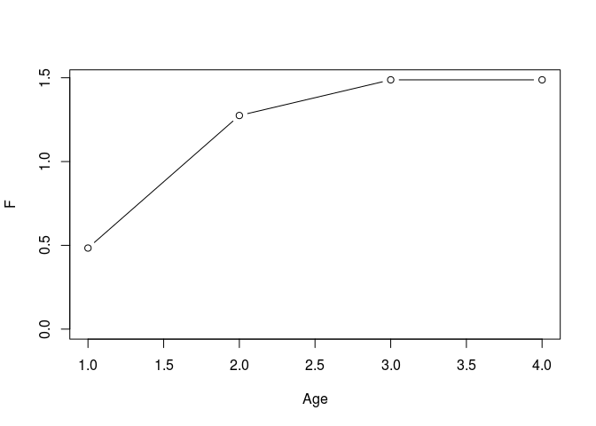
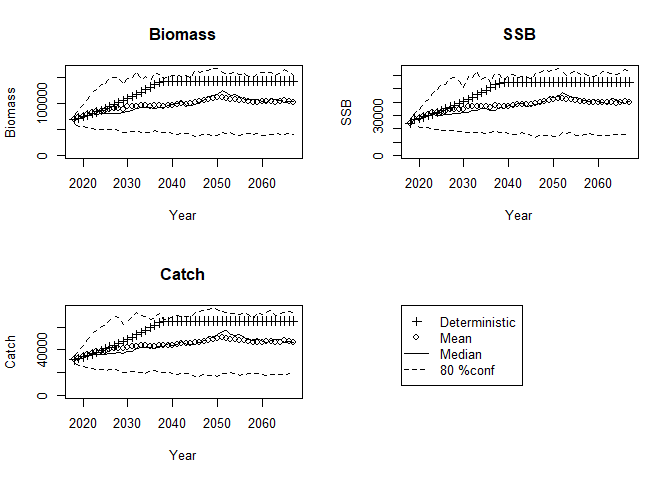
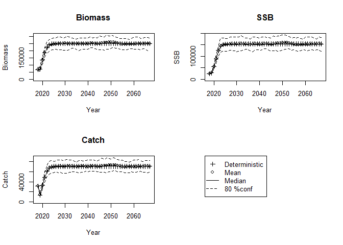

MSY推定用のRコード（ダイジェスト版）
================
Momoko Ichinokawa
2019-03-05

本マニュアルの完全版(細かいオプションの説明などがあります)はこちら <https://ichimomo.github.io/future-rvpa/future-doc-abc.html>

事前準備
========

データの読み込み
----------------

    [1] "caa"        "maa"        "waa"        "index"      "M"         
    [6] "maa.tune"   "waa.catch"  "catch.prop"

VPAによる資源量推定
-------------------

-   **設定ポイント:** vpa関数の引数fc.yearで指定した年数が今後current FのFとして扱われます。

-   [VPA結果を外部から読み込む場合](https://ichimomo.github.io/future-rvpa/future-doc-abc.html#vpa%E7%B5%90%E6%9E%9C%E3%82%92%E5%A4%96%E9%83%A8%E3%81%8B%E3%82%89%E8%AA%AD%E3%81%BF%E8%BE%BC%E3%82%80%E5%A0%B4%E5%90%88)
-   [再生産関係を仮定しない管理基準値の計算](https://ichimomo.github.io/future-rvpa/future-doc-abc.html#%E5%86%8D%E7%94%9F%E7%94%A3%E9%96%A2%E4%BF%82%E3%82%92%E4%BB%AE%E5%AE%9A%E3%81%97%E3%81%AA%E3%81%84%E7%AE%A1%E7%90%86%E5%9F%BA%E6%BA%96%E5%80%A4%E3%81%AE%E8%A8%88%E7%AE%97)

<!-- -->

            0         1         2         3 
    0.4838556 1.2749150 1.4877701 1.4877698 

再生産関係の推定
----------------

-   詳しい解説は[こちら](https://ichimomo.github.io/future-rvpa/future-doc-abc.html#%E5%86%8D%E7%94%9F%E7%94%A3%E9%96%A2%E4%BF%82%E3%81%AE%E6%8E%A8%E5%AE%9A)
-   上記を参考に、AICで比較したあと、フィットした再生産関係のプロットなどをみて、ちゃんと推定できてそうか確かめて下さい
-   [モデル診断](https://ichimomo.github.io/future-rvpa/SRR-guidline.html)も行って下さい。
-   **設定ポイント:** get.SRdata関数のyearsの引数で、再生産関係をフィットさせたい年を指定します。何も指定しないと全年のデータが使われます。
-   **設定ポイント:** ここで、将来予測で使う再生産関係を一つに決めます(SRmodel.baseに入れる)。

<!-- -->

    $year
     [1] 1988 1989 1990 1991 1992 1993 1994 1995 1996 1997 1998 1999 2000 2001
    [15] 2002 2003 2004 2005 2006 2007 2008 2009 2010 2011 2012 2013 2014 2015
    [29] 2016

    $SSB
     [1] 12199.02 15266.68 15072.03 19114.22 23544.42 28769.36 34764.44
     [8] 38219.49 48535.10 61891.08 63966.56 38839.78 53404.29 47322.39
    [15] 54485.00 54385.04 47917.14 46090.76 59847.97 53370.62 48781.20
    [22] 42719.39 40095.19 39311.04 38332.44 37547.09 27543.26 22881.37
    [29] 22184.28

    $R
     [1]  406.0086  498.9652  544.3007  469.6025 1106.8877 1043.4237  696.7049
     [8]  923.9567 1353.1790 1698.8457 1117.5454 2381.1352 1669.1381 1818.3638
    [15] 1858.0043 1458.9524 1334.9288 1116.9433 1100.4598 1693.9768 1090.7172
    [22] 1081.8343 1265.0456 1023.9650  753.1901  764.0987  876.6335  500.9416
    [29]  549.3746

       SR.rel AR.type L.type     AICc delta.AIC
    7      HS       0     L2 11.68088 0.0000000
    9      RI       0     L2 12.30980 0.6289293
    8      BH       0     L2 12.35364 0.6727687
    2      BH       0     L1 13.79426 2.1133843
    3      RI       0     L1 13.87867 2.1977984
    5      BH       1     L1 14.09788 2.4170057
    6      RI       1     L1 14.10137 2.4204994
    10     HS       1     L2 14.32407 2.6431965
    1      HS       0     L1 14.75174 3.0708666
    12     RI       1     L2 14.99619 3.3153125
    11     BH       1     L2 15.05006 3.3691864
    4      HS       1     L1 15.68126 4.0003803

将来予測
--------

-   細かい設定の解説は[こちら](https://ichimomo.github.io/future-rvpa/future-doc-abc.html#%E5%B0%86%E6%9D%A5%E4%BA%88%E6%B8%AC)
    -   自己相関を考慮する場合
    -   Frecオプション（目標の年に指定した確率で漁獲する）
    -   年齢別体重が資源尾数に影響される場合、などのオプションがあります
-   **設定ポイント:**　将来予測やMSY推定で使う生物パラメータをここで指定します（`waa.year`, `maa.year`, `M.year`）。ABC計算年（`ABC.year`）などの設定もここで。
-   **設定ポイント:**　再生産関係の関数型とパラメータも与えます。`rec.fun`に関数名を、`rec.arg`にリスト形式で引数を与えます。
-   これはFcurrentでの将来予測を実施しますが、今後の管理基準値計算でもここで指定したオプションを引き継いで使っていきます
-   近年の加入の仮定(`rec.new`)や近年の漁獲量(`pre.catch`)を設定する場合にはここで設定してください
-   引数 `silent == TRUE` とすると、設定した引数のリストがすべて表示されます。意図しない設定などがないかどうか確認してください。

<!-- -->

    $ABC.year
    [1] 2019

    $Blim
    [1] 0

    $F.sigma
    [1] 0

    $Frec
    NULL

    $HCR
    NULL

    $M
    NULL

    $M.year
    [1] 2015 2016 2017

    $N
    [1] 100

    $Pope
    [1] TRUE

    $add.year
    [1] 0

    $currentF
    NULL

    $delta
    NULL

    $det.run
    [1] TRUE

    $eaa0
    NULL

    $faa0
    NULL

    $is.plot
    [1] TRUE

    $maa
    NULL

    $maa.year
    [1] 2015 2016 2017

    $multi
    [1] 1

    $multi.year
    [1] 1

    $naa0
    NULL

    $nyear
    [1] 50

    $outtype
    [1] "FULL"

    $plus.group
    [1] TRUE

    $pre.catch
    NULL

    $random.select
    NULL

    $rec.arg
    $rec.arg$a
    [1] 0.02864499

    $rec.arg$b
    [1] 51882.06

    $rec.arg$rho
    [1] 0

    $rec.arg$sd
    [1] 0.2624895

    $rec.arg$resid
     [1]  0.15003999  0.13188525  0.23168312 -0.15352429  0.49544035
     [6]  0.23597319 -0.35721137 -0.16965875 -0.02705374  0.13375295
    [11] -0.28506140  0.76090931  0.11611132  0.29373043  0.22330688
    [16] -0.01847747 -0.02781840 -0.16723995 -0.30046800  0.13088282
    [21] -0.24773256 -0.12321799  0.09662881 -0.09504603 -0.37695727
    [26] -0.34187713  0.10535290 -0.26881174 -0.14558152

    $rec.new
    NULL

    $recfunc
    function (ssb, vpares, rec.resample = NULL, rec.arg = list(a = 1000, 
        b = 1000, sd = 0.1, rho = 0, resid = 0)) 
    {
        rec0 <- ifelse(ssb > rec.arg$b, rec.arg$a * rec.arg$b, rec.arg$a * 
            ssb)
        rec <- rec0 * exp(rec.arg$rho * rec.arg$resid)
        rec <- rec * exp(rnorm(length(ssb), -0.5 * rec.arg$sd2^2, 
            rec.arg$sd))
        new.resid <- log(rec/rec0) + 0.5 * rec.arg$sd2^2
        return(list(rec = rec, rec.resample = new.resid))
    }

    $replace.rec.year
    [1] 2012

    $seed
    [1] 1

    $silent
    [1] FALSE

    $start.year
    [1] 2018

    $waa
    NULL

    $waa.catch
    NULL

    $waa.fun
    [1] FALSE

    $waa.year
    [1] 2015 2016 2017

MSY管理基準値の計算
-------------------

-   MSY管理基準値計算では，上記の将来予測において，Fcurrentの値に様々な乗数を乗じたF一定方策における平衡状態時の（世代時間×20年を`nyear`で指定します）資源量やそれに対応するF等を管理基準値として算出します
-   なので、ここまでのプロセスで、ABC計算のためにきちんとしたオプションを設定したfuture.vpaを実行しておいてください。その返り値`future.Fcurrent`をMSY計算では使っていきます
-   MSY.est関数の引数の詳細な解説は[こちら](https://ichimomo.github.io/future-rvpa/future-doc-abc.html#msy%E7%AE%A1%E7%90%86%E5%9F%BA%E6%BA%96%E5%80%A4%E3%81%AE%E8%A8%88%E7%AE%97)
-   オプション`PGY`(MSYに対する比率を指定) や`B0percent`(B0に対する比率を指定)、`Bempirical`(親魚資源量の絶対値で指定)で、別の管理基準値も同時に計算できます。
-   最近年の親魚量で維持した場合の管理基準値も、比較のためにあとで見るため`Bempirical`で指定しておいてください。また、B\_HS(HSの折れ点)や最大親魚量などもここで計算しておいても良いかと。。。

### 結果の表示

-   `MSY.base$summary_tb`にすべての結果が入っています。

<!-- -->

    # A tibble: 34 x 13
       RP_name AR       SSB      B      U  Catch `Fref/Fcur` `SSB/SSB0`
       <chr>   <lgl>  <dbl>  <dbl>  <dbl>  <dbl>       <dbl>      <dbl>
     1 MSY     FALSE 1.25e5 2.21e5 0.325  71794.      0.490      0.256 
     2 B0      FALSE 4.88e5 5.93e5 0          0       0          1     
     3 PGY_0.… FALSE 1.90e5 2.89e5 0.236  68205.      0.301      0.389 
     4 PGY_0.… FALSE 6.97e4 1.60e5 0.427  68205.      0.832      0.143 
     5 PGY_0.… FALSE 2.19e5 3.20e5 0.202  64615.      0.244      0.450 
     6 PGY_0.… FALSE 5.85e4 1.44e5 0.447  64615.      0.931      0.120 
     7 PGY_0.… FALSE 3.32e5 4.36e5 0.0988 43080.      0.104      0.681 
     8 PGY_0.… FALSE 3.55e4 9.37e4 0.460  43074.      1.01       0.0728
     9 PGY_0.… FALSE 4.64e5 5.70e5 0.0126  7172.      0.0121     0.952 
    10 PGY_0.… FALSE 5.56e3 1.52e4 0.473   7175.      1.08       0.0114
    # ... with 24 more rows, and 5 more variables: Fref2Fcurrent <dbl>,
    #   F0 <dbl>, F1 <dbl>, F2 <dbl>, F3 <dbl>

### 管理基準値の選択

-   **設定ポイント** est.MSYで計算された管理基準値から、何をBtarget, Blimit, Bbanとして用いるかをチョイスします。
-   具体的には、refs.allにRP.definitionという新しい列をひとつ作って、その列にそれぞれの管理基準値をどのように使うかを指定します
-   「管理基準値名 + 0」はデフォルト規則による管理基準値
-   代替候補がある場合は「管理基準値名 + 数字」として指定
-   たとえば目標管理基準値の第一候補はBmsyなのでRP\_nameがMSYでARなしの行のRP.definitionには"Btarget0"と入力します
-   Rコードがちょっと汚いですがご容赦ください。いい方法あったら教えてください。

<!-- -->

    # A tibble: 34 x 2
       RP_name        RP.definition
       <chr>          <chr>        
     1 MSY            Btarget0     
     2 B0             <NA>         
     3 PGY_0.95_upper <NA>         
     4 PGY_0.95_lower Btarget2     
     5 PGY_0.9_upper  <NA>         
     6 PGY_0.9_lower  Blow0        
     7 PGY_0.6_upper  <NA>         
     8 PGY_0.6_lower  Blimit0      
     9 PGY_0.1_upper  <NA>         
    10 PGY_0.1_lower  Bban0        
    # ... with 24 more rows

    # A tibble: 10 x 6
       RP.definition RP_name            SSB  Catch     U Fref2Fcurrent
       <chr>         <chr>            <dbl>  <dbl> <dbl>         <dbl>
     1 Btarget0      MSY            124683. 71794. 0.325         0.490
     2 Btarget1      B0-20%          97546. 71023. 0.371         0.622
     3 Btarget2      PGY_0.95_lower  69681. 68205. 0.427         0.832
     4 Bmax          Ben-63967       63971. 66913. 0.439         0.887
     5 Blow0         PGY_0.9_lower   58475. 64615. 0.447         0.931
     6 B_HS          Ben-51882       51882. 59717. 0.453         0.965
     7 Blimit0       PGY_0.6_lower   35490. 43074. 0.460         1.01 
     8 Blimit1       Ben-24000       24006. 29863. 0.462         1.03 
     9 Bcurrent      Ben-19431       19440. 24340. 0.464         1.04 
    10 Bban0         PGY_0.1_lower    5564.  7175. 0.473         1.08 

### デフォルトルールを使った将来予測

    $ABC.year
    [1] 2019

    $Blim
    [1] 0

    $F.sigma
    [1] 0

    $Frec
    NULL

    $HCR
    $HCR$Blim
    [1] 35489.95

    $HCR$Bban
    [1] 5564.275

    $HCR$beta
    [1] 0.8

    $M
    NULL

    $M.year
    [1] 2015 2016 2017

    $N
    [1] 100

    $Pope
    [1] TRUE

    $add.year
    [1] 0

    $currentF
    NULL

    $delta
    NULL

    $det.run
    [1] TRUE

    $eaa0
    NULL

    $faa0
    NULL

    $is.plot
    [1] TRUE

    $maa
    NULL

    $maa.year
    [1] 2015 2016 2017

    $multi
    [1] 0.4903466

    $multi.year
    [1] 1

    $naa0
    NULL

    $nyear
    [1] 50

    $outtype
    [1] "FULL"

    $plus.group
    [1] TRUE

    $pre.catch
    NULL

    $random.select
    NULL

    $rec.arg
    $rec.arg$a
    [1] 0.02864499

    $rec.arg$b
    [1] 51882.06

    $rec.arg$rho
    [1] 0

    $rec.arg$sd
    [1] 0.2624895

    $rec.arg$resid
     [1]  0.15003999  0.13188525  0.23168312 -0.15352429  0.49544035
     [6]  0.23597319 -0.35721137 -0.16965875 -0.02705374  0.13375295
    [11] -0.28506140  0.76090931  0.11611132  0.29373043  0.22330688
    [16] -0.01847747 -0.02781840 -0.16723995 -0.30046800  0.13088282
    [21] -0.24773256 -0.12321799  0.09662881 -0.09504603 -0.37695727
    [26] -0.34187713  0.10535290 -0.26881174 -0.14558152

    $rec.new
    NULL

    $recfunc
    function (ssb, vpares, rec.resample = NULL, rec.arg = list(a = 1000, 
        b = 1000, sd = 0.1, rho = 0, resid = 0)) 
    {
        rec0 <- ifelse(ssb > rec.arg$b, rec.arg$a * rec.arg$b, rec.arg$a * 
            ssb)
        rec <- rec0 * exp(rec.arg$rho * rec.arg$resid)
        rec <- rec * exp(rnorm(length(ssb), -0.5 * rec.arg$sd2^2, 
            rec.arg$sd))
        new.resid <- log(rec/rec0) + 0.5 * rec.arg$sd2^2
        return(list(rec = rec, rec.resample = new.resid))
    }
    <bytecode: 0x51445e0>

    $replace.rec.year
    [1] 2012

    $seed
    [1] 1

    $silent
    [1] FALSE

    $start.year
    [1] 2018

    $waa
    NULL

    $waa.catch
    NULL

    $waa.fun
    [1] FALSE

    $waa.year
    [1] 2015 2016 2017

    4 HCR is calculated:  Btarget0-Blimit0-Bban0 Btarget0-Blimit1-Bban0 Btarget1-Blimit0-Bban0 Btarget1-Blimit1-Bban0 

    # A tibble: 24 x 11
       HCR_name  beta `2018` `2019` `2020` `2021` `2022` `2023` `2028` `2038`
       <chr>    <dbl>  <dbl>  <dbl>  <dbl>  <dbl>  <dbl>  <dbl>  <dbl>  <dbl>
     1 Btarget…   1    31000  16000  36000  52000  63000  69000  72000  71000
     2 Btarget…   0.9  31000  15000  34000  50000  62000  69000  72000  71000
     3 Btarget…   0.8  31000  14000  32000  48000  61000  68000  71000  71000
     4 Btarget…   0.7  31000  12000  30000  46000  59000  66000  70000  70000
     5 Btarget…   0.6  31000  11000  27000  42000  56000  63000  68000  68000
     6 Btarget…   0.5  31000   9000  24000  38000  51000  59000  65000  65000
     7 Btarget…   1    31000  20000  33000  48000  61000  68000  72000  71000
     8 Btarget…   0.9  31000  19000  31000  47000  60000  67000  72000  71000
     9 Btarget…   0.8  31000  17000  30000  46000  59000  67000  71000  71000
    10 Btarget…   0.7  31000  15000  28000  44000  57000  65000  70000  70000
    # ... with 14 more rows, and 1 more variable: stat_name <chr>
