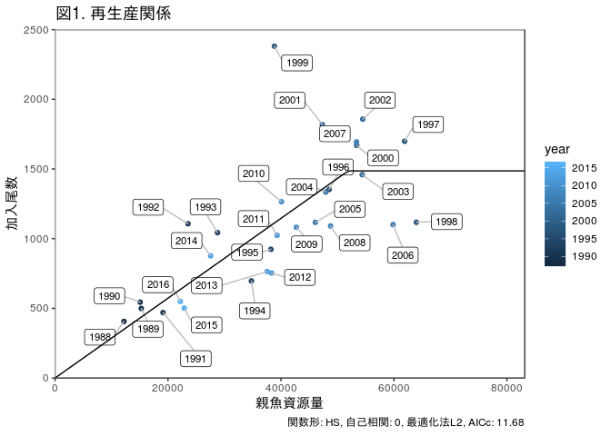
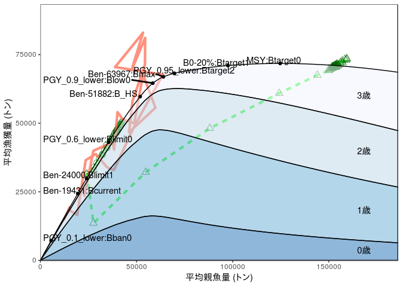
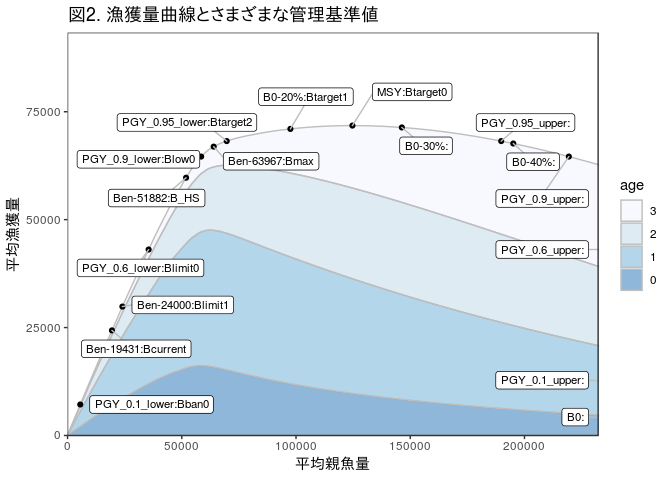
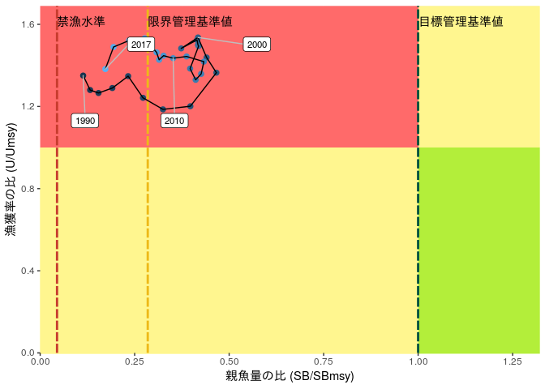
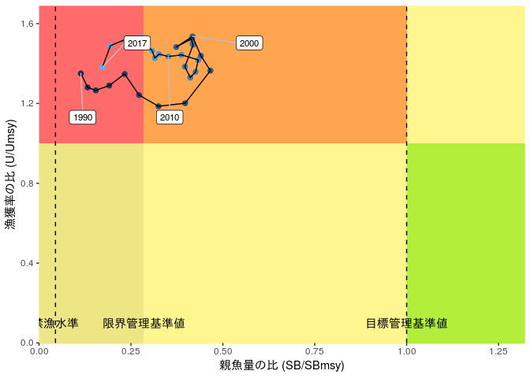
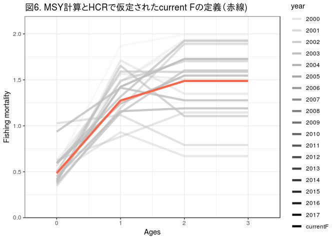

会議用資料
================
2019-05-09

マアジ太平洋系群 (ダミーデータ)
===============================

-   レポートの完成例はこちら
-   こちらではレポートをつくるさいのRコードも一緒に示しています
-   rvpaやfuture.vpaではあまり特殊なライブラリは必要としていませんでしたが、レポート用の図の作成のため、ここではggplot2などいろいろライブラリを使います。必要なパッケージを適宜インストールしてください。tidyverseなど、一部のパッケージがうまくインストールできない場合は、Rを最新のものに更新してください。
-   est.MSY以降の計算についてはtidyverseパッケージのdplyrやggplot2ライブラリを多用しています。今のRのコーディングはこれを使ってやるのが主流のようです。
    -   参考リンク tidyr <https://heavywatal.github.io/rstats/tidyr.html>
    -   参考リンク ggplot2 <https://heavywatal.github.io/rstats/ggplot2.html>
-   ここで必要なオブジェクトは以下です。
    -   res.pma(VPAの結果)
    -   future.Fcurrent(Fcurrentによる将来予測結果)
    -   MSY.base(MSYの計算結果)
    -   refs.all(計算したすべての管理基準値)
    -   refs.base(選択した管理基準値)

再生産関係式
------------

**(レポート記述内容例)**

-   何年から何年までのデータを使ったか？（また、その判断基準）
-   詳細な報告書には、モデル診断の結果で重要そうなもの、AICが近い他の再生産関係でフィットしたときの図なども示す。

``` r
source("../../rvpa1.9.2.r")
source("../../future2.1.r")
source("../../utilities.r", encoding = "UTF-8")  # ggplotを使ったグラフ作成用の関数

options(scipen = 100)  # 桁数表示の調整(1E+9とかを抑制する)

library(tidyverse)
# 再生産関係のプロット
(g1_SRplot <- SRplot_gg(SRmodel.base))
```



管理基準値
----------

-   どの管理基準値がどのような意味を示すのか？デフォルト以外に候補がある場合には、その候補を選んだ理由。その管理基準値における利点・欠点を示す。0, 1, 2の数字が小さいほどデフォルトルールにのっとった管理基準値となる。
-   漁獲量曲線は指示書の中にはなかったですｇが、管理基準値の位置の概要を見るため、また、水産庁からの資料には例として載っていたため、追加してみました。
-   表では、有効数字が資源量・漁獲量について最小値で有効数字1桁になるように調整しています

**(レポート記述内容例)** (あくまで例です。今の例で、代替基準値を最大限選ぶとしたらどうするか、というものです)

<br> <br>

**表：さまざまな管理基準値**

<table style="width:93%;">
<colgroup>
<col width="18%" />
<col width="26%" />
<col width="48%" />
</colgroup>
<thead>
<tr class="header">
<th align="left">ラベル</th>
<th align="left">管理基準値</th>
<th align="left">説明</th>
</tr>
</thead>
<tbody>
<tr class="odd">
<td align="left">Btarget0</td>
<td align="left">目標</td>
<td align="left">最大の平均漁獲量を得る時の親魚量(<strong>Bmsy</strong>)。過去最大親魚量の2倍となり、SSB&gt;SSB_maxの範囲における不確実性が大きい懸念がある。</td>
</tr>
<tr class="even">
<td align="left">Btarget1</td>
<td align="left">目標(代替値候補1)</td>
<td align="left">説明を書く</td>
</tr>
<tr class="odd">
<td align="left">Btarget2</td>
<td align="left">目標(代替値候補2)</td>
<td align="left">説明を書く</td>
</tr>
<tr class="even">
<td align="left">Blimit0</td>
<td align="left">限界</td>
<td align="left">MSYの60%の平均漁獲量を得るときの親魚資源量</td>
</tr>
<tr class="odd">
<td align="left">Blimit1</td>
<td align="left">限界(代替値候補1)</td>
<td align="left">説明を書く</td>
</tr>
<tr class="even">
<td align="left">Bban0</td>
<td align="left">禁漁</td>
<td align="left">MSYの10%の平衡漁獲量を得るときの親魚資源量</td>
</tr>
<tr class="odd">
<td align="left">Bmax</td>
<td align="left">経験値</td>
<td align="left">過去最大親魚量　</td>
</tr>
<tr class="even">
<td align="left">B_HS</td>
<td align="left">経験値</td>
<td align="left">HS再生産関係の折れ点　</td>
</tr>
<tr class="odd">
<td align="left">B_current</td>
<td align="left">経験値</td>
<td align="left">最近年の親魚量　</td>
</tr>
</tbody>
</table>

``` r
# 管理基準値表
make_RP_table(refs.base)
```

<table class="table table-condensed">
<thead>
<tr>
<th style="text-align:right;">
管理基準値
</th>
<th style="text-align:right;">
親魚資源量
</th>
<th style="text-align:right;">
B0に対する比
</th>
<th style="text-align:right;">
漁獲量
</th>
<th style="text-align:right;">
漁獲量の変動係数
</th>
<th style="text-align:right;">
漁獲率
</th>
<th style="text-align:right;">
努力量の乗数
</th>
</tr>
</thead>
<tbody>
<tr>
<td style="text-align:right;">
Btarget0
</td>
<td style="text-align:right;">
<span style="display: inline-block; direction: rtl; border-radius: 4px; padding-right: 2px; background-color: olivedrab; width: 100.00%">125000</span>
</td>
<td style="text-align:right;">
0.26
</td>
<td style="text-align:right;">
<span style="display: inline-block; direction: rtl; border-radius: 4px; padding-right: 2px; background-color: steelblue; width: 100.00%">72000</span>
</td>
<td style="text-align:right;">
0.14
</td>
<td style="text-align:right;">
<span style="display: inline-block; direction: rtl; border-radius: 4px; padding-right: 2px; background-color: orange; width: 70.21%">0.33</span>
</td>
<td style="text-align:right;">
<span style="display: inline-block; direction: rtl; border-radius: 4px; padding-right: 2px; background-color: tomato; width: 45.37%">0.49</span>
</td>
</tr>
<tr>
<td style="text-align:right;">
Btarget1
</td>
<td style="text-align:right;">
<span style="display: inline-block; direction: rtl; border-radius: 4px; padding-right: 2px; background-color: olivedrab; width: 78.40%">98000</span>
</td>
<td style="text-align:right;">
0.20
</td>
<td style="text-align:right;">
<span style="display: inline-block; direction: rtl; border-radius: 4px; padding-right: 2px; background-color: steelblue; width: 98.61%">71000</span>
</td>
<td style="text-align:right;">
0.15
</td>
<td style="text-align:right;">
<span style="display: inline-block; direction: rtl; border-radius: 4px; padding-right: 2px; background-color: orange; width: 78.72%">0.37</span>
</td>
<td style="text-align:right;">
<span style="display: inline-block; direction: rtl; border-radius: 4px; padding-right: 2px; background-color: tomato; width: 57.41%">0.62</span>
</td>
</tr>
<tr>
<td style="text-align:right;">
Btarget2
</td>
<td style="text-align:right;">
<span style="display: inline-block; direction: rtl; border-radius: 4px; padding-right: 2px; background-color: olivedrab; width: 56.00%">70000</span>
</td>
<td style="text-align:right;">
0.14
</td>
<td style="text-align:right;">
<span style="display: inline-block; direction: rtl; border-radius: 4px; padding-right: 2px; background-color: steelblue; width: 94.44%">68000</span>
</td>
<td style="text-align:right;">
0.16
</td>
<td style="text-align:right;">
<span style="display: inline-block; direction: rtl; border-radius: 4px; padding-right: 2px; background-color: orange; width: 91.49%">0.43</span>
</td>
<td style="text-align:right;">
<span style="display: inline-block; direction: rtl; border-radius: 4px; padding-right: 2px; background-color: tomato; width: 76.85%">0.83</span>
</td>
</tr>
<tr>
<td style="text-align:right;">
Bmax
</td>
<td style="text-align:right;">
<span style="display: inline-block; direction: rtl; border-radius: 4px; padding-right: 2px; background-color: olivedrab; width: 51.20%">64000</span>
</td>
<td style="text-align:right;">
0.13
</td>
<td style="text-align:right;">
<span style="display: inline-block; direction: rtl; border-radius: 4px; padding-right: 2px; background-color: steelblue; width: 93.06%">67000</span>
</td>
<td style="text-align:right;">
0.17
</td>
<td style="text-align:right;">
<span style="display: inline-block; direction: rtl; border-radius: 4px; padding-right: 2px; background-color: orange; width: 93.62%">0.44</span>
</td>
<td style="text-align:right;">
<span style="display: inline-block; direction: rtl; border-radius: 4px; padding-right: 2px; background-color: tomato; width: 82.41%">0.89</span>
</td>
</tr>
<tr>
<td style="text-align:right;">
Blow0
</td>
<td style="text-align:right;">
<span style="display: inline-block; direction: rtl; border-radius: 4px; padding-right: 2px; background-color: olivedrab; width: 46.40%">58000</span>
</td>
<td style="text-align:right;">
0.12
</td>
<td style="text-align:right;">
<span style="display: inline-block; direction: rtl; border-radius: 4px; padding-right: 2px; background-color: steelblue; width: 90.28%">65000</span>
</td>
<td style="text-align:right;">
0.18
</td>
<td style="text-align:right;">
<span style="display: inline-block; direction: rtl; border-radius: 4px; padding-right: 2px; background-color: orange; width: 95.74%">0.45</span>
</td>
<td style="text-align:right;">
<span style="display: inline-block; direction: rtl; border-radius: 4px; padding-right: 2px; background-color: tomato; width: 86.11%">0.93</span>
</td>
</tr>
<tr>
<td style="text-align:right;">
B\_HS
</td>
<td style="text-align:right;">
<span style="display: inline-block; direction: rtl; border-radius: 4px; padding-right: 2px; background-color: olivedrab; width: 41.60%">52000</span>
</td>
<td style="text-align:right;">
0.11
</td>
<td style="text-align:right;">
<span style="display: inline-block; direction: rtl; border-radius: 4px; padding-right: 2px; background-color: steelblue; width: 83.33%">60000</span>
</td>
<td style="text-align:right;">
0.24
</td>
<td style="text-align:right;">
<span style="display: inline-block; direction: rtl; border-radius: 4px; padding-right: 2px; background-color: orange; width: 95.74%">0.45</span>
</td>
<td style="text-align:right;">
<span style="display: inline-block; direction: rtl; border-radius: 4px; padding-right: 2px; background-color: tomato; width: 88.89%">0.96</span>
</td>
</tr>
<tr>
<td style="text-align:right;">
Blimit0
</td>
<td style="text-align:right;">
<span style="display: inline-block; direction: rtl; border-radius: 4px; padding-right: 2px; background-color: olivedrab; width: 28.00%">35000</span>
</td>
<td style="text-align:right;">
0.07
</td>
<td style="text-align:right;">
<span style="display: inline-block; direction: rtl; border-radius: 4px; padding-right: 2px; background-color: steelblue; width: 59.72%">43000</span>
</td>
<td style="text-align:right;">
0.46
</td>
<td style="text-align:right;">
<span style="display: inline-block; direction: rtl; border-radius: 4px; padding-right: 2px; background-color: orange; width: 97.87%">0.46</span>
</td>
<td style="text-align:right;">
<span style="display: inline-block; direction: rtl; border-radius: 4px; padding-right: 2px; background-color: tomato; width: 93.52%">1.01</span>
</td>
</tr>
<tr>
<td style="text-align:right;">
Blimit1
</td>
<td style="text-align:right;">
<span style="display: inline-block; direction: rtl; border-radius: 4px; padding-right: 2px; background-color: olivedrab; width: 19.20%">24000</span>
</td>
<td style="text-align:right;">
0.05
</td>
<td style="text-align:right;">
<span style="display: inline-block; direction: rtl; border-radius: 4px; padding-right: 2px; background-color: steelblue; width: 41.67%">30000</span>
</td>
<td style="text-align:right;">
0.66
</td>
<td style="text-align:right;">
<span style="display: inline-block; direction: rtl; border-radius: 4px; padding-right: 2px; background-color: orange; width: 97.87%">0.46</span>
</td>
<td style="text-align:right;">
<span style="display: inline-block; direction: rtl; border-radius: 4px; padding-right: 2px; background-color: tomato; width: 95.37%">1.03</span>
</td>
</tr>
<tr>
<td style="text-align:right;">
Bcurrent
</td>
<td style="text-align:right;">
<span style="display: inline-block; direction: rtl; border-radius: 4px; padding-right: 2px; background-color: olivedrab; width: 15.20%">19000</span>
</td>
<td style="text-align:right;">
0.04
</td>
<td style="text-align:right;">
<span style="display: inline-block; direction: rtl; border-radius: 4px; padding-right: 2px; background-color: steelblue; width: 33.33%">24000</span>
</td>
<td style="text-align:right;">
0.76
</td>
<td style="text-align:right;">
<span style="display: inline-block; direction: rtl; border-radius: 4px; padding-right: 2px; background-color: orange; width: 97.87%">0.46</span>
</td>
<td style="text-align:right;">
<span style="display: inline-block; direction: rtl; border-radius: 4px; padding-right: 2px; background-color: tomato; width: 96.30%">1.04</span>
</td>
</tr>
<tr>
<td style="text-align:right;">
Bban0
</td>
<td style="text-align:right;">
<span style="display: inline-block; direction: rtl; border-radius: 4px; padding-right: 2px; background-color: olivedrab; width: 4.80%">6000</span>
</td>
<td style="text-align:right;">
0.01
</td>
<td style="text-align:right;">
<span style="display: inline-block; direction: rtl; border-radius: 4px; padding-right: 2px; background-color: steelblue; width: 9.72%">7000</span>
</td>
<td style="text-align:right;">
1.41
</td>
<td style="text-align:right;">
<span style="display: inline-block; direction: rtl; border-radius: 4px; padding-right: 2px; background-color: orange; width: 100.00%">0.47</span>
</td>
<td style="text-align:right;">
<span style="display: inline-block; direction: rtl; border-radius: 4px; padding-right: 2px; background-color: tomato; width: 100.00%">1.08</span>
</td>
</tr>
</tbody>
</table>
``` r
# 漁獲量曲線
# 再生産関係をもとにしたyield curveと管理基準値のプロット。
# 計算した全管理基準値を示す場合にはrefs.allを、厳選したものだけを示す場合にはrefs.baseを引数に使ってください
# AR==TRUEにするとARありの結果もプロットされます

# 将来予測と過去の漁獲量を追記した図
(g2_yield_curve <- plot_yield(MSY.base$trace,refs.base,
                   future=list(future.Fcurrent,future.default),
                   past=res.pma,AR=FALSE,xlim.scale=0.4,ylim.scale=1.3,lining=FALSE))
```



``` r
# xlimやylimを変更する場合
(g2.2 <- plot_yield(MSY.base$trace,refs.base,AR_select=FALSE,xlim.scale=0.5,ylim.scale=1.3,lining=FALSE))
```



``` r
# yield curveの元データが欲しい場合
yield.table <- get.trace(MSY.base$trace) 
yield.table <- yield.table %>% mutate(age=as.character(age)) %>% spread(key=age,value=value) %>% arrange(ssb.mean)


# 神戸チャート

# Btarget0として選ばれた管理基準値をベースにした神戸チャート4区分
# roll_meanで各年の値を何年分移動平均するか指定します
(g3_kobe4 <- plot_kobe_gg(res.pma,refs.base,roll_mean=3,category=4,
                   Blow="Btarget0", # Btargeと同じ値を入れておいてください
                   Btarget="Btarget0")) # <- どの管理基準値を軸に使うのか指定。指定しなければ"0"マークがついた管理基準値が使われます
```



``` r
# Btarget0, Blow0, Blimit0として選ばれた管理基準値をベースにした神戸チャート6区分
# Blowを使うかどうかは不明。とりあえず6区分の一番上の境界(Blowのオプション)は"Btarget0"と、targetで使う管理基準値の名前を入れて下さい
(g4_kobe6 <- plot_kobe_gg(res.pma,refs.base,roll_mean=3,category=6,Blow="Btarget0"))
```



HCRによる将来予測
-----------------

-   デフォルトの管理基準値を使った将来予測と現状のFのまま維持した場合の将来予測の結果を比較します

**(レポート記述内容例)** - 現状のFは2015年から2017年の年齢別Fの単純平均を用いた（など、どのようにcurrent Fを定義したかを書く)

``` r
# 親魚資源量と漁獲量の時系列の図示
(g5_future <- plot_futures(res.pma, #vpaの結果
                   list(future.Fcurrent,future.default), # 将来予測結果
                   future.name=c("F current",str_c("HCR(beta=",future.default$input$HCR$beta,")")),
                   CI_range=c(0.1,0.9),
                   maxyear=2045,ncol=2,
                   Btarget=derive_RP_value(refs.base,"Btarget0")$SSB,
                   Blimit=derive_RP_value(refs.base,"Blimit0")$SSB,
#                   Blow=derive_RP_value(refs.base,"Blow0")$SSB,
                   Bban=derive_RP_value(refs.base,"Bban0")$SSB,
                   biomass.unit=10000,  # バイオマスの単位(100, 1000, or 10000トン)
                   font.size=12)) # フォントサイズ
```


``` r
#(g5 <- g5+ggtitle("図5. 現行のFとデフォルトのHCRを用いた時の将来予測\n(実線：平均値、範囲：80パーセント信頼区間)")+ylab("トン"))

# Fcurrentの図
(g6_Fcurrent <- plot_Fcurrent(res.pma,year.range=2007:2017))
```



``` r
# HCRの図
(g7_hcr <- plot_HCR(SBtarget=derive_RP_value(refs.base,"Btarget0")$SSB,
         SBlim=derive_RP_value(refs.base,"Blimit0")$SSB,
         SBban=derive_RP_value(refs.base,"Bban0")$SSB,
         Ftarget=1,biomass.unit=1000,
         beta=0.8))
```


``` r
ggsave("g7_hcr.png",g7_hcr,width=8,height=4,dpi=600) 
```

図の一括保存
------------

-   g1からg6までの図を一括してpngに保存します。あらかじめ解像度や大きさを設定しておくことで、ワードに貼った時に一貫した十分なクオリティを確保できます。

``` r
ggsave("g1_SRplot.png", g1_SRplot, width = 8, height = 5, dpi = 400)
ggsave("g2_yield_curve.png", g2_yield_curve, width = 8, height = 5, dpi = 400)
ggsave("g3_kobe4.png", g3_kobe4, width = 8, height = 5, dpi = 400)
ggsave("g4_kobe6.png", g4_kobe6, width = 8, height = 5, dpi = 400)
ggsave("g5_future.png", g5_future, width = 12, height = 6, dpi = 400)
ggsave("g6_Fcurrent.png", g6_Fcurrent, width = 6, height = 4, dpi = 400)
```

パフォーマンス指標の比較
------------------------

-   代替管理基準値やさまざまなβを用いたときの将来予測を実施し、パフォーマンスを表にします
-   代替管理基準値が多すぎると表がすごく長くなります。
-   `calc_kobeII_matrix`で計算した結果を使います

### csvへの出力

``` r
all.table <- bind_rows(catch.table, ssbtarget.table, ssblow.table, ssblimit.table, 
    ssbmin.table)
write.csv(all.table, file = "all.table.csv")
```

### htmlへの出力

#### 平均漁獲量

``` r
library(formattable)
catch.table %>% select(-stat_name) %>% formattable::formattable(list(area(col = -1) ~ 
    color_tile("white", "steelblue"), beta = color_tile("white", "blue"), HCR_name = formatter("span", 
    style = ~style(color = ifelse(HCR_name == "Btarget0-Blimit0-Bban0" & beta == 
        0.8, "red", "black")))))
```

<table class="table table-condensed">
<thead>
<tr>
<th style="text-align:right;">
HCR\_name
</th>
<th style="text-align:right;">
beta
</th>
<th style="text-align:right;">
2018
</th>
<th style="text-align:right;">
2019
</th>
<th style="text-align:right;">
2020
</th>
<th style="text-align:right;">
2021
</th>
<th style="text-align:right;">
2022
</th>
<th style="text-align:right;">
2023
</th>
<th style="text-align:right;">
2028
</th>
<th style="text-align:right;">
2038
</th>
</tr>
</thead>
<tbody>
<tr>
<td style="text-align:right;">
<span style="color: black">Btarget0-Blimit0-Bban0</span>
</td>
<td style="text-align:right;">
<span style="display: block; padding: 0 4px; border-radius: 4px; background-color: #0000ff">1.0</span>
</td>
<td style="text-align:right;">
<span style="display: block; padding: 0 4px; border-radius: 4px; background-color: #afc9de">31000.0</span>
</td>
<td style="text-align:right;">
<span style="display: block; padding: 0 4px; border-radius: 4px; background-color: #d5e3ee">16000.0</span>
</td>
<td style="text-align:right;">
<span style="display: block; padding: 0 4px; border-radius: 4px; background-color: #a2c0d9">36000.0</span>
</td>
<td style="text-align:right;">
<span style="display: block; padding: 0 4px; border-radius: 4px; background-color: #79a4c8">52000.0</span>
</td>
<td style="text-align:right;">
<span style="display: block; padding: 0 4px; border-radius: 4px; background-color: #5d91bd">63000.0</span>
</td>
<td style="text-align:right;">
<span style="display: block; padding: 0 4px; border-radius: 4px; background-color: #4d87b7">69000.0</span>
</td>
<td style="text-align:right;">
<span style="display: block; padding: 0 4px; border-radius: 4px; background-color: #4682b4">72000.0</span>
</td>
<td style="text-align:right;">
<span style="display: block; padding: 0 4px; border-radius: 4px; background-color: #4883b5">71000.0</span>
</td>
</tr>
<tr>
<td style="text-align:right;">
<span style="color: black">Btarget0-Blimit0-Bban0</span>
</td>
<td style="text-align:right;">
<span style="display: block; padding: 0 4px; border-radius: 4px; background-color: #3333ff">0.9</span>
</td>
<td style="text-align:right;">
<span style="display: block; padding: 0 4px; border-radius: 4px; background-color: #afc9de">31000.0</span>
</td>
<td style="text-align:right;">
<span style="display: block; padding: 0 4px; border-radius: 4px; background-color: #d8e4ef">15000.0</span>
</td>
<td style="text-align:right;">
<span style="display: block; padding: 0 4px; border-radius: 4px; background-color: #a7c3db">34000.0</span>
</td>
<td style="text-align:right;">
<span style="display: block; padding: 0 4px; border-radius: 4px; background-color: #7ea8ca">50000.0</span>
</td>
<td style="text-align:right;">
<span style="display: block; padding: 0 4px; border-radius: 4px; background-color: #5f93be">62000.0</span>
</td>
<td style="text-align:right;">
<span style="display: block; padding: 0 4px; border-radius: 4px; background-color: #4d87b7">69000.0</span>
</td>
<td style="text-align:right;">
<span style="display: block; padding: 0 4px; border-radius: 4px; background-color: #4682b4">72000.0</span>
</td>
<td style="text-align:right;">
<span style="display: block; padding: 0 4px; border-radius: 4px; background-color: #4883b5">71000.0</span>
</td>
</tr>
<tr>
<td style="text-align:right;">
<span style="color: red">Btarget0-Blimit0-Bban0</span>
</td>
<td style="text-align:right;">
<span style="display: block; padding: 0 4px; border-radius: 4px; background-color: #6565ff">0.8</span>
</td>
<td style="text-align:right;">
<span style="display: block; padding: 0 4px; border-radius: 4px; background-color: #afc9de">31000.0</span>
</td>
<td style="text-align:right;">
<span style="display: block; padding: 0 4px; border-radius: 4px; background-color: #dbe6f0">14000.0</span>
</td>
<td style="text-align:right;">
<span style="display: block; padding: 0 4px; border-radius: 4px; background-color: #acc7dd">32000.0</span>
</td>
<td style="text-align:right;">
<span style="display: block; padding: 0 4px; border-radius: 4px; background-color: #83abcd">48000.0</span>
</td>
<td style="text-align:right;">
<span style="display: block; padding: 0 4px; border-radius: 4px; background-color: #6295bf">61000.0</span>
</td>
<td style="text-align:right;">
<span style="display: block; padding: 0 4px; border-radius: 4px; background-color: #5088b8">68000.0</span>
</td>
<td style="text-align:right;">
<span style="display: block; padding: 0 4px; border-radius: 4px; background-color: #4883b5">71000.0</span>
</td>
<td style="text-align:right;">
<span style="display: block; padding: 0 4px; border-radius: 4px; background-color: #4883b5">71000.0</span>
</td>
</tr>
<tr>
<td style="text-align:right;">
<span style="color: black">Btarget0-Blimit0-Bban0</span>
</td>
<td style="text-align:right;">
<span style="display: block; padding: 0 4px; border-radius: 4px; background-color: #9999ff">0.7</span>
</td>
<td style="text-align:right;">
<span style="display: block; padding: 0 4px; border-radius: 4px; background-color: #afc9de">31000.0</span>
</td>
<td style="text-align:right;">
<span style="display: block; padding: 0 4px; border-radius: 4px; background-color: #e0eaf2">12000.0</span>
</td>
<td style="text-align:right;">
<span style="display: block; padding: 0 4px; border-radius: 4px; background-color: #b1cadf">30000.0</span>
</td>
<td style="text-align:right;">
<span style="display: block; padding: 0 4px; border-radius: 4px; background-color: #88afcf">46000.0</span>
</td>
<td style="text-align:right;">
<span style="display: block; padding: 0 4px; border-radius: 4px; background-color: #6798c1">59000.0</span>
</td>
<td style="text-align:right;">
<span style="display: block; padding: 0 4px; border-radius: 4px; background-color: #558cba">66000.0</span>
</td>
<td style="text-align:right;">
<span style="display: block; padding: 0 4px; border-radius: 4px; background-color: #4b85b6">70000.0</span>
</td>
<td style="text-align:right;">
<span style="display: block; padding: 0 4px; border-radius: 4px; background-color: #4b85b6">70000.0</span>
</td>
</tr>
<tr>
<td style="text-align:right;">
<span style="color: black">Btarget0-Blimit0-Bban0</span>
</td>
<td style="text-align:right;">
<span style="display: block; padding: 0 4px; border-radius: 4px; background-color: #ccccff">0.6</span>
</td>
<td style="text-align:right;">
<span style="display: block; padding: 0 4px; border-radius: 4px; background-color: #afc9de">31000.0</span>
</td>
<td style="text-align:right;">
<span style="display: block; padding: 0 4px; border-radius: 4px; background-color: #e2ebf3">11000.0</span>
</td>
<td style="text-align:right;">
<span style="display: block; padding: 0 4px; border-radius: 4px; background-color: #b9d0e2">27000.0</span>
</td>
<td style="text-align:right;">
<span style="display: block; padding: 0 4px; border-radius: 4px; background-color: #93b6d3">42000.0</span>
</td>
<td style="text-align:right;">
<span style="display: block; padding: 0 4px; border-radius: 4px; background-color: #6f9dc4">56000.0</span>
</td>
<td style="text-align:right;">
<span style="display: block; padding: 0 4px; border-radius: 4px; background-color: #5d91bd">63000.0</span>
</td>
<td style="text-align:right;">
<span style="display: block; padding: 0 4px; border-radius: 4px; background-color: #5088b8">68000.0</span>
</td>
<td style="text-align:right;">
<span style="display: block; padding: 0 4px; border-radius: 4px; background-color: #5088b8">68000.0</span>
</td>
</tr>
<tr>
<td style="text-align:right;">
<span style="color: black">Btarget0-Blimit0-Bban0</span>
</td>
<td style="text-align:right;">
<span style="display: block; padding: 0 4px; border-radius: 4px; background-color: #ffffff">0.5</span>
</td>
<td style="text-align:right;">
<span style="display: block; padding: 0 4px; border-radius: 4px; background-color: #afc9de">31000.0</span>
</td>
<td style="text-align:right;">
<span style="display: block; padding: 0 4px; border-radius: 4px; background-color: #e7eff5">9000.0</span>
</td>
<td style="text-align:right;">
<span style="display: block; padding: 0 4px; border-radius: 4px; background-color: #c1d5e6">24000.0</span>
</td>
<td style="text-align:right;">
<span style="display: block; padding: 0 4px; border-radius: 4px; background-color: #9dbdd7">38000.0</span>
</td>
<td style="text-align:right;">
<span style="display: block; padding: 0 4px; border-radius: 4px; background-color: #7ba6c9">51000.0</span>
</td>
<td style="text-align:right;">
<span style="display: block; padding: 0 4px; border-radius: 4px; background-color: #6798c1">59000.0</span>
</td>
<td style="text-align:right;">
<span style="display: block; padding: 0 4px; border-radius: 4px; background-color: #578ebb">65000.0</span>
</td>
<td style="text-align:right;">
<span style="display: block; padding: 0 4px; border-radius: 4px; background-color: #578ebb">65000.0</span>
</td>
</tr>
<tr>
<td style="text-align:right;">
<span style="color: black">Btarget0-Blimit1-Bban0</span>
</td>
<td style="text-align:right;">
<span style="display: block; padding: 0 4px; border-radius: 4px; background-color: #0000ff">1.0</span>
</td>
<td style="text-align:right;">
<span style="display: block; padding: 0 4px; border-radius: 4px; background-color: #afc9de">31000.0</span>
</td>
<td style="text-align:right;">
<span style="display: block; padding: 0 4px; border-radius: 4px; background-color: #cbdcea">20000.0</span>
</td>
<td style="text-align:right;">
<span style="display: block; padding: 0 4px; border-radius: 4px; background-color: #aac5dc">33000.0</span>
</td>
<td style="text-align:right;">
<span style="display: block; padding: 0 4px; border-radius: 4px; background-color: #83abcd">48000.0</span>
</td>
<td style="text-align:right;">
<span style="display: block; padding: 0 4px; border-radius: 4px; background-color: #6295bf">61000.0</span>
</td>
<td style="text-align:right;">
<span style="display: block; padding: 0 4px; border-radius: 4px; background-color: #5088b8">68000.0</span>
</td>
<td style="text-align:right;">
<span style="display: block; padding: 0 4px; border-radius: 4px; background-color: #4682b4">72000.0</span>
</td>
<td style="text-align:right;">
<span style="display: block; padding: 0 4px; border-radius: 4px; background-color: #4883b5">71000.0</span>
</td>
</tr>
<tr>
<td style="text-align:right;">
<span style="color: black">Btarget0-Blimit1-Bban0</span>
</td>
<td style="text-align:right;">
<span style="display: block; padding: 0 4px; border-radius: 4px; background-color: #3333ff">0.9</span>
</td>
<td style="text-align:right;">
<span style="display: block; padding: 0 4px; border-radius: 4px; background-color: #afc9de">31000.0</span>
</td>
<td style="text-align:right;">
<span style="display: block; padding: 0 4px; border-radius: 4px; background-color: #cedeeb">19000.0</span>
</td>
<td style="text-align:right;">
<span style="display: block; padding: 0 4px; border-radius: 4px; background-color: #afc9de">31000.0</span>
</td>
<td style="text-align:right;">
<span style="display: block; padding: 0 4px; border-radius: 4px; background-color: #86adce">47000.0</span>
</td>
<td style="text-align:right;">
<span style="display: block; padding: 0 4px; border-radius: 4px; background-color: #6496c0">60000.0</span>
</td>
<td style="text-align:right;">
<span style="display: block; padding: 0 4px; border-radius: 4px; background-color: #528ab9">67000.0</span>
</td>
<td style="text-align:right;">
<span style="display: block; padding: 0 4px; border-radius: 4px; background-color: #4682b4">72000.0</span>
</td>
<td style="text-align:right;">
<span style="display: block; padding: 0 4px; border-radius: 4px; background-color: #4883b5">71000.0</span>
</td>
</tr>
<tr>
<td style="text-align:right;">
<span style="color: black">Btarget0-Blimit1-Bban0</span>
</td>
<td style="text-align:right;">
<span style="display: block; padding: 0 4px; border-radius: 4px; background-color: #6565ff">0.8</span>
</td>
<td style="text-align:right;">
<span style="display: block; padding: 0 4px; border-radius: 4px; background-color: #afc9de">31000.0</span>
</td>
<td style="text-align:right;">
<span style="display: block; padding: 0 4px; border-radius: 4px; background-color: #d3e1ed">17000.0</span>
</td>
<td style="text-align:right;">
<span style="display: block; padding: 0 4px; border-radius: 4px; background-color: #b1cadf">30000.0</span>
</td>
<td style="text-align:right;">
<span style="display: block; padding: 0 4px; border-radius: 4px; background-color: #88afcf">46000.0</span>
</td>
<td style="text-align:right;">
<span style="display: block; padding: 0 4px; border-radius: 4px; background-color: #6798c1">59000.0</span>
</td>
<td style="text-align:right;">
<span style="display: block; padding: 0 4px; border-radius: 4px; background-color: #528ab9">67000.0</span>
</td>
<td style="text-align:right;">
<span style="display: block; padding: 0 4px; border-radius: 4px; background-color: #4883b5">71000.0</span>
</td>
<td style="text-align:right;">
<span style="display: block; padding: 0 4px; border-radius: 4px; background-color: #4883b5">71000.0</span>
</td>
</tr>
<tr>
<td style="text-align:right;">
<span style="color: black">Btarget0-Blimit1-Bban0</span>
</td>
<td style="text-align:right;">
<span style="display: block; padding: 0 4px; border-radius: 4px; background-color: #9999ff">0.7</span>
</td>
<td style="text-align:right;">
<span style="display: block; padding: 0 4px; border-radius: 4px; background-color: #afc9de">31000.0</span>
</td>
<td style="text-align:right;">
<span style="display: block; padding: 0 4px; border-radius: 4px; background-color: #d8e4ef">15000.0</span>
</td>
<td style="text-align:right;">
<span style="display: block; padding: 0 4px; border-radius: 4px; background-color: #b7cee1">28000.0</span>
</td>
<td style="text-align:right;">
<span style="display: block; padding: 0 4px; border-radius: 4px; background-color: #8db2d1">44000.0</span>
</td>
<td style="text-align:right;">
<span style="display: block; padding: 0 4px; border-radius: 4px; background-color: #6c9cc3">57000.0</span>
</td>
<td style="text-align:right;">
<span style="display: block; padding: 0 4px; border-radius: 4px; background-color: #578ebb">65000.0</span>
</td>
<td style="text-align:right;">
<span style="display: block; padding: 0 4px; border-radius: 4px; background-color: #4b85b6">70000.0</span>
</td>
<td style="text-align:right;">
<span style="display: block; padding: 0 4px; border-radius: 4px; background-color: #4b85b6">70000.0</span>
</td>
</tr>
<tr>
<td style="text-align:right;">
<span style="color: black">Btarget0-Blimit1-Bban0</span>
</td>
<td style="text-align:right;">
<span style="display: block; padding: 0 4px; border-radius: 4px; background-color: #ccccff">0.6</span>
</td>
<td style="text-align:right;">
<span style="display: block; padding: 0 4px; border-radius: 4px; background-color: #afc9de">31000.0</span>
</td>
<td style="text-align:right;">
<span style="display: block; padding: 0 4px; border-radius: 4px; background-color: #dbe6f0">14000.0</span>
</td>
<td style="text-align:right;">
<span style="display: block; padding: 0 4px; border-radius: 4px; background-color: #bed3e4">25000.0</span>
</td>
<td style="text-align:right;">
<span style="display: block; padding: 0 4px; border-radius: 4px; background-color: #95b7d4">41000.0</span>
</td>
<td style="text-align:right;">
<span style="display: block; padding: 0 4px; border-radius: 4px; background-color: #74a1c6">54000.0</span>
</td>
<td style="text-align:right;">
<span style="display: block; padding: 0 4px; border-radius: 4px; background-color: #5d91bd">63000.0</span>
</td>
<td style="text-align:right;">
<span style="display: block; padding: 0 4px; border-radius: 4px; background-color: #5088b8">68000.0</span>
</td>
<td style="text-align:right;">
<span style="display: block; padding: 0 4px; border-radius: 4px; background-color: #5088b8">68000.0</span>
</td>
</tr>
<tr>
<td style="text-align:right;">
<span style="color: black">Btarget0-Blimit1-Bban0</span>
</td>
<td style="text-align:right;">
<span style="display: block; padding: 0 4px; border-radius: 4px; background-color: #ffffff">0.5</span>
</td>
<td style="text-align:right;">
<span style="display: block; padding: 0 4px; border-radius: 4px; background-color: #afc9de">31000.0</span>
</td>
<td style="text-align:right;">
<span style="display: block; padding: 0 4px; border-radius: 4px; background-color: #e0eaf2">12000.0</span>
</td>
<td style="text-align:right;">
<span style="display: block; padding: 0 4px; border-radius: 4px; background-color: #c3d7e7">23000.0</span>
</td>
<td style="text-align:right;">
<span style="display: block; padding: 0 4px; border-radius: 4px; background-color: #9fbed8">37000.0</span>
</td>
<td style="text-align:right;">
<span style="display: block; padding: 0 4px; border-radius: 4px; background-color: #7ea8ca">50000.0</span>
</td>
<td style="text-align:right;">
<span style="display: block; padding: 0 4px; border-radius: 4px; background-color: #6798c1">59000.0</span>
</td>
<td style="text-align:right;">
<span style="display: block; padding: 0 4px; border-radius: 4px; background-color: #578ebb">65000.0</span>
</td>
<td style="text-align:right;">
<span style="display: block; padding: 0 4px; border-radius: 4px; background-color: #578ebb">65000.0</span>
</td>
</tr>
<tr>
<td style="text-align:right;">
<span style="color: black">Btarget1-Blimit0-Bban0</span>
</td>
<td style="text-align:right;">
<span style="display: block; padding: 0 4px; border-radius: 4px; background-color: #0000ff">1.0</span>
</td>
<td style="text-align:right;">
<span style="display: block; padding: 0 4px; border-radius: 4px; background-color: #afc9de">31000.0</span>
</td>
<td style="text-align:right;">
<span style="display: block; padding: 0 4px; border-radius: 4px; background-color: #cbdcea">20000.0</span>
</td>
<td style="text-align:right;">
<span style="display: block; padding: 0 4px; border-radius: 4px; background-color: #98b9d5">40000.0</span>
</td>
<td style="text-align:right;">
<span style="display: block; padding: 0 4px; border-radius: 4px; background-color: #76a2c7">53000.0</span>
</td>
<td style="text-align:right;">
<span style="display: block; padding: 0 4px; border-radius: 4px; background-color: #5d91bd">63000.0</span>
</td>
<td style="text-align:right;">
<span style="display: block; padding: 0 4px; border-radius: 4px; background-color: #5088b8">68000.0</span>
</td>
<td style="text-align:right;">
<span style="display: block; padding: 0 4px; border-radius: 4px; background-color: #4883b5">71000.0</span>
</td>
<td style="text-align:right;">
<span style="display: block; padding: 0 4px; border-radius: 4px; background-color: #4b85b6">70000.0</span>
</td>
</tr>
<tr>
<td style="text-align:right;">
<span style="color: black">Btarget1-Blimit0-Bban0</span>
</td>
<td style="text-align:right;">
<span style="display: block; padding: 0 4px; border-radius: 4px; background-color: #3333ff">0.9</span>
</td>
<td style="text-align:right;">
<span style="display: block; padding: 0 4px; border-radius: 4px; background-color: #afc9de">31000.0</span>
</td>
<td style="text-align:right;">
<span style="display: block; padding: 0 4px; border-radius: 4px; background-color: #d0dfec">18000.0</span>
</td>
<td style="text-align:right;">
<span style="display: block; padding: 0 4px; border-radius: 4px; background-color: #9dbdd7">38000.0</span>
</td>
<td style="text-align:right;">
<span style="display: block; padding: 0 4px; border-radius: 4px; background-color: #76a2c7">53000.0</span>
</td>
<td style="text-align:right;">
<span style="display: block; padding: 0 4px; border-radius: 4px; background-color: #5a8fbc">64000.0</span>
</td>
<td style="text-align:right;">
<span style="display: block; padding: 0 4px; border-radius: 4px; background-color: #4d87b7">69000.0</span>
</td>
<td style="text-align:right;">
<span style="display: block; padding: 0 4px; border-radius: 4px; background-color: #4883b5">71000.0</span>
</td>
<td style="text-align:right;">
<span style="display: block; padding: 0 4px; border-radius: 4px; background-color: #4883b5">71000.0</span>
</td>
</tr>
<tr>
<td style="text-align:right;">
<span style="color: black">Btarget1-Blimit0-Bban0</span>
</td>
<td style="text-align:right;">
<span style="display: block; padding: 0 4px; border-radius: 4px; background-color: #6565ff">0.8</span>
</td>
<td style="text-align:right;">
<span style="display: block; padding: 0 4px; border-radius: 4px; background-color: #afc9de">31000.0</span>
</td>
<td style="text-align:right;">
<span style="display: block; padding: 0 4px; border-radius: 4px; background-color: #d5e3ee">16000.0</span>
</td>
<td style="text-align:right;">
<span style="display: block; padding: 0 4px; border-radius: 4px; background-color: #a2c0d9">36000.0</span>
</td>
<td style="text-align:right;">
<span style="display: block; padding: 0 4px; border-radius: 4px; background-color: #79a4c8">52000.0</span>
</td>
<td style="text-align:right;">
<span style="display: block; padding: 0 4px; border-radius: 4px; background-color: #5d91bd">63000.0</span>
</td>
<td style="text-align:right;">
<span style="display: block; padding: 0 4px; border-radius: 4px; background-color: #4d87b7">69000.0</span>
</td>
<td style="text-align:right;">
<span style="display: block; padding: 0 4px; border-radius: 4px; background-color: #4682b4">72000.0</span>
</td>
<td style="text-align:right;">
<span style="display: block; padding: 0 4px; border-radius: 4px; background-color: #4883b5">71000.0</span>
</td>
</tr>
<tr>
<td style="text-align:right;">
<span style="color: black">Btarget1-Blimit0-Bban0</span>
</td>
<td style="text-align:right;">
<span style="display: block; padding: 0 4px; border-radius: 4px; background-color: #9999ff">0.7</span>
</td>
<td style="text-align:right;">
<span style="display: block; padding: 0 4px; border-radius: 4px; background-color: #afc9de">31000.0</span>
</td>
<td style="text-align:right;">
<span style="display: block; padding: 0 4px; border-radius: 4px; background-color: #d8e4ef">15000.0</span>
</td>
<td style="text-align:right;">
<span style="display: block; padding: 0 4px; border-radius: 4px; background-color: #a7c3db">34000.0</span>
</td>
<td style="text-align:right;">
<span style="display: block; padding: 0 4px; border-radius: 4px; background-color: #7ea8ca">50000.0</span>
</td>
<td style="text-align:right;">
<span style="display: block; padding: 0 4px; border-radius: 4px; background-color: #5f93be">62000.0</span>
</td>
<td style="text-align:right;">
<span style="display: block; padding: 0 4px; border-radius: 4px; background-color: #5088b8">68000.0</span>
</td>
<td style="text-align:right;">
<span style="display: block; padding: 0 4px; border-radius: 4px; background-color: #4682b4">72000.0</span>
</td>
<td style="text-align:right;">
<span style="display: block; padding: 0 4px; border-radius: 4px; background-color: #4883b5">71000.0</span>
</td>
</tr>
<tr>
<td style="text-align:right;">
<span style="color: black">Btarget1-Blimit0-Bban0</span>
</td>
<td style="text-align:right;">
<span style="display: block; padding: 0 4px; border-radius: 4px; background-color: #ccccff">0.6</span>
</td>
<td style="text-align:right;">
<span style="display: block; padding: 0 4px; border-radius: 4px; background-color: #afc9de">31000.0</span>
</td>
<td style="text-align:right;">
<span style="display: block; padding: 0 4px; border-radius: 4px; background-color: #dde8f1">13000.0</span>
</td>
<td style="text-align:right;">
<span style="display: block; padding: 0 4px; border-radius: 4px; background-color: #afc9de">31000.0</span>
</td>
<td style="text-align:right;">
<span style="display: block; padding: 0 4px; border-radius: 4px; background-color: #86adce">47000.0</span>
</td>
<td style="text-align:right;">
<span style="display: block; padding: 0 4px; border-radius: 4px; background-color: #6496c0">60000.0</span>
</td>
<td style="text-align:right;">
<span style="display: block; padding: 0 4px; border-radius: 4px; background-color: #528ab9">67000.0</span>
</td>
<td style="text-align:right;">
<span style="display: block; padding: 0 4px; border-radius: 4px; background-color: #4883b5">71000.0</span>
</td>
<td style="text-align:right;">
<span style="display: block; padding: 0 4px; border-radius: 4px; background-color: #4883b5">71000.0</span>
</td>
</tr>
<tr>
<td style="text-align:right;">
<span style="color: black">Btarget1-Blimit0-Bban0</span>
</td>
<td style="text-align:right;">
<span style="display: block; padding: 0 4px; border-radius: 4px; background-color: #ffffff">0.5</span>
</td>
<td style="text-align:right;">
<span style="display: block; padding: 0 4px; border-radius: 4px; background-color: #afc9de">31000.0</span>
</td>
<td style="text-align:right;">
<span style="display: block; padding: 0 4px; border-radius: 4px; background-color: #e2ebf3">11000.0</span>
</td>
<td style="text-align:right;">
<span style="display: block; padding: 0 4px; border-radius: 4px; background-color: #b7cee1">28000.0</span>
</td>
<td style="text-align:right;">
<span style="display: block; padding: 0 4px; border-radius: 4px; background-color: #8db2d1">44000.0</span>
</td>
<td style="text-align:right;">
<span style="display: block; padding: 0 4px; border-radius: 4px; background-color: #6c9cc3">57000.0</span>
</td>
<td style="text-align:right;">
<span style="display: block; padding: 0 4px; border-radius: 4px; background-color: #5a8fbc">64000.0</span>
</td>
<td style="text-align:right;">
<span style="display: block; padding: 0 4px; border-radius: 4px; background-color: #4d87b7">69000.0</span>
</td>
<td style="text-align:right;">
<span style="display: block; padding: 0 4px; border-radius: 4px; background-color: #4d87b7">69000.0</span>
</td>
</tr>
<tr>
<td style="text-align:right;">
<span style="color: black">Btarget1-Blimit1-Bban0</span>
</td>
<td style="text-align:right;">
<span style="display: block; padding: 0 4px; border-radius: 4px; background-color: #0000ff">1.0</span>
</td>
<td style="text-align:right;">
<span style="display: block; padding: 0 4px; border-radius: 4px; background-color: #afc9de">31000.0</span>
</td>
<td style="text-align:right;">
<span style="display: block; padding: 0 4px; border-radius: 4px; background-color: #c1d5e6">24000.0</span>
</td>
<td style="text-align:right;">
<span style="display: block; padding: 0 4px; border-radius: 4px; background-color: #a5c2da">35000.0</span>
</td>
<td style="text-align:right;">
<span style="display: block; padding: 0 4px; border-radius: 4px; background-color: #86adce">47000.0</span>
</td>
<td style="text-align:right;">
<span style="display: block; padding: 0 4px; border-radius: 4px; background-color: #6798c1">59000.0</span>
</td>
<td style="text-align:right;">
<span style="display: block; padding: 0 4px; border-radius: 4px; background-color: #558cba">66000.0</span>
</td>
<td style="text-align:right;">
<span style="display: block; padding: 0 4px; border-radius: 4px; background-color: #4883b5">71000.0</span>
</td>
<td style="text-align:right;">
<span style="display: block; padding: 0 4px; border-radius: 4px; background-color: #4b85b6">70000.0</span>
</td>
</tr>
<tr>
<td style="text-align:right;">
<span style="color: black">Btarget1-Blimit1-Bban0</span>
</td>
<td style="text-align:right;">
<span style="display: block; padding: 0 4px; border-radius: 4px; background-color: #3333ff">0.9</span>
</td>
<td style="text-align:right;">
<span style="display: block; padding: 0 4px; border-radius: 4px; background-color: #afc9de">31000.0</span>
</td>
<td style="text-align:right;">
<span style="display: block; padding: 0 4px; border-radius: 4px; background-color: #c3d7e7">23000.0</span>
</td>
<td style="text-align:right;">
<span style="display: block; padding: 0 4px; border-radius: 4px; background-color: #a7c3db">34000.0</span>
</td>
<td style="text-align:right;">
<span style="display: block; padding: 0 4px; border-radius: 4px; background-color: #83abcd">48000.0</span>
</td>
<td style="text-align:right;">
<span style="display: block; padding: 0 4px; border-radius: 4px; background-color: #6496c0">60000.0</span>
</td>
<td style="text-align:right;">
<span style="display: block; padding: 0 4px; border-radius: 4px; background-color: #528ab9">67000.0</span>
</td>
<td style="text-align:right;">
<span style="display: block; padding: 0 4px; border-radius: 4px; background-color: #4883b5">71000.0</span>
</td>
<td style="text-align:right;">
<span style="display: block; padding: 0 4px; border-radius: 4px; background-color: #4883b5">71000.0</span>
</td>
</tr>
<tr>
<td style="text-align:right;">
<span style="color: black">Btarget1-Blimit1-Bban0</span>
</td>
<td style="text-align:right;">
<span style="display: block; padding: 0 4px; border-radius: 4px; background-color: #6565ff">0.8</span>
</td>
<td style="text-align:right;">
<span style="display: block; padding: 0 4px; border-radius: 4px; background-color: #afc9de">31000.0</span>
</td>
<td style="text-align:right;">
<span style="display: block; padding: 0 4px; border-radius: 4px; background-color: #c9dae9">21000.0</span>
</td>
<td style="text-align:right;">
<span style="display: block; padding: 0 4px; border-radius: 4px; background-color: #aac5dc">33000.0</span>
</td>
<td style="text-align:right;">
<span style="display: block; padding: 0 4px; border-radius: 4px; background-color: #83abcd">48000.0</span>
</td>
<td style="text-align:right;">
<span style="display: block; padding: 0 4px; border-radius: 4px; background-color: #6295bf">61000.0</span>
</td>
<td style="text-align:right;">
<span style="display: block; padding: 0 4px; border-radius: 4px; background-color: #5088b8">68000.0</span>
</td>
<td style="text-align:right;">
<span style="display: block; padding: 0 4px; border-radius: 4px; background-color: #4682b4">72000.0</span>
</td>
<td style="text-align:right;">
<span style="display: block; padding: 0 4px; border-radius: 4px; background-color: #4883b5">71000.0</span>
</td>
</tr>
<tr>
<td style="text-align:right;">
<span style="color: black">Btarget1-Blimit1-Bban0</span>
</td>
<td style="text-align:right;">
<span style="display: block; padding: 0 4px; border-radius: 4px; background-color: #9999ff">0.7</span>
</td>
<td style="text-align:right;">
<span style="display: block; padding: 0 4px; border-radius: 4px; background-color: #afc9de">31000.0</span>
</td>
<td style="text-align:right;">
<span style="display: block; padding: 0 4px; border-radius: 4px; background-color: #cedeeb">19000.0</span>
</td>
<td style="text-align:right;">
<span style="display: block; padding: 0 4px; border-radius: 4px; background-color: #afc9de">31000.0</span>
</td>
<td style="text-align:right;">
<span style="display: block; padding: 0 4px; border-radius: 4px; background-color: #86adce">47000.0</span>
</td>
<td style="text-align:right;">
<span style="display: block; padding: 0 4px; border-radius: 4px; background-color: #6496c0">60000.0</span>
</td>
<td style="text-align:right;">
<span style="display: block; padding: 0 4px; border-radius: 4px; background-color: #528ab9">67000.0</span>
</td>
<td style="text-align:right;">
<span style="display: block; padding: 0 4px; border-radius: 4px; background-color: #4682b4">72000.0</span>
</td>
<td style="text-align:right;">
<span style="display: block; padding: 0 4px; border-radius: 4px; background-color: #4883b5">71000.0</span>
</td>
</tr>
<tr>
<td style="text-align:right;">
<span style="color: black">Btarget1-Blimit1-Bban0</span>
</td>
<td style="text-align:right;">
<span style="display: block; padding: 0 4px; border-radius: 4px; background-color: #ccccff">0.6</span>
</td>
<td style="text-align:right;">
<span style="display: block; padding: 0 4px; border-radius: 4px; background-color: #afc9de">31000.0</span>
</td>
<td style="text-align:right;">
<span style="display: block; padding: 0 4px; border-radius: 4px; background-color: #d3e1ed">17000.0</span>
</td>
<td style="text-align:right;">
<span style="display: block; padding: 0 4px; border-radius: 4px; background-color: #b4cce0">29000.0</span>
</td>
<td style="text-align:right;">
<span style="display: block; padding: 0 4px; border-radius: 4px; background-color: #8bb0d0">45000.0</span>
</td>
<td style="text-align:right;">
<span style="display: block; padding: 0 4px; border-radius: 4px; background-color: #6798c1">59000.0</span>
</td>
<td style="text-align:right;">
<span style="display: block; padding: 0 4px; border-radius: 4px; background-color: #558cba">66000.0</span>
</td>
<td style="text-align:right;">
<span style="display: block; padding: 0 4px; border-radius: 4px; background-color: #4883b5">71000.0</span>
</td>
<td style="text-align:right;">
<span style="display: block; padding: 0 4px; border-radius: 4px; background-color: #4883b5">71000.0</span>
</td>
</tr>
<tr>
<td style="text-align:right;">
<span style="color: black">Btarget1-Blimit1-Bban0</span>
</td>
<td style="text-align:right;">
<span style="display: block; padding: 0 4px; border-radius: 4px; background-color: #ffffff">0.5</span>
</td>
<td style="text-align:right;">
<span style="display: block; padding: 0 4px; border-radius: 4px; background-color: #afc9de">31000.0</span>
</td>
<td style="text-align:right;">
<span style="display: block; padding: 0 4px; border-radius: 4px; background-color: #dbe6f0">14000.0</span>
</td>
<td style="text-align:right;">
<span style="display: block; padding: 0 4px; border-radius: 4px; background-color: #bcd1e3">26000.0</span>
</td>
<td style="text-align:right;">
<span style="display: block; padding: 0 4px; border-radius: 4px; background-color: #93b6d3">42000.0</span>
</td>
<td style="text-align:right;">
<span style="display: block; padding: 0 4px; border-radius: 4px; background-color: #6f9dc4">56000.0</span>
</td>
<td style="text-align:right;">
<span style="display: block; padding: 0 4px; border-radius: 4px; background-color: #5a8fbc">64000.0</span>
</td>
<td style="text-align:right;">
<span style="display: block; padding: 0 4px; border-radius: 4px; background-color: #4d87b7">69000.0</span>
</td>
<td style="text-align:right;">
<span style="display: block; padding: 0 4px; border-radius: 4px; background-color: #4d87b7">69000.0</span>
</td>
</tr>
</tbody>
</table>
#### currentFからのFの削減率

``` r
library(formattable)
Fsakugen.table %>% select(-stat_name) %>% formattable::formattable(list(area(col = -1) ~ 
    color_tile("white", "steelblue"), beta = color_tile("white", "blue"), HCR_name = formatter("span", 
    style = ~style(color = ifelse(HCR_name == "Btarget0-Blimit0-Bban0" & beta == 
        0.8, "red", "black")))))
```

<table class="table table-condensed">
<thead>
<tr>
<th style="text-align:right;">
HCR\_name
</th>
<th style="text-align:right;">
beta
</th>
<th style="text-align:right;">
2018
</th>
<th style="text-align:right;">
2019
</th>
<th style="text-align:right;">
2020
</th>
<th style="text-align:right;">
2021
</th>
<th style="text-align:right;">
2022
</th>
<th style="text-align:right;">
2023
</th>
<th style="text-align:right;">
2028
</th>
<th style="text-align:right;">
2038
</th>
</tr>
</thead>
<tbody>
<tr>
<td style="text-align:right;">
<span style="color: black">Btarget0-Blimit0-Bban0</span>
</td>
<td style="text-align:right;">
<span style="display: block; padding: 0 4px; border-radius: 4px; background-color: #0000ff">1.0</span>
</td>
<td style="text-align:right;">
<span style="display: block; padding: 0 4px; border-radius: 4px; background-color: #abc6dd">0.00</span>
</td>
<td style="text-align:right;">
<span style="display: block; padding: 0 4px; border-radius: 4px; background-color: #ecf2f7">-0.64</span>
</td>
<td style="text-align:right;">
<span style="display: block; padding: 0 4px; border-radius: 4px; background-color: #dfe9f2">-0.51</span>
</td>
<td style="text-align:right;">
<span style="display: block; padding: 0 4px; border-radius: 4px; background-color: #dfe9f2">-0.51</span>
</td>
<td style="text-align:right;">
<span style="display: block; padding: 0 4px; border-radius: 4px; background-color: #dfe9f2">-0.51</span>
</td>
<td style="text-align:right;">
<span style="display: block; padding: 0 4px; border-radius: 4px; background-color: #dfe9f2">-0.51</span>
</td>
<td style="text-align:right;">
<span style="display: block; padding: 0 4px; border-radius: 4px; background-color: #dfe9f2">-0.51</span>
</td>
<td style="text-align:right;">
<span style="display: block; padding: 0 4px; border-radius: 4px; background-color: #dfe9f2">-0.51</span>
</td>
</tr>
<tr>
<td style="text-align:right;">
<span style="color: black">Btarget0-Blimit0-Bban0</span>
</td>
<td style="text-align:right;">
<span style="display: block; padding: 0 4px; border-radius: 4px; background-color: #3333ff">0.9</span>
</td>
<td style="text-align:right;">
<span style="display: block; padding: 0 4px; border-radius: 4px; background-color: #abc6dd">0.00</span>
</td>
<td style="text-align:right;">
<span style="display: block; padding: 0 4px; border-radius: 4px; background-color: #f0f5f9">-0.68</span>
</td>
<td style="text-align:right;">
<span style="display: block; padding: 0 4px; border-radius: 4px; background-color: #e4edf4">-0.56</span>
</td>
<td style="text-align:right;">
<span style="display: block; padding: 0 4px; border-radius: 4px; background-color: #e4edf4">-0.56</span>
</td>
<td style="text-align:right;">
<span style="display: block; padding: 0 4px; border-radius: 4px; background-color: #e4edf4">-0.56</span>
</td>
<td style="text-align:right;">
<span style="display: block; padding: 0 4px; border-radius: 4px; background-color: #e4edf4">-0.56</span>
</td>
<td style="text-align:right;">
<span style="display: block; padding: 0 4px; border-radius: 4px; background-color: #e4edf4">-0.56</span>
</td>
<td style="text-align:right;">
<span style="display: block; padding: 0 4px; border-radius: 4px; background-color: #e4edf4">-0.56</span>
</td>
</tr>
<tr>
<td style="text-align:right;">
<span style="color: red">Btarget0-Blimit0-Bban0</span>
</td>
<td style="text-align:right;">
<span style="display: block; padding: 0 4px; border-radius: 4px; background-color: #6565ff">0.8</span>
</td>
<td style="text-align:right;">
<span style="display: block; padding: 0 4px; border-radius: 4px; background-color: #abc6dd">0.00</span>
</td>
<td style="text-align:right;">
<span style="display: block; padding: 0 4px; border-radius: 4px; background-color: #f3f7fa">-0.71</span>
</td>
<td style="text-align:right;">
<span style="display: block; padding: 0 4px; border-radius: 4px; background-color: #e9f0f6">-0.61</span>
</td>
<td style="text-align:right;">
<span style="display: block; padding: 0 4px; border-radius: 4px; background-color: #e9f0f6">-0.61</span>
</td>
<td style="text-align:right;">
<span style="display: block; padding: 0 4px; border-radius: 4px; background-color: #e9f0f6">-0.61</span>
</td>
<td style="text-align:right;">
<span style="display: block; padding: 0 4px; border-radius: 4px; background-color: #e9f0f6">-0.61</span>
</td>
<td style="text-align:right;">
<span style="display: block; padding: 0 4px; border-radius: 4px; background-color: #e9f0f6">-0.61</span>
</td>
<td style="text-align:right;">
<span style="display: block; padding: 0 4px; border-radius: 4px; background-color: #e9f0f6">-0.61</span>
</td>
</tr>
<tr>
<td style="text-align:right;">
<span style="color: black">Btarget0-Blimit0-Bban0</span>
</td>
<td style="text-align:right;">
<span style="display: block; padding: 0 4px; border-radius: 4px; background-color: #9999ff">0.7</span>
</td>
<td style="text-align:right;">
<span style="display: block; padding: 0 4px; border-radius: 4px; background-color: #abc6dd">0.00</span>
</td>
<td style="text-align:right;">
<span style="display: block; padding: 0 4px; border-radius: 4px; background-color: #f7fafc">-0.75</span>
</td>
<td style="text-align:right;">
<span style="display: block; padding: 0 4px; border-radius: 4px; background-color: #eef4f8">-0.66</span>
</td>
<td style="text-align:right;">
<span style="display: block; padding: 0 4px; border-radius: 4px; background-color: #eef4f8">-0.66</span>
</td>
<td style="text-align:right;">
<span style="display: block; padding: 0 4px; border-radius: 4px; background-color: #eef4f8">-0.66</span>
</td>
<td style="text-align:right;">
<span style="display: block; padding: 0 4px; border-radius: 4px; background-color: #eef4f8">-0.66</span>
</td>
<td style="text-align:right;">
<span style="display: block; padding: 0 4px; border-radius: 4px; background-color: #eef4f8">-0.66</span>
</td>
<td style="text-align:right;">
<span style="display: block; padding: 0 4px; border-radius: 4px; background-color: #eef4f8">-0.66</span>
</td>
</tr>
<tr>
<td style="text-align:right;">
<span style="color: black">Btarget0-Blimit0-Bban0</span>
</td>
<td style="text-align:right;">
<span style="display: block; padding: 0 4px; border-radius: 4px; background-color: #ccccff">0.6</span>
</td>
<td style="text-align:right;">
<span style="display: block; padding: 0 4px; border-radius: 4px; background-color: #abc6dd">0.00</span>
</td>
<td style="text-align:right;">
<span style="display: block; padding: 0 4px; border-radius: 4px; background-color: #fafcfd">-0.78</span>
</td>
<td style="text-align:right;">
<span style="display: block; padding: 0 4px; border-radius: 4px; background-color: #f3f7fa">-0.71</span>
</td>
<td style="text-align:right;">
<span style="display: block; padding: 0 4px; border-radius: 4px; background-color: #f3f7fa">-0.71</span>
</td>
<td style="text-align:right;">
<span style="display: block; padding: 0 4px; border-radius: 4px; background-color: #f3f7fa">-0.71</span>
</td>
<td style="text-align:right;">
<span style="display: block; padding: 0 4px; border-radius: 4px; background-color: #f3f7fa">-0.71</span>
</td>
<td style="text-align:right;">
<span style="display: block; padding: 0 4px; border-radius: 4px; background-color: #f3f7fa">-0.71</span>
</td>
<td style="text-align:right;">
<span style="display: block; padding: 0 4px; border-radius: 4px; background-color: #f3f7fa">-0.71</span>
</td>
</tr>
<tr>
<td style="text-align:right;">
<span style="color: black">Btarget0-Blimit0-Bban0</span>
</td>
<td style="text-align:right;">
<span style="display: block; padding: 0 4px; border-radius: 4px; background-color: #ffffff">0.5</span>
</td>
<td style="text-align:right;">
<span style="display: block; padding: 0 4px; border-radius: 4px; background-color: #abc6dd">0.00</span>
</td>
<td style="text-align:right;">
<span style="display: block; padding: 0 4px; border-radius: 4px; background-color: #ffffff">-0.82</span>
</td>
<td style="text-align:right;">
<span style="display: block; padding: 0 4px; border-radius: 4px; background-color: #f7fafc">-0.75</span>
</td>
<td style="text-align:right;">
<span style="display: block; padding: 0 4px; border-radius: 4px; background-color: #f7fafc">-0.75</span>
</td>
<td style="text-align:right;">
<span style="display: block; padding: 0 4px; border-radius: 4px; background-color: #f7fafc">-0.75</span>
</td>
<td style="text-align:right;">
<span style="display: block; padding: 0 4px; border-radius: 4px; background-color: #f7fafc">-0.75</span>
</td>
<td style="text-align:right;">
<span style="display: block; padding: 0 4px; border-radius: 4px; background-color: #f7fafc">-0.75</span>
</td>
<td style="text-align:right;">
<span style="display: block; padding: 0 4px; border-radius: 4px; background-color: #f7fafc">-0.75</span>
</td>
</tr>
<tr>
<td style="text-align:right;">
<span style="color: black">Btarget0-Blimit1-Bban0</span>
</td>
<td style="text-align:right;">
<span style="display: block; padding: 0 4px; border-radius: 4px; background-color: #0000ff">1.0</span>
</td>
<td style="text-align:right;">
<span style="display: block; padding: 0 4px; border-radius: 4px; background-color: #abc6dd">0.00</span>
</td>
<td style="text-align:right;">
<span style="display: block; padding: 0 4px; border-radius: 4px; background-color: #dfe9f2">-0.51</span>
</td>
<td style="text-align:right;">
<span style="display: block; padding: 0 4px; border-radius: 4px; background-color: #dfe9f2">-0.51</span>
</td>
<td style="text-align:right;">
<span style="display: block; padding: 0 4px; border-radius: 4px; background-color: #dfe9f2">-0.51</span>
</td>
<td style="text-align:right;">
<span style="display: block; padding: 0 4px; border-radius: 4px; background-color: #dfe9f2">-0.51</span>
</td>
<td style="text-align:right;">
<span style="display: block; padding: 0 4px; border-radius: 4px; background-color: #dfe9f2">-0.51</span>
</td>
<td style="text-align:right;">
<span style="display: block; padding: 0 4px; border-radius: 4px; background-color: #dfe9f2">-0.51</span>
</td>
<td style="text-align:right;">
<span style="display: block; padding: 0 4px; border-radius: 4px; background-color: #dfe9f2">-0.51</span>
</td>
</tr>
<tr>
<td style="text-align:right;">
<span style="color: black">Btarget0-Blimit1-Bban0</span>
</td>
<td style="text-align:right;">
<span style="display: block; padding: 0 4px; border-radius: 4px; background-color: #3333ff">0.9</span>
</td>
<td style="text-align:right;">
<span style="display: block; padding: 0 4px; border-radius: 4px; background-color: #abc6dd">0.00</span>
</td>
<td style="text-align:right;">
<span style="display: block; padding: 0 4px; border-radius: 4px; background-color: #e4edf4">-0.56</span>
</td>
<td style="text-align:right;">
<span style="display: block; padding: 0 4px; border-radius: 4px; background-color: #e4edf4">-0.56</span>
</td>
<td style="text-align:right;">
<span style="display: block; padding: 0 4px; border-radius: 4px; background-color: #e4edf4">-0.56</span>
</td>
<td style="text-align:right;">
<span style="display: block; padding: 0 4px; border-radius: 4px; background-color: #e4edf4">-0.56</span>
</td>
<td style="text-align:right;">
<span style="display: block; padding: 0 4px; border-radius: 4px; background-color: #e4edf4">-0.56</span>
</td>
<td style="text-align:right;">
<span style="display: block; padding: 0 4px; border-radius: 4px; background-color: #e4edf4">-0.56</span>
</td>
<td style="text-align:right;">
<span style="display: block; padding: 0 4px; border-radius: 4px; background-color: #e4edf4">-0.56</span>
</td>
</tr>
<tr>
<td style="text-align:right;">
<span style="color: black">Btarget0-Blimit1-Bban0</span>
</td>
<td style="text-align:right;">
<span style="display: block; padding: 0 4px; border-radius: 4px; background-color: #6565ff">0.8</span>
</td>
<td style="text-align:right;">
<span style="display: block; padding: 0 4px; border-radius: 4px; background-color: #abc6dd">0.00</span>
</td>
<td style="text-align:right;">
<span style="display: block; padding: 0 4px; border-radius: 4px; background-color: #e9f0f6">-0.61</span>
</td>
<td style="text-align:right;">
<span style="display: block; padding: 0 4px; border-radius: 4px; background-color: #e9f0f6">-0.61</span>
</td>
<td style="text-align:right;">
<span style="display: block; padding: 0 4px; border-radius: 4px; background-color: #e9f0f6">-0.61</span>
</td>
<td style="text-align:right;">
<span style="display: block; padding: 0 4px; border-radius: 4px; background-color: #e9f0f6">-0.61</span>
</td>
<td style="text-align:right;">
<span style="display: block; padding: 0 4px; border-radius: 4px; background-color: #e9f0f6">-0.61</span>
</td>
<td style="text-align:right;">
<span style="display: block; padding: 0 4px; border-radius: 4px; background-color: #e9f0f6">-0.61</span>
</td>
<td style="text-align:right;">
<span style="display: block; padding: 0 4px; border-radius: 4px; background-color: #e9f0f6">-0.61</span>
</td>
</tr>
<tr>
<td style="text-align:right;">
<span style="color: black">Btarget0-Blimit1-Bban0</span>
</td>
<td style="text-align:right;">
<span style="display: block; padding: 0 4px; border-radius: 4px; background-color: #9999ff">0.7</span>
</td>
<td style="text-align:right;">
<span style="display: block; padding: 0 4px; border-radius: 4px; background-color: #abc6dd">0.00</span>
</td>
<td style="text-align:right;">
<span style="display: block; padding: 0 4px; border-radius: 4px; background-color: #eef4f8">-0.66</span>
</td>
<td style="text-align:right;">
<span style="display: block; padding: 0 4px; border-radius: 4px; background-color: #eef4f8">-0.66</span>
</td>
<td style="text-align:right;">
<span style="display: block; padding: 0 4px; border-radius: 4px; background-color: #eef4f8">-0.66</span>
</td>
<td style="text-align:right;">
<span style="display: block; padding: 0 4px; border-radius: 4px; background-color: #eef4f8">-0.66</span>
</td>
<td style="text-align:right;">
<span style="display: block; padding: 0 4px; border-radius: 4px; background-color: #eef4f8">-0.66</span>
</td>
<td style="text-align:right;">
<span style="display: block; padding: 0 4px; border-radius: 4px; background-color: #eef4f8">-0.66</span>
</td>
<td style="text-align:right;">
<span style="display: block; padding: 0 4px; border-radius: 4px; background-color: #eef4f8">-0.66</span>
</td>
</tr>
<tr>
<td style="text-align:right;">
<span style="color: black">Btarget0-Blimit1-Bban0</span>
</td>
<td style="text-align:right;">
<span style="display: block; padding: 0 4px; border-radius: 4px; background-color: #ccccff">0.6</span>
</td>
<td style="text-align:right;">
<span style="display: block; padding: 0 4px; border-radius: 4px; background-color: #abc6dd">0.00</span>
</td>
<td style="text-align:right;">
<span style="display: block; padding: 0 4px; border-radius: 4px; background-color: #f3f7fa">-0.71</span>
</td>
<td style="text-align:right;">
<span style="display: block; padding: 0 4px; border-radius: 4px; background-color: #f3f7fa">-0.71</span>
</td>
<td style="text-align:right;">
<span style="display: block; padding: 0 4px; border-radius: 4px; background-color: #f3f7fa">-0.71</span>
</td>
<td style="text-align:right;">
<span style="display: block; padding: 0 4px; border-radius: 4px; background-color: #f3f7fa">-0.71</span>
</td>
<td style="text-align:right;">
<span style="display: block; padding: 0 4px; border-radius: 4px; background-color: #f3f7fa">-0.71</span>
</td>
<td style="text-align:right;">
<span style="display: block; padding: 0 4px; border-radius: 4px; background-color: #f3f7fa">-0.71</span>
</td>
<td style="text-align:right;">
<span style="display: block; padding: 0 4px; border-radius: 4px; background-color: #f3f7fa">-0.71</span>
</td>
</tr>
<tr>
<td style="text-align:right;">
<span style="color: black">Btarget0-Blimit1-Bban0</span>
</td>
<td style="text-align:right;">
<span style="display: block; padding: 0 4px; border-radius: 4px; background-color: #ffffff">0.5</span>
</td>
<td style="text-align:right;">
<span style="display: block; padding: 0 4px; border-radius: 4px; background-color: #abc6dd">0.00</span>
</td>
<td style="text-align:right;">
<span style="display: block; padding: 0 4px; border-radius: 4px; background-color: #f8fafc">-0.76</span>
</td>
<td style="text-align:right;">
<span style="display: block; padding: 0 4px; border-radius: 4px; background-color: #f7fafc">-0.75</span>
</td>
<td style="text-align:right;">
<span style="display: block; padding: 0 4px; border-radius: 4px; background-color: #f7fafc">-0.75</span>
</td>
<td style="text-align:right;">
<span style="display: block; padding: 0 4px; border-radius: 4px; background-color: #f7fafc">-0.75</span>
</td>
<td style="text-align:right;">
<span style="display: block; padding: 0 4px; border-radius: 4px; background-color: #f7fafc">-0.75</span>
</td>
<td style="text-align:right;">
<span style="display: block; padding: 0 4px; border-radius: 4px; background-color: #f7fafc">-0.75</span>
</td>
<td style="text-align:right;">
<span style="display: block; padding: 0 4px; border-radius: 4px; background-color: #f7fafc">-0.75</span>
</td>
</tr>
<tr>
<td style="text-align:right;">
<span style="color: black">Btarget1-Blimit0-Bban0</span>
</td>
<td style="text-align:right;">
<span style="display: block; padding: 0 4px; border-radius: 4px; background-color: #0000ff">1.0</span>
</td>
<td style="text-align:right;">
<span style="display: block; padding: 0 4px; border-radius: 4px; background-color: #abc6dd">0.00</span>
</td>
<td style="text-align:right;">
<span style="display: block; padding: 0 4px; border-radius: 4px; background-color: #e2ebf3">-0.54</span>
</td>
<td style="text-align:right;">
<span style="display: block; padding: 0 4px; border-radius: 4px; background-color: #d2e0ec">-0.38</span>
</td>
<td style="text-align:right;">
<span style="display: block; padding: 0 4px; border-radius: 4px; background-color: #d2e0ec">-0.38</span>
</td>
<td style="text-align:right;">
<span style="display: block; padding: 0 4px; border-radius: 4px; background-color: #d2e0ec">-0.38</span>
</td>
<td style="text-align:right;">
<span style="display: block; padding: 0 4px; border-radius: 4px; background-color: #d2e0ec">-0.38</span>
</td>
<td style="text-align:right;">
<span style="display: block; padding: 0 4px; border-radius: 4px; background-color: #d2e0ec">-0.38</span>
</td>
<td style="text-align:right;">
<span style="display: block; padding: 0 4px; border-radius: 4px; background-color: #d2e0ec">-0.38</span>
</td>
</tr>
<tr>
<td style="text-align:right;">
<span style="color: black">Btarget1-Blimit0-Bban0</span>
</td>
<td style="text-align:right;">
<span style="display: block; padding: 0 4px; border-radius: 4px; background-color: #3333ff">0.9</span>
</td>
<td style="text-align:right;">
<span style="display: block; padding: 0 4px; border-radius: 4px; background-color: #abc6dd">0.00</span>
</td>
<td style="text-align:right;">
<span style="display: block; padding: 0 4px; border-radius: 4px; background-color: #e7eff5">-0.59</span>
</td>
<td style="text-align:right;">
<span style="display: block; padding: 0 4px; border-radius: 4px; background-color: #d8e4ef">-0.44</span>
</td>
<td style="text-align:right;">
<span style="display: block; padding: 0 4px; border-radius: 4px; background-color: #d8e4ef">-0.44</span>
</td>
<td style="text-align:right;">
<span style="display: block; padding: 0 4px; border-radius: 4px; background-color: #d8e4ef">-0.44</span>
</td>
<td style="text-align:right;">
<span style="display: block; padding: 0 4px; border-radius: 4px; background-color: #d8e4ef">-0.44</span>
</td>
<td style="text-align:right;">
<span style="display: block; padding: 0 4px; border-radius: 4px; background-color: #d8e4ef">-0.44</span>
</td>
<td style="text-align:right;">
<span style="display: block; padding: 0 4px; border-radius: 4px; background-color: #d8e4ef">-0.44</span>
</td>
</tr>
<tr>
<td style="text-align:right;">
<span style="color: black">Btarget1-Blimit0-Bban0</span>
</td>
<td style="text-align:right;">
<span style="display: block; padding: 0 4px; border-radius: 4px; background-color: #6565ff">0.8</span>
</td>
<td style="text-align:right;">
<span style="display: block; padding: 0 4px; border-radius: 4px; background-color: #abc6dd">0.00</span>
</td>
<td style="text-align:right;">
<span style="display: block; padding: 0 4px; border-radius: 4px; background-color: #ebf1f7">-0.63</span>
</td>
<td style="text-align:right;">
<span style="display: block; padding: 0 4px; border-radius: 4px; background-color: #dee9f1">-0.50</span>
</td>
<td style="text-align:right;">
<span style="display: block; padding: 0 4px; border-radius: 4px; background-color: #dee9f1">-0.50</span>
</td>
<td style="text-align:right;">
<span style="display: block; padding: 0 4px; border-radius: 4px; background-color: #dee9f1">-0.50</span>
</td>
<td style="text-align:right;">
<span style="display: block; padding: 0 4px; border-radius: 4px; background-color: #dee9f1">-0.50</span>
</td>
<td style="text-align:right;">
<span style="display: block; padding: 0 4px; border-radius: 4px; background-color: #dee9f1">-0.50</span>
</td>
<td style="text-align:right;">
<span style="display: block; padding: 0 4px; border-radius: 4px; background-color: #dee9f1">-0.50</span>
</td>
</tr>
<tr>
<td style="text-align:right;">
<span style="color: black">Btarget1-Blimit0-Bban0</span>
</td>
<td style="text-align:right;">
<span style="display: block; padding: 0 4px; border-radius: 4px; background-color: #9999ff">0.7</span>
</td>
<td style="text-align:right;">
<span style="display: block; padding: 0 4px; border-radius: 4px; background-color: #abc6dd">0.00</span>
</td>
<td style="text-align:right;">
<span style="display: block; padding: 0 4px; border-radius: 4px; background-color: #f0f5f9">-0.68</span>
</td>
<td style="text-align:right;">
<span style="display: block; padding: 0 4px; border-radius: 4px; background-color: #e4edf4">-0.56</span>
</td>
<td style="text-align:right;">
<span style="display: block; padding: 0 4px; border-radius: 4px; background-color: #e4edf4">-0.56</span>
</td>
<td style="text-align:right;">
<span style="display: block; padding: 0 4px; border-radius: 4px; background-color: #e4edf4">-0.56</span>
</td>
<td style="text-align:right;">
<span style="display: block; padding: 0 4px; border-radius: 4px; background-color: #e4edf4">-0.56</span>
</td>
<td style="text-align:right;">
<span style="display: block; padding: 0 4px; border-radius: 4px; background-color: #e4edf4">-0.56</span>
</td>
<td style="text-align:right;">
<span style="display: block; padding: 0 4px; border-radius: 4px; background-color: #e4edf4">-0.56</span>
</td>
</tr>
<tr>
<td style="text-align:right;">
<span style="color: black">Btarget1-Blimit0-Bban0</span>
</td>
<td style="text-align:right;">
<span style="display: block; padding: 0 4px; border-radius: 4px; background-color: #ccccff">0.6</span>
</td>
<td style="text-align:right;">
<span style="display: block; padding: 0 4px; border-radius: 4px; background-color: #abc6dd">0.00</span>
</td>
<td style="text-align:right;">
<span style="display: block; padding: 0 4px; border-radius: 4px; background-color: #f5f8fb">-0.73</span>
</td>
<td style="text-align:right;">
<span style="display: block; padding: 0 4px; border-radius: 4px; background-color: #ebf1f7">-0.63</span>
</td>
<td style="text-align:right;">
<span style="display: block; padding: 0 4px; border-radius: 4px; background-color: #ebf1f7">-0.63</span>
</td>
<td style="text-align:right;">
<span style="display: block; padding: 0 4px; border-radius: 4px; background-color: #ebf1f7">-0.63</span>
</td>
<td style="text-align:right;">
<span style="display: block; padding: 0 4px; border-radius: 4px; background-color: #ebf1f7">-0.63</span>
</td>
<td style="text-align:right;">
<span style="display: block; padding: 0 4px; border-radius: 4px; background-color: #ebf1f7">-0.63</span>
</td>
<td style="text-align:right;">
<span style="display: block; padding: 0 4px; border-radius: 4px; background-color: #ebf1f7">-0.63</span>
</td>
</tr>
<tr>
<td style="text-align:right;">
<span style="color: black">Btarget1-Blimit0-Bban0</span>
</td>
<td style="text-align:right;">
<span style="display: block; padding: 0 4px; border-radius: 4px; background-color: #ffffff">0.5</span>
</td>
<td style="text-align:right;">
<span style="display: block; padding: 0 4px; border-radius: 4px; background-color: #abc6dd">0.00</span>
</td>
<td style="text-align:right;">
<span style="display: block; padding: 0 4px; border-radius: 4px; background-color: #f9fbfc">-0.77</span>
</td>
<td style="text-align:right;">
<span style="display: block; padding: 0 4px; border-radius: 4px; background-color: #f1f6f9">-0.69</span>
</td>
<td style="text-align:right;">
<span style="display: block; padding: 0 4px; border-radius: 4px; background-color: #f1f6f9">-0.69</span>
</td>
<td style="text-align:right;">
<span style="display: block; padding: 0 4px; border-radius: 4px; background-color: #f1f6f9">-0.69</span>
</td>
<td style="text-align:right;">
<span style="display: block; padding: 0 4px; border-radius: 4px; background-color: #f1f6f9">-0.69</span>
</td>
<td style="text-align:right;">
<span style="display: block; padding: 0 4px; border-radius: 4px; background-color: #f1f6f9">-0.69</span>
</td>
<td style="text-align:right;">
<span style="display: block; padding: 0 4px; border-radius: 4px; background-color: #f1f6f9">-0.69</span>
</td>
</tr>
<tr>
<td style="text-align:right;">
<span style="color: black">Btarget1-Blimit1-Bban0</span>
</td>
<td style="text-align:right;">
<span style="display: block; padding: 0 4px; border-radius: 4px; background-color: #0000ff">1.0</span>
</td>
<td style="text-align:right;">
<span style="display: block; padding: 0 4px; border-radius: 4px; background-color: #abc6dd">0.00</span>
</td>
<td style="text-align:right;">
<span style="display: block; padding: 0 4px; border-radius: 4px; background-color: #d2e0ec">-0.38</span>
</td>
<td style="text-align:right;">
<span style="display: block; padding: 0 4px; border-radius: 4px; background-color: #d2e0ec">-0.38</span>
</td>
<td style="text-align:right;">
<span style="display: block; padding: 0 4px; border-radius: 4px; background-color: #d2e0ec">-0.38</span>
</td>
<td style="text-align:right;">
<span style="display: block; padding: 0 4px; border-radius: 4px; background-color: #d2e0ec">-0.38</span>
</td>
<td style="text-align:right;">
<span style="display: block; padding: 0 4px; border-radius: 4px; background-color: #d2e0ec">-0.38</span>
</td>
<td style="text-align:right;">
<span style="display: block; padding: 0 4px; border-radius: 4px; background-color: #d2e0ec">-0.38</span>
</td>
<td style="text-align:right;">
<span style="display: block; padding: 0 4px; border-radius: 4px; background-color: #d2e0ec">-0.38</span>
</td>
</tr>
<tr>
<td style="text-align:right;">
<span style="color: black">Btarget1-Blimit1-Bban0</span>
</td>
<td style="text-align:right;">
<span style="display: block; padding: 0 4px; border-radius: 4px; background-color: #3333ff">0.9</span>
</td>
<td style="text-align:right;">
<span style="display: block; padding: 0 4px; border-radius: 4px; background-color: #abc6dd">0.00</span>
</td>
<td style="text-align:right;">
<span style="display: block; padding: 0 4px; border-radius: 4px; background-color: #d8e4ef">-0.44</span>
</td>
<td style="text-align:right;">
<span style="display: block; padding: 0 4px; border-radius: 4px; background-color: #d8e4ef">-0.44</span>
</td>
<td style="text-align:right;">
<span style="display: block; padding: 0 4px; border-radius: 4px; background-color: #d8e4ef">-0.44</span>
</td>
<td style="text-align:right;">
<span style="display: block; padding: 0 4px; border-radius: 4px; background-color: #d8e4ef">-0.44</span>
</td>
<td style="text-align:right;">
<span style="display: block; padding: 0 4px; border-radius: 4px; background-color: #d8e4ef">-0.44</span>
</td>
<td style="text-align:right;">
<span style="display: block; padding: 0 4px; border-radius: 4px; background-color: #d8e4ef">-0.44</span>
</td>
<td style="text-align:right;">
<span style="display: block; padding: 0 4px; border-radius: 4px; background-color: #d8e4ef">-0.44</span>
</td>
</tr>
<tr>
<td style="text-align:right;">
<span style="color: black">Btarget1-Blimit1-Bban0</span>
</td>
<td style="text-align:right;">
<span style="display: block; padding: 0 4px; border-radius: 4px; background-color: #6565ff">0.8</span>
</td>
<td style="text-align:right;">
<span style="display: block; padding: 0 4px; border-radius: 4px; background-color: #abc6dd">0.00</span>
</td>
<td style="text-align:right;">
<span style="display: block; padding: 0 4px; border-radius: 4px; background-color: #dfe9f2">-0.51</span>
</td>
<td style="text-align:right;">
<span style="display: block; padding: 0 4px; border-radius: 4px; background-color: #dee9f1">-0.50</span>
</td>
<td style="text-align:right;">
<span style="display: block; padding: 0 4px; border-radius: 4px; background-color: #dee9f1">-0.50</span>
</td>
<td style="text-align:right;">
<span style="display: block; padding: 0 4px; border-radius: 4px; background-color: #dee9f1">-0.50</span>
</td>
<td style="text-align:right;">
<span style="display: block; padding: 0 4px; border-radius: 4px; background-color: #dee9f1">-0.50</span>
</td>
<td style="text-align:right;">
<span style="display: block; padding: 0 4px; border-radius: 4px; background-color: #dee9f1">-0.50</span>
</td>
<td style="text-align:right;">
<span style="display: block; padding: 0 4px; border-radius: 4px; background-color: #dee9f1">-0.50</span>
</td>
</tr>
<tr>
<td style="text-align:right;">
<span style="color: black">Btarget1-Blimit1-Bban0</span>
</td>
<td style="text-align:right;">
<span style="display: block; padding: 0 4px; border-radius: 4px; background-color: #9999ff">0.7</span>
</td>
<td style="text-align:right;">
<span style="display: block; padding: 0 4px; border-radius: 4px; background-color: #abc6dd">0.00</span>
</td>
<td style="text-align:right;">
<span style="display: block; padding: 0 4px; border-radius: 4px; background-color: #e5edf4">-0.57</span>
</td>
<td style="text-align:right;">
<span style="display: block; padding: 0 4px; border-radius: 4px; background-color: #e4edf4">-0.56</span>
</td>
<td style="text-align:right;">
<span style="display: block; padding: 0 4px; border-radius: 4px; background-color: #e4edf4">-0.56</span>
</td>
<td style="text-align:right;">
<span style="display: block; padding: 0 4px; border-radius: 4px; background-color: #e4edf4">-0.56</span>
</td>
<td style="text-align:right;">
<span style="display: block; padding: 0 4px; border-radius: 4px; background-color: #e4edf4">-0.56</span>
</td>
<td style="text-align:right;">
<span style="display: block; padding: 0 4px; border-radius: 4px; background-color: #e4edf4">-0.56</span>
</td>
<td style="text-align:right;">
<span style="display: block; padding: 0 4px; border-radius: 4px; background-color: #e4edf4">-0.56</span>
</td>
</tr>
<tr>
<td style="text-align:right;">
<span style="color: black">Btarget1-Blimit1-Bban0</span>
</td>
<td style="text-align:right;">
<span style="display: block; padding: 0 4px; border-radius: 4px; background-color: #ccccff">0.6</span>
</td>
<td style="text-align:right;">
<span style="display: block; padding: 0 4px; border-radius: 4px; background-color: #abc6dd">0.00</span>
</td>
<td style="text-align:right;">
<span style="display: block; padding: 0 4px; border-radius: 4px; background-color: #ebf1f7">-0.63</span>
</td>
<td style="text-align:right;">
<span style="display: block; padding: 0 4px; border-radius: 4px; background-color: #ebf1f7">-0.63</span>
</td>
<td style="text-align:right;">
<span style="display: block; padding: 0 4px; border-radius: 4px; background-color: #ebf1f7">-0.63</span>
</td>
<td style="text-align:right;">
<span style="display: block; padding: 0 4px; border-radius: 4px; background-color: #ebf1f7">-0.63</span>
</td>
<td style="text-align:right;">
<span style="display: block; padding: 0 4px; border-radius: 4px; background-color: #ebf1f7">-0.63</span>
</td>
<td style="text-align:right;">
<span style="display: block; padding: 0 4px; border-radius: 4px; background-color: #ebf1f7">-0.63</span>
</td>
<td style="text-align:right;">
<span style="display: block; padding: 0 4px; border-radius: 4px; background-color: #ebf1f7">-0.63</span>
</td>
</tr>
<tr>
<td style="text-align:right;">
<span style="color: black">Btarget1-Blimit1-Bban0</span>
</td>
<td style="text-align:right;">
<span style="display: block; padding: 0 4px; border-radius: 4px; background-color: #ffffff">0.5</span>
</td>
<td style="text-align:right;">
<span style="display: block; padding: 0 4px; border-radius: 4px; background-color: #abc6dd">0.00</span>
</td>
<td style="text-align:right;">
<span style="display: block; padding: 0 4px; border-radius: 4px; background-color: #f1f6f9">-0.69</span>
</td>
<td style="text-align:right;">
<span style="display: block; padding: 0 4px; border-radius: 4px; background-color: #f1f6f9">-0.69</span>
</td>
<td style="text-align:right;">
<span style="display: block; padding: 0 4px; border-radius: 4px; background-color: #f1f6f9">-0.69</span>
</td>
<td style="text-align:right;">
<span style="display: block; padding: 0 4px; border-radius: 4px; background-color: #f1f6f9">-0.69</span>
</td>
<td style="text-align:right;">
<span style="display: block; padding: 0 4px; border-radius: 4px; background-color: #f1f6f9">-0.69</span>
</td>
<td style="text-align:right;">
<span style="display: block; padding: 0 4px; border-radius: 4px; background-color: #f1f6f9">-0.69</span>
</td>
<td style="text-align:right;">
<span style="display: block; padding: 0 4px; border-radius: 4px; background-color: #f1f6f9">-0.69</span>
</td>
</tr>
</tbody>
</table>
#### SSB&gt;SSBtargetとなる確率

``` r
ssbtarget.table %>% select(-stat_name) %>% formattable::formattable(list(area(col = -1) ~ 
    color_tile("white", "olivedrab"), beta = color_tile("white", "blue"), HCR_name = formatter("span", 
    style = ~style(color = ifelse(HCR_name == "Btarget0-Blimit0-Bban0" & beta == 
        0.8, "red", "black")))))
```

<table class="table table-condensed">
<thead>
<tr>
<th style="text-align:right;">
HCR\_name
</th>
<th style="text-align:right;">
beta
</th>
<th style="text-align:right;">
2018
</th>
<th style="text-align:right;">
2019
</th>
<th style="text-align:right;">
2020
</th>
<th style="text-align:right;">
2021
</th>
<th style="text-align:right;">
2022
</th>
<th style="text-align:right;">
2023
</th>
<th style="text-align:right;">
2028
</th>
<th style="text-align:right;">
2038
</th>
</tr>
</thead>
<tbody>
<tr>
<td style="text-align:right;">
<span style="color: black">Btarget0-Blimit0-Bban0</span>
</td>
<td style="text-align:right;">
<span style="display: block; padding: 0 4px; border-radius: 4px; background-color: #0000ff">1.0</span>
</td>
<td style="text-align:right;">
<span style="display: block; padding: 0 4px; border-radius: 4px; background-color: #ffffff">0.0</span>
</td>
<td style="text-align:right;">
<span style="display: block; padding: 0 4px; border-radius: 4px; background-color: #ffffff">0.0</span>
</td>
<td style="text-align:right;">
<span style="display: block; padding: 0 4px; border-radius: 4px; background-color: #ffffff">0.0</span>
</td>
<td style="text-align:right;">
<span style="display: block; padding: 0 4px; border-radius: 4px; background-color: #ffffff">0.0</span>
</td>
<td style="text-align:right;">
<span style="display: block; padding: 0 4px; border-radius: 4px; background-color: #edf1e4">12.0</span>
</td>
<td style="text-align:right;">
<span style="display: block; padding: 0 4px; border-radius: 4px; background-color: #d2ddbd">30.0</span>
</td>
<td style="text-align:right;">
<span style="display: block; padding: 0 4px; border-radius: 4px; background-color: #b9c997">47.0</span>
</td>
<td style="text-align:right;">
<span style="display: block; padding: 0 4px; border-radius: 4px; background-color: #b9c997">47.0</span>
</td>
</tr>
<tr>
<td style="text-align:right;">
<span style="color: black">Btarget0-Blimit0-Bban0</span>
</td>
<td style="text-align:right;">
<span style="display: block; padding: 0 4px; border-radius: 4px; background-color: #3333ff">0.9</span>
</td>
<td style="text-align:right;">
<span style="display: block; padding: 0 4px; border-radius: 4px; background-color: #ffffff">0.0</span>
</td>
<td style="text-align:right;">
<span style="display: block; padding: 0 4px; border-radius: 4px; background-color: #ffffff">0.0</span>
</td>
<td style="text-align:right;">
<span style="display: block; padding: 0 4px; border-radius: 4px; background-color: #ffffff">0.0</span>
</td>
<td style="text-align:right;">
<span style="display: block; padding: 0 4px; border-radius: 4px; background-color: #fdfdfc">1.0</span>
</td>
<td style="text-align:right;">
<span style="display: block; padding: 0 4px; border-radius: 4px; background-color: #d4debf">29.0</span>
</td>
<td style="text-align:right;">
<span style="display: block; padding: 0 4px; border-radius: 4px; background-color: #9eb570">65.0</span>
</td>
<td style="text-align:right;">
<span style="display: block; padding: 0 4px; border-radius: 4px; background-color: #94ad60">72.0</span>
</td>
<td style="text-align:right;">
<span style="display: block; padding: 0 4px; border-radius: 4px; background-color: #94ad60">72.0</span>
</td>
</tr>
<tr>
<td style="text-align:right;">
<span style="color: red">Btarget0-Blimit0-Bban0</span>
</td>
<td style="text-align:right;">
<span style="display: block; padding: 0 4px; border-radius: 4px; background-color: #6565ff">0.8</span>
</td>
<td style="text-align:right;">
<span style="display: block; padding: 0 4px; border-radius: 4px; background-color: #ffffff">0.0</span>
</td>
<td style="text-align:right;">
<span style="display: block; padding: 0 4px; border-radius: 4px; background-color: #ffffff">0.0</span>
</td>
<td style="text-align:right;">
<span style="display: block; padding: 0 4px; border-radius: 4px; background-color: #ffffff">0.0</span>
</td>
<td style="text-align:right;">
<span style="display: block; padding: 0 4px; border-radius: 4px; background-color: #fdfdfc">1.0</span>
</td>
<td style="text-align:right;">
<span style="display: block; padding: 0 4px; border-radius: 4px; background-color: #b7c895">48.0</span>
</td>
<td style="text-align:right;">
<span style="display: block; padding: 0 4px; border-radius: 4px; background-color: #8aa551">79.0</span>
</td>
<td style="text-align:right;">
<span style="display: block; padding: 0 4px; border-radius: 4px; background-color: #7c9b3d">88.0</span>
</td>
<td style="text-align:right;">
<span style="display: block; padding: 0 4px; border-radius: 4px; background-color: #759532">93.0</span>
</td>
</tr>
<tr>
<td style="text-align:right;">
<span style="color: black">Btarget0-Blimit0-Bban0</span>
</td>
<td style="text-align:right;">
<span style="display: block; padding: 0 4px; border-radius: 4px; background-color: #9999ff">0.7</span>
</td>
<td style="text-align:right;">
<span style="display: block; padding: 0 4px; border-radius: 4px; background-color: #ffffff">0.0</span>
</td>
<td style="text-align:right;">
<span style="display: block; padding: 0 4px; border-radius: 4px; background-color: #ffffff">0.0</span>
</td>
<td style="text-align:right;">
<span style="display: block; padding: 0 4px; border-radius: 4px; background-color: #ffffff">0.0</span>
</td>
<td style="text-align:right;">
<span style="display: block; padding: 0 4px; border-radius: 4px; background-color: #fafbf8">3.0</span>
</td>
<td style="text-align:right;">
<span style="display: block; padding: 0 4px; border-radius: 4px; background-color: #a1b774">63.0</span>
</td>
<td style="text-align:right;">
<span style="display: block; padding: 0 4px; border-radius: 4px; background-color: #769734">92.0</span>
</td>
<td style="text-align:right;">
<span style="display: block; padding: 0 4px; border-radius: 4px; background-color: #6f9129">97.0</span>
</td>
<td style="text-align:right;">
<span style="display: block; padding: 0 4px; border-radius: 4px; background-color: #6b8e23">100.0</span>
</td>
</tr>
<tr>
<td style="text-align:right;">
<span style="color: black">Btarget0-Blimit0-Bban0</span>
</td>
<td style="text-align:right;">
<span style="display: block; padding: 0 4px; border-radius: 4px; background-color: #ccccff">0.6</span>
</td>
<td style="text-align:right;">
<span style="display: block; padding: 0 4px; border-radius: 4px; background-color: #ffffff">0.0</span>
</td>
<td style="text-align:right;">
<span style="display: block; padding: 0 4px; border-radius: 4px; background-color: #ffffff">0.0</span>
</td>
<td style="text-align:right;">
<span style="display: block; padding: 0 4px; border-radius: 4px; background-color: #ffffff">0.0</span>
</td>
<td style="text-align:right;">
<span style="display: block; padding: 0 4px; border-radius: 4px; background-color: #f1f4eb">9.0</span>
</td>
<td style="text-align:right;">
<span style="display: block; padding: 0 4px; border-radius: 4px; background-color: #7c9b3d">88.0</span>
</td>
<td style="text-align:right;">
<span style="display: block; padding: 0 4px; border-radius: 4px; background-color: #6f9129">97.0</span>
</td>
<td style="text-align:right;">
<span style="display: block; padding: 0 4px; border-radius: 4px; background-color: #6b8e23">100.0</span>
</td>
<td style="text-align:right;">
<span style="display: block; padding: 0 4px; border-radius: 4px; background-color: #6b8e23">100.0</span>
</td>
</tr>
<tr>
<td style="text-align:right;">
<span style="color: black">Btarget0-Blimit0-Bban0</span>
</td>
<td style="text-align:right;">
<span style="display: block; padding: 0 4px; border-radius: 4px; background-color: #ffffff">0.5</span>
</td>
<td style="text-align:right;">
<span style="display: block; padding: 0 4px; border-radius: 4px; background-color: #ffffff">0.0</span>
</td>
<td style="text-align:right;">
<span style="display: block; padding: 0 4px; border-radius: 4px; background-color: #ffffff">0.0</span>
</td>
<td style="text-align:right;">
<span style="display: block; padding: 0 4px; border-radius: 4px; background-color: #ffffff">0.0</span>
</td>
<td style="text-align:right;">
<span style="display: block; padding: 0 4px; border-radius: 4px; background-color: #dbe3ca">24.0</span>
</td>
<td style="text-align:right;">
<span style="display: block; padding: 0 4px; border-radius: 4px; background-color: #759532">93.0</span>
</td>
<td style="text-align:right;">
<span style="display: block; padding: 0 4px; border-radius: 4px; background-color: #6c8f25">99.0</span>
</td>
<td style="text-align:right;">
<span style="display: block; padding: 0 4px; border-radius: 4px; background-color: #6b8e23">100.0</span>
</td>
<td style="text-align:right;">
<span style="display: block; padding: 0 4px; border-radius: 4px; background-color: #6b8e23">100.0</span>
</td>
</tr>
<tr>
<td style="text-align:right;">
<span style="color: black">Btarget0-Blimit1-Bban0</span>
</td>
<td style="text-align:right;">
<span style="display: block; padding: 0 4px; border-radius: 4px; background-color: #0000ff">1.0</span>
</td>
<td style="text-align:right;">
<span style="display: block; padding: 0 4px; border-radius: 4px; background-color: #ffffff">0.0</span>
</td>
<td style="text-align:right;">
<span style="display: block; padding: 0 4px; border-radius: 4px; background-color: #ffffff">0.0</span>
</td>
<td style="text-align:right;">
<span style="display: block; padding: 0 4px; border-radius: 4px; background-color: #ffffff">0.0</span>
</td>
<td style="text-align:right;">
<span style="display: block; padding: 0 4px; border-radius: 4px; background-color: #ffffff">0.0</span>
</td>
<td style="text-align:right;">
<span style="display: block; padding: 0 4px; border-radius: 4px; background-color: #f4f7ef">7.0</span>
</td>
<td style="text-align:right;">
<span style="display: block; padding: 0 4px; border-radius: 4px; background-color: #d5dfc1">28.0</span>
</td>
<td style="text-align:right;">
<span style="display: block; padding: 0 4px; border-radius: 4px; background-color: #b9c997">47.0</span>
</td>
<td style="text-align:right;">
<span style="display: block; padding: 0 4px; border-radius: 4px; background-color: #b9c997">47.0</span>
</td>
</tr>
<tr>
<td style="text-align:right;">
<span style="color: black">Btarget0-Blimit1-Bban0</span>
</td>
<td style="text-align:right;">
<span style="display: block; padding: 0 4px; border-radius: 4px; background-color: #3333ff">0.9</span>
</td>
<td style="text-align:right;">
<span style="display: block; padding: 0 4px; border-radius: 4px; background-color: #ffffff">0.0</span>
</td>
<td style="text-align:right;">
<span style="display: block; padding: 0 4px; border-radius: 4px; background-color: #ffffff">0.0</span>
</td>
<td style="text-align:right;">
<span style="display: block; padding: 0 4px; border-radius: 4px; background-color: #ffffff">0.0</span>
</td>
<td style="text-align:right;">
<span style="display: block; padding: 0 4px; border-radius: 4px; background-color: #ffffff">0.0</span>
</td>
<td style="text-align:right;">
<span style="display: block; padding: 0 4px; border-radius: 4px; background-color: #dae2c8">25.0</span>
</td>
<td style="text-align:right;">
<span style="display: block; padding: 0 4px; border-radius: 4px; background-color: #aabe81">57.0</span>
</td>
<td style="text-align:right;">
<span style="display: block; padding: 0 4px; border-radius: 4px; background-color: #94ad60">72.0</span>
</td>
<td style="text-align:right;">
<span style="display: block; padding: 0 4px; border-radius: 4px; background-color: #94ad60">72.0</span>
</td>
</tr>
<tr>
<td style="text-align:right;">
<span style="color: black">Btarget0-Blimit1-Bban0</span>
</td>
<td style="text-align:right;">
<span style="display: block; padding: 0 4px; border-radius: 4px; background-color: #6565ff">0.8</span>
</td>
<td style="text-align:right;">
<span style="display: block; padding: 0 4px; border-radius: 4px; background-color: #ffffff">0.0</span>
</td>
<td style="text-align:right;">
<span style="display: block; padding: 0 4px; border-radius: 4px; background-color: #ffffff">0.0</span>
</td>
<td style="text-align:right;">
<span style="display: block; padding: 0 4px; border-radius: 4px; background-color: #ffffff">0.0</span>
</td>
<td style="text-align:right;">
<span style="display: block; padding: 0 4px; border-radius: 4px; background-color: #fdfdfc">1.0</span>
</td>
<td style="text-align:right;">
<span style="display: block; padding: 0 4px; border-radius: 4px; background-color: #c8d5ad">37.0</span>
</td>
<td style="text-align:right;">
<span style="display: block; padding: 0 4px; border-radius: 4px; background-color: #8ba653">78.0</span>
</td>
<td style="text-align:right;">
<span style="display: block; padding: 0 4px; border-radius: 4px; background-color: #7c9b3d">88.0</span>
</td>
<td style="text-align:right;">
<span style="display: block; padding: 0 4px; border-radius: 4px; background-color: #759532">93.0</span>
</td>
</tr>
<tr>
<td style="text-align:right;">
<span style="color: black">Btarget0-Blimit1-Bban0</span>
</td>
<td style="text-align:right;">
<span style="display: block; padding: 0 4px; border-radius: 4px; background-color: #9999ff">0.7</span>
</td>
<td style="text-align:right;">
<span style="display: block; padding: 0 4px; border-radius: 4px; background-color: #ffffff">0.0</span>
</td>
<td style="text-align:right;">
<span style="display: block; padding: 0 4px; border-radius: 4px; background-color: #ffffff">0.0</span>
</td>
<td style="text-align:right;">
<span style="display: block; padding: 0 4px; border-radius: 4px; background-color: #ffffff">0.0</span>
</td>
<td style="text-align:right;">
<span style="display: block; padding: 0 4px; border-radius: 4px; background-color: #fcfcfa">2.0</span>
</td>
<td style="text-align:right;">
<span style="display: block; padding: 0 4px; border-radius: 4px; background-color: #a7bc7d">59.0</span>
</td>
<td style="text-align:right;">
<span style="display: block; padding: 0 4px; border-radius: 4px; background-color: #799939">90.0</span>
</td>
<td style="text-align:right;">
<span style="display: block; padding: 0 4px; border-radius: 4px; background-color: #6f9129">97.0</span>
</td>
<td style="text-align:right;">
<span style="display: block; padding: 0 4px; border-radius: 4px; background-color: #6b8e23">100.0</span>
</td>
</tr>
<tr>
<td style="text-align:right;">
<span style="color: black">Btarget0-Blimit1-Bban0</span>
</td>
<td style="text-align:right;">
<span style="display: block; padding: 0 4px; border-radius: 4px; background-color: #ccccff">0.6</span>
</td>
<td style="text-align:right;">
<span style="display: block; padding: 0 4px; border-radius: 4px; background-color: #ffffff">0.0</span>
</td>
<td style="text-align:right;">
<span style="display: block; padding: 0 4px; border-radius: 4px; background-color: #ffffff">0.0</span>
</td>
<td style="text-align:right;">
<span style="display: block; padding: 0 4px; border-radius: 4px; background-color: #ffffff">0.0</span>
</td>
<td style="text-align:right;">
<span style="display: block; padding: 0 4px; border-radius: 4px; background-color: #f7f9f4">5.0</span>
</td>
<td style="text-align:right;">
<span style="display: block; padding: 0 4px; border-radius: 4px; background-color: #85a24a">82.0</span>
</td>
<td style="text-align:right;">
<span style="display: block; padding: 0 4px; border-radius: 4px; background-color: #70922b">96.0</span>
</td>
<td style="text-align:right;">
<span style="display: block; padding: 0 4px; border-radius: 4px; background-color: #6b8e23">100.0</span>
</td>
<td style="text-align:right;">
<span style="display: block; padding: 0 4px; border-radius: 4px; background-color: #6b8e23">100.0</span>
</td>
</tr>
<tr>
<td style="text-align:right;">
<span style="color: black">Btarget0-Blimit1-Bban0</span>
</td>
<td style="text-align:right;">
<span style="display: block; padding: 0 4px; border-radius: 4px; background-color: #ffffff">0.5</span>
</td>
<td style="text-align:right;">
<span style="display: block; padding: 0 4px; border-radius: 4px; background-color: #ffffff">0.0</span>
</td>
<td style="text-align:right;">
<span style="display: block; padding: 0 4px; border-radius: 4px; background-color: #ffffff">0.0</span>
</td>
<td style="text-align:right;">
<span style="display: block; padding: 0 4px; border-radius: 4px; background-color: #ffffff">0.0</span>
</td>
<td style="text-align:right;">
<span style="display: block; padding: 0 4px; border-radius: 4px; background-color: #e7ecdb">16.0</span>
</td>
<td style="text-align:right;">
<span style="display: block; padding: 0 4px; border-radius: 4px; background-color: #769734">92.0</span>
</td>
<td style="text-align:right;">
<span style="display: block; padding: 0 4px; border-radius: 4px; background-color: #6c8f25">99.0</span>
</td>
<td style="text-align:right;">
<span style="display: block; padding: 0 4px; border-radius: 4px; background-color: #6b8e23">100.0</span>
</td>
<td style="text-align:right;">
<span style="display: block; padding: 0 4px; border-radius: 4px; background-color: #6b8e23">100.0</span>
</td>
</tr>
<tr>
<td style="text-align:right;">
<span style="color: black">Btarget1-Blimit0-Bban0</span>
</td>
<td style="text-align:right;">
<span style="display: block; padding: 0 4px; border-radius: 4px; background-color: #0000ff">1.0</span>
</td>
<td style="text-align:right;">
<span style="display: block; padding: 0 4px; border-radius: 4px; background-color: #ffffff">0.0</span>
</td>
<td style="text-align:right;">
<span style="display: block; padding: 0 4px; border-radius: 4px; background-color: #ffffff">0.0</span>
</td>
<td style="text-align:right;">
<span style="display: block; padding: 0 4px; border-radius: 4px; background-color: #ffffff">0.0</span>
</td>
<td style="text-align:right;">
<span style="display: block; padding: 0 4px; border-radius: 4px; background-color: #fdfdfc">1.0</span>
</td>
<td style="text-align:right;">
<span style="display: block; padding: 0 4px; border-radius: 4px; background-color: #e5ebd9">17.0</span>
</td>
<td style="text-align:right;">
<span style="display: block; padding: 0 4px; border-radius: 4px; background-color: #cfdab8">32.0</span>
</td>
<td style="text-align:right;">
<span style="display: block; padding: 0 4px; border-radius: 4px; background-color: #b9c997">47.0</span>
</td>
<td style="text-align:right;">
<span style="display: block; padding: 0 4px; border-radius: 4px; background-color: #b6c793">49.0</span>
</td>
</tr>
<tr>
<td style="text-align:right;">
<span style="color: black">Btarget1-Blimit0-Bban0</span>
</td>
<td style="text-align:right;">
<span style="display: block; padding: 0 4px; border-radius: 4px; background-color: #3333ff">0.9</span>
</td>
<td style="text-align:right;">
<span style="display: block; padding: 0 4px; border-radius: 4px; background-color: #ffffff">0.0</span>
</td>
<td style="text-align:right;">
<span style="display: block; padding: 0 4px; border-radius: 4px; background-color: #ffffff">0.0</span>
</td>
<td style="text-align:right;">
<span style="display: block; padding: 0 4px; border-radius: 4px; background-color: #ffffff">0.0</span>
</td>
<td style="text-align:right;">
<span style="display: block; padding: 0 4px; border-radius: 4px; background-color: #fdfdfc">1.0</span>
</td>
<td style="text-align:right;">
<span style="display: block; padding: 0 4px; border-radius: 4px; background-color: #cbd7b2">35.0</span>
</td>
<td style="text-align:right;">
<span style="display: block; padding: 0 4px; border-radius: 4px; background-color: #9bb36b">67.0</span>
</td>
<td style="text-align:right;">
<span style="display: block; padding: 0 4px; border-radius: 4px; background-color: #91ab5c">74.0</span>
</td>
<td style="text-align:right;">
<span style="display: block; padding: 0 4px; border-radius: 4px; background-color: #91ab5c">74.0</span>
</td>
</tr>
<tr>
<td style="text-align:right;">
<span style="color: black">Btarget1-Blimit0-Bban0</span>
</td>
<td style="text-align:right;">
<span style="display: block; padding: 0 4px; border-radius: 4px; background-color: #6565ff">0.8</span>
</td>
<td style="text-align:right;">
<span style="display: block; padding: 0 4px; border-radius: 4px; background-color: #ffffff">0.0</span>
</td>
<td style="text-align:right;">
<span style="display: block; padding: 0 4px; border-radius: 4px; background-color: #ffffff">0.0</span>
</td>
<td style="text-align:right;">
<span style="display: block; padding: 0 4px; border-radius: 4px; background-color: #ffffff">0.0</span>
</td>
<td style="text-align:right;">
<span style="display: block; padding: 0 4px; border-radius: 4px; background-color: #f6f8f1">6.0</span>
</td>
<td style="text-align:right;">
<span style="display: block; padding: 0 4px; border-radius: 4px; background-color: #a6bb7b">60.0</span>
</td>
<td style="text-align:right;">
<span style="display: block; padding: 0 4px; border-radius: 4px; background-color: #87a34c">81.0</span>
</td>
<td style="text-align:right;">
<span style="display: block; padding: 0 4px; border-radius: 4px; background-color: #7c9b3d">88.0</span>
</td>
<td style="text-align:right;">
<span style="display: block; padding: 0 4px; border-radius: 4px; background-color: #72932e">95.0</span>
</td>
</tr>
<tr>
<td style="text-align:right;">
<span style="color: black">Btarget1-Blimit0-Bban0</span>
</td>
<td style="text-align:right;">
<span style="display: block; padding: 0 4px; border-radius: 4px; background-color: #9999ff">0.7</span>
</td>
<td style="text-align:right;">
<span style="display: block; padding: 0 4px; border-radius: 4px; background-color: #ffffff">0.0</span>
</td>
<td style="text-align:right;">
<span style="display: block; padding: 0 4px; border-radius: 4px; background-color: #ffffff">0.0</span>
</td>
<td style="text-align:right;">
<span style="display: block; padding: 0 4px; border-radius: 4px; background-color: #ffffff">0.0</span>
</td>
<td style="text-align:right;">
<span style="display: block; padding: 0 4px; border-radius: 4px; background-color: #e2e9d5">19.0</span>
</td>
<td style="text-align:right;">
<span style="display: block; padding: 0 4px; border-radius: 4px; background-color: #7f9d41">86.0</span>
</td>
<td style="text-align:right;">
<span style="display: block; padding: 0 4px; border-radius: 4px; background-color: #739430">94.0</span>
</td>
<td style="text-align:right;">
<span style="display: block; padding: 0 4px; border-radius: 4px; background-color: #6c8f25">99.0</span>
</td>
<td style="text-align:right;">
<span style="display: block; padding: 0 4px; border-radius: 4px; background-color: #6b8e23">100.0</span>
</td>
</tr>
<tr>
<td style="text-align:right;">
<span style="color: black">Btarget1-Blimit0-Bban0</span>
</td>
<td style="text-align:right;">
<span style="display: block; padding: 0 4px; border-radius: 4px; background-color: #ccccff">0.6</span>
</td>
<td style="text-align:right;">
<span style="display: block; padding: 0 4px; border-radius: 4px; background-color: #ffffff">0.0</span>
</td>
<td style="text-align:right;">
<span style="display: block; padding: 0 4px; border-radius: 4px; background-color: #ffffff">0.0</span>
</td>
<td style="text-align:right;">
<span style="display: block; padding: 0 4px; border-radius: 4px; background-color: #ffffff">0.0</span>
</td>
<td style="text-align:right;">
<span style="display: block; padding: 0 4px; border-radius: 4px; background-color: #d1dbba">31.0</span>
</td>
<td style="text-align:right;">
<span style="display: block; padding: 0 4px; border-radius: 4px; background-color: #759532">93.0</span>
</td>
<td style="text-align:right;">
<span style="display: block; padding: 0 4px; border-radius: 4px; background-color: #6d9027">98.0</span>
</td>
<td style="text-align:right;">
<span style="display: block; padding: 0 4px; border-radius: 4px; background-color: #6b8e23">100.0</span>
</td>
<td style="text-align:right;">
<span style="display: block; padding: 0 4px; border-radius: 4px; background-color: #6b8e23">100.0</span>
</td>
</tr>
<tr>
<td style="text-align:right;">
<span style="color: black">Btarget1-Blimit0-Bban0</span>
</td>
<td style="text-align:right;">
<span style="display: block; padding: 0 4px; border-radius: 4px; background-color: #ffffff">0.5</span>
</td>
<td style="text-align:right;">
<span style="display: block; padding: 0 4px; border-radius: 4px; background-color: #ffffff">0.0</span>
</td>
<td style="text-align:right;">
<span style="display: block; padding: 0 4px; border-radius: 4px; background-color: #ffffff">0.0</span>
</td>
<td style="text-align:right;">
<span style="display: block; padding: 0 4px; border-radius: 4px; background-color: #ffffff">0.0</span>
</td>
<td style="text-align:right;">
<span style="display: block; padding: 0 4px; border-radius: 4px; background-color: #b2c48c">52.0</span>
</td>
<td style="text-align:right;">
<span style="display: block; padding: 0 4px; border-radius: 4px; background-color: #6f9129">97.0</span>
</td>
<td style="text-align:right;">
<span style="display: block; padding: 0 4px; border-radius: 4px; background-color: #6b8e23">100.0</span>
</td>
<td style="text-align:right;">
<span style="display: block; padding: 0 4px; border-radius: 4px; background-color: #6b8e23">100.0</span>
</td>
<td style="text-align:right;">
<span style="display: block; padding: 0 4px; border-radius: 4px; background-color: #6b8e23">100.0</span>
</td>
</tr>
<tr>
<td style="text-align:right;">
<span style="color: black">Btarget1-Blimit1-Bban0</span>
</td>
<td style="text-align:right;">
<span style="display: block; padding: 0 4px; border-radius: 4px; background-color: #0000ff">1.0</span>
</td>
<td style="text-align:right;">
<span style="display: block; padding: 0 4px; border-radius: 4px; background-color: #ffffff">0.0</span>
</td>
<td style="text-align:right;">
<span style="display: block; padding: 0 4px; border-radius: 4px; background-color: #ffffff">0.0</span>
</td>
<td style="text-align:right;">
<span style="display: block; padding: 0 4px; border-radius: 4px; background-color: #ffffff">0.0</span>
</td>
<td style="text-align:right;">
<span style="display: block; padding: 0 4px; border-radius: 4px; background-color: #ffffff">0.0</span>
</td>
<td style="text-align:right;">
<span style="display: block; padding: 0 4px; border-radius: 4px; background-color: #f1f4eb">9.0</span>
</td>
<td style="text-align:right;">
<span style="display: block; padding: 0 4px; border-radius: 4px; background-color: #dae2c8">25.0</span>
</td>
<td style="text-align:right;">
<span style="display: block; padding: 0 4px; border-radius: 4px; background-color: #b9c997">47.0</span>
</td>
<td style="text-align:right;">
<span style="display: block; padding: 0 4px; border-radius: 4px; background-color: #b6c793">49.0</span>
</td>
</tr>
<tr>
<td style="text-align:right;">
<span style="color: black">Btarget1-Blimit1-Bban0</span>
</td>
<td style="text-align:right;">
<span style="display: block; padding: 0 4px; border-radius: 4px; background-color: #3333ff">0.9</span>
</td>
<td style="text-align:right;">
<span style="display: block; padding: 0 4px; border-radius: 4px; background-color: #ffffff">0.0</span>
</td>
<td style="text-align:right;">
<span style="display: block; padding: 0 4px; border-radius: 4px; background-color: #ffffff">0.0</span>
</td>
<td style="text-align:right;">
<span style="display: block; padding: 0 4px; border-radius: 4px; background-color: #ffffff">0.0</span>
</td>
<td style="text-align:right;">
<span style="display: block; padding: 0 4px; border-radius: 4px; background-color: #ffffff">0.0</span>
</td>
<td style="text-align:right;">
<span style="display: block; padding: 0 4px; border-radius: 4px; background-color: #dbe3ca">24.0</span>
</td>
<td style="text-align:right;">
<span style="display: block; padding: 0 4px; border-radius: 4px; background-color: #acbf83">56.0</span>
</td>
<td style="text-align:right;">
<span style="display: block; padding: 0 4px; border-radius: 4px; background-color: #91ab5c">74.0</span>
</td>
<td style="text-align:right;">
<span style="display: block; padding: 0 4px; border-radius: 4px; background-color: #91ab5c">74.0</span>
</td>
</tr>
<tr>
<td style="text-align:right;">
<span style="color: black">Btarget1-Blimit1-Bban0</span>
</td>
<td style="text-align:right;">
<span style="display: block; padding: 0 4px; border-radius: 4px; background-color: #6565ff">0.8</span>
</td>
<td style="text-align:right;">
<span style="display: block; padding: 0 4px; border-radius: 4px; background-color: #ffffff">0.0</span>
</td>
<td style="text-align:right;">
<span style="display: block; padding: 0 4px; border-radius: 4px; background-color: #ffffff">0.0</span>
</td>
<td style="text-align:right;">
<span style="display: block; padding: 0 4px; border-radius: 4px; background-color: #ffffff">0.0</span>
</td>
<td style="text-align:right;">
<span style="display: block; padding: 0 4px; border-radius: 4px; background-color: #fcfcfa">2.0</span>
</td>
<td style="text-align:right;">
<span style="display: block; padding: 0 4px; border-radius: 4px; background-color: #bdcd9e">44.0</span>
</td>
<td style="text-align:right;">
<span style="display: block; padding: 0 4px; border-radius: 4px; background-color: #88a44f">80.0</span>
</td>
<td style="text-align:right;">
<span style="display: block; padding: 0 4px; border-radius: 4px; background-color: #7c9b3d">88.0</span>
</td>
<td style="text-align:right;">
<span style="display: block; padding: 0 4px; border-radius: 4px; background-color: #72932e">95.0</span>
</td>
</tr>
<tr>
<td style="text-align:right;">
<span style="color: black">Btarget1-Blimit1-Bban0</span>
</td>
<td style="text-align:right;">
<span style="display: block; padding: 0 4px; border-radius: 4px; background-color: #9999ff">0.7</span>
</td>
<td style="text-align:right;">
<span style="display: block; padding: 0 4px; border-radius: 4px; background-color: #ffffff">0.0</span>
</td>
<td style="text-align:right;">
<span style="display: block; padding: 0 4px; border-radius: 4px; background-color: #ffffff">0.0</span>
</td>
<td style="text-align:right;">
<span style="display: block; padding: 0 4px; border-radius: 4px; background-color: #ffffff">0.0</span>
</td>
<td style="text-align:right;">
<span style="display: block; padding: 0 4px; border-radius: 4px; background-color: #f3f5ed">8.0</span>
</td>
<td style="text-align:right;">
<span style="display: block; padding: 0 4px; border-radius: 4px; background-color: #95ae62">71.0</span>
</td>
<td style="text-align:right;">
<span style="display: block; padding: 0 4px; border-radius: 4px; background-color: #739430">94.0</span>
</td>
<td style="text-align:right;">
<span style="display: block; padding: 0 4px; border-radius: 4px; background-color: #6c8f25">99.0</span>
</td>
<td style="text-align:right;">
<span style="display: block; padding: 0 4px; border-radius: 4px; background-color: #6b8e23">100.0</span>
</td>
</tr>
<tr>
<td style="text-align:right;">
<span style="color: black">Btarget1-Blimit1-Bban0</span>
</td>
<td style="text-align:right;">
<span style="display: block; padding: 0 4px; border-radius: 4px; background-color: #ccccff">0.6</span>
</td>
<td style="text-align:right;">
<span style="display: block; padding: 0 4px; border-radius: 4px; background-color: #ffffff">0.0</span>
</td>
<td style="text-align:right;">
<span style="display: block; padding: 0 4px; border-radius: 4px; background-color: #ffffff">0.0</span>
</td>
<td style="text-align:right;">
<span style="display: block; padding: 0 4px; border-radius: 4px; background-color: #ffffff">0.0</span>
</td>
<td style="text-align:right;">
<span style="display: block; padding: 0 4px; border-radius: 4px; background-color: #d7e0c3">27.0</span>
</td>
<td style="text-align:right;">
<span style="display: block; padding: 0 4px; border-radius: 4px; background-color: #799939">90.0</span>
</td>
<td style="text-align:right;">
<span style="display: block; padding: 0 4px; border-radius: 4px; background-color: #6d9027">98.0</span>
</td>
<td style="text-align:right;">
<span style="display: block; padding: 0 4px; border-radius: 4px; background-color: #6b8e23">100.0</span>
</td>
<td style="text-align:right;">
<span style="display: block; padding: 0 4px; border-radius: 4px; background-color: #6b8e23">100.0</span>
</td>
</tr>
<tr>
<td style="text-align:right;">
<span style="color: black">Btarget1-Blimit1-Bban0</span>
</td>
<td style="text-align:right;">
<span style="display: block; padding: 0 4px; border-radius: 4px; background-color: #ffffff">0.5</span>
</td>
<td style="text-align:right;">
<span style="display: block; padding: 0 4px; border-radius: 4px; background-color: #ffffff">0.0</span>
</td>
<td style="text-align:right;">
<span style="display: block; padding: 0 4px; border-radius: 4px; background-color: #ffffff">0.0</span>
</td>
<td style="text-align:right;">
<span style="display: block; padding: 0 4px; border-radius: 4px; background-color: #ffffff">0.0</span>
</td>
<td style="text-align:right;">
<span style="display: block; padding: 0 4px; border-radius: 4px; background-color: #c2d0a4">41.0</span>
</td>
<td style="text-align:right;">
<span style="display: block; padding: 0 4px; border-radius: 4px; background-color: #70922b">96.0</span>
</td>
<td style="text-align:right;">
<span style="display: block; padding: 0 4px; border-radius: 4px; background-color: #6c8f25">99.0</span>
</td>
<td style="text-align:right;">
<span style="display: block; padding: 0 4px; border-radius: 4px; background-color: #6b8e23">100.0</span>
</td>
<td style="text-align:right;">
<span style="display: block; padding: 0 4px; border-radius: 4px; background-color: #6b8e23">100.0</span>
</td>
</tr>
</tbody>
</table>
#### Blimitを上回る確率

``` r
ssblimit.table %>% select(-stat_name) %>% formattable::formattable(list(area(col = -1) ~ 
    color_tile("white", "olivedrab"), beta = color_tile("white", "blue"), HCR_name = formatter("span", 
    style = ~style(color = ifelse(HCR_name == "Btarget0-Blimit0-Bban0" & beta == 
        0.8, "red", "black")))))
```

<table class="table table-condensed">
<thead>
<tr>
<th style="text-align:right;">
HCR\_name
</th>
<th style="text-align:right;">
beta
</th>
<th style="text-align:right;">
2018
</th>
<th style="text-align:right;">
2019
</th>
<th style="text-align:right;">
2020
</th>
<th style="text-align:right;">
2021
</th>
<th style="text-align:right;">
2022
</th>
<th style="text-align:right;">
2023
</th>
<th style="text-align:right;">
2028
</th>
<th style="text-align:right;">
2038
</th>
</tr>
</thead>
<tbody>
<tr>
<td style="text-align:right;">
<span style="color: black">Btarget0-Blimit0-Bban0</span>
</td>
<td style="text-align:right;">
<span style="display: block; padding: 0 4px; border-radius: 4px; background-color: #0000ff">1.0</span>
</td>
<td style="text-align:right;">
<span style="display: block; padding: 0 4px; border-radius: 4px; background-color: #ffffff">0.0</span>
</td>
<td style="text-align:right;">
<span style="display: block; padding: 0 4px; border-radius: 4px; background-color: #fcfcfa">2.0</span>
</td>
<td style="text-align:right;">
<span style="display: block; padding: 0 4px; border-radius: 4px; background-color: #6b8e23">100.0</span>
</td>
<td style="text-align:right;">
<span style="display: block; padding: 0 4px; border-radius: 4px; background-color: #6b8e23">100.0</span>
</td>
<td style="text-align:right;">
<span style="display: block; padding: 0 4px; border-radius: 4px; background-color: #6b8e23">100.0</span>
</td>
<td style="text-align:right;">
<span style="display: block; padding: 0 4px; border-radius: 4px; background-color: #6b8e23">100.0</span>
</td>
<td style="text-align:right;">
<span style="display: block; padding: 0 4px; border-radius: 4px; background-color: #6b8e23">100.0</span>
</td>
<td style="text-align:right;">
<span style="display: block; padding: 0 4px; border-radius: 4px; background-color: #6b8e23">100.0</span>
</td>
</tr>
<tr>
<td style="text-align:right;">
<span style="color: black">Btarget0-Blimit0-Bban0</span>
</td>
<td style="text-align:right;">
<span style="display: block; padding: 0 4px; border-radius: 4px; background-color: #3333ff">0.9</span>
</td>
<td style="text-align:right;">
<span style="display: block; padding: 0 4px; border-radius: 4px; background-color: #ffffff">0.0</span>
</td>
<td style="text-align:right;">
<span style="display: block; padding: 0 4px; border-radius: 4px; background-color: #fcfcfa">2.0</span>
</td>
<td style="text-align:right;">
<span style="display: block; padding: 0 4px; border-radius: 4px; background-color: #6b8e23">100.0</span>
</td>
<td style="text-align:right;">
<span style="display: block; padding: 0 4px; border-radius: 4px; background-color: #6b8e23">100.0</span>
</td>
<td style="text-align:right;">
<span style="display: block; padding: 0 4px; border-radius: 4px; background-color: #6b8e23">100.0</span>
</td>
<td style="text-align:right;">
<span style="display: block; padding: 0 4px; border-radius: 4px; background-color: #6b8e23">100.0</span>
</td>
<td style="text-align:right;">
<span style="display: block; padding: 0 4px; border-radius: 4px; background-color: #6b8e23">100.0</span>
</td>
<td style="text-align:right;">
<span style="display: block; padding: 0 4px; border-radius: 4px; background-color: #6b8e23">100.0</span>
</td>
</tr>
<tr>
<td style="text-align:right;">
<span style="color: red">Btarget0-Blimit0-Bban0</span>
</td>
<td style="text-align:right;">
<span style="display: block; padding: 0 4px; border-radius: 4px; background-color: #6565ff">0.8</span>
</td>
<td style="text-align:right;">
<span style="display: block; padding: 0 4px; border-radius: 4px; background-color: #ffffff">0.0</span>
</td>
<td style="text-align:right;">
<span style="display: block; padding: 0 4px; border-radius: 4px; background-color: #fcfcfa">2.0</span>
</td>
<td style="text-align:right;">
<span style="display: block; padding: 0 4px; border-radius: 4px; background-color: #6b8e23">100.0</span>
</td>
<td style="text-align:right;">
<span style="display: block; padding: 0 4px; border-radius: 4px; background-color: #6b8e23">100.0</span>
</td>
<td style="text-align:right;">
<span style="display: block; padding: 0 4px; border-radius: 4px; background-color: #6b8e23">100.0</span>
</td>
<td style="text-align:right;">
<span style="display: block; padding: 0 4px; border-radius: 4px; background-color: #6b8e23">100.0</span>
</td>
<td style="text-align:right;">
<span style="display: block; padding: 0 4px; border-radius: 4px; background-color: #6b8e23">100.0</span>
</td>
<td style="text-align:right;">
<span style="display: block; padding: 0 4px; border-radius: 4px; background-color: #6b8e23">100.0</span>
</td>
</tr>
<tr>
<td style="text-align:right;">
<span style="color: black">Btarget0-Blimit0-Bban0</span>
</td>
<td style="text-align:right;">
<span style="display: block; padding: 0 4px; border-radius: 4px; background-color: #9999ff">0.7</span>
</td>
<td style="text-align:right;">
<span style="display: block; padding: 0 4px; border-radius: 4px; background-color: #ffffff">0.0</span>
</td>
<td style="text-align:right;">
<span style="display: block; padding: 0 4px; border-radius: 4px; background-color: #fcfcfa">2.0</span>
</td>
<td style="text-align:right;">
<span style="display: block; padding: 0 4px; border-radius: 4px; background-color: #6b8e23">100.0</span>
</td>
<td style="text-align:right;">
<span style="display: block; padding: 0 4px; border-radius: 4px; background-color: #6b8e23">100.0</span>
</td>
<td style="text-align:right;">
<span style="display: block; padding: 0 4px; border-radius: 4px; background-color: #6b8e23">100.0</span>
</td>
<td style="text-align:right;">
<span style="display: block; padding: 0 4px; border-radius: 4px; background-color: #6b8e23">100.0</span>
</td>
<td style="text-align:right;">
<span style="display: block; padding: 0 4px; border-radius: 4px; background-color: #6b8e23">100.0</span>
</td>
<td style="text-align:right;">
<span style="display: block; padding: 0 4px; border-radius: 4px; background-color: #6b8e23">100.0</span>
</td>
</tr>
<tr>
<td style="text-align:right;">
<span style="color: black">Btarget0-Blimit0-Bban0</span>
</td>
<td style="text-align:right;">
<span style="display: block; padding: 0 4px; border-radius: 4px; background-color: #ccccff">0.6</span>
</td>
<td style="text-align:right;">
<span style="display: block; padding: 0 4px; border-radius: 4px; background-color: #ffffff">0.0</span>
</td>
<td style="text-align:right;">
<span style="display: block; padding: 0 4px; border-radius: 4px; background-color: #fcfcfa">2.0</span>
</td>
<td style="text-align:right;">
<span style="display: block; padding: 0 4px; border-radius: 4px; background-color: #6b8e23">100.0</span>
</td>
<td style="text-align:right;">
<span style="display: block; padding: 0 4px; border-radius: 4px; background-color: #6b8e23">100.0</span>
</td>
<td style="text-align:right;">
<span style="display: block; padding: 0 4px; border-radius: 4px; background-color: #6b8e23">100.0</span>
</td>
<td style="text-align:right;">
<span style="display: block; padding: 0 4px; border-radius: 4px; background-color: #6b8e23">100.0</span>
</td>
<td style="text-align:right;">
<span style="display: block; padding: 0 4px; border-radius: 4px; background-color: #6b8e23">100.0</span>
</td>
<td style="text-align:right;">
<span style="display: block; padding: 0 4px; border-radius: 4px; background-color: #6b8e23">100.0</span>
</td>
</tr>
<tr>
<td style="text-align:right;">
<span style="color: black">Btarget0-Blimit0-Bban0</span>
</td>
<td style="text-align:right;">
<span style="display: block; padding: 0 4px; border-radius: 4px; background-color: #ffffff">0.5</span>
</td>
<td style="text-align:right;">
<span style="display: block; padding: 0 4px; border-radius: 4px; background-color: #ffffff">0.0</span>
</td>
<td style="text-align:right;">
<span style="display: block; padding: 0 4px; border-radius: 4px; background-color: #fcfcfa">2.0</span>
</td>
<td style="text-align:right;">
<span style="display: block; padding: 0 4px; border-radius: 4px; background-color: #6b8e23">100.0</span>
</td>
<td style="text-align:right;">
<span style="display: block; padding: 0 4px; border-radius: 4px; background-color: #6b8e23">100.0</span>
</td>
<td style="text-align:right;">
<span style="display: block; padding: 0 4px; border-radius: 4px; background-color: #6b8e23">100.0</span>
</td>
<td style="text-align:right;">
<span style="display: block; padding: 0 4px; border-radius: 4px; background-color: #6b8e23">100.0</span>
</td>
<td style="text-align:right;">
<span style="display: block; padding: 0 4px; border-radius: 4px; background-color: #6b8e23">100.0</span>
</td>
<td style="text-align:right;">
<span style="display: block; padding: 0 4px; border-radius: 4px; background-color: #6b8e23">100.0</span>
</td>
</tr>
<tr>
<td style="text-align:right;">
<span style="color: black">Btarget0-Blimit1-Bban0</span>
</td>
<td style="text-align:right;">
<span style="display: block; padding: 0 4px; border-radius: 4px; background-color: #0000ff">1.0</span>
</td>
<td style="text-align:right;">
<span style="display: block; padding: 0 4px; border-radius: 4px; background-color: #6b8e23">100.0</span>
</td>
<td style="text-align:right;">
<span style="display: block; padding: 0 4px; border-radius: 4px; background-color: #7b9a3b">89.0</span>
</td>
<td style="text-align:right;">
<span style="display: block; padding: 0 4px; border-radius: 4px; background-color: #6b8e23">100.0</span>
</td>
<td style="text-align:right;">
<span style="display: block; padding: 0 4px; border-radius: 4px; background-color: #6b8e23">100.0</span>
</td>
<td style="text-align:right;">
<span style="display: block; padding: 0 4px; border-radius: 4px; background-color: #6b8e23">100.0</span>
</td>
<td style="text-align:right;">
<span style="display: block; padding: 0 4px; border-radius: 4px; background-color: #6b8e23">100.0</span>
</td>
<td style="text-align:right;">
<span style="display: block; padding: 0 4px; border-radius: 4px; background-color: #6b8e23">100.0</span>
</td>
<td style="text-align:right;">
<span style="display: block; padding: 0 4px; border-radius: 4px; background-color: #6b8e23">100.0</span>
</td>
</tr>
<tr>
<td style="text-align:right;">
<span style="color: black">Btarget0-Blimit1-Bban0</span>
</td>
<td style="text-align:right;">
<span style="display: block; padding: 0 4px; border-radius: 4px; background-color: #3333ff">0.9</span>
</td>
<td style="text-align:right;">
<span style="display: block; padding: 0 4px; border-radius: 4px; background-color: #6b8e23">100.0</span>
</td>
<td style="text-align:right;">
<span style="display: block; padding: 0 4px; border-radius: 4px; background-color: #7b9a3b">89.0</span>
</td>
<td style="text-align:right;">
<span style="display: block; padding: 0 4px; border-radius: 4px; background-color: #6b8e23">100.0</span>
</td>
<td style="text-align:right;">
<span style="display: block; padding: 0 4px; border-radius: 4px; background-color: #6b8e23">100.0</span>
</td>
<td style="text-align:right;">
<span style="display: block; padding: 0 4px; border-radius: 4px; background-color: #6b8e23">100.0</span>
</td>
<td style="text-align:right;">
<span style="display: block; padding: 0 4px; border-radius: 4px; background-color: #6b8e23">100.0</span>
</td>
<td style="text-align:right;">
<span style="display: block; padding: 0 4px; border-radius: 4px; background-color: #6b8e23">100.0</span>
</td>
<td style="text-align:right;">
<span style="display: block; padding: 0 4px; border-radius: 4px; background-color: #6b8e23">100.0</span>
</td>
</tr>
<tr>
<td style="text-align:right;">
<span style="color: black">Btarget0-Blimit1-Bban0</span>
</td>
<td style="text-align:right;">
<span style="display: block; padding: 0 4px; border-radius: 4px; background-color: #6565ff">0.8</span>
</td>
<td style="text-align:right;">
<span style="display: block; padding: 0 4px; border-radius: 4px; background-color: #6b8e23">100.0</span>
</td>
<td style="text-align:right;">
<span style="display: block; padding: 0 4px; border-radius: 4px; background-color: #7b9a3b">89.0</span>
</td>
<td style="text-align:right;">
<span style="display: block; padding: 0 4px; border-radius: 4px; background-color: #6b8e23">100.0</span>
</td>
<td style="text-align:right;">
<span style="display: block; padding: 0 4px; border-radius: 4px; background-color: #6b8e23">100.0</span>
</td>
<td style="text-align:right;">
<span style="display: block; padding: 0 4px; border-radius: 4px; background-color: #6b8e23">100.0</span>
</td>
<td style="text-align:right;">
<span style="display: block; padding: 0 4px; border-radius: 4px; background-color: #6b8e23">100.0</span>
</td>
<td style="text-align:right;">
<span style="display: block; padding: 0 4px; border-radius: 4px; background-color: #6b8e23">100.0</span>
</td>
<td style="text-align:right;">
<span style="display: block; padding: 0 4px; border-radius: 4px; background-color: #6b8e23">100.0</span>
</td>
</tr>
<tr>
<td style="text-align:right;">
<span style="color: black">Btarget0-Blimit1-Bban0</span>
</td>
<td style="text-align:right;">
<span style="display: block; padding: 0 4px; border-radius: 4px; background-color: #9999ff">0.7</span>
</td>
<td style="text-align:right;">
<span style="display: block; padding: 0 4px; border-radius: 4px; background-color: #6b8e23">100.0</span>
</td>
<td style="text-align:right;">
<span style="display: block; padding: 0 4px; border-radius: 4px; background-color: #7b9a3b">89.0</span>
</td>
<td style="text-align:right;">
<span style="display: block; padding: 0 4px; border-radius: 4px; background-color: #6b8e23">100.0</span>
</td>
<td style="text-align:right;">
<span style="display: block; padding: 0 4px; border-radius: 4px; background-color: #6b8e23">100.0</span>
</td>
<td style="text-align:right;">
<span style="display: block; padding: 0 4px; border-radius: 4px; background-color: #6b8e23">100.0</span>
</td>
<td style="text-align:right;">
<span style="display: block; padding: 0 4px; border-radius: 4px; background-color: #6b8e23">100.0</span>
</td>
<td style="text-align:right;">
<span style="display: block; padding: 0 4px; border-radius: 4px; background-color: #6b8e23">100.0</span>
</td>
<td style="text-align:right;">
<span style="display: block; padding: 0 4px; border-radius: 4px; background-color: #6b8e23">100.0</span>
</td>
</tr>
<tr>
<td style="text-align:right;">
<span style="color: black">Btarget0-Blimit1-Bban0</span>
</td>
<td style="text-align:right;">
<span style="display: block; padding: 0 4px; border-radius: 4px; background-color: #ccccff">0.6</span>
</td>
<td style="text-align:right;">
<span style="display: block; padding: 0 4px; border-radius: 4px; background-color: #6b8e23">100.0</span>
</td>
<td style="text-align:right;">
<span style="display: block; padding: 0 4px; border-radius: 4px; background-color: #7b9a3b">89.0</span>
</td>
<td style="text-align:right;">
<span style="display: block; padding: 0 4px; border-radius: 4px; background-color: #6b8e23">100.0</span>
</td>
<td style="text-align:right;">
<span style="display: block; padding: 0 4px; border-radius: 4px; background-color: #6b8e23">100.0</span>
</td>
<td style="text-align:right;">
<span style="display: block; padding: 0 4px; border-radius: 4px; background-color: #6b8e23">100.0</span>
</td>
<td style="text-align:right;">
<span style="display: block; padding: 0 4px; border-radius: 4px; background-color: #6b8e23">100.0</span>
</td>
<td style="text-align:right;">
<span style="display: block; padding: 0 4px; border-radius: 4px; background-color: #6b8e23">100.0</span>
</td>
<td style="text-align:right;">
<span style="display: block; padding: 0 4px; border-radius: 4px; background-color: #6b8e23">100.0</span>
</td>
</tr>
<tr>
<td style="text-align:right;">
<span style="color: black">Btarget0-Blimit1-Bban0</span>
</td>
<td style="text-align:right;">
<span style="display: block; padding: 0 4px; border-radius: 4px; background-color: #ffffff">0.5</span>
</td>
<td style="text-align:right;">
<span style="display: block; padding: 0 4px; border-radius: 4px; background-color: #6b8e23">100.0</span>
</td>
<td style="text-align:right;">
<span style="display: block; padding: 0 4px; border-radius: 4px; background-color: #7b9a3b">89.0</span>
</td>
<td style="text-align:right;">
<span style="display: block; padding: 0 4px; border-radius: 4px; background-color: #6b8e23">100.0</span>
</td>
<td style="text-align:right;">
<span style="display: block; padding: 0 4px; border-radius: 4px; background-color: #6b8e23">100.0</span>
</td>
<td style="text-align:right;">
<span style="display: block; padding: 0 4px; border-radius: 4px; background-color: #6b8e23">100.0</span>
</td>
<td style="text-align:right;">
<span style="display: block; padding: 0 4px; border-radius: 4px; background-color: #6b8e23">100.0</span>
</td>
<td style="text-align:right;">
<span style="display: block; padding: 0 4px; border-radius: 4px; background-color: #6b8e23">100.0</span>
</td>
<td style="text-align:right;">
<span style="display: block; padding: 0 4px; border-radius: 4px; background-color: #6b8e23">100.0</span>
</td>
</tr>
<tr>
<td style="text-align:right;">
<span style="color: black">Btarget1-Blimit0-Bban0</span>
</td>
<td style="text-align:right;">
<span style="display: block; padding: 0 4px; border-radius: 4px; background-color: #0000ff">1.0</span>
</td>
<td style="text-align:right;">
<span style="display: block; padding: 0 4px; border-radius: 4px; background-color: #ffffff">0.0</span>
</td>
<td style="text-align:right;">
<span style="display: block; padding: 0 4px; border-radius: 4px; background-color: #fcfcfa">2.0</span>
</td>
<td style="text-align:right;">
<span style="display: block; padding: 0 4px; border-radius: 4px; background-color: #6d9027">98.0</span>
</td>
<td style="text-align:right;">
<span style="display: block; padding: 0 4px; border-radius: 4px; background-color: #6b8e23">100.0</span>
</td>
<td style="text-align:right;">
<span style="display: block; padding: 0 4px; border-radius: 4px; background-color: #6b8e23">100.0</span>
</td>
<td style="text-align:right;">
<span style="display: block; padding: 0 4px; border-radius: 4px; background-color: #6b8e23">100.0</span>
</td>
<td style="text-align:right;">
<span style="display: block; padding: 0 4px; border-radius: 4px; background-color: #6b8e23">100.0</span>
</td>
<td style="text-align:right;">
<span style="display: block; padding: 0 4px; border-radius: 4px; background-color: #6b8e23">100.0</span>
</td>
</tr>
<tr>
<td style="text-align:right;">
<span style="color: black">Btarget1-Blimit0-Bban0</span>
</td>
<td style="text-align:right;">
<span style="display: block; padding: 0 4px; border-radius: 4px; background-color: #3333ff">0.9</span>
</td>
<td style="text-align:right;">
<span style="display: block; padding: 0 4px; border-radius: 4px; background-color: #ffffff">0.0</span>
</td>
<td style="text-align:right;">
<span style="display: block; padding: 0 4px; border-radius: 4px; background-color: #fcfcfa">2.0</span>
</td>
<td style="text-align:right;">
<span style="display: block; padding: 0 4px; border-radius: 4px; background-color: #6d9027">98.0</span>
</td>
<td style="text-align:right;">
<span style="display: block; padding: 0 4px; border-radius: 4px; background-color: #6b8e23">100.0</span>
</td>
<td style="text-align:right;">
<span style="display: block; padding: 0 4px; border-radius: 4px; background-color: #6b8e23">100.0</span>
</td>
<td style="text-align:right;">
<span style="display: block; padding: 0 4px; border-radius: 4px; background-color: #6b8e23">100.0</span>
</td>
<td style="text-align:right;">
<span style="display: block; padding: 0 4px; border-radius: 4px; background-color: #6b8e23">100.0</span>
</td>
<td style="text-align:right;">
<span style="display: block; padding: 0 4px; border-radius: 4px; background-color: #6b8e23">100.0</span>
</td>
</tr>
<tr>
<td style="text-align:right;">
<span style="color: black">Btarget1-Blimit0-Bban0</span>
</td>
<td style="text-align:right;">
<span style="display: block; padding: 0 4px; border-radius: 4px; background-color: #6565ff">0.8</span>
</td>
<td style="text-align:right;">
<span style="display: block; padding: 0 4px; border-radius: 4px; background-color: #ffffff">0.0</span>
</td>
<td style="text-align:right;">
<span style="display: block; padding: 0 4px; border-radius: 4px; background-color: #fcfcfa">2.0</span>
</td>
<td style="text-align:right;">
<span style="display: block; padding: 0 4px; border-radius: 4px; background-color: #6b8e23">100.0</span>
</td>
<td style="text-align:right;">
<span style="display: block; padding: 0 4px; border-radius: 4px; background-color: #6b8e23">100.0</span>
</td>
<td style="text-align:right;">
<span style="display: block; padding: 0 4px; border-radius: 4px; background-color: #6b8e23">100.0</span>
</td>
<td style="text-align:right;">
<span style="display: block; padding: 0 4px; border-radius: 4px; background-color: #6b8e23">100.0</span>
</td>
<td style="text-align:right;">
<span style="display: block; padding: 0 4px; border-radius: 4px; background-color: #6b8e23">100.0</span>
</td>
<td style="text-align:right;">
<span style="display: block; padding: 0 4px; border-radius: 4px; background-color: #6b8e23">100.0</span>
</td>
</tr>
<tr>
<td style="text-align:right;">
<span style="color: black">Btarget1-Blimit0-Bban0</span>
</td>
<td style="text-align:right;">
<span style="display: block; padding: 0 4px; border-radius: 4px; background-color: #9999ff">0.7</span>
</td>
<td style="text-align:right;">
<span style="display: block; padding: 0 4px; border-radius: 4px; background-color: #ffffff">0.0</span>
</td>
<td style="text-align:right;">
<span style="display: block; padding: 0 4px; border-radius: 4px; background-color: #fcfcfa">2.0</span>
</td>
<td style="text-align:right;">
<span style="display: block; padding: 0 4px; border-radius: 4px; background-color: #6b8e23">100.0</span>
</td>
<td style="text-align:right;">
<span style="display: block; padding: 0 4px; border-radius: 4px; background-color: #6b8e23">100.0</span>
</td>
<td style="text-align:right;">
<span style="display: block; padding: 0 4px; border-radius: 4px; background-color: #6b8e23">100.0</span>
</td>
<td style="text-align:right;">
<span style="display: block; padding: 0 4px; border-radius: 4px; background-color: #6b8e23">100.0</span>
</td>
<td style="text-align:right;">
<span style="display: block; padding: 0 4px; border-radius: 4px; background-color: #6b8e23">100.0</span>
</td>
<td style="text-align:right;">
<span style="display: block; padding: 0 4px; border-radius: 4px; background-color: #6b8e23">100.0</span>
</td>
</tr>
<tr>
<td style="text-align:right;">
<span style="color: black">Btarget1-Blimit0-Bban0</span>
</td>
<td style="text-align:right;">
<span style="display: block; padding: 0 4px; border-radius: 4px; background-color: #ccccff">0.6</span>
</td>
<td style="text-align:right;">
<span style="display: block; padding: 0 4px; border-radius: 4px; background-color: #ffffff">0.0</span>
</td>
<td style="text-align:right;">
<span style="display: block; padding: 0 4px; border-radius: 4px; background-color: #fcfcfa">2.0</span>
</td>
<td style="text-align:right;">
<span style="display: block; padding: 0 4px; border-radius: 4px; background-color: #6b8e23">100.0</span>
</td>
<td style="text-align:right;">
<span style="display: block; padding: 0 4px; border-radius: 4px; background-color: #6b8e23">100.0</span>
</td>
<td style="text-align:right;">
<span style="display: block; padding: 0 4px; border-radius: 4px; background-color: #6b8e23">100.0</span>
</td>
<td style="text-align:right;">
<span style="display: block; padding: 0 4px; border-radius: 4px; background-color: #6b8e23">100.0</span>
</td>
<td style="text-align:right;">
<span style="display: block; padding: 0 4px; border-radius: 4px; background-color: #6b8e23">100.0</span>
</td>
<td style="text-align:right;">
<span style="display: block; padding: 0 4px; border-radius: 4px; background-color: #6b8e23">100.0</span>
</td>
</tr>
<tr>
<td style="text-align:right;">
<span style="color: black">Btarget1-Blimit0-Bban0</span>
</td>
<td style="text-align:right;">
<span style="display: block; padding: 0 4px; border-radius: 4px; background-color: #ffffff">0.5</span>
</td>
<td style="text-align:right;">
<span style="display: block; padding: 0 4px; border-radius: 4px; background-color: #ffffff">0.0</span>
</td>
<td style="text-align:right;">
<span style="display: block; padding: 0 4px; border-radius: 4px; background-color: #fcfcfa">2.0</span>
</td>
<td style="text-align:right;">
<span style="display: block; padding: 0 4px; border-radius: 4px; background-color: #6b8e23">100.0</span>
</td>
<td style="text-align:right;">
<span style="display: block; padding: 0 4px; border-radius: 4px; background-color: #6b8e23">100.0</span>
</td>
<td style="text-align:right;">
<span style="display: block; padding: 0 4px; border-radius: 4px; background-color: #6b8e23">100.0</span>
</td>
<td style="text-align:right;">
<span style="display: block; padding: 0 4px; border-radius: 4px; background-color: #6b8e23">100.0</span>
</td>
<td style="text-align:right;">
<span style="display: block; padding: 0 4px; border-radius: 4px; background-color: #6b8e23">100.0</span>
</td>
<td style="text-align:right;">
<span style="display: block; padding: 0 4px; border-radius: 4px; background-color: #6b8e23">100.0</span>
</td>
</tr>
<tr>
<td style="text-align:right;">
<span style="color: black">Btarget1-Blimit1-Bban0</span>
</td>
<td style="text-align:right;">
<span style="display: block; padding: 0 4px; border-radius: 4px; background-color: #0000ff">1.0</span>
</td>
<td style="text-align:right;">
<span style="display: block; padding: 0 4px; border-radius: 4px; background-color: #6b8e23">100.0</span>
</td>
<td style="text-align:right;">
<span style="display: block; padding: 0 4px; border-radius: 4px; background-color: #7b9a3b">89.0</span>
</td>
<td style="text-align:right;">
<span style="display: block; padding: 0 4px; border-radius: 4px; background-color: #6b8e23">100.0</span>
</td>
<td style="text-align:right;">
<span style="display: block; padding: 0 4px; border-radius: 4px; background-color: #6b8e23">100.0</span>
</td>
<td style="text-align:right;">
<span style="display: block; padding: 0 4px; border-radius: 4px; background-color: #6b8e23">100.0</span>
</td>
<td style="text-align:right;">
<span style="display: block; padding: 0 4px; border-radius: 4px; background-color: #6b8e23">100.0</span>
</td>
<td style="text-align:right;">
<span style="display: block; padding: 0 4px; border-radius: 4px; background-color: #6b8e23">100.0</span>
</td>
<td style="text-align:right;">
<span style="display: block; padding: 0 4px; border-radius: 4px; background-color: #6b8e23">100.0</span>
</td>
</tr>
<tr>
<td style="text-align:right;">
<span style="color: black">Btarget1-Blimit1-Bban0</span>
</td>
<td style="text-align:right;">
<span style="display: block; padding: 0 4px; border-radius: 4px; background-color: #3333ff">0.9</span>
</td>
<td style="text-align:right;">
<span style="display: block; padding: 0 4px; border-radius: 4px; background-color: #6b8e23">100.0</span>
</td>
<td style="text-align:right;">
<span style="display: block; padding: 0 4px; border-radius: 4px; background-color: #7b9a3b">89.0</span>
</td>
<td style="text-align:right;">
<span style="display: block; padding: 0 4px; border-radius: 4px; background-color: #6b8e23">100.0</span>
</td>
<td style="text-align:right;">
<span style="display: block; padding: 0 4px; border-radius: 4px; background-color: #6b8e23">100.0</span>
</td>
<td style="text-align:right;">
<span style="display: block; padding: 0 4px; border-radius: 4px; background-color: #6b8e23">100.0</span>
</td>
<td style="text-align:right;">
<span style="display: block; padding: 0 4px; border-radius: 4px; background-color: #6b8e23">100.0</span>
</td>
<td style="text-align:right;">
<span style="display: block; padding: 0 4px; border-radius: 4px; background-color: #6b8e23">100.0</span>
</td>
<td style="text-align:right;">
<span style="display: block; padding: 0 4px; border-radius: 4px; background-color: #6b8e23">100.0</span>
</td>
</tr>
<tr>
<td style="text-align:right;">
<span style="color: black">Btarget1-Blimit1-Bban0</span>
</td>
<td style="text-align:right;">
<span style="display: block; padding: 0 4px; border-radius: 4px; background-color: #6565ff">0.8</span>
</td>
<td style="text-align:right;">
<span style="display: block; padding: 0 4px; border-radius: 4px; background-color: #6b8e23">100.0</span>
</td>
<td style="text-align:right;">
<span style="display: block; padding: 0 4px; border-radius: 4px; background-color: #7b9a3b">89.0</span>
</td>
<td style="text-align:right;">
<span style="display: block; padding: 0 4px; border-radius: 4px; background-color: #6b8e23">100.0</span>
</td>
<td style="text-align:right;">
<span style="display: block; padding: 0 4px; border-radius: 4px; background-color: #6b8e23">100.0</span>
</td>
<td style="text-align:right;">
<span style="display: block; padding: 0 4px; border-radius: 4px; background-color: #6b8e23">100.0</span>
</td>
<td style="text-align:right;">
<span style="display: block; padding: 0 4px; border-radius: 4px; background-color: #6b8e23">100.0</span>
</td>
<td style="text-align:right;">
<span style="display: block; padding: 0 4px; border-radius: 4px; background-color: #6b8e23">100.0</span>
</td>
<td style="text-align:right;">
<span style="display: block; padding: 0 4px; border-radius: 4px; background-color: #6b8e23">100.0</span>
</td>
</tr>
<tr>
<td style="text-align:right;">
<span style="color: black">Btarget1-Blimit1-Bban0</span>
</td>
<td style="text-align:right;">
<span style="display: block; padding: 0 4px; border-radius: 4px; background-color: #9999ff">0.7</span>
</td>
<td style="text-align:right;">
<span style="display: block; padding: 0 4px; border-radius: 4px; background-color: #6b8e23">100.0</span>
</td>
<td style="text-align:right;">
<span style="display: block; padding: 0 4px; border-radius: 4px; background-color: #7b9a3b">89.0</span>
</td>
<td style="text-align:right;">
<span style="display: block; padding: 0 4px; border-radius: 4px; background-color: #6b8e23">100.0</span>
</td>
<td style="text-align:right;">
<span style="display: block; padding: 0 4px; border-radius: 4px; background-color: #6b8e23">100.0</span>
</td>
<td style="text-align:right;">
<span style="display: block; padding: 0 4px; border-radius: 4px; background-color: #6b8e23">100.0</span>
</td>
<td style="text-align:right;">
<span style="display: block; padding: 0 4px; border-radius: 4px; background-color: #6b8e23">100.0</span>
</td>
<td style="text-align:right;">
<span style="display: block; padding: 0 4px; border-radius: 4px; background-color: #6b8e23">100.0</span>
</td>
<td style="text-align:right;">
<span style="display: block; padding: 0 4px; border-radius: 4px; background-color: #6b8e23">100.0</span>
</td>
</tr>
<tr>
<td style="text-align:right;">
<span style="color: black">Btarget1-Blimit1-Bban0</span>
</td>
<td style="text-align:right;">
<span style="display: block; padding: 0 4px; border-radius: 4px; background-color: #ccccff">0.6</span>
</td>
<td style="text-align:right;">
<span style="display: block; padding: 0 4px; border-radius: 4px; background-color: #6b8e23">100.0</span>
</td>
<td style="text-align:right;">
<span style="display: block; padding: 0 4px; border-radius: 4px; background-color: #7b9a3b">89.0</span>
</td>
<td style="text-align:right;">
<span style="display: block; padding: 0 4px; border-radius: 4px; background-color: #6b8e23">100.0</span>
</td>
<td style="text-align:right;">
<span style="display: block; padding: 0 4px; border-radius: 4px; background-color: #6b8e23">100.0</span>
</td>
<td style="text-align:right;">
<span style="display: block; padding: 0 4px; border-radius: 4px; background-color: #6b8e23">100.0</span>
</td>
<td style="text-align:right;">
<span style="display: block; padding: 0 4px; border-radius: 4px; background-color: #6b8e23">100.0</span>
</td>
<td style="text-align:right;">
<span style="display: block; padding: 0 4px; border-radius: 4px; background-color: #6b8e23">100.0</span>
</td>
<td style="text-align:right;">
<span style="display: block; padding: 0 4px; border-radius: 4px; background-color: #6b8e23">100.0</span>
</td>
</tr>
<tr>
<td style="text-align:right;">
<span style="color: black">Btarget1-Blimit1-Bban0</span>
</td>
<td style="text-align:right;">
<span style="display: block; padding: 0 4px; border-radius: 4px; background-color: #ffffff">0.5</span>
</td>
<td style="text-align:right;">
<span style="display: block; padding: 0 4px; border-radius: 4px; background-color: #6b8e23">100.0</span>
</td>
<td style="text-align:right;">
<span style="display: block; padding: 0 4px; border-radius: 4px; background-color: #7b9a3b">89.0</span>
</td>
<td style="text-align:right;">
<span style="display: block; padding: 0 4px; border-radius: 4px; background-color: #6b8e23">100.0</span>
</td>
<td style="text-align:right;">
<span style="display: block; padding: 0 4px; border-radius: 4px; background-color: #6b8e23">100.0</span>
</td>
<td style="text-align:right;">
<span style="display: block; padding: 0 4px; border-radius: 4px; background-color: #6b8e23">100.0</span>
</td>
<td style="text-align:right;">
<span style="display: block; padding: 0 4px; border-radius: 4px; background-color: #6b8e23">100.0</span>
</td>
<td style="text-align:right;">
<span style="display: block; padding: 0 4px; border-radius: 4px; background-color: #6b8e23">100.0</span>
</td>
<td style="text-align:right;">
<span style="display: block; padding: 0 4px; border-radius: 4px; background-color: #6b8e23">100.0</span>
</td>
</tr>
</tbody>
</table>
#### Blimitを上回る確率

``` r
ssblimit.table %>% select(-stat_name) %>% formattable::formattable(list(area(col = -1) ~ 
    color_tile("white", "olivedrab"), beta = color_tile("white", "blue"), HCR_name = formatter("span", 
    style = ~style(color = ifelse(HCR_name == "Btarget0-Blimit0-Bban0" & beta == 
        0.8, "red", "black")))))
```

<table class="table table-condensed">
<thead>
<tr>
<th style="text-align:right;">
HCR\_name
</th>
<th style="text-align:right;">
beta
</th>
<th style="text-align:right;">
2018
</th>
<th style="text-align:right;">
2019
</th>
<th style="text-align:right;">
2020
</th>
<th style="text-align:right;">
2021
</th>
<th style="text-align:right;">
2022
</th>
<th style="text-align:right;">
2023
</th>
<th style="text-align:right;">
2028
</th>
<th style="text-align:right;">
2038
</th>
</tr>
</thead>
<tbody>
<tr>
<td style="text-align:right;">
<span style="color: black">Btarget0-Blimit0-Bban0</span>
</td>
<td style="text-align:right;">
<span style="display: block; padding: 0 4px; border-radius: 4px; background-color: #0000ff">1.0</span>
</td>
<td style="text-align:right;">
<span style="display: block; padding: 0 4px; border-radius: 4px; background-color: #ffffff">0.0</span>
</td>
<td style="text-align:right;">
<span style="display: block; padding: 0 4px; border-radius: 4px; background-color: #fcfcfa">2.0</span>
</td>
<td style="text-align:right;">
<span style="display: block; padding: 0 4px; border-radius: 4px; background-color: #6b8e23">100.0</span>
</td>
<td style="text-align:right;">
<span style="display: block; padding: 0 4px; border-radius: 4px; background-color: #6b8e23">100.0</span>
</td>
<td style="text-align:right;">
<span style="display: block; padding: 0 4px; border-radius: 4px; background-color: #6b8e23">100.0</span>
</td>
<td style="text-align:right;">
<span style="display: block; padding: 0 4px; border-radius: 4px; background-color: #6b8e23">100.0</span>
</td>
<td style="text-align:right;">
<span style="display: block; padding: 0 4px; border-radius: 4px; background-color: #6b8e23">100.0</span>
</td>
<td style="text-align:right;">
<span style="display: block; padding: 0 4px; border-radius: 4px; background-color: #6b8e23">100.0</span>
</td>
</tr>
<tr>
<td style="text-align:right;">
<span style="color: black">Btarget0-Blimit0-Bban0</span>
</td>
<td style="text-align:right;">
<span style="display: block; padding: 0 4px; border-radius: 4px; background-color: #3333ff">0.9</span>
</td>
<td style="text-align:right;">
<span style="display: block; padding: 0 4px; border-radius: 4px; background-color: #ffffff">0.0</span>
</td>
<td style="text-align:right;">
<span style="display: block; padding: 0 4px; border-radius: 4px; background-color: #fcfcfa">2.0</span>
</td>
<td style="text-align:right;">
<span style="display: block; padding: 0 4px; border-radius: 4px; background-color: #6b8e23">100.0</span>
</td>
<td style="text-align:right;">
<span style="display: block; padding: 0 4px; border-radius: 4px; background-color: #6b8e23">100.0</span>
</td>
<td style="text-align:right;">
<span style="display: block; padding: 0 4px; border-radius: 4px; background-color: #6b8e23">100.0</span>
</td>
<td style="text-align:right;">
<span style="display: block; padding: 0 4px; border-radius: 4px; background-color: #6b8e23">100.0</span>
</td>
<td style="text-align:right;">
<span style="display: block; padding: 0 4px; border-radius: 4px; background-color: #6b8e23">100.0</span>
</td>
<td style="text-align:right;">
<span style="display: block; padding: 0 4px; border-radius: 4px; background-color: #6b8e23">100.0</span>
</td>
</tr>
<tr>
<td style="text-align:right;">
<span style="color: red">Btarget0-Blimit0-Bban0</span>
</td>
<td style="text-align:right;">
<span style="display: block; padding: 0 4px; border-radius: 4px; background-color: #6565ff">0.8</span>
</td>
<td style="text-align:right;">
<span style="display: block; padding: 0 4px; border-radius: 4px; background-color: #ffffff">0.0</span>
</td>
<td style="text-align:right;">
<span style="display: block; padding: 0 4px; border-radius: 4px; background-color: #fcfcfa">2.0</span>
</td>
<td style="text-align:right;">
<span style="display: block; padding: 0 4px; border-radius: 4px; background-color: #6b8e23">100.0</span>
</td>
<td style="text-align:right;">
<span style="display: block; padding: 0 4px; border-radius: 4px; background-color: #6b8e23">100.0</span>
</td>
<td style="text-align:right;">
<span style="display: block; padding: 0 4px; border-radius: 4px; background-color: #6b8e23">100.0</span>
</td>
<td style="text-align:right;">
<span style="display: block; padding: 0 4px; border-radius: 4px; background-color: #6b8e23">100.0</span>
</td>
<td style="text-align:right;">
<span style="display: block; padding: 0 4px; border-radius: 4px; background-color: #6b8e23">100.0</span>
</td>
<td style="text-align:right;">
<span style="display: block; padding: 0 4px; border-radius: 4px; background-color: #6b8e23">100.0</span>
</td>
</tr>
<tr>
<td style="text-align:right;">
<span style="color: black">Btarget0-Blimit0-Bban0</span>
</td>
<td style="text-align:right;">
<span style="display: block; padding: 0 4px; border-radius: 4px; background-color: #9999ff">0.7</span>
</td>
<td style="text-align:right;">
<span style="display: block; padding: 0 4px; border-radius: 4px; background-color: #ffffff">0.0</span>
</td>
<td style="text-align:right;">
<span style="display: block; padding: 0 4px; border-radius: 4px; background-color: #fcfcfa">2.0</span>
</td>
<td style="text-align:right;">
<span style="display: block; padding: 0 4px; border-radius: 4px; background-color: #6b8e23">100.0</span>
</td>
<td style="text-align:right;">
<span style="display: block; padding: 0 4px; border-radius: 4px; background-color: #6b8e23">100.0</span>
</td>
<td style="text-align:right;">
<span style="display: block; padding: 0 4px; border-radius: 4px; background-color: #6b8e23">100.0</span>
</td>
<td style="text-align:right;">
<span style="display: block; padding: 0 4px; border-radius: 4px; background-color: #6b8e23">100.0</span>
</td>
<td style="text-align:right;">
<span style="display: block; padding: 0 4px; border-radius: 4px; background-color: #6b8e23">100.0</span>
</td>
<td style="text-align:right;">
<span style="display: block; padding: 0 4px; border-radius: 4px; background-color: #6b8e23">100.0</span>
</td>
</tr>
<tr>
<td style="text-align:right;">
<span style="color: black">Btarget0-Blimit0-Bban0</span>
</td>
<td style="text-align:right;">
<span style="display: block; padding: 0 4px; border-radius: 4px; background-color: #ccccff">0.6</span>
</td>
<td style="text-align:right;">
<span style="display: block; padding: 0 4px; border-radius: 4px; background-color: #ffffff">0.0</span>
</td>
<td style="text-align:right;">
<span style="display: block; padding: 0 4px; border-radius: 4px; background-color: #fcfcfa">2.0</span>
</td>
<td style="text-align:right;">
<span style="display: block; padding: 0 4px; border-radius: 4px; background-color: #6b8e23">100.0</span>
</td>
<td style="text-align:right;">
<span style="display: block; padding: 0 4px; border-radius: 4px; background-color: #6b8e23">100.0</span>
</td>
<td style="text-align:right;">
<span style="display: block; padding: 0 4px; border-radius: 4px; background-color: #6b8e23">100.0</span>
</td>
<td style="text-align:right;">
<span style="display: block; padding: 0 4px; border-radius: 4px; background-color: #6b8e23">100.0</span>
</td>
<td style="text-align:right;">
<span style="display: block; padding: 0 4px; border-radius: 4px; background-color: #6b8e23">100.0</span>
</td>
<td style="text-align:right;">
<span style="display: block; padding: 0 4px; border-radius: 4px; background-color: #6b8e23">100.0</span>
</td>
</tr>
<tr>
<td style="text-align:right;">
<span style="color: black">Btarget0-Blimit0-Bban0</span>
</td>
<td style="text-align:right;">
<span style="display: block; padding: 0 4px; border-radius: 4px; background-color: #ffffff">0.5</span>
</td>
<td style="text-align:right;">
<span style="display: block; padding: 0 4px; border-radius: 4px; background-color: #ffffff">0.0</span>
</td>
<td style="text-align:right;">
<span style="display: block; padding: 0 4px; border-radius: 4px; background-color: #fcfcfa">2.0</span>
</td>
<td style="text-align:right;">
<span style="display: block; padding: 0 4px; border-radius: 4px; background-color: #6b8e23">100.0</span>
</td>
<td style="text-align:right;">
<span style="display: block; padding: 0 4px; border-radius: 4px; background-color: #6b8e23">100.0</span>
</td>
<td style="text-align:right;">
<span style="display: block; padding: 0 4px; border-radius: 4px; background-color: #6b8e23">100.0</span>
</td>
<td style="text-align:right;">
<span style="display: block; padding: 0 4px; border-radius: 4px; background-color: #6b8e23">100.0</span>
</td>
<td style="text-align:right;">
<span style="display: block; padding: 0 4px; border-radius: 4px; background-color: #6b8e23">100.0</span>
</td>
<td style="text-align:right;">
<span style="display: block; padding: 0 4px; border-radius: 4px; background-color: #6b8e23">100.0</span>
</td>
</tr>
<tr>
<td style="text-align:right;">
<span style="color: black">Btarget0-Blimit1-Bban0</span>
</td>
<td style="text-align:right;">
<span style="display: block; padding: 0 4px; border-radius: 4px; background-color: #0000ff">1.0</span>
</td>
<td style="text-align:right;">
<span style="display: block; padding: 0 4px; border-radius: 4px; background-color: #6b8e23">100.0</span>
</td>
<td style="text-align:right;">
<span style="display: block; padding: 0 4px; border-radius: 4px; background-color: #7b9a3b">89.0</span>
</td>
<td style="text-align:right;">
<span style="display: block; padding: 0 4px; border-radius: 4px; background-color: #6b8e23">100.0</span>
</td>
<td style="text-align:right;">
<span style="display: block; padding: 0 4px; border-radius: 4px; background-color: #6b8e23">100.0</span>
</td>
<td style="text-align:right;">
<span style="display: block; padding: 0 4px; border-radius: 4px; background-color: #6b8e23">100.0</span>
</td>
<td style="text-align:right;">
<span style="display: block; padding: 0 4px; border-radius: 4px; background-color: #6b8e23">100.0</span>
</td>
<td style="text-align:right;">
<span style="display: block; padding: 0 4px; border-radius: 4px; background-color: #6b8e23">100.0</span>
</td>
<td style="text-align:right;">
<span style="display: block; padding: 0 4px; border-radius: 4px; background-color: #6b8e23">100.0</span>
</td>
</tr>
<tr>
<td style="text-align:right;">
<span style="color: black">Btarget0-Blimit1-Bban0</span>
</td>
<td style="text-align:right;">
<span style="display: block; padding: 0 4px; border-radius: 4px; background-color: #3333ff">0.9</span>
</td>
<td style="text-align:right;">
<span style="display: block; padding: 0 4px; border-radius: 4px; background-color: #6b8e23">100.0</span>
</td>
<td style="text-align:right;">
<span style="display: block; padding: 0 4px; border-radius: 4px; background-color: #7b9a3b">89.0</span>
</td>
<td style="text-align:right;">
<span style="display: block; padding: 0 4px; border-radius: 4px; background-color: #6b8e23">100.0</span>
</td>
<td style="text-align:right;">
<span style="display: block; padding: 0 4px; border-radius: 4px; background-color: #6b8e23">100.0</span>
</td>
<td style="text-align:right;">
<span style="display: block; padding: 0 4px; border-radius: 4px; background-color: #6b8e23">100.0</span>
</td>
<td style="text-align:right;">
<span style="display: block; padding: 0 4px; border-radius: 4px; background-color: #6b8e23">100.0</span>
</td>
<td style="text-align:right;">
<span style="display: block; padding: 0 4px; border-radius: 4px; background-color: #6b8e23">100.0</span>
</td>
<td style="text-align:right;">
<span style="display: block; padding: 0 4px; border-radius: 4px; background-color: #6b8e23">100.0</span>
</td>
</tr>
<tr>
<td style="text-align:right;">
<span style="color: black">Btarget0-Blimit1-Bban0</span>
</td>
<td style="text-align:right;">
<span style="display: block; padding: 0 4px; border-radius: 4px; background-color: #6565ff">0.8</span>
</td>
<td style="text-align:right;">
<span style="display: block; padding: 0 4px; border-radius: 4px; background-color: #6b8e23">100.0</span>
</td>
<td style="text-align:right;">
<span style="display: block; padding: 0 4px; border-radius: 4px; background-color: #7b9a3b">89.0</span>
</td>
<td style="text-align:right;">
<span style="display: block; padding: 0 4px; border-radius: 4px; background-color: #6b8e23">100.0</span>
</td>
<td style="text-align:right;">
<span style="display: block; padding: 0 4px; border-radius: 4px; background-color: #6b8e23">100.0</span>
</td>
<td style="text-align:right;">
<span style="display: block; padding: 0 4px; border-radius: 4px; background-color: #6b8e23">100.0</span>
</td>
<td style="text-align:right;">
<span style="display: block; padding: 0 4px; border-radius: 4px; background-color: #6b8e23">100.0</span>
</td>
<td style="text-align:right;">
<span style="display: block; padding: 0 4px; border-radius: 4px; background-color: #6b8e23">100.0</span>
</td>
<td style="text-align:right;">
<span style="display: block; padding: 0 4px; border-radius: 4px; background-color: #6b8e23">100.0</span>
</td>
</tr>
<tr>
<td style="text-align:right;">
<span style="color: black">Btarget0-Blimit1-Bban0</span>
</td>
<td style="text-align:right;">
<span style="display: block; padding: 0 4px; border-radius: 4px; background-color: #9999ff">0.7</span>
</td>
<td style="text-align:right;">
<span style="display: block; padding: 0 4px; border-radius: 4px; background-color: #6b8e23">100.0</span>
</td>
<td style="text-align:right;">
<span style="display: block; padding: 0 4px; border-radius: 4px; background-color: #7b9a3b">89.0</span>
</td>
<td style="text-align:right;">
<span style="display: block; padding: 0 4px; border-radius: 4px; background-color: #6b8e23">100.0</span>
</td>
<td style="text-align:right;">
<span style="display: block; padding: 0 4px; border-radius: 4px; background-color: #6b8e23">100.0</span>
</td>
<td style="text-align:right;">
<span style="display: block; padding: 0 4px; border-radius: 4px; background-color: #6b8e23">100.0</span>
</td>
<td style="text-align:right;">
<span style="display: block; padding: 0 4px; border-radius: 4px; background-color: #6b8e23">100.0</span>
</td>
<td style="text-align:right;">
<span style="display: block; padding: 0 4px; border-radius: 4px; background-color: #6b8e23">100.0</span>
</td>
<td style="text-align:right;">
<span style="display: block; padding: 0 4px; border-radius: 4px; background-color: #6b8e23">100.0</span>
</td>
</tr>
<tr>
<td style="text-align:right;">
<span style="color: black">Btarget0-Blimit1-Bban0</span>
</td>
<td style="text-align:right;">
<span style="display: block; padding: 0 4px; border-radius: 4px; background-color: #ccccff">0.6</span>
</td>
<td style="text-align:right;">
<span style="display: block; padding: 0 4px; border-radius: 4px; background-color: #6b8e23">100.0</span>
</td>
<td style="text-align:right;">
<span style="display: block; padding: 0 4px; border-radius: 4px; background-color: #7b9a3b">89.0</span>
</td>
<td style="text-align:right;">
<span style="display: block; padding: 0 4px; border-radius: 4px; background-color: #6b8e23">100.0</span>
</td>
<td style="text-align:right;">
<span style="display: block; padding: 0 4px; border-radius: 4px; background-color: #6b8e23">100.0</span>
</td>
<td style="text-align:right;">
<span style="display: block; padding: 0 4px; border-radius: 4px; background-color: #6b8e23">100.0</span>
</td>
<td style="text-align:right;">
<span style="display: block; padding: 0 4px; border-radius: 4px; background-color: #6b8e23">100.0</span>
</td>
<td style="text-align:right;">
<span style="display: block; padding: 0 4px; border-radius: 4px; background-color: #6b8e23">100.0</span>
</td>
<td style="text-align:right;">
<span style="display: block; padding: 0 4px; border-radius: 4px; background-color: #6b8e23">100.0</span>
</td>
</tr>
<tr>
<td style="text-align:right;">
<span style="color: black">Btarget0-Blimit1-Bban0</span>
</td>
<td style="text-align:right;">
<span style="display: block; padding: 0 4px; border-radius: 4px; background-color: #ffffff">0.5</span>
</td>
<td style="text-align:right;">
<span style="display: block; padding: 0 4px; border-radius: 4px; background-color: #6b8e23">100.0</span>
</td>
<td style="text-align:right;">
<span style="display: block; padding: 0 4px; border-radius: 4px; background-color: #7b9a3b">89.0</span>
</td>
<td style="text-align:right;">
<span style="display: block; padding: 0 4px; border-radius: 4px; background-color: #6b8e23">100.0</span>
</td>
<td style="text-align:right;">
<span style="display: block; padding: 0 4px; border-radius: 4px; background-color: #6b8e23">100.0</span>
</td>
<td style="text-align:right;">
<span style="display: block; padding: 0 4px; border-radius: 4px; background-color: #6b8e23">100.0</span>
</td>
<td style="text-align:right;">
<span style="display: block; padding: 0 4px; border-radius: 4px; background-color: #6b8e23">100.0</span>
</td>
<td style="text-align:right;">
<span style="display: block; padding: 0 4px; border-radius: 4px; background-color: #6b8e23">100.0</span>
</td>
<td style="text-align:right;">
<span style="display: block; padding: 0 4px; border-radius: 4px; background-color: #6b8e23">100.0</span>
</td>
</tr>
<tr>
<td style="text-align:right;">
<span style="color: black">Btarget1-Blimit0-Bban0</span>
</td>
<td style="text-align:right;">
<span style="display: block; padding: 0 4px; border-radius: 4px; background-color: #0000ff">1.0</span>
</td>
<td style="text-align:right;">
<span style="display: block; padding: 0 4px; border-radius: 4px; background-color: #ffffff">0.0</span>
</td>
<td style="text-align:right;">
<span style="display: block; padding: 0 4px; border-radius: 4px; background-color: #fcfcfa">2.0</span>
</td>
<td style="text-align:right;">
<span style="display: block; padding: 0 4px; border-radius: 4px; background-color: #6d9027">98.0</span>
</td>
<td style="text-align:right;">
<span style="display: block; padding: 0 4px; border-radius: 4px; background-color: #6b8e23">100.0</span>
</td>
<td style="text-align:right;">
<span style="display: block; padding: 0 4px; border-radius: 4px; background-color: #6b8e23">100.0</span>
</td>
<td style="text-align:right;">
<span style="display: block; padding: 0 4px; border-radius: 4px; background-color: #6b8e23">100.0</span>
</td>
<td style="text-align:right;">
<span style="display: block; padding: 0 4px; border-radius: 4px; background-color: #6b8e23">100.0</span>
</td>
<td style="text-align:right;">
<span style="display: block; padding: 0 4px; border-radius: 4px; background-color: #6b8e23">100.0</span>
</td>
</tr>
<tr>
<td style="text-align:right;">
<span style="color: black">Btarget1-Blimit0-Bban0</span>
</td>
<td style="text-align:right;">
<span style="display: block; padding: 0 4px; border-radius: 4px; background-color: #3333ff">0.9</span>
</td>
<td style="text-align:right;">
<span style="display: block; padding: 0 4px; border-radius: 4px; background-color: #ffffff">0.0</span>
</td>
<td style="text-align:right;">
<span style="display: block; padding: 0 4px; border-radius: 4px; background-color: #fcfcfa">2.0</span>
</td>
<td style="text-align:right;">
<span style="display: block; padding: 0 4px; border-radius: 4px; background-color: #6d9027">98.0</span>
</td>
<td style="text-align:right;">
<span style="display: block; padding: 0 4px; border-radius: 4px; background-color: #6b8e23">100.0</span>
</td>
<td style="text-align:right;">
<span style="display: block; padding: 0 4px; border-radius: 4px; background-color: #6b8e23">100.0</span>
</td>
<td style="text-align:right;">
<span style="display: block; padding: 0 4px; border-radius: 4px; background-color: #6b8e23">100.0</span>
</td>
<td style="text-align:right;">
<span style="display: block; padding: 0 4px; border-radius: 4px; background-color: #6b8e23">100.0</span>
</td>
<td style="text-align:right;">
<span style="display: block; padding: 0 4px; border-radius: 4px; background-color: #6b8e23">100.0</span>
</td>
</tr>
<tr>
<td style="text-align:right;">
<span style="color: black">Btarget1-Blimit0-Bban0</span>
</td>
<td style="text-align:right;">
<span style="display: block; padding: 0 4px; border-radius: 4px; background-color: #6565ff">0.8</span>
</td>
<td style="text-align:right;">
<span style="display: block; padding: 0 4px; border-radius: 4px; background-color: #ffffff">0.0</span>
</td>
<td style="text-align:right;">
<span style="display: block; padding: 0 4px; border-radius: 4px; background-color: #fcfcfa">2.0</span>
</td>
<td style="text-align:right;">
<span style="display: block; padding: 0 4px; border-radius: 4px; background-color: #6b8e23">100.0</span>
</td>
<td style="text-align:right;">
<span style="display: block; padding: 0 4px; border-radius: 4px; background-color: #6b8e23">100.0</span>
</td>
<td style="text-align:right;">
<span style="display: block; padding: 0 4px; border-radius: 4px; background-color: #6b8e23">100.0</span>
</td>
<td style="text-align:right;">
<span style="display: block; padding: 0 4px; border-radius: 4px; background-color: #6b8e23">100.0</span>
</td>
<td style="text-align:right;">
<span style="display: block; padding: 0 4px; border-radius: 4px; background-color: #6b8e23">100.0</span>
</td>
<td style="text-align:right;">
<span style="display: block; padding: 0 4px; border-radius: 4px; background-color: #6b8e23">100.0</span>
</td>
</tr>
<tr>
<td style="text-align:right;">
<span style="color: black">Btarget1-Blimit0-Bban0</span>
</td>
<td style="text-align:right;">
<span style="display: block; padding: 0 4px; border-radius: 4px; background-color: #9999ff">0.7</span>
</td>
<td style="text-align:right;">
<span style="display: block; padding: 0 4px; border-radius: 4px; background-color: #ffffff">0.0</span>
</td>
<td style="text-align:right;">
<span style="display: block; padding: 0 4px; border-radius: 4px; background-color: #fcfcfa">2.0</span>
</td>
<td style="text-align:right;">
<span style="display: block; padding: 0 4px; border-radius: 4px; background-color: #6b8e23">100.0</span>
</td>
<td style="text-align:right;">
<span style="display: block; padding: 0 4px; border-radius: 4px; background-color: #6b8e23">100.0</span>
</td>
<td style="text-align:right;">
<span style="display: block; padding: 0 4px; border-radius: 4px; background-color: #6b8e23">100.0</span>
</td>
<td style="text-align:right;">
<span style="display: block; padding: 0 4px; border-radius: 4px; background-color: #6b8e23">100.0</span>
</td>
<td style="text-align:right;">
<span style="display: block; padding: 0 4px; border-radius: 4px; background-color: #6b8e23">100.0</span>
</td>
<td style="text-align:right;">
<span style="display: block; padding: 0 4px; border-radius: 4px; background-color: #6b8e23">100.0</span>
</td>
</tr>
<tr>
<td style="text-align:right;">
<span style="color: black">Btarget1-Blimit0-Bban0</span>
</td>
<td style="text-align:right;">
<span style="display: block; padding: 0 4px; border-radius: 4px; background-color: #ccccff">0.6</span>
</td>
<td style="text-align:right;">
<span style="display: block; padding: 0 4px; border-radius: 4px; background-color: #ffffff">0.0</span>
</td>
<td style="text-align:right;">
<span style="display: block; padding: 0 4px; border-radius: 4px; background-color: #fcfcfa">2.0</span>
</td>
<td style="text-align:right;">
<span style="display: block; padding: 0 4px; border-radius: 4px; background-color: #6b8e23">100.0</span>
</td>
<td style="text-align:right;">
<span style="display: block; padding: 0 4px; border-radius: 4px; background-color: #6b8e23">100.0</span>
</td>
<td style="text-align:right;">
<span style="display: block; padding: 0 4px; border-radius: 4px; background-color: #6b8e23">100.0</span>
</td>
<td style="text-align:right;">
<span style="display: block; padding: 0 4px; border-radius: 4px; background-color: #6b8e23">100.0</span>
</td>
<td style="text-align:right;">
<span style="display: block; padding: 0 4px; border-radius: 4px; background-color: #6b8e23">100.0</span>
</td>
<td style="text-align:right;">
<span style="display: block; padding: 0 4px; border-radius: 4px; background-color: #6b8e23">100.0</span>
</td>
</tr>
<tr>
<td style="text-align:right;">
<span style="color: black">Btarget1-Blimit0-Bban0</span>
</td>
<td style="text-align:right;">
<span style="display: block; padding: 0 4px; border-radius: 4px; background-color: #ffffff">0.5</span>
</td>
<td style="text-align:right;">
<span style="display: block; padding: 0 4px; border-radius: 4px; background-color: #ffffff">0.0</span>
</td>
<td style="text-align:right;">
<span style="display: block; padding: 0 4px; border-radius: 4px; background-color: #fcfcfa">2.0</span>
</td>
<td style="text-align:right;">
<span style="display: block; padding: 0 4px; border-radius: 4px; background-color: #6b8e23">100.0</span>
</td>
<td style="text-align:right;">
<span style="display: block; padding: 0 4px; border-radius: 4px; background-color: #6b8e23">100.0</span>
</td>
<td style="text-align:right;">
<span style="display: block; padding: 0 4px; border-radius: 4px; background-color: #6b8e23">100.0</span>
</td>
<td style="text-align:right;">
<span style="display: block; padding: 0 4px; border-radius: 4px; background-color: #6b8e23">100.0</span>
</td>
<td style="text-align:right;">
<span style="display: block; padding: 0 4px; border-radius: 4px; background-color: #6b8e23">100.0</span>
</td>
<td style="text-align:right;">
<span style="display: block; padding: 0 4px; border-radius: 4px; background-color: #6b8e23">100.0</span>
</td>
</tr>
<tr>
<td style="text-align:right;">
<span style="color: black">Btarget1-Blimit1-Bban0</span>
</td>
<td style="text-align:right;">
<span style="display: block; padding: 0 4px; border-radius: 4px; background-color: #0000ff">1.0</span>
</td>
<td style="text-align:right;">
<span style="display: block; padding: 0 4px; border-radius: 4px; background-color: #6b8e23">100.0</span>
</td>
<td style="text-align:right;">
<span style="display: block; padding: 0 4px; border-radius: 4px; background-color: #7b9a3b">89.0</span>
</td>
<td style="text-align:right;">
<span style="display: block; padding: 0 4px; border-radius: 4px; background-color: #6b8e23">100.0</span>
</td>
<td style="text-align:right;">
<span style="display: block; padding: 0 4px; border-radius: 4px; background-color: #6b8e23">100.0</span>
</td>
<td style="text-align:right;">
<span style="display: block; padding: 0 4px; border-radius: 4px; background-color: #6b8e23">100.0</span>
</td>
<td style="text-align:right;">
<span style="display: block; padding: 0 4px; border-radius: 4px; background-color: #6b8e23">100.0</span>
</td>
<td style="text-align:right;">
<span style="display: block; padding: 0 4px; border-radius: 4px; background-color: #6b8e23">100.0</span>
</td>
<td style="text-align:right;">
<span style="display: block; padding: 0 4px; border-radius: 4px; background-color: #6b8e23">100.0</span>
</td>
</tr>
<tr>
<td style="text-align:right;">
<span style="color: black">Btarget1-Blimit1-Bban0</span>
</td>
<td style="text-align:right;">
<span style="display: block; padding: 0 4px; border-radius: 4px; background-color: #3333ff">0.9</span>
</td>
<td style="text-align:right;">
<span style="display: block; padding: 0 4px; border-radius: 4px; background-color: #6b8e23">100.0</span>
</td>
<td style="text-align:right;">
<span style="display: block; padding: 0 4px; border-radius: 4px; background-color: #7b9a3b">89.0</span>
</td>
<td style="text-align:right;">
<span style="display: block; padding: 0 4px; border-radius: 4px; background-color: #6b8e23">100.0</span>
</td>
<td style="text-align:right;">
<span style="display: block; padding: 0 4px; border-radius: 4px; background-color: #6b8e23">100.0</span>
</td>
<td style="text-align:right;">
<span style="display: block; padding: 0 4px; border-radius: 4px; background-color: #6b8e23">100.0</span>
</td>
<td style="text-align:right;">
<span style="display: block; padding: 0 4px; border-radius: 4px; background-color: #6b8e23">100.0</span>
</td>
<td style="text-align:right;">
<span style="display: block; padding: 0 4px; border-radius: 4px; background-color: #6b8e23">100.0</span>
</td>
<td style="text-align:right;">
<span style="display: block; padding: 0 4px; border-radius: 4px; background-color: #6b8e23">100.0</span>
</td>
</tr>
<tr>
<td style="text-align:right;">
<span style="color: black">Btarget1-Blimit1-Bban0</span>
</td>
<td style="text-align:right;">
<span style="display: block; padding: 0 4px; border-radius: 4px; background-color: #6565ff">0.8</span>
</td>
<td style="text-align:right;">
<span style="display: block; padding: 0 4px; border-radius: 4px; background-color: #6b8e23">100.0</span>
</td>
<td style="text-align:right;">
<span style="display: block; padding: 0 4px; border-radius: 4px; background-color: #7b9a3b">89.0</span>
</td>
<td style="text-align:right;">
<span style="display: block; padding: 0 4px; border-radius: 4px; background-color: #6b8e23">100.0</span>
</td>
<td style="text-align:right;">
<span style="display: block; padding: 0 4px; border-radius: 4px; background-color: #6b8e23">100.0</span>
</td>
<td style="text-align:right;">
<span style="display: block; padding: 0 4px; border-radius: 4px; background-color: #6b8e23">100.0</span>
</td>
<td style="text-align:right;">
<span style="display: block; padding: 0 4px; border-radius: 4px; background-color: #6b8e23">100.0</span>
</td>
<td style="text-align:right;">
<span style="display: block; padding: 0 4px; border-radius: 4px; background-color: #6b8e23">100.0</span>
</td>
<td style="text-align:right;">
<span style="display: block; padding: 0 4px; border-radius: 4px; background-color: #6b8e23">100.0</span>
</td>
</tr>
<tr>
<td style="text-align:right;">
<span style="color: black">Btarget1-Blimit1-Bban0</span>
</td>
<td style="text-align:right;">
<span style="display: block; padding: 0 4px; border-radius: 4px; background-color: #9999ff">0.7</span>
</td>
<td style="text-align:right;">
<span style="display: block; padding: 0 4px; border-radius: 4px; background-color: #6b8e23">100.0</span>
</td>
<td style="text-align:right;">
<span style="display: block; padding: 0 4px; border-radius: 4px; background-color: #7b9a3b">89.0</span>
</td>
<td style="text-align:right;">
<span style="display: block; padding: 0 4px; border-radius: 4px; background-color: #6b8e23">100.0</span>
</td>
<td style="text-align:right;">
<span style="display: block; padding: 0 4px; border-radius: 4px; background-color: #6b8e23">100.0</span>
</td>
<td style="text-align:right;">
<span style="display: block; padding: 0 4px; border-radius: 4px; background-color: #6b8e23">100.0</span>
</td>
<td style="text-align:right;">
<span style="display: block; padding: 0 4px; border-radius: 4px; background-color: #6b8e23">100.0</span>
</td>
<td style="text-align:right;">
<span style="display: block; padding: 0 4px; border-radius: 4px; background-color: #6b8e23">100.0</span>
</td>
<td style="text-align:right;">
<span style="display: block; padding: 0 4px; border-radius: 4px; background-color: #6b8e23">100.0</span>
</td>
</tr>
<tr>
<td style="text-align:right;">
<span style="color: black">Btarget1-Blimit1-Bban0</span>
</td>
<td style="text-align:right;">
<span style="display: block; padding: 0 4px; border-radius: 4px; background-color: #ccccff">0.6</span>
</td>
<td style="text-align:right;">
<span style="display: block; padding: 0 4px; border-radius: 4px; background-color: #6b8e23">100.0</span>
</td>
<td style="text-align:right;">
<span style="display: block; padding: 0 4px; border-radius: 4px; background-color: #7b9a3b">89.0</span>
</td>
<td style="text-align:right;">
<span style="display: block; padding: 0 4px; border-radius: 4px; background-color: #6b8e23">100.0</span>
</td>
<td style="text-align:right;">
<span style="display: block; padding: 0 4px; border-radius: 4px; background-color: #6b8e23">100.0</span>
</td>
<td style="text-align:right;">
<span style="display: block; padding: 0 4px; border-radius: 4px; background-color: #6b8e23">100.0</span>
</td>
<td style="text-align:right;">
<span style="display: block; padding: 0 4px; border-radius: 4px; background-color: #6b8e23">100.0</span>
</td>
<td style="text-align:right;">
<span style="display: block; padding: 0 4px; border-radius: 4px; background-color: #6b8e23">100.0</span>
</td>
<td style="text-align:right;">
<span style="display: block; padding: 0 4px; border-radius: 4px; background-color: #6b8e23">100.0</span>
</td>
</tr>
<tr>
<td style="text-align:right;">
<span style="color: black">Btarget1-Blimit1-Bban0</span>
</td>
<td style="text-align:right;">
<span style="display: block; padding: 0 4px; border-radius: 4px; background-color: #ffffff">0.5</span>
</td>
<td style="text-align:right;">
<span style="display: block; padding: 0 4px; border-radius: 4px; background-color: #6b8e23">100.0</span>
</td>
<td style="text-align:right;">
<span style="display: block; padding: 0 4px; border-radius: 4px; background-color: #7b9a3b">89.0</span>
</td>
<td style="text-align:right;">
<span style="display: block; padding: 0 4px; border-radius: 4px; background-color: #6b8e23">100.0</span>
</td>
<td style="text-align:right;">
<span style="display: block; padding: 0 4px; border-radius: 4px; background-color: #6b8e23">100.0</span>
</td>
<td style="text-align:right;">
<span style="display: block; padding: 0 4px; border-radius: 4px; background-color: #6b8e23">100.0</span>
</td>
<td style="text-align:right;">
<span style="display: block; padding: 0 4px; border-radius: 4px; background-color: #6b8e23">100.0</span>
</td>
<td style="text-align:right;">
<span style="display: block; padding: 0 4px; border-radius: 4px; background-color: #6b8e23">100.0</span>
</td>
<td style="text-align:right;">
<span style="display: block; padding: 0 4px; border-radius: 4px; background-color: #6b8e23">100.0</span>
</td>
</tr>
</tbody>
</table>
#### 過去最低親魚量を上回る確率

``` r
ssbmin.table %>% select(-stat_name) %>% formattable::formattable(list(area(col = -1) ~ 
    color_tile("white", "olivedrab"), beta = color_tile("white", "blue"), HCR_name = formatter("span", 
    style = ~style(color = ifelse(HCR_name == "Btarget0-Blimit0-Bban0" & beta == 
        0.8, "red", "black")))))
```

<table class="table table-condensed">
<thead>
<tr>
<th style="text-align:right;">
HCR\_name
</th>
<th style="text-align:right;">
beta
</th>
<th style="text-align:right;">
2018
</th>
<th style="text-align:right;">
2019
</th>
<th style="text-align:right;">
2020
</th>
<th style="text-align:right;">
2021
</th>
<th style="text-align:right;">
2022
</th>
<th style="text-align:right;">
2023
</th>
<th style="text-align:right;">
2028
</th>
<th style="text-align:right;">
2038
</th>
</tr>
</thead>
<tbody>
<tr>
<td style="text-align:right;">
<span style="color: black">Btarget0-Blimit0-Bban0</span>
</td>
<td style="text-align:right;">
<span style="display: block; padding: 0 4px; border-radius: 4px; background-color: #0000ff">1.0</span>
</td>
<td style="text-align:right;">
<span style="display: block; padding: 0 4px; border-radius: 4px; background-color: #6b8e23">100.0</span>
</td>
<td style="text-align:right;">
<span style="display: block; padding: 0 4px; border-radius: 4px; background-color: #6b8e23">100.0</span>
</td>
<td style="text-align:right;">
<span style="display: block; padding: 0 4px; border-radius: 4px; background-color: #6b8e23">100.0</span>
</td>
<td style="text-align:right;">
<span style="display: block; padding: 0 4px; border-radius: 4px; background-color: #6b8e23">100.0</span>
</td>
<td style="text-align:right;">
<span style="display: block; padding: 0 4px; border-radius: 4px; background-color: #6b8e23">100.0</span>
</td>
<td style="text-align:right;">
<span style="display: block; padding: 0 4px; border-radius: 4px; background-color: #6b8e23">100.0</span>
</td>
<td style="text-align:right;">
<span style="display: block; padding: 0 4px; border-radius: 4px; background-color: #6b8e23">100.0</span>
</td>
<td style="text-align:right;">
<span style="display: block; padding: 0 4px; border-radius: 4px; background-color: #6b8e23">100.0</span>
</td>
</tr>
<tr>
<td style="text-align:right;">
<span style="color: black">Btarget0-Blimit0-Bban0</span>
</td>
<td style="text-align:right;">
<span style="display: block; padding: 0 4px; border-radius: 4px; background-color: #3333ff">0.9</span>
</td>
<td style="text-align:right;">
<span style="display: block; padding: 0 4px; border-radius: 4px; background-color: #6b8e23">100.0</span>
</td>
<td style="text-align:right;">
<span style="display: block; padding: 0 4px; border-radius: 4px; background-color: #6b8e23">100.0</span>
</td>
<td style="text-align:right;">
<span style="display: block; padding: 0 4px; border-radius: 4px; background-color: #6b8e23">100.0</span>
</td>
<td style="text-align:right;">
<span style="display: block; padding: 0 4px; border-radius: 4px; background-color: #6b8e23">100.0</span>
</td>
<td style="text-align:right;">
<span style="display: block; padding: 0 4px; border-radius: 4px; background-color: #6b8e23">100.0</span>
</td>
<td style="text-align:right;">
<span style="display: block; padding: 0 4px; border-radius: 4px; background-color: #6b8e23">100.0</span>
</td>
<td style="text-align:right;">
<span style="display: block; padding: 0 4px; border-radius: 4px; background-color: #6b8e23">100.0</span>
</td>
<td style="text-align:right;">
<span style="display: block; padding: 0 4px; border-radius: 4px; background-color: #6b8e23">100.0</span>
</td>
</tr>
<tr>
<td style="text-align:right;">
<span style="color: red">Btarget0-Blimit0-Bban0</span>
</td>
<td style="text-align:right;">
<span style="display: block; padding: 0 4px; border-radius: 4px; background-color: #6565ff">0.8</span>
</td>
<td style="text-align:right;">
<span style="display: block; padding: 0 4px; border-radius: 4px; background-color: #6b8e23">100.0</span>
</td>
<td style="text-align:right;">
<span style="display: block; padding: 0 4px; border-radius: 4px; background-color: #6b8e23">100.0</span>
</td>
<td style="text-align:right;">
<span style="display: block; padding: 0 4px; border-radius: 4px; background-color: #6b8e23">100.0</span>
</td>
<td style="text-align:right;">
<span style="display: block; padding: 0 4px; border-radius: 4px; background-color: #6b8e23">100.0</span>
</td>
<td style="text-align:right;">
<span style="display: block; padding: 0 4px; border-radius: 4px; background-color: #6b8e23">100.0</span>
</td>
<td style="text-align:right;">
<span style="display: block; padding: 0 4px; border-radius: 4px; background-color: #6b8e23">100.0</span>
</td>
<td style="text-align:right;">
<span style="display: block; padding: 0 4px; border-radius: 4px; background-color: #6b8e23">100.0</span>
</td>
<td style="text-align:right;">
<span style="display: block; padding: 0 4px; border-radius: 4px; background-color: #6b8e23">100.0</span>
</td>
</tr>
<tr>
<td style="text-align:right;">
<span style="color: black">Btarget0-Blimit0-Bban0</span>
</td>
<td style="text-align:right;">
<span style="display: block; padding: 0 4px; border-radius: 4px; background-color: #9999ff">0.7</span>
</td>
<td style="text-align:right;">
<span style="display: block; padding: 0 4px; border-radius: 4px; background-color: #6b8e23">100.0</span>
</td>
<td style="text-align:right;">
<span style="display: block; padding: 0 4px; border-radius: 4px; background-color: #6b8e23">100.0</span>
</td>
<td style="text-align:right;">
<span style="display: block; padding: 0 4px; border-radius: 4px; background-color: #6b8e23">100.0</span>
</td>
<td style="text-align:right;">
<span style="display: block; padding: 0 4px; border-radius: 4px; background-color: #6b8e23">100.0</span>
</td>
<td style="text-align:right;">
<span style="display: block; padding: 0 4px; border-radius: 4px; background-color: #6b8e23">100.0</span>
</td>
<td style="text-align:right;">
<span style="display: block; padding: 0 4px; border-radius: 4px; background-color: #6b8e23">100.0</span>
</td>
<td style="text-align:right;">
<span style="display: block; padding: 0 4px; border-radius: 4px; background-color: #6b8e23">100.0</span>
</td>
<td style="text-align:right;">
<span style="display: block; padding: 0 4px; border-radius: 4px; background-color: #6b8e23">100.0</span>
</td>
</tr>
<tr>
<td style="text-align:right;">
<span style="color: black">Btarget0-Blimit0-Bban0</span>
</td>
<td style="text-align:right;">
<span style="display: block; padding: 0 4px; border-radius: 4px; background-color: #ccccff">0.6</span>
</td>
<td style="text-align:right;">
<span style="display: block; padding: 0 4px; border-radius: 4px; background-color: #6b8e23">100.0</span>
</td>
<td style="text-align:right;">
<span style="display: block; padding: 0 4px; border-radius: 4px; background-color: #6b8e23">100.0</span>
</td>
<td style="text-align:right;">
<span style="display: block; padding: 0 4px; border-radius: 4px; background-color: #6b8e23">100.0</span>
</td>
<td style="text-align:right;">
<span style="display: block; padding: 0 4px; border-radius: 4px; background-color: #6b8e23">100.0</span>
</td>
<td style="text-align:right;">
<span style="display: block; padding: 0 4px; border-radius: 4px; background-color: #6b8e23">100.0</span>
</td>
<td style="text-align:right;">
<span style="display: block; padding: 0 4px; border-radius: 4px; background-color: #6b8e23">100.0</span>
</td>
<td style="text-align:right;">
<span style="display: block; padding: 0 4px; border-radius: 4px; background-color: #6b8e23">100.0</span>
</td>
<td style="text-align:right;">
<span style="display: block; padding: 0 4px; border-radius: 4px; background-color: #6b8e23">100.0</span>
</td>
</tr>
<tr>
<td style="text-align:right;">
<span style="color: black">Btarget0-Blimit0-Bban0</span>
</td>
<td style="text-align:right;">
<span style="display: block; padding: 0 4px; border-radius: 4px; background-color: #ffffff">0.5</span>
</td>
<td style="text-align:right;">
<span style="display: block; padding: 0 4px; border-radius: 4px; background-color: #6b8e23">100.0</span>
</td>
<td style="text-align:right;">
<span style="display: block; padding: 0 4px; border-radius: 4px; background-color: #6b8e23">100.0</span>
</td>
<td style="text-align:right;">
<span style="display: block; padding: 0 4px; border-radius: 4px; background-color: #6b8e23">100.0</span>
</td>
<td style="text-align:right;">
<span style="display: block; padding: 0 4px; border-radius: 4px; background-color: #6b8e23">100.0</span>
</td>
<td style="text-align:right;">
<span style="display: block; padding: 0 4px; border-radius: 4px; background-color: #6b8e23">100.0</span>
</td>
<td style="text-align:right;">
<span style="display: block; padding: 0 4px; border-radius: 4px; background-color: #6b8e23">100.0</span>
</td>
<td style="text-align:right;">
<span style="display: block; padding: 0 4px; border-radius: 4px; background-color: #6b8e23">100.0</span>
</td>
<td style="text-align:right;">
<span style="display: block; padding: 0 4px; border-radius: 4px; background-color: #6b8e23">100.0</span>
</td>
</tr>
<tr>
<td style="text-align:right;">
<span style="color: black">Btarget0-Blimit1-Bban0</span>
</td>
<td style="text-align:right;">
<span style="display: block; padding: 0 4px; border-radius: 4px; background-color: #0000ff">1.0</span>
</td>
<td style="text-align:right;">
<span style="display: block; padding: 0 4px; border-radius: 4px; background-color: #6b8e23">100.0</span>
</td>
<td style="text-align:right;">
<span style="display: block; padding: 0 4px; border-radius: 4px; background-color: #6b8e23">100.0</span>
</td>
<td style="text-align:right;">
<span style="display: block; padding: 0 4px; border-radius: 4px; background-color: #6b8e23">100.0</span>
</td>
<td style="text-align:right;">
<span style="display: block; padding: 0 4px; border-radius: 4px; background-color: #6b8e23">100.0</span>
</td>
<td style="text-align:right;">
<span style="display: block; padding: 0 4px; border-radius: 4px; background-color: #6b8e23">100.0</span>
</td>
<td style="text-align:right;">
<span style="display: block; padding: 0 4px; border-radius: 4px; background-color: #6b8e23">100.0</span>
</td>
<td style="text-align:right;">
<span style="display: block; padding: 0 4px; border-radius: 4px; background-color: #6b8e23">100.0</span>
</td>
<td style="text-align:right;">
<span style="display: block; padding: 0 4px; border-radius: 4px; background-color: #6b8e23">100.0</span>
</td>
</tr>
<tr>
<td style="text-align:right;">
<span style="color: black">Btarget0-Blimit1-Bban0</span>
</td>
<td style="text-align:right;">
<span style="display: block; padding: 0 4px; border-radius: 4px; background-color: #3333ff">0.9</span>
</td>
<td style="text-align:right;">
<span style="display: block; padding: 0 4px; border-radius: 4px; background-color: #6b8e23">100.0</span>
</td>
<td style="text-align:right;">
<span style="display: block; padding: 0 4px; border-radius: 4px; background-color: #6b8e23">100.0</span>
</td>
<td style="text-align:right;">
<span style="display: block; padding: 0 4px; border-radius: 4px; background-color: #6b8e23">100.0</span>
</td>
<td style="text-align:right;">
<span style="display: block; padding: 0 4px; border-radius: 4px; background-color: #6b8e23">100.0</span>
</td>
<td style="text-align:right;">
<span style="display: block; padding: 0 4px; border-radius: 4px; background-color: #6b8e23">100.0</span>
</td>
<td style="text-align:right;">
<span style="display: block; padding: 0 4px; border-radius: 4px; background-color: #6b8e23">100.0</span>
</td>
<td style="text-align:right;">
<span style="display: block; padding: 0 4px; border-radius: 4px; background-color: #6b8e23">100.0</span>
</td>
<td style="text-align:right;">
<span style="display: block; padding: 0 4px; border-radius: 4px; background-color: #6b8e23">100.0</span>
</td>
</tr>
<tr>
<td style="text-align:right;">
<span style="color: black">Btarget0-Blimit1-Bban0</span>
</td>
<td style="text-align:right;">
<span style="display: block; padding: 0 4px; border-radius: 4px; background-color: #6565ff">0.8</span>
</td>
<td style="text-align:right;">
<span style="display: block; padding: 0 4px; border-radius: 4px; background-color: #6b8e23">100.0</span>
</td>
<td style="text-align:right;">
<span style="display: block; padding: 0 4px; border-radius: 4px; background-color: #6b8e23">100.0</span>
</td>
<td style="text-align:right;">
<span style="display: block; padding: 0 4px; border-radius: 4px; background-color: #6b8e23">100.0</span>
</td>
<td style="text-align:right;">
<span style="display: block; padding: 0 4px; border-radius: 4px; background-color: #6b8e23">100.0</span>
</td>
<td style="text-align:right;">
<span style="display: block; padding: 0 4px; border-radius: 4px; background-color: #6b8e23">100.0</span>
</td>
<td style="text-align:right;">
<span style="display: block; padding: 0 4px; border-radius: 4px; background-color: #6b8e23">100.0</span>
</td>
<td style="text-align:right;">
<span style="display: block; padding: 0 4px; border-radius: 4px; background-color: #6b8e23">100.0</span>
</td>
<td style="text-align:right;">
<span style="display: block; padding: 0 4px; border-radius: 4px; background-color: #6b8e23">100.0</span>
</td>
</tr>
<tr>
<td style="text-align:right;">
<span style="color: black">Btarget0-Blimit1-Bban0</span>
</td>
<td style="text-align:right;">
<span style="display: block; padding: 0 4px; border-radius: 4px; background-color: #9999ff">0.7</span>
</td>
<td style="text-align:right;">
<span style="display: block; padding: 0 4px; border-radius: 4px; background-color: #6b8e23">100.0</span>
</td>
<td style="text-align:right;">
<span style="display: block; padding: 0 4px; border-radius: 4px; background-color: #6b8e23">100.0</span>
</td>
<td style="text-align:right;">
<span style="display: block; padding: 0 4px; border-radius: 4px; background-color: #6b8e23">100.0</span>
</td>
<td style="text-align:right;">
<span style="display: block; padding: 0 4px; border-radius: 4px; background-color: #6b8e23">100.0</span>
</td>
<td style="text-align:right;">
<span style="display: block; padding: 0 4px; border-radius: 4px; background-color: #6b8e23">100.0</span>
</td>
<td style="text-align:right;">
<span style="display: block; padding: 0 4px; border-radius: 4px; background-color: #6b8e23">100.0</span>
</td>
<td style="text-align:right;">
<span style="display: block; padding: 0 4px; border-radius: 4px; background-color: #6b8e23">100.0</span>
</td>
<td style="text-align:right;">
<span style="display: block; padding: 0 4px; border-radius: 4px; background-color: #6b8e23">100.0</span>
</td>
</tr>
<tr>
<td style="text-align:right;">
<span style="color: black">Btarget0-Blimit1-Bban0</span>
</td>
<td style="text-align:right;">
<span style="display: block; padding: 0 4px; border-radius: 4px; background-color: #ccccff">0.6</span>
</td>
<td style="text-align:right;">
<span style="display: block; padding: 0 4px; border-radius: 4px; background-color: #6b8e23">100.0</span>
</td>
<td style="text-align:right;">
<span style="display: block; padding: 0 4px; border-radius: 4px; background-color: #6b8e23">100.0</span>
</td>
<td style="text-align:right;">
<span style="display: block; padding: 0 4px; border-radius: 4px; background-color: #6b8e23">100.0</span>
</td>
<td style="text-align:right;">
<span style="display: block; padding: 0 4px; border-radius: 4px; background-color: #6b8e23">100.0</span>
</td>
<td style="text-align:right;">
<span style="display: block; padding: 0 4px; border-radius: 4px; background-color: #6b8e23">100.0</span>
</td>
<td style="text-align:right;">
<span style="display: block; padding: 0 4px; border-radius: 4px; background-color: #6b8e23">100.0</span>
</td>
<td style="text-align:right;">
<span style="display: block; padding: 0 4px; border-radius: 4px; background-color: #6b8e23">100.0</span>
</td>
<td style="text-align:right;">
<span style="display: block; padding: 0 4px; border-radius: 4px; background-color: #6b8e23">100.0</span>
</td>
</tr>
<tr>
<td style="text-align:right;">
<span style="color: black">Btarget0-Blimit1-Bban0</span>
</td>
<td style="text-align:right;">
<span style="display: block; padding: 0 4px; border-radius: 4px; background-color: #ffffff">0.5</span>
</td>
<td style="text-align:right;">
<span style="display: block; padding: 0 4px; border-radius: 4px; background-color: #6b8e23">100.0</span>
</td>
<td style="text-align:right;">
<span style="display: block; padding: 0 4px; border-radius: 4px; background-color: #6b8e23">100.0</span>
</td>
<td style="text-align:right;">
<span style="display: block; padding: 0 4px; border-radius: 4px; background-color: #6b8e23">100.0</span>
</td>
<td style="text-align:right;">
<span style="display: block; padding: 0 4px; border-radius: 4px; background-color: #6b8e23">100.0</span>
</td>
<td style="text-align:right;">
<span style="display: block; padding: 0 4px; border-radius: 4px; background-color: #6b8e23">100.0</span>
</td>
<td style="text-align:right;">
<span style="display: block; padding: 0 4px; border-radius: 4px; background-color: #6b8e23">100.0</span>
</td>
<td style="text-align:right;">
<span style="display: block; padding: 0 4px; border-radius: 4px; background-color: #6b8e23">100.0</span>
</td>
<td style="text-align:right;">
<span style="display: block; padding: 0 4px; border-radius: 4px; background-color: #6b8e23">100.0</span>
</td>
</tr>
<tr>
<td style="text-align:right;">
<span style="color: black">Btarget1-Blimit0-Bban0</span>
</td>
<td style="text-align:right;">
<span style="display: block; padding: 0 4px; border-radius: 4px; background-color: #0000ff">1.0</span>
</td>
<td style="text-align:right;">
<span style="display: block; padding: 0 4px; border-radius: 4px; background-color: #6b8e23">100.0</span>
</td>
<td style="text-align:right;">
<span style="display: block; padding: 0 4px; border-radius: 4px; background-color: #6b8e23">100.0</span>
</td>
<td style="text-align:right;">
<span style="display: block; padding: 0 4px; border-radius: 4px; background-color: #6b8e23">100.0</span>
</td>
<td style="text-align:right;">
<span style="display: block; padding: 0 4px; border-radius: 4px; background-color: #6b8e23">100.0</span>
</td>
<td style="text-align:right;">
<span style="display: block; padding: 0 4px; border-radius: 4px; background-color: #6b8e23">100.0</span>
</td>
<td style="text-align:right;">
<span style="display: block; padding: 0 4px; border-radius: 4px; background-color: #6b8e23">100.0</span>
</td>
<td style="text-align:right;">
<span style="display: block; padding: 0 4px; border-radius: 4px; background-color: #6b8e23">100.0</span>
</td>
<td style="text-align:right;">
<span style="display: block; padding: 0 4px; border-radius: 4px; background-color: #6b8e23">100.0</span>
</td>
</tr>
<tr>
<td style="text-align:right;">
<span style="color: black">Btarget1-Blimit0-Bban0</span>
</td>
<td style="text-align:right;">
<span style="display: block; padding: 0 4px; border-radius: 4px; background-color: #3333ff">0.9</span>
</td>
<td style="text-align:right;">
<span style="display: block; padding: 0 4px; border-radius: 4px; background-color: #6b8e23">100.0</span>
</td>
<td style="text-align:right;">
<span style="display: block; padding: 0 4px; border-radius: 4px; background-color: #6b8e23">100.0</span>
</td>
<td style="text-align:right;">
<span style="display: block; padding: 0 4px; border-radius: 4px; background-color: #6b8e23">100.0</span>
</td>
<td style="text-align:right;">
<span style="display: block; padding: 0 4px; border-radius: 4px; background-color: #6b8e23">100.0</span>
</td>
<td style="text-align:right;">
<span style="display: block; padding: 0 4px; border-radius: 4px; background-color: #6b8e23">100.0</span>
</td>
<td style="text-align:right;">
<span style="display: block; padding: 0 4px; border-radius: 4px; background-color: #6b8e23">100.0</span>
</td>
<td style="text-align:right;">
<span style="display: block; padding: 0 4px; border-radius: 4px; background-color: #6b8e23">100.0</span>
</td>
<td style="text-align:right;">
<span style="display: block; padding: 0 4px; border-radius: 4px; background-color: #6b8e23">100.0</span>
</td>
</tr>
<tr>
<td style="text-align:right;">
<span style="color: black">Btarget1-Blimit0-Bban0</span>
</td>
<td style="text-align:right;">
<span style="display: block; padding: 0 4px; border-radius: 4px; background-color: #6565ff">0.8</span>
</td>
<td style="text-align:right;">
<span style="display: block; padding: 0 4px; border-radius: 4px; background-color: #6b8e23">100.0</span>
</td>
<td style="text-align:right;">
<span style="display: block; padding: 0 4px; border-radius: 4px; background-color: #6b8e23">100.0</span>
</td>
<td style="text-align:right;">
<span style="display: block; padding: 0 4px; border-radius: 4px; background-color: #6b8e23">100.0</span>
</td>
<td style="text-align:right;">
<span style="display: block; padding: 0 4px; border-radius: 4px; background-color: #6b8e23">100.0</span>
</td>
<td style="text-align:right;">
<span style="display: block; padding: 0 4px; border-radius: 4px; background-color: #6b8e23">100.0</span>
</td>
<td style="text-align:right;">
<span style="display: block; padding: 0 4px; border-radius: 4px; background-color: #6b8e23">100.0</span>
</td>
<td style="text-align:right;">
<span style="display: block; padding: 0 4px; border-radius: 4px; background-color: #6b8e23">100.0</span>
</td>
<td style="text-align:right;">
<span style="display: block; padding: 0 4px; border-radius: 4px; background-color: #6b8e23">100.0</span>
</td>
</tr>
<tr>
<td style="text-align:right;">
<span style="color: black">Btarget1-Blimit0-Bban0</span>
</td>
<td style="text-align:right;">
<span style="display: block; padding: 0 4px; border-radius: 4px; background-color: #9999ff">0.7</span>
</td>
<td style="text-align:right;">
<span style="display: block; padding: 0 4px; border-radius: 4px; background-color: #6b8e23">100.0</span>
</td>
<td style="text-align:right;">
<span style="display: block; padding: 0 4px; border-radius: 4px; background-color: #6b8e23">100.0</span>
</td>
<td style="text-align:right;">
<span style="display: block; padding: 0 4px; border-radius: 4px; background-color: #6b8e23">100.0</span>
</td>
<td style="text-align:right;">
<span style="display: block; padding: 0 4px; border-radius: 4px; background-color: #6b8e23">100.0</span>
</td>
<td style="text-align:right;">
<span style="display: block; padding: 0 4px; border-radius: 4px; background-color: #6b8e23">100.0</span>
</td>
<td style="text-align:right;">
<span style="display: block; padding: 0 4px; border-radius: 4px; background-color: #6b8e23">100.0</span>
</td>
<td style="text-align:right;">
<span style="display: block; padding: 0 4px; border-radius: 4px; background-color: #6b8e23">100.0</span>
</td>
<td style="text-align:right;">
<span style="display: block; padding: 0 4px; border-radius: 4px; background-color: #6b8e23">100.0</span>
</td>
</tr>
<tr>
<td style="text-align:right;">
<span style="color: black">Btarget1-Blimit0-Bban0</span>
</td>
<td style="text-align:right;">
<span style="display: block; padding: 0 4px; border-radius: 4px; background-color: #ccccff">0.6</span>
</td>
<td style="text-align:right;">
<span style="display: block; padding: 0 4px; border-radius: 4px; background-color: #6b8e23">100.0</span>
</td>
<td style="text-align:right;">
<span style="display: block; padding: 0 4px; border-radius: 4px; background-color: #6b8e23">100.0</span>
</td>
<td style="text-align:right;">
<span style="display: block; padding: 0 4px; border-radius: 4px; background-color: #6b8e23">100.0</span>
</td>
<td style="text-align:right;">
<span style="display: block; padding: 0 4px; border-radius: 4px; background-color: #6b8e23">100.0</span>
</td>
<td style="text-align:right;">
<span style="display: block; padding: 0 4px; border-radius: 4px; background-color: #6b8e23">100.0</span>
</td>
<td style="text-align:right;">
<span style="display: block; padding: 0 4px; border-radius: 4px; background-color: #6b8e23">100.0</span>
</td>
<td style="text-align:right;">
<span style="display: block; padding: 0 4px; border-radius: 4px; background-color: #6b8e23">100.0</span>
</td>
<td style="text-align:right;">
<span style="display: block; padding: 0 4px; border-radius: 4px; background-color: #6b8e23">100.0</span>
</td>
</tr>
<tr>
<td style="text-align:right;">
<span style="color: black">Btarget1-Blimit0-Bban0</span>
</td>
<td style="text-align:right;">
<span style="display: block; padding: 0 4px; border-radius: 4px; background-color: #ffffff">0.5</span>
</td>
<td style="text-align:right;">
<span style="display: block; padding: 0 4px; border-radius: 4px; background-color: #6b8e23">100.0</span>
</td>
<td style="text-align:right;">
<span style="display: block; padding: 0 4px; border-radius: 4px; background-color: #6b8e23">100.0</span>
</td>
<td style="text-align:right;">
<span style="display: block; padding: 0 4px; border-radius: 4px; background-color: #6b8e23">100.0</span>
</td>
<td style="text-align:right;">
<span style="display: block; padding: 0 4px; border-radius: 4px; background-color: #6b8e23">100.0</span>
</td>
<td style="text-align:right;">
<span style="display: block; padding: 0 4px; border-radius: 4px; background-color: #6b8e23">100.0</span>
</td>
<td style="text-align:right;">
<span style="display: block; padding: 0 4px; border-radius: 4px; background-color: #6b8e23">100.0</span>
</td>
<td style="text-align:right;">
<span style="display: block; padding: 0 4px; border-radius: 4px; background-color: #6b8e23">100.0</span>
</td>
<td style="text-align:right;">
<span style="display: block; padding: 0 4px; border-radius: 4px; background-color: #6b8e23">100.0</span>
</td>
</tr>
<tr>
<td style="text-align:right;">
<span style="color: black">Btarget1-Blimit1-Bban0</span>
</td>
<td style="text-align:right;">
<span style="display: block; padding: 0 4px; border-radius: 4px; background-color: #0000ff">1.0</span>
</td>
<td style="text-align:right;">
<span style="display: block; padding: 0 4px; border-radius: 4px; background-color: #6b8e23">100.0</span>
</td>
<td style="text-align:right;">
<span style="display: block; padding: 0 4px; border-radius: 4px; background-color: #6b8e23">100.0</span>
</td>
<td style="text-align:right;">
<span style="display: block; padding: 0 4px; border-radius: 4px; background-color: #6b8e23">100.0</span>
</td>
<td style="text-align:right;">
<span style="display: block; padding: 0 4px; border-radius: 4px; background-color: #6b8e23">100.0</span>
</td>
<td style="text-align:right;">
<span style="display: block; padding: 0 4px; border-radius: 4px; background-color: #6b8e23">100.0</span>
</td>
<td style="text-align:right;">
<span style="display: block; padding: 0 4px; border-radius: 4px; background-color: #6b8e23">100.0</span>
</td>
<td style="text-align:right;">
<span style="display: block; padding: 0 4px; border-radius: 4px; background-color: #6b8e23">100.0</span>
</td>
<td style="text-align:right;">
<span style="display: block; padding: 0 4px; border-radius: 4px; background-color: #6b8e23">100.0</span>
</td>
</tr>
<tr>
<td style="text-align:right;">
<span style="color: black">Btarget1-Blimit1-Bban0</span>
</td>
<td style="text-align:right;">
<span style="display: block; padding: 0 4px; border-radius: 4px; background-color: #3333ff">0.9</span>
</td>
<td style="text-align:right;">
<span style="display: block; padding: 0 4px; border-radius: 4px; background-color: #6b8e23">100.0</span>
</td>
<td style="text-align:right;">
<span style="display: block; padding: 0 4px; border-radius: 4px; background-color: #6b8e23">100.0</span>
</td>
<td style="text-align:right;">
<span style="display: block; padding: 0 4px; border-radius: 4px; background-color: #6b8e23">100.0</span>
</td>
<td style="text-align:right;">
<span style="display: block; padding: 0 4px; border-radius: 4px; background-color: #6b8e23">100.0</span>
</td>
<td style="text-align:right;">
<span style="display: block; padding: 0 4px; border-radius: 4px; background-color: #6b8e23">100.0</span>
</td>
<td style="text-align:right;">
<span style="display: block; padding: 0 4px; border-radius: 4px; background-color: #6b8e23">100.0</span>
</td>
<td style="text-align:right;">
<span style="display: block; padding: 0 4px; border-radius: 4px; background-color: #6b8e23">100.0</span>
</td>
<td style="text-align:right;">
<span style="display: block; padding: 0 4px; border-radius: 4px; background-color: #6b8e23">100.0</span>
</td>
</tr>
<tr>
<td style="text-align:right;">
<span style="color: black">Btarget1-Blimit1-Bban0</span>
</td>
<td style="text-align:right;">
<span style="display: block; padding: 0 4px; border-radius: 4px; background-color: #6565ff">0.8</span>
</td>
<td style="text-align:right;">
<span style="display: block; padding: 0 4px; border-radius: 4px; background-color: #6b8e23">100.0</span>
</td>
<td style="text-align:right;">
<span style="display: block; padding: 0 4px; border-radius: 4px; background-color: #6b8e23">100.0</span>
</td>
<td style="text-align:right;">
<span style="display: block; padding: 0 4px; border-radius: 4px; background-color: #6b8e23">100.0</span>
</td>
<td style="text-align:right;">
<span style="display: block; padding: 0 4px; border-radius: 4px; background-color: #6b8e23">100.0</span>
</td>
<td style="text-align:right;">
<span style="display: block; padding: 0 4px; border-radius: 4px; background-color: #6b8e23">100.0</span>
</td>
<td style="text-align:right;">
<span style="display: block; padding: 0 4px; border-radius: 4px; background-color: #6b8e23">100.0</span>
</td>
<td style="text-align:right;">
<span style="display: block; padding: 0 4px; border-radius: 4px; background-color: #6b8e23">100.0</span>
</td>
<td style="text-align:right;">
<span style="display: block; padding: 0 4px; border-radius: 4px; background-color: #6b8e23">100.0</span>
</td>
</tr>
<tr>
<td style="text-align:right;">
<span style="color: black">Btarget1-Blimit1-Bban0</span>
</td>
<td style="text-align:right;">
<span style="display: block; padding: 0 4px; border-radius: 4px; background-color: #9999ff">0.7</span>
</td>
<td style="text-align:right;">
<span style="display: block; padding: 0 4px; border-radius: 4px; background-color: #6b8e23">100.0</span>
</td>
<td style="text-align:right;">
<span style="display: block; padding: 0 4px; border-radius: 4px; background-color: #6b8e23">100.0</span>
</td>
<td style="text-align:right;">
<span style="display: block; padding: 0 4px; border-radius: 4px; background-color: #6b8e23">100.0</span>
</td>
<td style="text-align:right;">
<span style="display: block; padding: 0 4px; border-radius: 4px; background-color: #6b8e23">100.0</span>
</td>
<td style="text-align:right;">
<span style="display: block; padding: 0 4px; border-radius: 4px; background-color: #6b8e23">100.0</span>
</td>
<td style="text-align:right;">
<span style="display: block; padding: 0 4px; border-radius: 4px; background-color: #6b8e23">100.0</span>
</td>
<td style="text-align:right;">
<span style="display: block; padding: 0 4px; border-radius: 4px; background-color: #6b8e23">100.0</span>
</td>
<td style="text-align:right;">
<span style="display: block; padding: 0 4px; border-radius: 4px; background-color: #6b8e23">100.0</span>
</td>
</tr>
<tr>
<td style="text-align:right;">
<span style="color: black">Btarget1-Blimit1-Bban0</span>
</td>
<td style="text-align:right;">
<span style="display: block; padding: 0 4px; border-radius: 4px; background-color: #ccccff">0.6</span>
</td>
<td style="text-align:right;">
<span style="display: block; padding: 0 4px; border-radius: 4px; background-color: #6b8e23">100.0</span>
</td>
<td style="text-align:right;">
<span style="display: block; padding: 0 4px; border-radius: 4px; background-color: #6b8e23">100.0</span>
</td>
<td style="text-align:right;">
<span style="display: block; padding: 0 4px; border-radius: 4px; background-color: #6b8e23">100.0</span>
</td>
<td style="text-align:right;">
<span style="display: block; padding: 0 4px; border-radius: 4px; background-color: #6b8e23">100.0</span>
</td>
<td style="text-align:right;">
<span style="display: block; padding: 0 4px; border-radius: 4px; background-color: #6b8e23">100.0</span>
</td>
<td style="text-align:right;">
<span style="display: block; padding: 0 4px; border-radius: 4px; background-color: #6b8e23">100.0</span>
</td>
<td style="text-align:right;">
<span style="display: block; padding: 0 4px; border-radius: 4px; background-color: #6b8e23">100.0</span>
</td>
<td style="text-align:right;">
<span style="display: block; padding: 0 4px; border-radius: 4px; background-color: #6b8e23">100.0</span>
</td>
</tr>
<tr>
<td style="text-align:right;">
<span style="color: black">Btarget1-Blimit1-Bban0</span>
</td>
<td style="text-align:right;">
<span style="display: block; padding: 0 4px; border-radius: 4px; background-color: #ffffff">0.5</span>
</td>
<td style="text-align:right;">
<span style="display: block; padding: 0 4px; border-radius: 4px; background-color: #6b8e23">100.0</span>
</td>
<td style="text-align:right;">
<span style="display: block; padding: 0 4px; border-radius: 4px; background-color: #6b8e23">100.0</span>
</td>
<td style="text-align:right;">
<span style="display: block; padding: 0 4px; border-radius: 4px; background-color: #6b8e23">100.0</span>
</td>
<td style="text-align:right;">
<span style="display: block; padding: 0 4px; border-radius: 4px; background-color: #6b8e23">100.0</span>
</td>
<td style="text-align:right;">
<span style="display: block; padding: 0 4px; border-radius: 4px; background-color: #6b8e23">100.0</span>
</td>
<td style="text-align:right;">
<span style="display: block; padding: 0 4px; border-radius: 4px; background-color: #6b8e23">100.0</span>
</td>
<td style="text-align:right;">
<span style="display: block; padding: 0 4px; border-radius: 4px; background-color: #6b8e23">100.0</span>
</td>
<td style="text-align:right;">
<span style="display: block; padding: 0 4px; border-radius: 4px; background-color: #6b8e23">100.0</span>
</td>
</tr>
</tbody>
</table>
#### オプション：Catch AAV mean((catch\_y-catch\_y+1)/catch\_y+1)

``` r
catch.aav.table %>% select(-stat_name) %>% formattable::formattable(list(area(col = -1) ~ 
    color_tile("white", "olivedrab"), beta = color_tile("white", "blue"), HCR_name = formatter("span", 
    style = ~style(color = ifelse(HCR_name == "Btarget0-Blimit0-Bban0" & beta == 
        0.8, "red", "black")))))
```

<table class="table table-condensed">
<thead>
<tr>
<th style="text-align:right;">
HCR\_name
</th>
<th style="text-align:right;">
beta
</th>
<th style="text-align:right;">
catch.aav.mean
</th>
</tr>
</thead>
<tbody>
<tr>
<td style="text-align:right;">
<span style="color: black">Btarget0-Blimit0-Bban0</span>
</td>
<td style="text-align:right;">
<span style="display: block; padding: 0 4px; border-radius: 4px; background-color: #0000ff">1.0</span>
</td>
<td style="text-align:right;">
<span style="display: block; padding: 0 4px; border-radius: 4px; background-color: #f0f4e9">0.2938507</span>
</td>
</tr>
<tr>
<td style="text-align:right;">
<span style="color: black">Btarget0-Blimit0-Bban0</span>
</td>
<td style="text-align:right;">
<span style="display: block; padding: 0 4px; border-radius: 4px; background-color: #3333ff">0.9</span>
</td>
<td style="text-align:right;">
<span style="display: block; padding: 0 4px; border-radius: 4px; background-color: #edf1e5">0.3093949</span>
</td>
</tr>
<tr>
<td style="text-align:right;">
<span style="color: red">Btarget0-Blimit0-Bban0</span>
</td>
<td style="text-align:right;">
<span style="display: block; padding: 0 4px; border-radius: 4px; background-color: #6565ff">0.8</span>
</td>
<td style="text-align:right;">
<span style="display: block; padding: 0 4px; border-radius: 4px; background-color: #eaefe0">0.3271384</span>
</td>
</tr>
<tr>
<td style="text-align:right;">
<span style="color: black">Btarget0-Blimit0-Bban0</span>
</td>
<td style="text-align:right;">
<span style="display: block; padding: 0 4px; border-radius: 4px; background-color: #9999ff">0.7</span>
</td>
<td style="text-align:right;">
<span style="display: block; padding: 0 4px; border-radius: 4px; background-color: #e6ecda">0.3478960</span>
</td>
</tr>
<tr>
<td style="text-align:right;">
<span style="color: black">Btarget0-Blimit0-Bban0</span>
</td>
<td style="text-align:right;">
<span style="display: block; padding: 0 4px; border-radius: 4px; background-color: #ccccff">0.6</span>
</td>
<td style="text-align:right;">
<span style="display: block; padding: 0 4px; border-radius: 4px; background-color: #e1e8d3">0.3727564</span>
</td>
</tr>
<tr>
<td style="text-align:right;">
<span style="color: black">Btarget0-Blimit0-Bban0</span>
</td>
<td style="text-align:right;">
<span style="display: block; padding: 0 4px; border-radius: 4px; background-color: #ffffff">0.5</span>
</td>
<td style="text-align:right;">
<span style="display: block; padding: 0 4px; border-radius: 4px; background-color: #dce4cb">0.4032906</span>
</td>
</tr>
<tr>
<td style="text-align:right;">
<span style="color: black">Btarget0-Blimit1-Bban0</span>
</td>
<td style="text-align:right;">
<span style="display: block; padding: 0 4px; border-radius: 4px; background-color: #0000ff">1.0</span>
</td>
<td style="text-align:right;">
<span style="display: block; padding: 0 4px; border-radius: 4px; background-color: #f7f9f3">0.2598543</span>
</td>
</tr>
<tr>
<td style="text-align:right;">
<span style="color: black">Btarget0-Blimit1-Bban0</span>
</td>
<td style="text-align:right;">
<span style="display: block; padding: 0 4px; border-radius: 4px; background-color: #3333ff">0.9</span>
</td>
<td style="text-align:right;">
<span style="display: block; padding: 0 4px; border-radius: 4px; background-color: #f4f6ee">0.2764743</span>
</td>
</tr>
<tr>
<td style="text-align:right;">
<span style="color: black">Btarget0-Blimit1-Bban0</span>
</td>
<td style="text-align:right;">
<span style="display: block; padding: 0 4px; border-radius: 4px; background-color: #6565ff">0.8</span>
</td>
<td style="text-align:right;">
<span style="display: block; padding: 0 4px; border-radius: 4px; background-color: #f0f3e9">0.2952152</span>
</td>
</tr>
<tr>
<td style="text-align:right;">
<span style="color: black">Btarget0-Blimit1-Bban0</span>
</td>
<td style="text-align:right;">
<span style="display: block; padding: 0 4px; border-radius: 4px; background-color: #9999ff">0.7</span>
</td>
<td style="text-align:right;">
<span style="display: block; padding: 0 4px; border-radius: 4px; background-color: #ecf0e3">0.3167217</span>
</td>
</tr>
<tr>
<td style="text-align:right;">
<span style="color: black">Btarget0-Blimit1-Bban0</span>
</td>
<td style="text-align:right;">
<span style="display: block; padding: 0 4px; border-radius: 4px; background-color: #ccccff">0.6</span>
</td>
<td style="text-align:right;">
<span style="display: block; padding: 0 4px; border-radius: 4px; background-color: #e7eddc">0.3422802</span>
</td>
</tr>
<tr>
<td style="text-align:right;">
<span style="color: black">Btarget0-Blimit1-Bban0</span>
</td>
<td style="text-align:right;">
<span style="display: block; padding: 0 4px; border-radius: 4px; background-color: #ffffff">0.5</span>
</td>
<td style="text-align:right;">
<span style="display: block; padding: 0 4px; border-radius: 4px; background-color: #e1e8d3">0.3734457</span>
</td>
</tr>
<tr>
<td style="text-align:right;">
<span style="color: black">Btarget1-Blimit0-Bban0</span>
</td>
<td style="text-align:right;">
<span style="display: block; padding: 0 4px; border-radius: 4px; background-color: #0000ff">1.0</span>
</td>
<td style="text-align:right;">
<span style="display: block; padding: 0 4px; border-radius: 4px; background-color: #f7f9f3">0.2585963</span>
</td>
</tr>
<tr>
<td style="text-align:right;">
<span style="color: black">Btarget1-Blimit0-Bban0</span>
</td>
<td style="text-align:right;">
<span style="display: block; padding: 0 4px; border-radius: 4px; background-color: #3333ff">0.9</span>
</td>
<td style="text-align:right;">
<span style="display: block; padding: 0 4px; border-radius: 4px; background-color: #f4f6ef">0.2744462</span>
</td>
</tr>
<tr>
<td style="text-align:right;">
<span style="color: black">Btarget1-Blimit0-Bban0</span>
</td>
<td style="text-align:right;">
<span style="display: block; padding: 0 4px; border-radius: 4px; background-color: #6565ff">0.8</span>
</td>
<td style="text-align:right;">
<span style="display: block; padding: 0 4px; border-radius: 4px; background-color: #f1f4ea">0.2916813</span>
</td>
</tr>
<tr>
<td style="text-align:right;">
<span style="color: black">Btarget1-Blimit0-Bban0</span>
</td>
<td style="text-align:right;">
<span style="display: block; padding: 0 4px; border-radius: 4px; background-color: #9999ff">0.7</span>
</td>
<td style="text-align:right;">
<span style="display: block; padding: 0 4px; border-radius: 4px; background-color: #edf1e4">0.3114034</span>
</td>
</tr>
<tr>
<td style="text-align:right;">
<span style="color: black">Btarget1-Blimit0-Bban0</span>
</td>
<td style="text-align:right;">
<span style="display: block; padding: 0 4px; border-radius: 4px; background-color: #ccccff">0.6</span>
</td>
<td style="text-align:right;">
<span style="display: block; padding: 0 4px; border-radius: 4px; background-color: #e9eede">0.3347932</span>
</td>
</tr>
<tr>
<td style="text-align:right;">
<span style="color: black">Btarget1-Blimit0-Bban0</span>
</td>
<td style="text-align:right;">
<span style="display: block; padding: 0 4px; border-radius: 4px; background-color: #ffffff">0.5</span>
</td>
<td style="text-align:right;">
<span style="display: block; padding: 0 4px; border-radius: 4px; background-color: #e3ead6">0.3636903</span>
</td>
</tr>
<tr>
<td style="text-align:right;">
<span style="color: black">Btarget1-Blimit1-Bban0</span>
</td>
<td style="text-align:right;">
<span style="display: block; padding: 0 4px; border-radius: 4px; background-color: #0000ff">1.0</span>
</td>
<td style="text-align:right;">
<span style="display: block; padding: 0 4px; border-radius: 4px; background-color: #ffffff">0.2186822</span>
</td>
</tr>
<tr>
<td style="text-align:right;">
<span style="color: black">Btarget1-Blimit1-Bban0</span>
</td>
<td style="text-align:right;">
<span style="display: block; padding: 0 4px; border-radius: 4px; background-color: #3333ff">0.9</span>
</td>
<td style="text-align:right;">
<span style="display: block; padding: 0 4px; border-radius: 4px; background-color: #fbfcf9">0.2378201</span>
</td>
</tr>
<tr>
<td style="text-align:right;">
<span style="color: black">Btarget1-Blimit1-Bban0</span>
</td>
<td style="text-align:right;">
<span style="display: block; padding: 0 4px; border-radius: 4px; background-color: #6565ff">0.8</span>
</td>
<td style="text-align:right;">
<span style="display: block; padding: 0 4px; border-radius: 4px; background-color: #f7f9f4">0.2574970</span>
</td>
</tr>
<tr>
<td style="text-align:right;">
<span style="color: black">Btarget1-Blimit1-Bban0</span>
</td>
<td style="text-align:right;">
<span style="display: block; padding: 0 4px; border-radius: 4px; background-color: #9999ff">0.7</span>
</td>
<td style="text-align:right;">
<span style="display: block; padding: 0 4px; border-radius: 4px; background-color: #f3f6ee">0.2785887</span>
</td>
</tr>
<tr>
<td style="text-align:right;">
<span style="color: black">Btarget1-Blimit1-Bban0</span>
</td>
<td style="text-align:right;">
<span style="display: block; padding: 0 4px; border-radius: 4px; background-color: #ccccff">0.6</span>
</td>
<td style="text-align:right;">
<span style="display: block; padding: 0 4px; border-radius: 4px; background-color: #eef2e7">0.3031694</span>
</td>
</tr>
<tr>
<td style="text-align:right;">
<span style="color: black">Btarget1-Blimit1-Bban0</span>
</td>
<td style="text-align:right;">
<span style="display: block; padding: 0 4px; border-radius: 4px; background-color: #ffffff">0.5</span>
</td>
<td style="text-align:right;">
<span style="display: block; padding: 0 4px; border-radius: 4px; background-color: #e9eede">0.3329914</span>
</td>
</tr>
</tbody>
</table>
