レポート作成用のRコード
================
Momoko Ichinokawa
2019-02-25

事前準備
========

詳細は <https://ichimomo.github.io/future-rvpa/future-doc-abc.html> をご参照ください \#\# データの読み込み

-   以前のRVPAやfuture.vpaではあまり特殊なライブラリは必要としていませんでしたが、新バージョンではggplot2などいろいろライブラリを使います。以下のパッケージをインストールしてください。tidyverseなど、一部のパッケージがうまくインストールできない場合は、Rを最新のものに更新してください。
-   est.MSY以降の計算についてはtidyverseパッケージのdplyrやggplot2ライブラリを多用しています。今のRのコーディングはこれを使ってやるのが主流のようです。
    -   参考リンク tidyr <https://heavywatal.github.io/rstats/tidyr.html>
    -   参考リンク ggplot2 <https://heavywatal.github.io/rstats/ggplot2.html>

``` r
# 関数の読み込み →
# warningまたは「警告」が出るかもしれませんが，その後動いていれば問題ありません
source("../../rvpa1.9.2.r")
source("../../future2.1.r")
source("../../utilities.r", encoding = "UTF-8")  # ggplotを使ったグラフ作成用の関数

# ライブラリの読み込み

library(rmdformats)
library(tidyverse)
library(rmarkdown)
library(RcppRoll)
library(grid)
library(gridExtra)
library(ggrepel)
library(formattable)

# データの読み込み
caa <- read.csv("caa_pma.csv", row.names = 1)
waa <- read.csv("waa_pma.csv", row.names = 1)
maa <- read.csv("maa_pma.csv", row.names = 1)
dat <- data.handler(caa = caa, waa = waa, maa = maa, M = 0.5)
names(dat)
```

    [1] "caa"        "maa"        "waa"        "index"      "M"         
    [6] "maa.tune"   "waa.catch"  "catch.prop"

VPAによる資源量推定
-------------------

-   **設定ポイント:** vpa関数の引数fc.yearで指定した年数が今後current FのFとして扱われます。

-   [VPA結果を外部から読み込む場合](https://ichimomo.github.io/future-rvpa/future-doc-abc.html#vpa%E7%B5%90%E6%9E%9C%E3%82%92%E5%A4%96%E9%83%A8%E3%81%8B%E3%82%89%E8%AA%AD%E3%81%BF%E8%BE%BC%E3%82%80%E5%A0%B4%E5%90%88)
-   [再生産関係を仮定しない管理基準値の計算](https://ichimomo.github.io/future-rvpa/future-doc-abc.html#%E5%86%8D%E7%94%9F%E7%94%A3%E9%96%A2%E4%BF%82%E3%82%92%E4%BB%AE%E5%AE%9A%E3%81%97%E3%81%AA%E3%81%84%E7%AE%A1%E7%90%86%E5%9F%BA%E6%BA%96%E5%80%A4%E3%81%AE%E8%A8%88%E7%AE%97)

``` r
# VPAによる資源量推定
res.pma <- vpa(dat, fc.year = 2015:2017, tf.year = 2008:2010, term.F = "max", 
    stat.tf = "mean", Pope = TRUE, tune = FALSE, p.init = 1)
```

``` r
res.pma$Fc.at.age  # 将来予測やMSY計算で使うcurrent Fを確認してプロットする
```

            0         1         2         3 
    0.4838556 1.2749150 1.4877701 1.4877698 

``` r
plot(res.pma$Fc.at.age, type = "b", xlab = "Age", ylab = "F", ylim = c(0, max(res.pma$Fc.at.age)))
```


``` r
# 独自のFc.at.ageを使いたい場合は以下のようにここで指定する
# res.pma$Fc.at.age[] <- c(1,1,2,2)
```

再生産関係の推定
----------------

-   詳しい解説は[こちら](https://ichimomo.github.io/future-rvpa/future-doc-abc.html#%E5%86%8D%E7%94%9F%E7%94%A3%E9%96%A2%E4%BF%82%E3%81%AE%E6%8E%A8%E5%AE%9A)
-   上記を参考に、AICで比較したあと、フィットした再生産関係のプロットなどをみて、ちゃんと推定できてそうか確かめて下さい
-   [モデル診断](https://ichimomo.github.io/future-rvpa/SRR-guidline.html)も行って下さい。
-   **設定ポイント:** get.SRdata関数のyearsの引数で、再生産関係をフィットさせたい年を指定します。何も指定しないと全年のデータが使われます。
-   **設定ポイント:** ここで、将来予測で使う再生産関係を一つに決めます(SRmodel.baseに入れる)。

``` r
# VPA結果を使って再生産データを作る
SRdata <- get.SRdata(res.pma, years = 1988:2016)
head(SRdata)
```

    $year
     [1] 1988 1989 1990 1991 1992 1993 1994 1995 1996 1997 1998 1999 2000 2001
    [15] 2002 2003 2004 2005 2006 2007 2008 2009 2010 2011 2012 2013 2014 2015
    [29] 2016

    $SSB
     [1] 12199.02 15266.68 15072.03 19114.22 23544.42 28769.36 34764.44
     [8] 38219.49 48535.10 61891.08 63966.56 38839.78 53404.29 47322.39
    [15] 54485.00 54385.04 47917.14 46090.76 59847.97 53370.62 48781.20
    [22] 42719.39 40095.19 39311.04 38332.44 37547.09 27543.26 22881.37
    [29] 22184.28

    $R
     [1]  406.0086  498.9652  544.3007  469.6025 1106.8877 1043.4237  696.7049
     [8]  923.9567 1353.1790 1698.8457 1117.5454 2381.1352 1669.1381 1818.3638
    [15] 1858.0043 1458.9524 1334.9288 1116.9433 1100.4598 1693.9768 1090.7172
    [22] 1081.8343 1265.0456 1023.9650  753.1901  764.0987  876.6335  500.9416
    [29]  549.3746

``` r
## モデルのフィット(網羅的に試しています) 網羅的なパラメータ設定
SRmodel.list <- expand.grid(SR.rel = c("HS", "BH", "RI"), AR.type = c(0, 1), 
    L.type = c("L1", "L2"))
SR.list <- list()
for (i in 1:nrow(SRmodel.list)) {
    SR.list[[i]] <- fit.SR(SRdata, SR = SRmodel.list$SR.rel[i], method = SRmodel.list$L.type[i], 
        AR = SRmodel.list$AR.type[i], hessian = FALSE)
}

SRmodel.list$AICc <- sapply(SR.list, function(x) x$AICc)
SRmodel.list$delta.AIC <- SRmodel.list$AICc - min(SRmodel.list$AICc)
SR.list <- SR.list[order(SRmodel.list$AICc)]  # AICの小さい順に並べたもの
(SRmodel.list <- SRmodel.list[order(SRmodel.list$AICc), ])  # 結果
```

       SR.rel AR.type L.type     AICc delta.AIC
    7      HS       0     L2 11.68088 0.0000000
    9      RI       0     L2 12.30980 0.6289293
    8      BH       0     L2 12.35364 0.6727687
    2      BH       0     L1 13.79426 2.1133843
    3      RI       0     L1 13.87867 2.1977984
    5      BH       1     L1 14.09788 2.4170057
    6      RI       1     L1 14.10137 2.4204994
    10     HS       1     L2 14.32407 2.6431965
    1      HS       0     L1 14.75174 3.0708666
    12     RI       1     L2 14.99619 3.3153125
    11     BH       1     L2 15.05006 3.3691864
    4      HS       1     L1 15.68126 4.0003803

``` r
SRmodel.base <- SR.list[[1]]  # AIC最小モデルを今後使っていく
```

将来予測
--------

-   細かい設定の解説は[こちら](https://ichimomo.github.io/future-rvpa/future-doc-abc.html#%E5%B0%86%E6%9D%A5%E4%BA%88%E6%B8%AC)
    -   自己相関を考慮する場合
    -   Frecオプション（目標の年に指定した確率で漁獲する）
    -   年齢別体重が資源尾数に影響される場合、などのオプションがあります
-   **設定ポイント:**　将来予測やMSY推定で使う生物パラメータをここで指定します（`waa.year`, `maa.year`, `M.year`）。ABC計算年（`ABC.year`）などの設定もここで。
-   **設定ポイント:**　再生産関係の関数型とパラメータも与えます。`rec.fun`に関数名を、`rec.arg`にリスト形式で引数を与えます。
-   これはFcurrentでの将来予測を実施しますが、今後の管理基準値計算でもここで指定したオプションを引き継いで使っていきます
-   近年の加入の仮定(`rec.new`)や近年の漁獲量(`pre.catch`)を設定する場合にはここで設定してください
-   引数 `silent == TRUE` とすると、設定した引数のリストがすべて表示されます。意図しない設定などがないかどうか確認してください。

``` r
future.Fcurrent <- future.vpa(res.pma,
                      multi=1,
                      nyear=50, # 将来予測の年数
                      start.year=2018, # 将来予測の開始年
                      N=100, # 確率的計算の繰り返し回数=>実際の計算では1000~5000回くらいやってください
                      ABC.year=2019, # ABCを計算する年
                      waa.year=2015:2017, # 生物パラメータの参照年
                      maa.year=2015:2017,
                      M.year=2015:2017,
                      is.plot=TRUE, # 結果をプロットするかどうか
                      seed=1,
                      silent=FALSE,
                      recfunc=HS.recAR, # 再生産関係の関数
                      # recfuncに対する引数
                      rec.arg=list(a=SRmodel.base$pars$a,b=SRmodel.base$pars$b,
                                   rho=SRmodel.base$pars$rho, # ここではrho=0なので指定しなくてもOK
                                   sd=SRmodel.base$pars$sd,resid=SRmodel.base$resid))
```

    $ABC.year
    [1] 2019

    $Blim
    [1] 0

    $F.sigma
    [1] 0

    $Frec
    NULL

    $HCR
    NULL

    $M
    NULL

    $M.year
    [1] 2015 2016 2017

    $N
    [1] 100

    $Pope
    [1] TRUE

    $add.year
    [1] 0

    $currentF
    NULL

    $delta
    NULL

    $det.run
    [1] TRUE

    $eaa0
    NULL

    $faa0
    NULL

    $is.plot
    [1] TRUE

    $maa
    NULL

    $maa.year
    [1] 2015 2016 2017

    $multi
    [1] 1

    $multi.year
    [1] 1

    $naa0
    NULL

    $nyear
    [1] 50

    $outtype
    [1] "FULL"

    $plus.group
    [1] TRUE

    $pre.catch
    NULL

    $random.select
    NULL

    $rec.arg
    $rec.arg$a
    [1] 0.02864499

    $rec.arg$b
    [1] 51882.06

    $rec.arg$rho
    [1] 0

    $rec.arg$sd
    [1] 0.2624895

    $rec.arg$resid
     [1]  0.15003999  0.13188525  0.23168312 -0.15352429  0.49544035
     [6]  0.23597319 -0.35721137 -0.16965875 -0.02705374  0.13375295
    [11] -0.28506140  0.76090931  0.11611132  0.29373043  0.22330688
    [16] -0.01847747 -0.02781840 -0.16723995 -0.30046800  0.13088282
    [21] -0.24773256 -0.12321799  0.09662881 -0.09504603 -0.37695727
    [26] -0.34187713  0.10535290 -0.26881174 -0.14558152


    $rec.new
    NULL

    $recfunc
    function (ssb, vpares, rec.resample = NULL, rec.arg = list(a = 1000, 
        b = 1000, sd = 0.1, rho = 0, resid = 0)) 
    {
        rec0 <- ifelse(ssb > rec.arg$b, rec.arg$a * rec.arg$b, rec.arg$a * 
            ssb)
        rec <- rec0 * exp(rec.arg$rho * rec.arg$resid)
        rec <- rec * exp(rnorm(length(ssb), -0.5 * rec.arg$sd2^2, 
            rec.arg$sd))
        new.resid <- log(rec/rec0) + 0.5 * rec.arg$sd2^2
        return(list(rec = rec, rec.resample = new.resid))
    }

    $replace.rec.year
    [1] 2012

    $seed
    [1] 1

    $silent
    [1] FALSE

    $start.year
    [1] 2018

    $waa
    NULL

    $waa.catch
    NULL

    $waa.fun
    [1] FALSE

    $waa.year
    [1] 2015 2016 2017

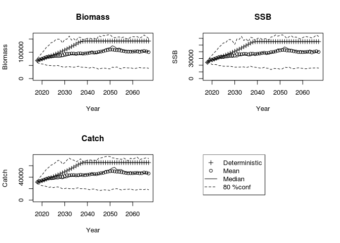

MSY管理基準値の計算
-------------------

-   MSY管理基準値計算では，上記の将来予測において，Fcurrentの値に様々な乗数を乗じたF一定方策における平衡状態時の（世代時間×20年を`nyear`で指定します）資源量やそれに対応するF等を管理基準値として算出します
-   なので、ここまでのプロセスで、ABC計算のためにきちんとしたオプションを設定したfuture.vpaを実行しておいてください。その返り値`future.Fcurrent`をMSY計算では使っていきます
-   MSY.est関数の引数の詳細な解説は[こちら](https://ichimomo.github.io/future-rvpa/future-doc-abc.html#msy%E7%AE%A1%E7%90%86%E5%9F%BA%E6%BA%96%E5%80%A4%E3%81%AE%E8%A8%88%E7%AE%97)
-   オプション`PGY`(MSYに対する比率を指定) や`B0percent`(B0に対する比率を指定)、`Bempirical`(親魚資源量の絶対値で指定)で、別の管理基準値も同時に計算できます。
-   最近年の親魚量で維持した場合の管理基準値も、比較のためにあとで見るため`Bempirical`で指定しておいてください。また、B\_HS(HSの折れ点)や最大親魚量などもここで計算しておいても良いかと。。。

``` r
# MSY管理基準値の計算
MSY.base <- est.MSY(res.pma, # VPAの計算結果
                 future.Fcurrent$input, # 将来予測で使用した引数
                 resid.year=0, # ARありの場合、最近何年分の残差を平均するかをここで指定する。ARありの設定を反映させたい場合必ずここを１以上とすること（とりあえず１としておいてください）。
                 N=100, # 確率的計算の繰り返し回数=>実際の計算では1000~5000回くらいやってください
                 calc.yieldcurve=TRUE,
                 PGY=c(0.95,0.9,0.6,0.1), # 計算したいPGYレベル。上限と下限の両方が計算される
                 onlylower.pgy=FALSE, # TRUEにするとPGYレベルの上限は計算しない（計算時間の節約になる）
                 B0percent=c(0.2,0.3,0.4),
                 Bempirical=c(round(tail(colSums(res.pma$ssb),n=1)),
                              round(max(colSums(res.pma$ssb))),
                              24000, # 現行Blimit
                              SRmodel.base$pars$b) # HSの折れ点
                 ) # 計算したいB0%レベル
```

    Estimating MSY
    F multiplier= 0.4903466 
    Estimating PGY  95 %
    F multiplier= 0.3006464 
    F multiplier= 0.8322266 
    Estimating PGY  90 %
    F multiplier= 0.2442106 
    F multiplier= 0.9314554 
    Estimating PGY  60 %
    F multiplier= 0.1042389 
    F multiplier= 1.009078 
    Estimating PGY  10 %
    F multiplier= 0.01208144 
    F multiplier= 1.076094 
    Estimating B0  20 %
    F multiplier= 0.622057 
    Estimating B0  30 %
    F multiplier= 0.4132039 
    Estimating B0  40 %
    F multiplier= 0.289628 
    Estimating B empirical  19431 
    F multiplier= 1.037682 
    Estimating B empirical  63967 
    F multiplier= 0.8873748 
    Estimating B empirical  24000 
    F multiplier= 1.029399 
    Estimating B empirical  51882.06 
    F multiplier= 0.9647514 

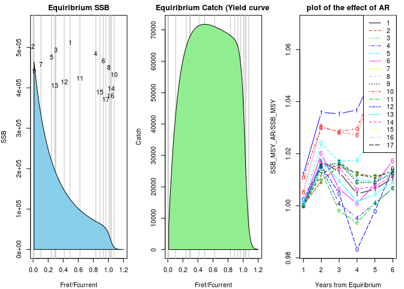

### 結果の表示

-   `MSY.base$summary_tb`にすべての結果が入っています。

``` r
# 結果の表示(tibbleという形式で表示され、最初の10行以外は省略されます)
(refs.all <- MSY.base$summary_tb)
```

    # A tibble: 34 x 13
       RP_name AR       SSB      B      U  Catch `Fref/Fcur` `SSB/SSB0`
       <chr>   <lgl>  <dbl>  <dbl>  <dbl>  <dbl>       <dbl>      <dbl>
     1 MSY     FALSE 1.25e5 2.21e5 0.325  71794.      0.490      0.256 
     2 B0      FALSE 4.88e5 5.93e5 0          0       0          1     
     3 PGY_0.… FALSE 1.90e5 2.89e5 0.236  68205.      0.301      0.389 
     4 PGY_0.… FALSE 6.97e4 1.60e5 0.427  68205.      0.832      0.143 
     5 PGY_0.… FALSE 2.19e5 3.20e5 0.202  64615.      0.244      0.450 
     6 PGY_0.… FALSE 5.85e4 1.44e5 0.447  64615.      0.931      0.120 
     7 PGY_0.… FALSE 3.32e5 4.36e5 0.0988 43080.      0.104      0.681 
     8 PGY_0.… FALSE 3.55e4 9.37e4 0.460  43074.      1.01       0.0728
     9 PGY_0.… FALSE 4.64e5 5.70e5 0.0126  7172.      0.0121     0.952 
    10 PGY_0.… FALSE 5.56e3 1.52e4 0.473   7175.      1.08       0.0114
    # ... with 24 more rows, and 5 more variables: Fref2Fcurrent <dbl>,
    #   F0 <dbl>, F1 <dbl>, F2 <dbl>, F3 <dbl>

``` r
# 全データをじっくり見たい場合
View(refs.all)
```

### 管理基準値の選択

-   **設定ポイント** est.MSYで計算された管理基準値から、何をBtarget, Blimit, Bbanとして用いるかをチョイスします。
-   具体的には、refs.allにRP.definitionという新しい列をひとつ作って、その列にそれぞれの管理基準値をどのように使うかを指定します
-   「管理基準値名 + 0」はデフォルト規則による管理基準値
-   代替候補がある場合は「管理基準値名 + 数字」として指定
-   たとえば目標管理基準値の第一候補はBmsyなのでRP\_nameがMSYでARなしの行のRP.definitionには"Btarget0"と入力します
-   Rコードがちょっと汚いですがご容赦ください。いい方法あったら教えてください。

``` r
# どの管理基準値をどのように定義するか、ここで指定します
refs.all$RP.definition <- NA 
refs.all$RP.definition[refs.all$RP_name=="MSY" & refs.all$AR==FALSE] <- "Btarget0"  # RP_nameがMSYでARがなしのものをBtargetとする
refs.all$RP.definition[refs.all$RP_name=="B0-20%" & refs.all$AR==FALSE] <- "Btarget1"  # たとえばBtargetの代替値をいちおう示す場合
refs.all$RP.definition[refs.all$RP_name=="PGY_0.95_lower" & refs.all$AR==FALSE] <- "Btarget2" 
refs.all$RP.definition[refs.all$RP_name=="PGY_0.9_lower" & refs.all$AR==FALSE] <- "Blow0"
refs.all$RP.definition[refs.all$RP_name=="PGY_0.6_lower" & refs.all$AR==FALSE] <- "Blimit0"
refs.all$RP.definition[refs.all$RP_name=="PGY_0.1_lower" & refs.all$AR==FALSE] <- "Bban0"
refs.all$RP.definition[refs.all$RP_name=="Ben-19431" & refs.all$AR==FALSE] <- "Bcurrent"
refs.all$RP.definition[refs.all$RP_name=="Ben-63967" & refs.all$AR==FALSE] <- "Bmax"
refs.all$RP.definition[refs.all$RP_name=="Ben-24000" & refs.all$AR==FALSE] <- "Blimit1"
refs.all$RP.definition[refs.all$RP_name=="Ben-51882" & refs.all$AR==FALSE] <- "B_HS"

# 定義した結果を見る
refs.all %>% select(RP_name,RP.definition)
```

    # A tibble: 34 x 2
       RP_name        RP.definition
       <chr>          <chr>        
     1 MSY            Btarget0     
     2 B0             <NA>         
     3 PGY_0.95_upper <NA>         
     4 PGY_0.95_lower Btarget2     
     5 PGY_0.9_upper  <NA>         
     6 PGY_0.9_lower  Blow0        
     7 PGY_0.6_upper  <NA>         
     8 PGY_0.6_lower  Blimit0      
     9 PGY_0.1_upper  <NA>         
    10 PGY_0.1_lower  Bban0        
    # ... with 24 more rows

``` r
# refs.allの中からRP.definitionで指定された行だけを抜き出す
(refs.base <- refs.all %>%
    filter(!is.na(RP.definition)) %>% # RP.definitionがNAでないものを抽出
    arrange(desc(SSB)) %>% # SSBを大きい順に並び替え
    select(RP.definition,RP_name,SSB,Catch,U,Fref2Fcurrent)) #　列を並び替え
```

    # A tibble: 10 x 6
       RP.definition RP_name            SSB  Catch     U Fref2Fcurrent
       <chr>         <chr>            <dbl>  <dbl> <dbl>         <dbl>
     1 Btarget0      MSY            124683. 71794. 0.325         0.490
     2 Btarget1      B0-20%          97546. 71023. 0.371         0.622
     3 Btarget2      PGY_0.95_lower  69681. 68205. 0.427         0.832
     4 Bmax          Ben-63967       63971. 66913. 0.439         0.887
     5 Blow0         PGY_0.9_lower   58475. 64615. 0.447         0.931
     6 B_HS          Ben-51882       51882. 59717. 0.453         0.965
     7 Blimit0       PGY_0.6_lower   35490. 43074. 0.460         1.01 
     8 Blimit1       Ben-24000       24006. 29863. 0.462         1.03 
     9 Bcurrent      Ben-19431       19440. 24340. 0.464         1.04 
    10 Bban0         PGY_0.1_lower    5564.  7175. 0.473         1.08 

------------------------------------------------------------------------

レポート作成
============

今まで作ったオブジェクトを使って、報告書の図を作っていきます。使うオブジェクトはこちら。 - res.pma(VPAの結果) - future.Fcurrent(Fcurrentによる将来予測結果) - MSY.base(MSYの計算結果) - refs.all(計算したすべての管理基準値) - refs.base(選択した管理基準値)

------------------------------------------------------------------------

再生産関係式
------------

``` r
# 再生産関係のプロット
g1 <- SRplot_gg(SRmodel.base)
g1 + ggtitle("図1. 再生産関係")
```

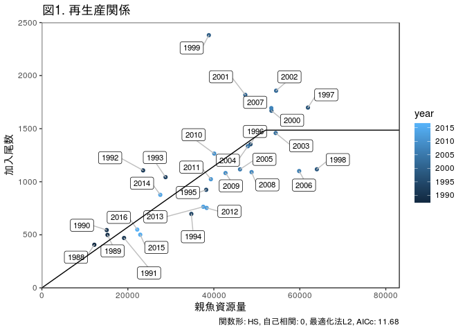

**(レポート記述内容例)**

-   何年から何年までのデータを使ったか？（また、その判断基準）
-   詳細な報告書には、モデル診断の結果で重要そうなもの、AICが近い他の再生産関係でフィットしたときの図なども示す。

管理基準値
----------

-   漁獲量曲線と表による出力
-   表では、有効数字が資源量・漁獲量について最小値で有効数字1桁になるように調整しています

``` r
# 再生産関係をもとにしたyield curveと管理基準値のプロット。
# 計算した全管理基準値を示す場合にはrefs.allを、厳選したものだけを示す場合にはrefs.baseを引数に使ってください
# AR==TRUEにするとARありの結果もプロットされます
g2 <- plot_yield(MSY.base, refs.all, AR = FALSE)
g2 + ggtitle("図2. 漁獲量曲線とさまざま管理基準値")
```


``` r
# 表の出力
make_RP_table(refs.base)
```

<table class="table table-condensed">
<thead>
<tr>
<th style="text-align:right;">
管理基準値
</th>
<th style="text-align:right;">
親魚資源量
</th>
<th style="text-align:right;">
漁獲量
</th>
<th style="text-align:right;">
漁獲率
</th>
<th style="text-align:right;">
努力量の乗数
</th>
</tr>
</thead>
<tbody>
<tr>
<td style="text-align:right;">
Btarget0
</td>
<td style="text-align:right;">
<span style="display: inline-block; direction: rtl; border-radius: 4px; padding-right: 2px; background-color: olivedrab; width: 100.00%">125000</span>
</td>
<td style="text-align:right;">
<span style="display: inline-block; direction: rtl; border-radius: 4px; padding-right: 2px; background-color: steelblue; width: 100.00%">72000</span>
</td>
<td style="text-align:right;">
<span style="display: inline-block; direction: rtl; border-radius: 4px; padding-right: 2px; background-color: orange; width: 70.21%">0.33</span>
</td>
<td style="text-align:right;">
<span style="display: inline-block; direction: rtl; border-radius: 4px; padding-right: 2px; background-color: tomato; width: 45.37%">0.49</span>
</td>
</tr>
<tr>
<td style="text-align:right;">
Btarget1
</td>
<td style="text-align:right;">
<span style="display: inline-block; direction: rtl; border-radius: 4px; padding-right: 2px; background-color: olivedrab; width: 78.40%">98000</span>
</td>
<td style="text-align:right;">
<span style="display: inline-block; direction: rtl; border-radius: 4px; padding-right: 2px; background-color: steelblue; width: 98.61%">71000</span>
</td>
<td style="text-align:right;">
<span style="display: inline-block; direction: rtl; border-radius: 4px; padding-right: 2px; background-color: orange; width: 78.72%">0.37</span>
</td>
<td style="text-align:right;">
<span style="display: inline-block; direction: rtl; border-radius: 4px; padding-right: 2px; background-color: tomato; width: 57.41%">0.62</span>
</td>
</tr>
<tr>
<td style="text-align:right;">
Btarget2
</td>
<td style="text-align:right;">
<span style="display: inline-block; direction: rtl; border-radius: 4px; padding-right: 2px; background-color: olivedrab; width: 56.00%">70000</span>
</td>
<td style="text-align:right;">
<span style="display: inline-block; direction: rtl; border-radius: 4px; padding-right: 2px; background-color: steelblue; width: 94.44%">68000</span>
</td>
<td style="text-align:right;">
<span style="display: inline-block; direction: rtl; border-radius: 4px; padding-right: 2px; background-color: orange; width: 91.49%">0.43</span>
</td>
<td style="text-align:right;">
<span style="display: inline-block; direction: rtl; border-radius: 4px; padding-right: 2px; background-color: tomato; width: 76.85%">0.83</span>
</td>
</tr>
<tr>
<td style="text-align:right;">
Bmax
</td>
<td style="text-align:right;">
<span style="display: inline-block; direction: rtl; border-radius: 4px; padding-right: 2px; background-color: olivedrab; width: 51.20%">64000</span>
</td>
<td style="text-align:right;">
<span style="display: inline-block; direction: rtl; border-radius: 4px; padding-right: 2px; background-color: steelblue; width: 93.06%">67000</span>
</td>
<td style="text-align:right;">
<span style="display: inline-block; direction: rtl; border-radius: 4px; padding-right: 2px; background-color: orange; width: 93.62%">0.44</span>
</td>
<td style="text-align:right;">
<span style="display: inline-block; direction: rtl; border-radius: 4px; padding-right: 2px; background-color: tomato; width: 82.41%">0.89</span>
</td>
</tr>
<tr>
<td style="text-align:right;">
Blow0
</td>
<td style="text-align:right;">
<span style="display: inline-block; direction: rtl; border-radius: 4px; padding-right: 2px; background-color: olivedrab; width: 46.40%">58000</span>
</td>
<td style="text-align:right;">
<span style="display: inline-block; direction: rtl; border-radius: 4px; padding-right: 2px; background-color: steelblue; width: 90.28%">65000</span>
</td>
<td style="text-align:right;">
<span style="display: inline-block; direction: rtl; border-radius: 4px; padding-right: 2px; background-color: orange; width: 95.74%">0.45</span>
</td>
<td style="text-align:right;">
<span style="display: inline-block; direction: rtl; border-radius: 4px; padding-right: 2px; background-color: tomato; width: 86.11%">0.93</span>
</td>
</tr>
<tr>
<td style="text-align:right;">
B\_HS
</td>
<td style="text-align:right;">
<span style="display: inline-block; direction: rtl; border-radius: 4px; padding-right: 2px; background-color: olivedrab; width: 41.60%">52000</span>
</td>
<td style="text-align:right;">
<span style="display: inline-block; direction: rtl; border-radius: 4px; padding-right: 2px; background-color: steelblue; width: 83.33%">60000</span>
</td>
<td style="text-align:right;">
<span style="display: inline-block; direction: rtl; border-radius: 4px; padding-right: 2px; background-color: orange; width: 95.74%">0.45</span>
</td>
<td style="text-align:right;">
<span style="display: inline-block; direction: rtl; border-radius: 4px; padding-right: 2px; background-color: tomato; width: 88.89%">0.96</span>
</td>
</tr>
<tr>
<td style="text-align:right;">
Blimit0
</td>
<td style="text-align:right;">
<span style="display: inline-block; direction: rtl; border-radius: 4px; padding-right: 2px; background-color: olivedrab; width: 28.00%">35000</span>
</td>
<td style="text-align:right;">
<span style="display: inline-block; direction: rtl; border-radius: 4px; padding-right: 2px; background-color: steelblue; width: 59.72%">43000</span>
</td>
<td style="text-align:right;">
<span style="display: inline-block; direction: rtl; border-radius: 4px; padding-right: 2px; background-color: orange; width: 97.87%">0.46</span>
</td>
<td style="text-align:right;">
<span style="display: inline-block; direction: rtl; border-radius: 4px; padding-right: 2px; background-color: tomato; width: 93.52%">1.01</span>
</td>
</tr>
<tr>
<td style="text-align:right;">
Blimit1
</td>
<td style="text-align:right;">
<span style="display: inline-block; direction: rtl; border-radius: 4px; padding-right: 2px; background-color: olivedrab; width: 19.20%">24000</span>
</td>
<td style="text-align:right;">
<span style="display: inline-block; direction: rtl; border-radius: 4px; padding-right: 2px; background-color: steelblue; width: 41.67%">30000</span>
</td>
<td style="text-align:right;">
<span style="display: inline-block; direction: rtl; border-radius: 4px; padding-right: 2px; background-color: orange; width: 97.87%">0.46</span>
</td>
<td style="text-align:right;">
<span style="display: inline-block; direction: rtl; border-radius: 4px; padding-right: 2px; background-color: tomato; width: 95.37%">1.03</span>
</td>
</tr>
<tr>
<td style="text-align:right;">
Bcurrent
</td>
<td style="text-align:right;">
<span style="display: inline-block; direction: rtl; border-radius: 4px; padding-right: 2px; background-color: olivedrab; width: 15.20%">19000</span>
</td>
<td style="text-align:right;">
<span style="display: inline-block; direction: rtl; border-radius: 4px; padding-right: 2px; background-color: steelblue; width: 33.33%">24000</span>
</td>
<td style="text-align:right;">
<span style="display: inline-block; direction: rtl; border-radius: 4px; padding-right: 2px; background-color: orange; width: 97.87%">0.46</span>
</td>
<td style="text-align:right;">
<span style="display: inline-block; direction: rtl; border-radius: 4px; padding-right: 2px; background-color: tomato; width: 96.30%">1.04</span>
</td>
</tr>
<tr>
<td style="text-align:right;">
Bban0
</td>
<td style="text-align:right;">
<span style="display: inline-block; direction: rtl; border-radius: 4px; padding-right: 2px; background-color: olivedrab; width: 4.80%">6000</span>
</td>
<td style="text-align:right;">
<span style="display: inline-block; direction: rtl; border-radius: 4px; padding-right: 2px; background-color: steelblue; width: 9.72%">7000</span>
</td>
<td style="text-align:right;">
<span style="display: inline-block; direction: rtl; border-radius: 4px; padding-right: 2px; background-color: orange; width: 100.00%">0.47</span>
</td>
<td style="text-align:right;">
<span style="display: inline-block; direction: rtl; border-radius: 4px; padding-right: 2px; background-color: tomato; width: 100.00%">1.08</span>
</td>
</tr>
</tbody>
</table>
**(レポート記述内容例)**

-   どの管理基準値がどのような意味を示すのか？デフォルト以外に候補がある場合には、その候補を選んだ理由。その管理基準値における利点・欠点を示す。0, 1, 2の数字が小さいほどデフォルトルールにのっとった管理基準値である。
    -   **記述例(あくまで例です。今の例で、代替基準値を最大限選ぶとしたらどうするか、というものです)**
    -   目標管理基準値(Btarget0): **Bmsy**。過去最大親魚量の2倍となり、SSB&gt;SSB\_maxの範囲における不確実性が大きい懸念がある。
    -   目標管理基準値(Btarget1)(代替値1): **漁獲がないときの親魚資源量の20%に相当する親魚量。**　MSYの90%以上の平均漁獲量を得られる親魚レベルは確保されている。米国では浮魚類のMSY代替値の下限としても利用されている。
    -   目標管理基準値(Btarget2)(代替値2): **MSYの95%の平衡漁獲量を得るときの親魚資源量** MSYには至らないがMSYの95%の平均漁獲量を得られる親魚レベルである。
    -   目標資源量の下限となる基準値(Blow): **MSYの90%の平衡漁獲量を得るときの親魚資源量**
    -   限界資源量(Blimit0): **MSYの60%の平衡漁獲量を得るときの親魚資源量**
    -   限界資源量(Blimit1): **今まで利用していたBlimit。**この水準ではMSYの50%以上の漁獲量が失われるため、Blimitとしては推奨できない。
    -   禁漁資源量(Blow): **MSYの10%の平衡漁獲量を得るときの親魚資源量**
    -   その他、参考となる経験的な指標として以下のものも示した
    -   Bmax: 過去最大親魚量
    -   B\_HS: HS再生産関係の折れ点
    -   B\_current: 最近年の親魚量

------------------------------------------------------------------------

神戸チャート
------------

4区分図と6区分図のどちらも出力します。

-   Btargetをベースとした4区分

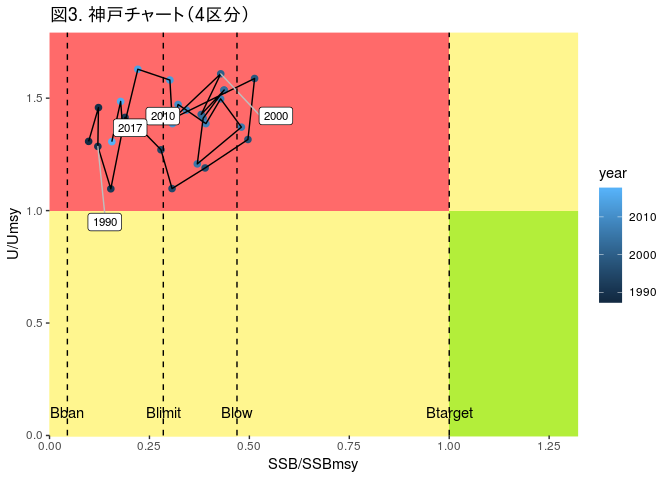

-   Blimit, Blowをベースとした6区分


------------------------------------------------------------------------

HCRによる将来予測
-----------------

-   まずデフォルトの管理基準値を使った将来予測を実施します

``` r
# デフォルトのHCR(Btarget0,Blimit0,Bban0のセット)
input.abc <- future.Fcurrent$input # Fcurrentにおける将来予測の引数をベースに将来予測します
input.abc$multi <- derive_RP_value(refs.base,"Btarget0")$Fref2Fcurrent # currentFへの乗数を"Btarget0"で指定した値に
input.abc$HCR <- list(Blim=derive_RP_value(refs.base,"Blimit0")$SSB,
                      Bban=derive_RP_value(refs.base,"Bban0")$SSB,
                      beta=0.8) # BlimitはBlimit0, BbanはBban0の値
future.default <- do.call(future.vpa,input.abc) # デフォルトルールの結果→図示などに使う
```

    $ABC.year
    [1] 2019

    $Blim
    [1] 0

    $F.sigma
    [1] 0

    $Frec
    NULL

    $HCR
    $HCR$Blim
    [1] 35489.95

    $HCR$Bban
    [1] 5564.275

    $HCR$beta
    [1] 0.8


    $M
    NULL

    $M.year
    [1] 2015 2016 2017

    $N
    [1] 100

    $Pope
    [1] TRUE

    $add.year
    [1] 0

    $currentF
    NULL

    $delta
    NULL

    $det.run
    [1] TRUE

    $eaa0
    NULL

    $faa0
    NULL

    $is.plot
    [1] TRUE

    $maa
    NULL

    $maa.year
    [1] 2015 2016 2017

    $multi
    [1] 0.4903466

    $multi.year
    [1] 1

    $naa0
    NULL

    $nyear
    [1] 50

    $outtype
    [1] "FULL"

    $plus.group
    [1] TRUE

    $pre.catch
    NULL

    $random.select
    NULL

    $rec.arg
    $rec.arg$a
    [1] 0.02864499

    $rec.arg$b
    [1] 51882.06

    $rec.arg$rho
    [1] 0

    $rec.arg$sd
    [1] 0.2624895

    $rec.arg$resid
     [1]  0.15003999  0.13188525  0.23168312 -0.15352429  0.49544035
     [6]  0.23597319 -0.35721137 -0.16965875 -0.02705374  0.13375295
    [11] -0.28506140  0.76090931  0.11611132  0.29373043  0.22330688
    [16] -0.01847747 -0.02781840 -0.16723995 -0.30046800  0.13088282
    [21] -0.24773256 -0.12321799  0.09662881 -0.09504603 -0.37695727
    [26] -0.34187713  0.10535290 -0.26881174 -0.14558152


    $rec.new
    NULL

    $recfunc
    function (ssb, vpares, rec.resample = NULL, rec.arg = list(a = 1000, 
        b = 1000, sd = 0.1, rho = 0, resid = 0)) 
    {
        rec0 <- ifelse(ssb > rec.arg$b, rec.arg$a * rec.arg$b, rec.arg$a * 
            ssb)
        rec <- rec0 * exp(rec.arg$rho * rec.arg$resid)
        rec <- rec * exp(rnorm(length(ssb), -0.5 * rec.arg$sd2^2, 
            rec.arg$sd))
        new.resid <- log(rec/rec0) + 0.5 * rec.arg$sd2^2
        return(list(rec = rec, rec.resample = new.resid))
    }
    <bytecode: 0xb22a2a0>

    $replace.rec.year
    [1] 2012

    $seed
    [1] 1

    $silent
    [1] FALSE

    $start.year
    [1] 2018

    $waa
    NULL

    $waa.catch
    NULL

    $waa.fun
    [1] FALSE

    $waa.year
    [1] 2015 2016 2017

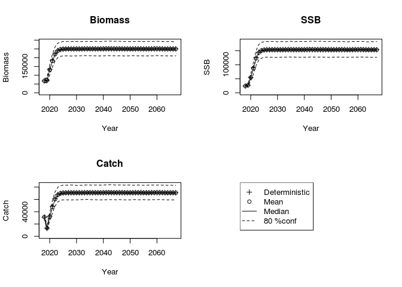

``` r
# 親魚資源量と漁獲量の時系列の図示
g5 <- plot_futures(res.pma, # vpaの結果
                   list(future.Fcurrent,future.default), # 将来予測結果
                   future.name=c("現行のF","HCRによるF"),
                   CI_range=c(0.1,0.9),
                   maxyear=2045,
                   Btarget=derive_RP_value(refs.base,"Btarget0")$SSB,
                   Blimit=derive_RP_value(refs.base,"Blimit0")$SSB,
                   Blow=derive_RP_value(refs.base,"Blow0")$SSB,
                   Bban=derive_RP_value(refs.base,"Bban0")$SSB)
(g5 <- g5+ggtitle("図5. 現行のFとデフォルトのHCRを用いた時の将来予測\n(実線：平均値、範囲：90パーセント信頼区間)")+ylab("トン"))
```

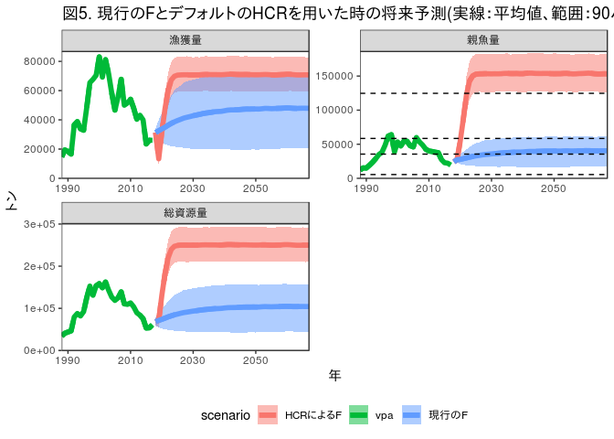

------------------------------------------------------------------------

代替管理基準値やさまざまなβを用いたときのパフォーマンス指標の比較
-----------------------------------------------------------------

-   代替管理基準値やさまざまなβを用いたときの将来予測を実施し、その結果を表にします
-   `calc_kobeII_matrix`で計算します

``` r
## 網羅的将来予測の実施
kobeII.table <- calc_kobeII_matrix(future.Fcurrent,
                         refs.base,
                         Btarget=c("Btarget0","Btarget1"), # HCRの候補として選択したい管理基準値を入れる
                         Blimit=c("Blimit0","Blimit1"),
                         beta=seq(from=0.5,to=1,by=0.1)) # betaの区分
```

    4 HCR is calculated:  Btarget0-Blimit0-Bban0 Btarget0-Blimit1-Bban0 Btarget1-Blimit0-Bban0 Btarget1-Blimit1-Bban0 

------------------------------------------------------------------------

### 結果の表の出力

-   関数化しようと思いましたが、どこを見たいなどが系群によって異なりそうなのでとりあえず生のRコードで示します

``` r
# 平均漁獲量の表
catch.table <- kobeII.table %>% filter(year %in% c(2017:2023, 2028, 2038), stat == 
    "catch") %>% group_by(HCR_name, beta, year) %>% summarise(catch.mean = round(mean(value), 
    -floor(log10(min(kobeII.table$value))))) %>% spread(key = year, value = round(catch.mean)) %>% 
    ungroup() %>% arrange(HCR_name, desc(beta)) %>% mutate(stat_name = "catch.mean")

# SSB>SSBtargetとなる確率
ssbtarget.table <- kobeII.table %>% filter(year %in% c(2017:2023, 2028, 2038), 
    stat == "SSB") %>% group_by(HCR_name, beta, year) %>% summarise(ssb.over.target = round(100 * 
    mean(value > Btarget))) %>% spread(key = year, value = ssb.over.target) %>% 
    ungroup() %>% arrange(HCR_name, desc(beta)) %>% mutate(stat_name = "Pr(SSB>SSBtarget)")


# SSB>SSBlow(=高位水準)となる確率
ssblow.table <- kobeII.table %>% filter(year %in% c(2017:2023, 2028, 2038), 
    stat == "SSB") %>% group_by(HCR_name, beta, year) %>% summarise(ssb.over.target = round(100 * 
    mean(value > Blow))) %>% spread(key = year, value = ssb.over.target) %>% 
    ungroup() %>% arrange(HCR_name, desc(beta)) %>% mutate(stat_name = "Pr(SSB>SSBlow)")

# SSB>SSBlimとなる確率
ssblimit.table <- kobeII.table %>% filter(year %in% c(2017:2023, 2028, 2038), 
    stat == "SSB") %>% group_by(HCR_name, beta, year) %>% summarise(ssb.over.target = round(100 * 
    mean(value > Blimit))) %>% spread(key = year, value = ssb.over.target) %>% 
    ungroup() %>% arrange(HCR_name, desc(beta)) %>% mutate(stat_name = "Pr(SSB>SSBlim)")
```

csvファイルに一括して出力する場合
---------------------------------

``` r
all.table <- bind_rows(catch.table, ssbtarget.table, ssblow.table, ssblimit.table)
write.csv(all.table, file = "all.table.csv")
```

htmlで出力したい場合
--------------------

### 平均漁獲量

``` r
library(formattable)
catch.table %>% formattable::formattable(list(area(col = -1) ~ color_bar("steelblue"), 
    beta = color_tile("white", "blue"), HCR_name = formatter("span", style = ~style(color = ifelse(HCR_name == 
        "Btarget0-Blimit0-Bban0" & beta == 0.8, "red", "black")))))
```

<table class="table table-condensed">
<thead>
<tr>
<th style="text-align:right;">
HCR\_name
</th>
<th style="text-align:right;">
beta
</th>
<th style="text-align:right;">
2018
</th>
<th style="text-align:right;">
2019
</th>
<th style="text-align:right;">
2020
</th>
<th style="text-align:right;">
2021
</th>
<th style="text-align:right;">
2022
</th>
<th style="text-align:right;">
2023
</th>
<th style="text-align:right;">
2028
</th>
<th style="text-align:right;">
2038
</th>
<th style="text-align:right;">
stat\_name
</th>
</tr>
</thead>
<tbody>
<tr>
<td style="text-align:right;">
<span style="color: black">Btarget0-Blimit0-Bban0</span>
</td>
<td style="text-align:right;">
<span style="display: block; padding: 0 4px; border-radius: 4px; background-color: #0000ff">1.0</span>
</td>
<td style="text-align:right;">
<span style="display: inline-block; direction: rtl; border-radius: 4px; padding-right: 2px; background-color: steelblue">31000 </span>
</td>
<td style="text-align:right;">
<span style="display: inline-block; direction: rtl; border-radius: 4px; padding-right: 2px; background-color: steelblue">16000 </span>
</td>
<td style="text-align:right;">
<span style="display: inline-block; direction: rtl; border-radius: 4px; padding-right: 2px; background-color: steelblue">36000 </span>
</td>
<td style="text-align:right;">
<span style="display: inline-block; direction: rtl; border-radius: 4px; padding-right: 2px; background-color: steelblue">52000 </span>
</td>
<td style="text-align:right;">
<span style="display: inline-block; direction: rtl; border-radius: 4px; padding-right: 2px; background-color: steelblue">63000 </span>
</td>
<td style="text-align:right;">
<span style="display: inline-block; direction: rtl; border-radius: 4px; padding-right: 2px; background-color: steelblue">69000 </span>
</td>
<td style="text-align:right;">
<span style="display: inline-block; direction: rtl; border-radius: 4px; padding-right: 2px; background-color: steelblue">72000 </span>
</td>
<td style="text-align:right;">
<span style="display: inline-block; direction: rtl; border-radius: 4px; padding-right: 2px; background-color: steelblue">71000 </span>
</td>
<td style="text-align:right;">
<span style="display: inline-block; direction: rtl; border-radius: 4px; padding-right: 2px; background-color: steelblue">catch.mean</span>
</td>
</tr>
<tr>
<td style="text-align:right;">
<span style="color: black">Btarget0-Blimit0-Bban0</span>
</td>
<td style="text-align:right;">
<span style="display: block; padding: 0 4px; border-radius: 4px; background-color: #3333ff">0.9</span>
</td>
<td style="text-align:right;">
<span style="display: inline-block; direction: rtl; border-radius: 4px; padding-right: 2px; background-color: steelblue">31000 </span>
</td>
<td style="text-align:right;">
<span style="display: inline-block; direction: rtl; border-radius: 4px; padding-right: 2px; background-color: steelblue">15000 </span>
</td>
<td style="text-align:right;">
<span style="display: inline-block; direction: rtl; border-radius: 4px; padding-right: 2px; background-color: steelblue">34000 </span>
</td>
<td style="text-align:right;">
<span style="display: inline-block; direction: rtl; border-radius: 4px; padding-right: 2px; background-color: steelblue">50000 </span>
</td>
<td style="text-align:right;">
<span style="display: inline-block; direction: rtl; border-radius: 4px; padding-right: 2px; background-color: steelblue">62000 </span>
</td>
<td style="text-align:right;">
<span style="display: inline-block; direction: rtl; border-radius: 4px; padding-right: 2px; background-color: steelblue">69000 </span>
</td>
<td style="text-align:right;">
<span style="display: inline-block; direction: rtl; border-radius: 4px; padding-right: 2px; background-color: steelblue">72000 </span>
</td>
<td style="text-align:right;">
<span style="display: inline-block; direction: rtl; border-radius: 4px; padding-right: 2px; background-color: steelblue">71000 </span>
</td>
<td style="text-align:right;">
<span style="display: inline-block; direction: rtl; border-radius: 4px; padding-right: 2px; background-color: steelblue">catch.mean</span>
</td>
</tr>
<tr>
<td style="text-align:right;">
<span style="color: red">Btarget0-Blimit0-Bban0</span>
</td>
<td style="text-align:right;">
<span style="display: block; padding: 0 4px; border-radius: 4px; background-color: #6565ff">0.8</span>
</td>
<td style="text-align:right;">
<span style="display: inline-block; direction: rtl; border-radius: 4px; padding-right: 2px; background-color: steelblue">31000 </span>
</td>
<td style="text-align:right;">
<span style="display: inline-block; direction: rtl; border-radius: 4px; padding-right: 2px; background-color: steelblue">14000 </span>
</td>
<td style="text-align:right;">
<span style="display: inline-block; direction: rtl; border-radius: 4px; padding-right: 2px; background-color: steelblue">32000 </span>
</td>
<td style="text-align:right;">
<span style="display: inline-block; direction: rtl; border-radius: 4px; padding-right: 2px; background-color: steelblue">48000 </span>
</td>
<td style="text-align:right;">
<span style="display: inline-block; direction: rtl; border-radius: 4px; padding-right: 2px; background-color: steelblue">61000 </span>
</td>
<td style="text-align:right;">
<span style="display: inline-block; direction: rtl; border-radius: 4px; padding-right: 2px; background-color: steelblue">68000 </span>
</td>
<td style="text-align:right;">
<span style="display: inline-block; direction: rtl; border-radius: 4px; padding-right: 2px; background-color: steelblue">71000 </span>
</td>
<td style="text-align:right;">
<span style="display: inline-block; direction: rtl; border-radius: 4px; padding-right: 2px; background-color: steelblue">71000 </span>
</td>
<td style="text-align:right;">
<span style="display: inline-block; direction: rtl; border-radius: 4px; padding-right: 2px; background-color: steelblue">catch.mean</span>
</td>
</tr>
<tr>
<td style="text-align:right;">
<span style="color: black">Btarget0-Blimit0-Bban0</span>
</td>
<td style="text-align:right;">
<span style="display: block; padding: 0 4px; border-radius: 4px; background-color: #9999ff">0.7</span>
</td>
<td style="text-align:right;">
<span style="display: inline-block; direction: rtl; border-radius: 4px; padding-right: 2px; background-color: steelblue">31000 </span>
</td>
<td style="text-align:right;">
<span style="display: inline-block; direction: rtl; border-radius: 4px; padding-right: 2px; background-color: steelblue">12000 </span>
</td>
<td style="text-align:right;">
<span style="display: inline-block; direction: rtl; border-radius: 4px; padding-right: 2px; background-color: steelblue">30000 </span>
</td>
<td style="text-align:right;">
<span style="display: inline-block; direction: rtl; border-radius: 4px; padding-right: 2px; background-color: steelblue">46000 </span>
</td>
<td style="text-align:right;">
<span style="display: inline-block; direction: rtl; border-radius: 4px; padding-right: 2px; background-color: steelblue">59000 </span>
</td>
<td style="text-align:right;">
<span style="display: inline-block; direction: rtl; border-radius: 4px; padding-right: 2px; background-color: steelblue">66000 </span>
</td>
<td style="text-align:right;">
<span style="display: inline-block; direction: rtl; border-radius: 4px; padding-right: 2px; background-color: steelblue">70000 </span>
</td>
<td style="text-align:right;">
<span style="display: inline-block; direction: rtl; border-radius: 4px; padding-right: 2px; background-color: steelblue">70000 </span>
</td>
<td style="text-align:right;">
<span style="display: inline-block; direction: rtl; border-radius: 4px; padding-right: 2px; background-color: steelblue">catch.mean</span>
</td>
</tr>
<tr>
<td style="text-align:right;">
<span style="color: black">Btarget0-Blimit0-Bban0</span>
</td>
<td style="text-align:right;">
<span style="display: block; padding: 0 4px; border-radius: 4px; background-color: #ccccff">0.6</span>
</td>
<td style="text-align:right;">
<span style="display: inline-block; direction: rtl; border-radius: 4px; padding-right: 2px; background-color: steelblue">31000 </span>
</td>
<td style="text-align:right;">
<span style="display: inline-block; direction: rtl; border-radius: 4px; padding-right: 2px; background-color: steelblue">11000 </span>
</td>
<td style="text-align:right;">
<span style="display: inline-block; direction: rtl; border-radius: 4px; padding-right: 2px; background-color: steelblue">27000 </span>
</td>
<td style="text-align:right;">
<span style="display: inline-block; direction: rtl; border-radius: 4px; padding-right: 2px; background-color: steelblue">42000 </span>
</td>
<td style="text-align:right;">
<span style="display: inline-block; direction: rtl; border-radius: 4px; padding-right: 2px; background-color: steelblue">56000 </span>
</td>
<td style="text-align:right;">
<span style="display: inline-block; direction: rtl; border-radius: 4px; padding-right: 2px; background-color: steelblue">63000 </span>
</td>
<td style="text-align:right;">
<span style="display: inline-block; direction: rtl; border-radius: 4px; padding-right: 2px; background-color: steelblue">68000 </span>
</td>
<td style="text-align:right;">
<span style="display: inline-block; direction: rtl; border-radius: 4px; padding-right: 2px; background-color: steelblue">68000 </span>
</td>
<td style="text-align:right;">
<span style="display: inline-block; direction: rtl; border-radius: 4px; padding-right: 2px; background-color: steelblue">catch.mean</span>
</td>
</tr>
<tr>
<td style="text-align:right;">
<span style="color: black">Btarget0-Blimit0-Bban0</span>
</td>
<td style="text-align:right;">
<span style="display: block; padding: 0 4px; border-radius: 4px; background-color: #ffffff">0.5</span>
</td>
<td style="text-align:right;">
<span style="display: inline-block; direction: rtl; border-radius: 4px; padding-right: 2px; background-color: steelblue">31000 </span>
</td>
<td style="text-align:right;">
<span style="display: inline-block; direction: rtl; border-radius: 4px; padding-right: 2px; background-color: steelblue"> 9000 </span>
</td>
<td style="text-align:right;">
<span style="display: inline-block; direction: rtl; border-radius: 4px; padding-right: 2px; background-color: steelblue">24000 </span>
</td>
<td style="text-align:right;">
<span style="display: inline-block; direction: rtl; border-radius: 4px; padding-right: 2px; background-color: steelblue">38000 </span>
</td>
<td style="text-align:right;">
<span style="display: inline-block; direction: rtl; border-radius: 4px; padding-right: 2px; background-color: steelblue">51000 </span>
</td>
<td style="text-align:right;">
<span style="display: inline-block; direction: rtl; border-radius: 4px; padding-right: 2px; background-color: steelblue">59000 </span>
</td>
<td style="text-align:right;">
<span style="display: inline-block; direction: rtl; border-radius: 4px; padding-right: 2px; background-color: steelblue">65000 </span>
</td>
<td style="text-align:right;">
<span style="display: inline-block; direction: rtl; border-radius: 4px; padding-right: 2px; background-color: steelblue">65000 </span>
</td>
<td style="text-align:right;">
<span style="display: inline-block; direction: rtl; border-radius: 4px; padding-right: 2px; background-color: steelblue">catch.mean</span>
</td>
</tr>
<tr>
<td style="text-align:right;">
<span style="color: black">Btarget0-Blimit1-Bban0</span>
</td>
<td style="text-align:right;">
<span style="display: block; padding: 0 4px; border-radius: 4px; background-color: #0000ff">1.0</span>
</td>
<td style="text-align:right;">
<span style="display: inline-block; direction: rtl; border-radius: 4px; padding-right: 2px; background-color: steelblue">31000 </span>
</td>
<td style="text-align:right;">
<span style="display: inline-block; direction: rtl; border-radius: 4px; padding-right: 2px; background-color: steelblue">20000 </span>
</td>
<td style="text-align:right;">
<span style="display: inline-block; direction: rtl; border-radius: 4px; padding-right: 2px; background-color: steelblue">33000 </span>
</td>
<td style="text-align:right;">
<span style="display: inline-block; direction: rtl; border-radius: 4px; padding-right: 2px; background-color: steelblue">48000 </span>
</td>
<td style="text-align:right;">
<span style="display: inline-block; direction: rtl; border-radius: 4px; padding-right: 2px; background-color: steelblue">61000 </span>
</td>
<td style="text-align:right;">
<span style="display: inline-block; direction: rtl; border-radius: 4px; padding-right: 2px; background-color: steelblue">68000 </span>
</td>
<td style="text-align:right;">
<span style="display: inline-block; direction: rtl; border-radius: 4px; padding-right: 2px; background-color: steelblue">72000 </span>
</td>
<td style="text-align:right;">
<span style="display: inline-block; direction: rtl; border-radius: 4px; padding-right: 2px; background-color: steelblue">71000 </span>
</td>
<td style="text-align:right;">
<span style="display: inline-block; direction: rtl; border-radius: 4px; padding-right: 2px; background-color: steelblue">catch.mean</span>
</td>
</tr>
<tr>
<td style="text-align:right;">
<span style="color: black">Btarget0-Blimit1-Bban0</span>
</td>
<td style="text-align:right;">
<span style="display: block; padding: 0 4px; border-radius: 4px; background-color: #3333ff">0.9</span>
</td>
<td style="text-align:right;">
<span style="display: inline-block; direction: rtl; border-radius: 4px; padding-right: 2px; background-color: steelblue">31000 </span>
</td>
<td style="text-align:right;">
<span style="display: inline-block; direction: rtl; border-radius: 4px; padding-right: 2px; background-color: steelblue">19000 </span>
</td>
<td style="text-align:right;">
<span style="display: inline-block; direction: rtl; border-radius: 4px; padding-right: 2px; background-color: steelblue">31000 </span>
</td>
<td style="text-align:right;">
<span style="display: inline-block; direction: rtl; border-radius: 4px; padding-right: 2px; background-color: steelblue">47000 </span>
</td>
<td style="text-align:right;">
<span style="display: inline-block; direction: rtl; border-radius: 4px; padding-right: 2px; background-color: steelblue">60000 </span>
</td>
<td style="text-align:right;">
<span style="display: inline-block; direction: rtl; border-radius: 4px; padding-right: 2px; background-color: steelblue">67000 </span>
</td>
<td style="text-align:right;">
<span style="display: inline-block; direction: rtl; border-radius: 4px; padding-right: 2px; background-color: steelblue">72000 </span>
</td>
<td style="text-align:right;">
<span style="display: inline-block; direction: rtl; border-radius: 4px; padding-right: 2px; background-color: steelblue">71000 </span>
</td>
<td style="text-align:right;">
<span style="display: inline-block; direction: rtl; border-radius: 4px; padding-right: 2px; background-color: steelblue">catch.mean</span>
</td>
</tr>
<tr>
<td style="text-align:right;">
<span style="color: black">Btarget0-Blimit1-Bban0</span>
</td>
<td style="text-align:right;">
<span style="display: block; padding: 0 4px; border-radius: 4px; background-color: #6565ff">0.8</span>
</td>
<td style="text-align:right;">
<span style="display: inline-block; direction: rtl; border-radius: 4px; padding-right: 2px; background-color: steelblue">31000 </span>
</td>
<td style="text-align:right;">
<span style="display: inline-block; direction: rtl; border-radius: 4px; padding-right: 2px; background-color: steelblue">17000 </span>
</td>
<td style="text-align:right;">
<span style="display: inline-block; direction: rtl; border-radius: 4px; padding-right: 2px; background-color: steelblue">30000 </span>
</td>
<td style="text-align:right;">
<span style="display: inline-block; direction: rtl; border-radius: 4px; padding-right: 2px; background-color: steelblue">46000 </span>
</td>
<td style="text-align:right;">
<span style="display: inline-block; direction: rtl; border-radius: 4px; padding-right: 2px; background-color: steelblue">59000 </span>
</td>
<td style="text-align:right;">
<span style="display: inline-block; direction: rtl; border-radius: 4px; padding-right: 2px; background-color: steelblue">67000 </span>
</td>
<td style="text-align:right;">
<span style="display: inline-block; direction: rtl; border-radius: 4px; padding-right: 2px; background-color: steelblue">71000 </span>
</td>
<td style="text-align:right;">
<span style="display: inline-block; direction: rtl; border-radius: 4px; padding-right: 2px; background-color: steelblue">71000 </span>
</td>
<td style="text-align:right;">
<span style="display: inline-block; direction: rtl; border-radius: 4px; padding-right: 2px; background-color: steelblue">catch.mean</span>
</td>
</tr>
<tr>
<td style="text-align:right;">
<span style="color: black">Btarget0-Blimit1-Bban0</span>
</td>
<td style="text-align:right;">
<span style="display: block; padding: 0 4px; border-radius: 4px; background-color: #9999ff">0.7</span>
</td>
<td style="text-align:right;">
<span style="display: inline-block; direction: rtl; border-radius: 4px; padding-right: 2px; background-color: steelblue">31000 </span>
</td>
<td style="text-align:right;">
<span style="display: inline-block; direction: rtl; border-radius: 4px; padding-right: 2px; background-color: steelblue">15000 </span>
</td>
<td style="text-align:right;">
<span style="display: inline-block; direction: rtl; border-radius: 4px; padding-right: 2px; background-color: steelblue">28000 </span>
</td>
<td style="text-align:right;">
<span style="display: inline-block; direction: rtl; border-radius: 4px; padding-right: 2px; background-color: steelblue">44000 </span>
</td>
<td style="text-align:right;">
<span style="display: inline-block; direction: rtl; border-radius: 4px; padding-right: 2px; background-color: steelblue">57000 </span>
</td>
<td style="text-align:right;">
<span style="display: inline-block; direction: rtl; border-radius: 4px; padding-right: 2px; background-color: steelblue">65000 </span>
</td>
<td style="text-align:right;">
<span style="display: inline-block; direction: rtl; border-radius: 4px; padding-right: 2px; background-color: steelblue">70000 </span>
</td>
<td style="text-align:right;">
<span style="display: inline-block; direction: rtl; border-radius: 4px; padding-right: 2px; background-color: steelblue">70000 </span>
</td>
<td style="text-align:right;">
<span style="display: inline-block; direction: rtl; border-radius: 4px; padding-right: 2px; background-color: steelblue">catch.mean</span>
</td>
</tr>
<tr>
<td style="text-align:right;">
<span style="color: black">Btarget0-Blimit1-Bban0</span>
</td>
<td style="text-align:right;">
<span style="display: block; padding: 0 4px; border-radius: 4px; background-color: #ccccff">0.6</span>
</td>
<td style="text-align:right;">
<span style="display: inline-block; direction: rtl; border-radius: 4px; padding-right: 2px; background-color: steelblue">31000 </span>
</td>
<td style="text-align:right;">
<span style="display: inline-block; direction: rtl; border-radius: 4px; padding-right: 2px; background-color: steelblue">14000 </span>
</td>
<td style="text-align:right;">
<span style="display: inline-block; direction: rtl; border-radius: 4px; padding-right: 2px; background-color: steelblue">25000 </span>
</td>
<td style="text-align:right;">
<span style="display: inline-block; direction: rtl; border-radius: 4px; padding-right: 2px; background-color: steelblue">41000 </span>
</td>
<td style="text-align:right;">
<span style="display: inline-block; direction: rtl; border-radius: 4px; padding-right: 2px; background-color: steelblue">54000 </span>
</td>
<td style="text-align:right;">
<span style="display: inline-block; direction: rtl; border-radius: 4px; padding-right: 2px; background-color: steelblue">63000 </span>
</td>
<td style="text-align:right;">
<span style="display: inline-block; direction: rtl; border-radius: 4px; padding-right: 2px; background-color: steelblue">68000 </span>
</td>
<td style="text-align:right;">
<span style="display: inline-block; direction: rtl; border-radius: 4px; padding-right: 2px; background-color: steelblue">68000 </span>
</td>
<td style="text-align:right;">
<span style="display: inline-block; direction: rtl; border-radius: 4px; padding-right: 2px; background-color: steelblue">catch.mean</span>
</td>
</tr>
<tr>
<td style="text-align:right;">
<span style="color: black">Btarget0-Blimit1-Bban0</span>
</td>
<td style="text-align:right;">
<span style="display: block; padding: 0 4px; border-radius: 4px; background-color: #ffffff">0.5</span>
</td>
<td style="text-align:right;">
<span style="display: inline-block; direction: rtl; border-radius: 4px; padding-right: 2px; background-color: steelblue">31000 </span>
</td>
<td style="text-align:right;">
<span style="display: inline-block; direction: rtl; border-radius: 4px; padding-right: 2px; background-color: steelblue">12000 </span>
</td>
<td style="text-align:right;">
<span style="display: inline-block; direction: rtl; border-radius: 4px; padding-right: 2px; background-color: steelblue">23000 </span>
</td>
<td style="text-align:right;">
<span style="display: inline-block; direction: rtl; border-radius: 4px; padding-right: 2px; background-color: steelblue">37000 </span>
</td>
<td style="text-align:right;">
<span style="display: inline-block; direction: rtl; border-radius: 4px; padding-right: 2px; background-color: steelblue">50000 </span>
</td>
<td style="text-align:right;">
<span style="display: inline-block; direction: rtl; border-radius: 4px; padding-right: 2px; background-color: steelblue">59000 </span>
</td>
<td style="text-align:right;">
<span style="display: inline-block; direction: rtl; border-radius: 4px; padding-right: 2px; background-color: steelblue">65000 </span>
</td>
<td style="text-align:right;">
<span style="display: inline-block; direction: rtl; border-radius: 4px; padding-right: 2px; background-color: steelblue">65000 </span>
</td>
<td style="text-align:right;">
<span style="display: inline-block; direction: rtl; border-radius: 4px; padding-right: 2px; background-color: steelblue">catch.mean</span>
</td>
</tr>
<tr>
<td style="text-align:right;">
<span style="color: black">Btarget1-Blimit0-Bban0</span>
</td>
<td style="text-align:right;">
<span style="display: block; padding: 0 4px; border-radius: 4px; background-color: #0000ff">1.0</span>
</td>
<td style="text-align:right;">
<span style="display: inline-block; direction: rtl; border-radius: 4px; padding-right: 2px; background-color: steelblue">31000 </span>
</td>
<td style="text-align:right;">
<span style="display: inline-block; direction: rtl; border-radius: 4px; padding-right: 2px; background-color: steelblue">20000 </span>
</td>
<td style="text-align:right;">
<span style="display: inline-block; direction: rtl; border-radius: 4px; padding-right: 2px; background-color: steelblue">40000 </span>
</td>
<td style="text-align:right;">
<span style="display: inline-block; direction: rtl; border-radius: 4px; padding-right: 2px; background-color: steelblue">53000 </span>
</td>
<td style="text-align:right;">
<span style="display: inline-block; direction: rtl; border-radius: 4px; padding-right: 2px; background-color: steelblue">63000 </span>
</td>
<td style="text-align:right;">
<span style="display: inline-block; direction: rtl; border-radius: 4px; padding-right: 2px; background-color: steelblue">68000 </span>
</td>
<td style="text-align:right;">
<span style="display: inline-block; direction: rtl; border-radius: 4px; padding-right: 2px; background-color: steelblue">71000 </span>
</td>
<td style="text-align:right;">
<span style="display: inline-block; direction: rtl; border-radius: 4px; padding-right: 2px; background-color: steelblue">70000 </span>
</td>
<td style="text-align:right;">
<span style="display: inline-block; direction: rtl; border-radius: 4px; padding-right: 2px; background-color: steelblue">catch.mean</span>
</td>
</tr>
<tr>
<td style="text-align:right;">
<span style="color: black">Btarget1-Blimit0-Bban0</span>
</td>
<td style="text-align:right;">
<span style="display: block; padding: 0 4px; border-radius: 4px; background-color: #3333ff">0.9</span>
</td>
<td style="text-align:right;">
<span style="display: inline-block; direction: rtl; border-radius: 4px; padding-right: 2px; background-color: steelblue">31000 </span>
</td>
<td style="text-align:right;">
<span style="display: inline-block; direction: rtl; border-radius: 4px; padding-right: 2px; background-color: steelblue">18000 </span>
</td>
<td style="text-align:right;">
<span style="display: inline-block; direction: rtl; border-radius: 4px; padding-right: 2px; background-color: steelblue">38000 </span>
</td>
<td style="text-align:right;">
<span style="display: inline-block; direction: rtl; border-radius: 4px; padding-right: 2px; background-color: steelblue">53000 </span>
</td>
<td style="text-align:right;">
<span style="display: inline-block; direction: rtl; border-radius: 4px; padding-right: 2px; background-color: steelblue">64000 </span>
</td>
<td style="text-align:right;">
<span style="display: inline-block; direction: rtl; border-radius: 4px; padding-right: 2px; background-color: steelblue">69000 </span>
</td>
<td style="text-align:right;">
<span style="display: inline-block; direction: rtl; border-radius: 4px; padding-right: 2px; background-color: steelblue">71000 </span>
</td>
<td style="text-align:right;">
<span style="display: inline-block; direction: rtl; border-radius: 4px; padding-right: 2px; background-color: steelblue">71000 </span>
</td>
<td style="text-align:right;">
<span style="display: inline-block; direction: rtl; border-radius: 4px; padding-right: 2px; background-color: steelblue">catch.mean</span>
</td>
</tr>
<tr>
<td style="text-align:right;">
<span style="color: black">Btarget1-Blimit0-Bban0</span>
</td>
<td style="text-align:right;">
<span style="display: block; padding: 0 4px; border-radius: 4px; background-color: #6565ff">0.8</span>
</td>
<td style="text-align:right;">
<span style="display: inline-block; direction: rtl; border-radius: 4px; padding-right: 2px; background-color: steelblue">31000 </span>
</td>
<td style="text-align:right;">
<span style="display: inline-block; direction: rtl; border-radius: 4px; padding-right: 2px; background-color: steelblue">16000 </span>
</td>
<td style="text-align:right;">
<span style="display: inline-block; direction: rtl; border-radius: 4px; padding-right: 2px; background-color: steelblue">36000 </span>
</td>
<td style="text-align:right;">
<span style="display: inline-block; direction: rtl; border-radius: 4px; padding-right: 2px; background-color: steelblue">52000 </span>
</td>
<td style="text-align:right;">
<span style="display: inline-block; direction: rtl; border-radius: 4px; padding-right: 2px; background-color: steelblue">63000 </span>
</td>
<td style="text-align:right;">
<span style="display: inline-block; direction: rtl; border-radius: 4px; padding-right: 2px; background-color: steelblue">69000 </span>
</td>
<td style="text-align:right;">
<span style="display: inline-block; direction: rtl; border-radius: 4px; padding-right: 2px; background-color: steelblue">72000 </span>
</td>
<td style="text-align:right;">
<span style="display: inline-block; direction: rtl; border-radius: 4px; padding-right: 2px; background-color: steelblue">71000 </span>
</td>
<td style="text-align:right;">
<span style="display: inline-block; direction: rtl; border-radius: 4px; padding-right: 2px; background-color: steelblue">catch.mean</span>
</td>
</tr>
<tr>
<td style="text-align:right;">
<span style="color: black">Btarget1-Blimit0-Bban0</span>
</td>
<td style="text-align:right;">
<span style="display: block; padding: 0 4px; border-radius: 4px; background-color: #9999ff">0.7</span>
</td>
<td style="text-align:right;">
<span style="display: inline-block; direction: rtl; border-radius: 4px; padding-right: 2px; background-color: steelblue">31000 </span>
</td>
<td style="text-align:right;">
<span style="display: inline-block; direction: rtl; border-radius: 4px; padding-right: 2px; background-color: steelblue">15000 </span>
</td>
<td style="text-align:right;">
<span style="display: inline-block; direction: rtl; border-radius: 4px; padding-right: 2px; background-color: steelblue">34000 </span>
</td>
<td style="text-align:right;">
<span style="display: inline-block; direction: rtl; border-radius: 4px; padding-right: 2px; background-color: steelblue">50000 </span>
</td>
<td style="text-align:right;">
<span style="display: inline-block; direction: rtl; border-radius: 4px; padding-right: 2px; background-color: steelblue">62000 </span>
</td>
<td style="text-align:right;">
<span style="display: inline-block; direction: rtl; border-radius: 4px; padding-right: 2px; background-color: steelblue">68000 </span>
</td>
<td style="text-align:right;">
<span style="display: inline-block; direction: rtl; border-radius: 4px; padding-right: 2px; background-color: steelblue">72000 </span>
</td>
<td style="text-align:right;">
<span style="display: inline-block; direction: rtl; border-radius: 4px; padding-right: 2px; background-color: steelblue">71000 </span>
</td>
<td style="text-align:right;">
<span style="display: inline-block; direction: rtl; border-radius: 4px; padding-right: 2px; background-color: steelblue">catch.mean</span>
</td>
</tr>
<tr>
<td style="text-align:right;">
<span style="color: black">Btarget1-Blimit0-Bban0</span>
</td>
<td style="text-align:right;">
<span style="display: block; padding: 0 4px; border-radius: 4px; background-color: #ccccff">0.6</span>
</td>
<td style="text-align:right;">
<span style="display: inline-block; direction: rtl; border-radius: 4px; padding-right: 2px; background-color: steelblue">31000 </span>
</td>
<td style="text-align:right;">
<span style="display: inline-block; direction: rtl; border-radius: 4px; padding-right: 2px; background-color: steelblue">13000 </span>
</td>
<td style="text-align:right;">
<span style="display: inline-block; direction: rtl; border-radius: 4px; padding-right: 2px; background-color: steelblue">31000 </span>
</td>
<td style="text-align:right;">
<span style="display: inline-block; direction: rtl; border-radius: 4px; padding-right: 2px; background-color: steelblue">47000 </span>
</td>
<td style="text-align:right;">
<span style="display: inline-block; direction: rtl; border-radius: 4px; padding-right: 2px; background-color: steelblue">60000 </span>
</td>
<td style="text-align:right;">
<span style="display: inline-block; direction: rtl; border-radius: 4px; padding-right: 2px; background-color: steelblue">67000 </span>
</td>
<td style="text-align:right;">
<span style="display: inline-block; direction: rtl; border-radius: 4px; padding-right: 2px; background-color: steelblue">71000 </span>
</td>
<td style="text-align:right;">
<span style="display: inline-block; direction: rtl; border-radius: 4px; padding-right: 2px; background-color: steelblue">71000 </span>
</td>
<td style="text-align:right;">
<span style="display: inline-block; direction: rtl; border-radius: 4px; padding-right: 2px; background-color: steelblue">catch.mean</span>
</td>
</tr>
<tr>
<td style="text-align:right;">
<span style="color: black">Btarget1-Blimit0-Bban0</span>
</td>
<td style="text-align:right;">
<span style="display: block; padding: 0 4px; border-radius: 4px; background-color: #ffffff">0.5</span>
</td>
<td style="text-align:right;">
<span style="display: inline-block; direction: rtl; border-radius: 4px; padding-right: 2px; background-color: steelblue">31000 </span>
</td>
<td style="text-align:right;">
<span style="display: inline-block; direction: rtl; border-radius: 4px; padding-right: 2px; background-color: steelblue">11000 </span>
</td>
<td style="text-align:right;">
<span style="display: inline-block; direction: rtl; border-radius: 4px; padding-right: 2px; background-color: steelblue">28000 </span>
</td>
<td style="text-align:right;">
<span style="display: inline-block; direction: rtl; border-radius: 4px; padding-right: 2px; background-color: steelblue">44000 </span>
</td>
<td style="text-align:right;">
<span style="display: inline-block; direction: rtl; border-radius: 4px; padding-right: 2px; background-color: steelblue">57000 </span>
</td>
<td style="text-align:right;">
<span style="display: inline-block; direction: rtl; border-radius: 4px; padding-right: 2px; background-color: steelblue">64000 </span>
</td>
<td style="text-align:right;">
<span style="display: inline-block; direction: rtl; border-radius: 4px; padding-right: 2px; background-color: steelblue">69000 </span>
</td>
<td style="text-align:right;">
<span style="display: inline-block; direction: rtl; border-radius: 4px; padding-right: 2px; background-color: steelblue">69000 </span>
</td>
<td style="text-align:right;">
<span style="display: inline-block; direction: rtl; border-radius: 4px; padding-right: 2px; background-color: steelblue">catch.mean</span>
</td>
</tr>
<tr>
<td style="text-align:right;">
<span style="color: black">Btarget1-Blimit1-Bban0</span>
</td>
<td style="text-align:right;">
<span style="display: block; padding: 0 4px; border-radius: 4px; background-color: #0000ff">1.0</span>
</td>
<td style="text-align:right;">
<span style="display: inline-block; direction: rtl; border-radius: 4px; padding-right: 2px; background-color: steelblue">31000 </span>
</td>
<td style="text-align:right;">
<span style="display: inline-block; direction: rtl; border-radius: 4px; padding-right: 2px; background-color: steelblue">24000 </span>
</td>
<td style="text-align:right;">
<span style="display: inline-block; direction: rtl; border-radius: 4px; padding-right: 2px; background-color: steelblue">35000 </span>
</td>
<td style="text-align:right;">
<span style="display: inline-block; direction: rtl; border-radius: 4px; padding-right: 2px; background-color: steelblue">47000 </span>
</td>
<td style="text-align:right;">
<span style="display: inline-block; direction: rtl; border-radius: 4px; padding-right: 2px; background-color: steelblue">59000 </span>
</td>
<td style="text-align:right;">
<span style="display: inline-block; direction: rtl; border-radius: 4px; padding-right: 2px; background-color: steelblue">66000 </span>
</td>
<td style="text-align:right;">
<span style="display: inline-block; direction: rtl; border-radius: 4px; padding-right: 2px; background-color: steelblue">71000 </span>
</td>
<td style="text-align:right;">
<span style="display: inline-block; direction: rtl; border-radius: 4px; padding-right: 2px; background-color: steelblue">70000 </span>
</td>
<td style="text-align:right;">
<span style="display: inline-block; direction: rtl; border-radius: 4px; padding-right: 2px; background-color: steelblue">catch.mean</span>
</td>
</tr>
<tr>
<td style="text-align:right;">
<span style="color: black">Btarget1-Blimit1-Bban0</span>
</td>
<td style="text-align:right;">
<span style="display: block; padding: 0 4px; border-radius: 4px; background-color: #3333ff">0.9</span>
</td>
<td style="text-align:right;">
<span style="display: inline-block; direction: rtl; border-radius: 4px; padding-right: 2px; background-color: steelblue">31000 </span>
</td>
<td style="text-align:right;">
<span style="display: inline-block; direction: rtl; border-radius: 4px; padding-right: 2px; background-color: steelblue">23000 </span>
</td>
<td style="text-align:right;">
<span style="display: inline-block; direction: rtl; border-radius: 4px; padding-right: 2px; background-color: steelblue">34000 </span>
</td>
<td style="text-align:right;">
<span style="display: inline-block; direction: rtl; border-radius: 4px; padding-right: 2px; background-color: steelblue">48000 </span>
</td>
<td style="text-align:right;">
<span style="display: inline-block; direction: rtl; border-radius: 4px; padding-right: 2px; background-color: steelblue">60000 </span>
</td>
<td style="text-align:right;">
<span style="display: inline-block; direction: rtl; border-radius: 4px; padding-right: 2px; background-color: steelblue">67000 </span>
</td>
<td style="text-align:right;">
<span style="display: inline-block; direction: rtl; border-radius: 4px; padding-right: 2px; background-color: steelblue">71000 </span>
</td>
<td style="text-align:right;">
<span style="display: inline-block; direction: rtl; border-radius: 4px; padding-right: 2px; background-color: steelblue">71000 </span>
</td>
<td style="text-align:right;">
<span style="display: inline-block; direction: rtl; border-radius: 4px; padding-right: 2px; background-color: steelblue">catch.mean</span>
</td>
</tr>
<tr>
<td style="text-align:right;">
<span style="color: black">Btarget1-Blimit1-Bban0</span>
</td>
<td style="text-align:right;">
<span style="display: block; padding: 0 4px; border-radius: 4px; background-color: #6565ff">0.8</span>
</td>
<td style="text-align:right;">
<span style="display: inline-block; direction: rtl; border-radius: 4px; padding-right: 2px; background-color: steelblue">31000 </span>
</td>
<td style="text-align:right;">
<span style="display: inline-block; direction: rtl; border-radius: 4px; padding-right: 2px; background-color: steelblue">21000 </span>
</td>
<td style="text-align:right;">
<span style="display: inline-block; direction: rtl; border-radius: 4px; padding-right: 2px; background-color: steelblue">33000 </span>
</td>
<td style="text-align:right;">
<span style="display: inline-block; direction: rtl; border-radius: 4px; padding-right: 2px; background-color: steelblue">48000 </span>
</td>
<td style="text-align:right;">
<span style="display: inline-block; direction: rtl; border-radius: 4px; padding-right: 2px; background-color: steelblue">61000 </span>
</td>
<td style="text-align:right;">
<span style="display: inline-block; direction: rtl; border-radius: 4px; padding-right: 2px; background-color: steelblue">68000 </span>
</td>
<td style="text-align:right;">
<span style="display: inline-block; direction: rtl; border-radius: 4px; padding-right: 2px; background-color: steelblue">72000 </span>
</td>
<td style="text-align:right;">
<span style="display: inline-block; direction: rtl; border-radius: 4px; padding-right: 2px; background-color: steelblue">71000 </span>
</td>
<td style="text-align:right;">
<span style="display: inline-block; direction: rtl; border-radius: 4px; padding-right: 2px; background-color: steelblue">catch.mean</span>
</td>
</tr>
<tr>
<td style="text-align:right;">
<span style="color: black">Btarget1-Blimit1-Bban0</span>
</td>
<td style="text-align:right;">
<span style="display: block; padding: 0 4px; border-radius: 4px; background-color: #9999ff">0.7</span>
</td>
<td style="text-align:right;">
<span style="display: inline-block; direction: rtl; border-radius: 4px; padding-right: 2px; background-color: steelblue">31000 </span>
</td>
<td style="text-align:right;">
<span style="display: inline-block; direction: rtl; border-radius: 4px; padding-right: 2px; background-color: steelblue">19000 </span>
</td>
<td style="text-align:right;">
<span style="display: inline-block; direction: rtl; border-radius: 4px; padding-right: 2px; background-color: steelblue">31000 </span>
</td>
<td style="text-align:right;">
<span style="display: inline-block; direction: rtl; border-radius: 4px; padding-right: 2px; background-color: steelblue">47000 </span>
</td>
<td style="text-align:right;">
<span style="display: inline-block; direction: rtl; border-radius: 4px; padding-right: 2px; background-color: steelblue">60000 </span>
</td>
<td style="text-align:right;">
<span style="display: inline-block; direction: rtl; border-radius: 4px; padding-right: 2px; background-color: steelblue">67000 </span>
</td>
<td style="text-align:right;">
<span style="display: inline-block; direction: rtl; border-radius: 4px; padding-right: 2px; background-color: steelblue">72000 </span>
</td>
<td style="text-align:right;">
<span style="display: inline-block; direction: rtl; border-radius: 4px; padding-right: 2px; background-color: steelblue">71000 </span>
</td>
<td style="text-align:right;">
<span style="display: inline-block; direction: rtl; border-radius: 4px; padding-right: 2px; background-color: steelblue">catch.mean</span>
</td>
</tr>
<tr>
<td style="text-align:right;">
<span style="color: black">Btarget1-Blimit1-Bban0</span>
</td>
<td style="text-align:right;">
<span style="display: block; padding: 0 4px; border-radius: 4px; background-color: #ccccff">0.6</span>
</td>
<td style="text-align:right;">
<span style="display: inline-block; direction: rtl; border-radius: 4px; padding-right: 2px; background-color: steelblue">31000 </span>
</td>
<td style="text-align:right;">
<span style="display: inline-block; direction: rtl; border-radius: 4px; padding-right: 2px; background-color: steelblue">17000 </span>
</td>
<td style="text-align:right;">
<span style="display: inline-block; direction: rtl; border-radius: 4px; padding-right: 2px; background-color: steelblue">29000 </span>
</td>
<td style="text-align:right;">
<span style="display: inline-block; direction: rtl; border-radius: 4px; padding-right: 2px; background-color: steelblue">45000 </span>
</td>
<td style="text-align:right;">
<span style="display: inline-block; direction: rtl; border-radius: 4px; padding-right: 2px; background-color: steelblue">59000 </span>
</td>
<td style="text-align:right;">
<span style="display: inline-block; direction: rtl; border-radius: 4px; padding-right: 2px; background-color: steelblue">66000 </span>
</td>
<td style="text-align:right;">
<span style="display: inline-block; direction: rtl; border-radius: 4px; padding-right: 2px; background-color: steelblue">71000 </span>
</td>
<td style="text-align:right;">
<span style="display: inline-block; direction: rtl; border-radius: 4px; padding-right: 2px; background-color: steelblue">71000 </span>
</td>
<td style="text-align:right;">
<span style="display: inline-block; direction: rtl; border-radius: 4px; padding-right: 2px; background-color: steelblue">catch.mean</span>
</td>
</tr>
<tr>
<td style="text-align:right;">
<span style="color: black">Btarget1-Blimit1-Bban0</span>
</td>
<td style="text-align:right;">
<span style="display: block; padding: 0 4px; border-radius: 4px; background-color: #ffffff">0.5</span>
</td>
<td style="text-align:right;">
<span style="display: inline-block; direction: rtl; border-radius: 4px; padding-right: 2px; background-color: steelblue">31000 </span>
</td>
<td style="text-align:right;">
<span style="display: inline-block; direction: rtl; border-radius: 4px; padding-right: 2px; background-color: steelblue">14000 </span>
</td>
<td style="text-align:right;">
<span style="display: inline-block; direction: rtl; border-radius: 4px; padding-right: 2px; background-color: steelblue">26000 </span>
</td>
<td style="text-align:right;">
<span style="display: inline-block; direction: rtl; border-radius: 4px; padding-right: 2px; background-color: steelblue">42000 </span>
</td>
<td style="text-align:right;">
<span style="display: inline-block; direction: rtl; border-radius: 4px; padding-right: 2px; background-color: steelblue">56000 </span>
</td>
<td style="text-align:right;">
<span style="display: inline-block; direction: rtl; border-radius: 4px; padding-right: 2px; background-color: steelblue">64000 </span>
</td>
<td style="text-align:right;">
<span style="display: inline-block; direction: rtl; border-radius: 4px; padding-right: 2px; background-color: steelblue">69000 </span>
</td>
<td style="text-align:right;">
<span style="display: inline-block; direction: rtl; border-radius: 4px; padding-right: 2px; background-color: steelblue">69000 </span>
</td>
<td style="text-align:right;">
<span style="display: inline-block; direction: rtl; border-radius: 4px; padding-right: 2px; background-color: steelblue">catch.mean</span>
</td>
</tr>
</tbody>
</table>
### SSB&gt;SSBtargetとなる確率

``` r
ssbtarget.table %>% formattable::formattable(list(area(col = -1) ~ color_bar("olivedrab"), 
    beta = color_tile("white", "blue"), HCR_name = formatter("span", style = ~style(color = ifelse(HCR_name == 
        "Btarget0-Blimit0-Bban0" & beta == 0.8, "red", "black")))))
```

<table class="table table-condensed">
<thead>
<tr>
<th style="text-align:right;">
HCR\_name
</th>
<th style="text-align:right;">
beta
</th>
<th style="text-align:right;">
2018
</th>
<th style="text-align:right;">
2019
</th>
<th style="text-align:right;">
2020
</th>
<th style="text-align:right;">
2021
</th>
<th style="text-align:right;">
2022
</th>
<th style="text-align:right;">
2023
</th>
<th style="text-align:right;">
2028
</th>
<th style="text-align:right;">
2038
</th>
<th style="text-align:right;">
stat\_name
</th>
</tr>
</thead>
<tbody>
<tr>
<td style="text-align:right;">
<span style="color: black">Btarget0-Blimit0-Bban0</span>
</td>
<td style="text-align:right;">
<span style="display: block; padding: 0 4px; border-radius: 4px; background-color: #0000ff">1.0</span>
</td>
<td style="text-align:right;">
<span style="display: inline-block; direction: rtl; border-radius: 4px; padding-right: 2px; background-color: olivedrab">0 </span>
</td>
<td style="text-align:right;">
<span style="display: inline-block; direction: rtl; border-radius: 4px; padding-right: 2px; background-color: olivedrab">0 </span>
</td>
<td style="text-align:right;">
<span style="display: inline-block; direction: rtl; border-radius: 4px; padding-right: 2px; background-color: olivedrab">0 </span>
</td>
<td style="text-align:right;">
<span style="display: inline-block; direction: rtl; border-radius: 4px; padding-right: 2px; background-color: olivedrab"> 0 </span>
</td>
<td style="text-align:right;">
<span style="display: inline-block; direction: rtl; border-radius: 4px; padding-right: 2px; background-color: olivedrab">12 </span>
</td>
<td style="text-align:right;">
<span style="display: inline-block; direction: rtl; border-radius: 4px; padding-right: 2px; background-color: olivedrab"> 30 </span>
</td>
<td style="text-align:right;">
<span style="display: inline-block; direction: rtl; border-radius: 4px; padding-right: 2px; background-color: olivedrab"> 47 </span>
</td>
<td style="text-align:right;">
<span style="display: inline-block; direction: rtl; border-radius: 4px; padding-right: 2px; background-color: olivedrab"> 47 </span>
</td>
<td style="text-align:right;">
<span style="display: inline-block; direction: rtl; border-radius: 4px; padding-right: 2px; background-color: olivedrab">Pr(SSB&gt;SSBtarget)</span>
</td>
</tr>
<tr>
<td style="text-align:right;">
<span style="color: black">Btarget0-Blimit0-Bban0</span>
</td>
<td style="text-align:right;">
<span style="display: block; padding: 0 4px; border-radius: 4px; background-color: #3333ff">0.9</span>
</td>
<td style="text-align:right;">
<span style="display: inline-block; direction: rtl; border-radius: 4px; padding-right: 2px; background-color: olivedrab">0 </span>
</td>
<td style="text-align:right;">
<span style="display: inline-block; direction: rtl; border-radius: 4px; padding-right: 2px; background-color: olivedrab">0 </span>
</td>
<td style="text-align:right;">
<span style="display: inline-block; direction: rtl; border-radius: 4px; padding-right: 2px; background-color: olivedrab">0 </span>
</td>
<td style="text-align:right;">
<span style="display: inline-block; direction: rtl; border-radius: 4px; padding-right: 2px; background-color: olivedrab"> 1 </span>
</td>
<td style="text-align:right;">
<span style="display: inline-block; direction: rtl; border-radius: 4px; padding-right: 2px; background-color: olivedrab">29 </span>
</td>
<td style="text-align:right;">
<span style="display: inline-block; direction: rtl; border-radius: 4px; padding-right: 2px; background-color: olivedrab"> 65 </span>
</td>
<td style="text-align:right;">
<span style="display: inline-block; direction: rtl; border-radius: 4px; padding-right: 2px; background-color: olivedrab"> 72 </span>
</td>
<td style="text-align:right;">
<span style="display: inline-block; direction: rtl; border-radius: 4px; padding-right: 2px; background-color: olivedrab"> 72 </span>
</td>
<td style="text-align:right;">
<span style="display: inline-block; direction: rtl; border-radius: 4px; padding-right: 2px; background-color: olivedrab">Pr(SSB&gt;SSBtarget)</span>
</td>
</tr>
<tr>
<td style="text-align:right;">
<span style="color: red">Btarget0-Blimit0-Bban0</span>
</td>
<td style="text-align:right;">
<span style="display: block; padding: 0 4px; border-radius: 4px; background-color: #6565ff">0.8</span>
</td>
<td style="text-align:right;">
<span style="display: inline-block; direction: rtl; border-radius: 4px; padding-right: 2px; background-color: olivedrab">0 </span>
</td>
<td style="text-align:right;">
<span style="display: inline-block; direction: rtl; border-radius: 4px; padding-right: 2px; background-color: olivedrab">0 </span>
</td>
<td style="text-align:right;">
<span style="display: inline-block; direction: rtl; border-radius: 4px; padding-right: 2px; background-color: olivedrab">0 </span>
</td>
<td style="text-align:right;">
<span style="display: inline-block; direction: rtl; border-radius: 4px; padding-right: 2px; background-color: olivedrab"> 1 </span>
</td>
<td style="text-align:right;">
<span style="display: inline-block; direction: rtl; border-radius: 4px; padding-right: 2px; background-color: olivedrab">48 </span>
</td>
<td style="text-align:right;">
<span style="display: inline-block; direction: rtl; border-radius: 4px; padding-right: 2px; background-color: olivedrab"> 79 </span>
</td>
<td style="text-align:right;">
<span style="display: inline-block; direction: rtl; border-radius: 4px; padding-right: 2px; background-color: olivedrab"> 88 </span>
</td>
<td style="text-align:right;">
<span style="display: inline-block; direction: rtl; border-radius: 4px; padding-right: 2px; background-color: olivedrab"> 93 </span>
</td>
<td style="text-align:right;">
<span style="display: inline-block; direction: rtl; border-radius: 4px; padding-right: 2px; background-color: olivedrab">Pr(SSB&gt;SSBtarget)</span>
</td>
</tr>
<tr>
<td style="text-align:right;">
<span style="color: black">Btarget0-Blimit0-Bban0</span>
</td>
<td style="text-align:right;">
<span style="display: block; padding: 0 4px; border-radius: 4px; background-color: #9999ff">0.7</span>
</td>
<td style="text-align:right;">
<span style="display: inline-block; direction: rtl; border-radius: 4px; padding-right: 2px; background-color: olivedrab">0 </span>
</td>
<td style="text-align:right;">
<span style="display: inline-block; direction: rtl; border-radius: 4px; padding-right: 2px; background-color: olivedrab">0 </span>
</td>
<td style="text-align:right;">
<span style="display: inline-block; direction: rtl; border-radius: 4px; padding-right: 2px; background-color: olivedrab">0 </span>
</td>
<td style="text-align:right;">
<span style="display: inline-block; direction: rtl; border-radius: 4px; padding-right: 2px; background-color: olivedrab"> 3 </span>
</td>
<td style="text-align:right;">
<span style="display: inline-block; direction: rtl; border-radius: 4px; padding-right: 2px; background-color: olivedrab">63 </span>
</td>
<td style="text-align:right;">
<span style="display: inline-block; direction: rtl; border-radius: 4px; padding-right: 2px; background-color: olivedrab"> 92 </span>
</td>
<td style="text-align:right;">
<span style="display: inline-block; direction: rtl; border-radius: 4px; padding-right: 2px; background-color: olivedrab"> 97 </span>
</td>
<td style="text-align:right;">
<span style="display: inline-block; direction: rtl; border-radius: 4px; padding-right: 2px; background-color: olivedrab">100 </span>
</td>
<td style="text-align:right;">
<span style="display: inline-block; direction: rtl; border-radius: 4px; padding-right: 2px; background-color: olivedrab">Pr(SSB&gt;SSBtarget)</span>
</td>
</tr>
<tr>
<td style="text-align:right;">
<span style="color: black">Btarget0-Blimit0-Bban0</span>
</td>
<td style="text-align:right;">
<span style="display: block; padding: 0 4px; border-radius: 4px; background-color: #ccccff">0.6</span>
</td>
<td style="text-align:right;">
<span style="display: inline-block; direction: rtl; border-radius: 4px; padding-right: 2px; background-color: olivedrab">0 </span>
</td>
<td style="text-align:right;">
<span style="display: inline-block; direction: rtl; border-radius: 4px; padding-right: 2px; background-color: olivedrab">0 </span>
</td>
<td style="text-align:right;">
<span style="display: inline-block; direction: rtl; border-radius: 4px; padding-right: 2px; background-color: olivedrab">0 </span>
</td>
<td style="text-align:right;">
<span style="display: inline-block; direction: rtl; border-radius: 4px; padding-right: 2px; background-color: olivedrab"> 9 </span>
</td>
<td style="text-align:right;">
<span style="display: inline-block; direction: rtl; border-radius: 4px; padding-right: 2px; background-color: olivedrab">88 </span>
</td>
<td style="text-align:right;">
<span style="display: inline-block; direction: rtl; border-radius: 4px; padding-right: 2px; background-color: olivedrab"> 97 </span>
</td>
<td style="text-align:right;">
<span style="display: inline-block; direction: rtl; border-radius: 4px; padding-right: 2px; background-color: olivedrab">100 </span>
</td>
<td style="text-align:right;">
<span style="display: inline-block; direction: rtl; border-radius: 4px; padding-right: 2px; background-color: olivedrab">100 </span>
</td>
<td style="text-align:right;">
<span style="display: inline-block; direction: rtl; border-radius: 4px; padding-right: 2px; background-color: olivedrab">Pr(SSB&gt;SSBtarget)</span>
</td>
</tr>
<tr>
<td style="text-align:right;">
<span style="color: black">Btarget0-Blimit0-Bban0</span>
</td>
<td style="text-align:right;">
<span style="display: block; padding: 0 4px; border-radius: 4px; background-color: #ffffff">0.5</span>
</td>
<td style="text-align:right;">
<span style="display: inline-block; direction: rtl; border-radius: 4px; padding-right: 2px; background-color: olivedrab">0 </span>
</td>
<td style="text-align:right;">
<span style="display: inline-block; direction: rtl; border-radius: 4px; padding-right: 2px; background-color: olivedrab">0 </span>
</td>
<td style="text-align:right;">
<span style="display: inline-block; direction: rtl; border-radius: 4px; padding-right: 2px; background-color: olivedrab">0 </span>
</td>
<td style="text-align:right;">
<span style="display: inline-block; direction: rtl; border-radius: 4px; padding-right: 2px; background-color: olivedrab">24 </span>
</td>
<td style="text-align:right;">
<span style="display: inline-block; direction: rtl; border-radius: 4px; padding-right: 2px; background-color: olivedrab">93 </span>
</td>
<td style="text-align:right;">
<span style="display: inline-block; direction: rtl; border-radius: 4px; padding-right: 2px; background-color: olivedrab"> 99 </span>
</td>
<td style="text-align:right;">
<span style="display: inline-block; direction: rtl; border-radius: 4px; padding-right: 2px; background-color: olivedrab">100 </span>
</td>
<td style="text-align:right;">
<span style="display: inline-block; direction: rtl; border-radius: 4px; padding-right: 2px; background-color: olivedrab">100 </span>
</td>
<td style="text-align:right;">
<span style="display: inline-block; direction: rtl; border-radius: 4px; padding-right: 2px; background-color: olivedrab">Pr(SSB&gt;SSBtarget)</span>
</td>
</tr>
<tr>
<td style="text-align:right;">
<span style="color: black">Btarget0-Blimit1-Bban0</span>
</td>
<td style="text-align:right;">
<span style="display: block; padding: 0 4px; border-radius: 4px; background-color: #0000ff">1.0</span>
</td>
<td style="text-align:right;">
<span style="display: inline-block; direction: rtl; border-radius: 4px; padding-right: 2px; background-color: olivedrab">0 </span>
</td>
<td style="text-align:right;">
<span style="display: inline-block; direction: rtl; border-radius: 4px; padding-right: 2px; background-color: olivedrab">0 </span>
</td>
<td style="text-align:right;">
<span style="display: inline-block; direction: rtl; border-radius: 4px; padding-right: 2px; background-color: olivedrab">0 </span>
</td>
<td style="text-align:right;">
<span style="display: inline-block; direction: rtl; border-radius: 4px; padding-right: 2px; background-color: olivedrab"> 0 </span>
</td>
<td style="text-align:right;">
<span style="display: inline-block; direction: rtl; border-radius: 4px; padding-right: 2px; background-color: olivedrab"> 7 </span>
</td>
<td style="text-align:right;">
<span style="display: inline-block; direction: rtl; border-radius: 4px; padding-right: 2px; background-color: olivedrab"> 28 </span>
</td>
<td style="text-align:right;">
<span style="display: inline-block; direction: rtl; border-radius: 4px; padding-right: 2px; background-color: olivedrab"> 47 </span>
</td>
<td style="text-align:right;">
<span style="display: inline-block; direction: rtl; border-radius: 4px; padding-right: 2px; background-color: olivedrab"> 47 </span>
</td>
<td style="text-align:right;">
<span style="display: inline-block; direction: rtl; border-radius: 4px; padding-right: 2px; background-color: olivedrab">Pr(SSB&gt;SSBtarget)</span>
</td>
</tr>
<tr>
<td style="text-align:right;">
<span style="color: black">Btarget0-Blimit1-Bban0</span>
</td>
<td style="text-align:right;">
<span style="display: block; padding: 0 4px; border-radius: 4px; background-color: #3333ff">0.9</span>
</td>
<td style="text-align:right;">
<span style="display: inline-block; direction: rtl; border-radius: 4px; padding-right: 2px; background-color: olivedrab">0 </span>
</td>
<td style="text-align:right;">
<span style="display: inline-block; direction: rtl; border-radius: 4px; padding-right: 2px; background-color: olivedrab">0 </span>
</td>
<td style="text-align:right;">
<span style="display: inline-block; direction: rtl; border-radius: 4px; padding-right: 2px; background-color: olivedrab">0 </span>
</td>
<td style="text-align:right;">
<span style="display: inline-block; direction: rtl; border-radius: 4px; padding-right: 2px; background-color: olivedrab"> 0 </span>
</td>
<td style="text-align:right;">
<span style="display: inline-block; direction: rtl; border-radius: 4px; padding-right: 2px; background-color: olivedrab">25 </span>
</td>
<td style="text-align:right;">
<span style="display: inline-block; direction: rtl; border-radius: 4px; padding-right: 2px; background-color: olivedrab"> 57 </span>
</td>
<td style="text-align:right;">
<span style="display: inline-block; direction: rtl; border-radius: 4px; padding-right: 2px; background-color: olivedrab"> 72 </span>
</td>
<td style="text-align:right;">
<span style="display: inline-block; direction: rtl; border-radius: 4px; padding-right: 2px; background-color: olivedrab"> 72 </span>
</td>
<td style="text-align:right;">
<span style="display: inline-block; direction: rtl; border-radius: 4px; padding-right: 2px; background-color: olivedrab">Pr(SSB&gt;SSBtarget)</span>
</td>
</tr>
<tr>
<td style="text-align:right;">
<span style="color: black">Btarget0-Blimit1-Bban0</span>
</td>
<td style="text-align:right;">
<span style="display: block; padding: 0 4px; border-radius: 4px; background-color: #6565ff">0.8</span>
</td>
<td style="text-align:right;">
<span style="display: inline-block; direction: rtl; border-radius: 4px; padding-right: 2px; background-color: olivedrab">0 </span>
</td>
<td style="text-align:right;">
<span style="display: inline-block; direction: rtl; border-radius: 4px; padding-right: 2px; background-color: olivedrab">0 </span>
</td>
<td style="text-align:right;">
<span style="display: inline-block; direction: rtl; border-radius: 4px; padding-right: 2px; background-color: olivedrab">0 </span>
</td>
<td style="text-align:right;">
<span style="display: inline-block; direction: rtl; border-radius: 4px; padding-right: 2px; background-color: olivedrab"> 1 </span>
</td>
<td style="text-align:right;">
<span style="display: inline-block; direction: rtl; border-radius: 4px; padding-right: 2px; background-color: olivedrab">37 </span>
</td>
<td style="text-align:right;">
<span style="display: inline-block; direction: rtl; border-radius: 4px; padding-right: 2px; background-color: olivedrab"> 78 </span>
</td>
<td style="text-align:right;">
<span style="display: inline-block; direction: rtl; border-radius: 4px; padding-right: 2px; background-color: olivedrab"> 88 </span>
</td>
<td style="text-align:right;">
<span style="display: inline-block; direction: rtl; border-radius: 4px; padding-right: 2px; background-color: olivedrab"> 93 </span>
</td>
<td style="text-align:right;">
<span style="display: inline-block; direction: rtl; border-radius: 4px; padding-right: 2px; background-color: olivedrab">Pr(SSB&gt;SSBtarget)</span>
</td>
</tr>
<tr>
<td style="text-align:right;">
<span style="color: black">Btarget0-Blimit1-Bban0</span>
</td>
<td style="text-align:right;">
<span style="display: block; padding: 0 4px; border-radius: 4px; background-color: #9999ff">0.7</span>
</td>
<td style="text-align:right;">
<span style="display: inline-block; direction: rtl; border-radius: 4px; padding-right: 2px; background-color: olivedrab">0 </span>
</td>
<td style="text-align:right;">
<span style="display: inline-block; direction: rtl; border-radius: 4px; padding-right: 2px; background-color: olivedrab">0 </span>
</td>
<td style="text-align:right;">
<span style="display: inline-block; direction: rtl; border-radius: 4px; padding-right: 2px; background-color: olivedrab">0 </span>
</td>
<td style="text-align:right;">
<span style="display: inline-block; direction: rtl; border-radius: 4px; padding-right: 2px; background-color: olivedrab"> 2 </span>
</td>
<td style="text-align:right;">
<span style="display: inline-block; direction: rtl; border-radius: 4px; padding-right: 2px; background-color: olivedrab">59 </span>
</td>
<td style="text-align:right;">
<span style="display: inline-block; direction: rtl; border-radius: 4px; padding-right: 2px; background-color: olivedrab"> 90 </span>
</td>
<td style="text-align:right;">
<span style="display: inline-block; direction: rtl; border-radius: 4px; padding-right: 2px; background-color: olivedrab"> 97 </span>
</td>
<td style="text-align:right;">
<span style="display: inline-block; direction: rtl; border-radius: 4px; padding-right: 2px; background-color: olivedrab">100 </span>
</td>
<td style="text-align:right;">
<span style="display: inline-block; direction: rtl; border-radius: 4px; padding-right: 2px; background-color: olivedrab">Pr(SSB&gt;SSBtarget)</span>
</td>
</tr>
<tr>
<td style="text-align:right;">
<span style="color: black">Btarget0-Blimit1-Bban0</span>
</td>
<td style="text-align:right;">
<span style="display: block; padding: 0 4px; border-radius: 4px; background-color: #ccccff">0.6</span>
</td>
<td style="text-align:right;">
<span style="display: inline-block; direction: rtl; border-radius: 4px; padding-right: 2px; background-color: olivedrab">0 </span>
</td>
<td style="text-align:right;">
<span style="display: inline-block; direction: rtl; border-radius: 4px; padding-right: 2px; background-color: olivedrab">0 </span>
</td>
<td style="text-align:right;">
<span style="display: inline-block; direction: rtl; border-radius: 4px; padding-right: 2px; background-color: olivedrab">0 </span>
</td>
<td style="text-align:right;">
<span style="display: inline-block; direction: rtl; border-radius: 4px; padding-right: 2px; background-color: olivedrab"> 5 </span>
</td>
<td style="text-align:right;">
<span style="display: inline-block; direction: rtl; border-radius: 4px; padding-right: 2px; background-color: olivedrab">82 </span>
</td>
<td style="text-align:right;">
<span style="display: inline-block; direction: rtl; border-radius: 4px; padding-right: 2px; background-color: olivedrab"> 96 </span>
</td>
<td style="text-align:right;">
<span style="display: inline-block; direction: rtl; border-radius: 4px; padding-right: 2px; background-color: olivedrab">100 </span>
</td>
<td style="text-align:right;">
<span style="display: inline-block; direction: rtl; border-radius: 4px; padding-right: 2px; background-color: olivedrab">100 </span>
</td>
<td style="text-align:right;">
<span style="display: inline-block; direction: rtl; border-radius: 4px; padding-right: 2px; background-color: olivedrab">Pr(SSB&gt;SSBtarget)</span>
</td>
</tr>
<tr>
<td style="text-align:right;">
<span style="color: black">Btarget0-Blimit1-Bban0</span>
</td>
<td style="text-align:right;">
<span style="display: block; padding: 0 4px; border-radius: 4px; background-color: #ffffff">0.5</span>
</td>
<td style="text-align:right;">
<span style="display: inline-block; direction: rtl; border-radius: 4px; padding-right: 2px; background-color: olivedrab">0 </span>
</td>
<td style="text-align:right;">
<span style="display: inline-block; direction: rtl; border-radius: 4px; padding-right: 2px; background-color: olivedrab">0 </span>
</td>
<td style="text-align:right;">
<span style="display: inline-block; direction: rtl; border-radius: 4px; padding-right: 2px; background-color: olivedrab">0 </span>
</td>
<td style="text-align:right;">
<span style="display: inline-block; direction: rtl; border-radius: 4px; padding-right: 2px; background-color: olivedrab">16 </span>
</td>
<td style="text-align:right;">
<span style="display: inline-block; direction: rtl; border-radius: 4px; padding-right: 2px; background-color: olivedrab">92 </span>
</td>
<td style="text-align:right;">
<span style="display: inline-block; direction: rtl; border-radius: 4px; padding-right: 2px; background-color: olivedrab"> 99 </span>
</td>
<td style="text-align:right;">
<span style="display: inline-block; direction: rtl; border-radius: 4px; padding-right: 2px; background-color: olivedrab">100 </span>
</td>
<td style="text-align:right;">
<span style="display: inline-block; direction: rtl; border-radius: 4px; padding-right: 2px; background-color: olivedrab">100 </span>
</td>
<td style="text-align:right;">
<span style="display: inline-block; direction: rtl; border-radius: 4px; padding-right: 2px; background-color: olivedrab">Pr(SSB&gt;SSBtarget)</span>
</td>
</tr>
<tr>
<td style="text-align:right;">
<span style="color: black">Btarget1-Blimit0-Bban0</span>
</td>
<td style="text-align:right;">
<span style="display: block; padding: 0 4px; border-radius: 4px; background-color: #0000ff">1.0</span>
</td>
<td style="text-align:right;">
<span style="display: inline-block; direction: rtl; border-radius: 4px; padding-right: 2px; background-color: olivedrab">0 </span>
</td>
<td style="text-align:right;">
<span style="display: inline-block; direction: rtl; border-radius: 4px; padding-right: 2px; background-color: olivedrab">0 </span>
</td>
<td style="text-align:right;">
<span style="display: inline-block; direction: rtl; border-radius: 4px; padding-right: 2px; background-color: olivedrab">0 </span>
</td>
<td style="text-align:right;">
<span style="display: inline-block; direction: rtl; border-radius: 4px; padding-right: 2px; background-color: olivedrab"> 1 </span>
</td>
<td style="text-align:right;">
<span style="display: inline-block; direction: rtl; border-radius: 4px; padding-right: 2px; background-color: olivedrab">17 </span>
</td>
<td style="text-align:right;">
<span style="display: inline-block; direction: rtl; border-radius: 4px; padding-right: 2px; background-color: olivedrab"> 32 </span>
</td>
<td style="text-align:right;">
<span style="display: inline-block; direction: rtl; border-radius: 4px; padding-right: 2px; background-color: olivedrab"> 47 </span>
</td>
<td style="text-align:right;">
<span style="display: inline-block; direction: rtl; border-radius: 4px; padding-right: 2px; background-color: olivedrab"> 49 </span>
</td>
<td style="text-align:right;">
<span style="display: inline-block; direction: rtl; border-radius: 4px; padding-right: 2px; background-color: olivedrab">Pr(SSB&gt;SSBtarget)</span>
</td>
</tr>
<tr>
<td style="text-align:right;">
<span style="color: black">Btarget1-Blimit0-Bban0</span>
</td>
<td style="text-align:right;">
<span style="display: block; padding: 0 4px; border-radius: 4px; background-color: #3333ff">0.9</span>
</td>
<td style="text-align:right;">
<span style="display: inline-block; direction: rtl; border-radius: 4px; padding-right: 2px; background-color: olivedrab">0 </span>
</td>
<td style="text-align:right;">
<span style="display: inline-block; direction: rtl; border-radius: 4px; padding-right: 2px; background-color: olivedrab">0 </span>
</td>
<td style="text-align:right;">
<span style="display: inline-block; direction: rtl; border-radius: 4px; padding-right: 2px; background-color: olivedrab">0 </span>
</td>
<td style="text-align:right;">
<span style="display: inline-block; direction: rtl; border-radius: 4px; padding-right: 2px; background-color: olivedrab"> 1 </span>
</td>
<td style="text-align:right;">
<span style="display: inline-block; direction: rtl; border-radius: 4px; padding-right: 2px; background-color: olivedrab">35 </span>
</td>
<td style="text-align:right;">
<span style="display: inline-block; direction: rtl; border-radius: 4px; padding-right: 2px; background-color: olivedrab"> 67 </span>
</td>
<td style="text-align:right;">
<span style="display: inline-block; direction: rtl; border-radius: 4px; padding-right: 2px; background-color: olivedrab"> 74 </span>
</td>
<td style="text-align:right;">
<span style="display: inline-block; direction: rtl; border-radius: 4px; padding-right: 2px; background-color: olivedrab"> 74 </span>
</td>
<td style="text-align:right;">
<span style="display: inline-block; direction: rtl; border-radius: 4px; padding-right: 2px; background-color: olivedrab">Pr(SSB&gt;SSBtarget)</span>
</td>
</tr>
<tr>
<td style="text-align:right;">
<span style="color: black">Btarget1-Blimit0-Bban0</span>
</td>
<td style="text-align:right;">
<span style="display: block; padding: 0 4px; border-radius: 4px; background-color: #6565ff">0.8</span>
</td>
<td style="text-align:right;">
<span style="display: inline-block; direction: rtl; border-radius: 4px; padding-right: 2px; background-color: olivedrab">0 </span>
</td>
<td style="text-align:right;">
<span style="display: inline-block; direction: rtl; border-radius: 4px; padding-right: 2px; background-color: olivedrab">0 </span>
</td>
<td style="text-align:right;">
<span style="display: inline-block; direction: rtl; border-radius: 4px; padding-right: 2px; background-color: olivedrab">0 </span>
</td>
<td style="text-align:right;">
<span style="display: inline-block; direction: rtl; border-radius: 4px; padding-right: 2px; background-color: olivedrab"> 6 </span>
</td>
<td style="text-align:right;">
<span style="display: inline-block; direction: rtl; border-radius: 4px; padding-right: 2px; background-color: olivedrab">60 </span>
</td>
<td style="text-align:right;">
<span style="display: inline-block; direction: rtl; border-radius: 4px; padding-right: 2px; background-color: olivedrab"> 81 </span>
</td>
<td style="text-align:right;">
<span style="display: inline-block; direction: rtl; border-radius: 4px; padding-right: 2px; background-color: olivedrab"> 88 </span>
</td>
<td style="text-align:right;">
<span style="display: inline-block; direction: rtl; border-radius: 4px; padding-right: 2px; background-color: olivedrab"> 95 </span>
</td>
<td style="text-align:right;">
<span style="display: inline-block; direction: rtl; border-radius: 4px; padding-right: 2px; background-color: olivedrab">Pr(SSB&gt;SSBtarget)</span>
</td>
</tr>
<tr>
<td style="text-align:right;">
<span style="color: black">Btarget1-Blimit0-Bban0</span>
</td>
<td style="text-align:right;">
<span style="display: block; padding: 0 4px; border-radius: 4px; background-color: #9999ff">0.7</span>
</td>
<td style="text-align:right;">
<span style="display: inline-block; direction: rtl; border-radius: 4px; padding-right: 2px; background-color: olivedrab">0 </span>
</td>
<td style="text-align:right;">
<span style="display: inline-block; direction: rtl; border-radius: 4px; padding-right: 2px; background-color: olivedrab">0 </span>
</td>
<td style="text-align:right;">
<span style="display: inline-block; direction: rtl; border-radius: 4px; padding-right: 2px; background-color: olivedrab">0 </span>
</td>
<td style="text-align:right;">
<span style="display: inline-block; direction: rtl; border-radius: 4px; padding-right: 2px; background-color: olivedrab">19 </span>
</td>
<td style="text-align:right;">
<span style="display: inline-block; direction: rtl; border-radius: 4px; padding-right: 2px; background-color: olivedrab">86 </span>
</td>
<td style="text-align:right;">
<span style="display: inline-block; direction: rtl; border-radius: 4px; padding-right: 2px; background-color: olivedrab"> 94 </span>
</td>
<td style="text-align:right;">
<span style="display: inline-block; direction: rtl; border-radius: 4px; padding-right: 2px; background-color: olivedrab"> 99 </span>
</td>
<td style="text-align:right;">
<span style="display: inline-block; direction: rtl; border-radius: 4px; padding-right: 2px; background-color: olivedrab">100 </span>
</td>
<td style="text-align:right;">
<span style="display: inline-block; direction: rtl; border-radius: 4px; padding-right: 2px; background-color: olivedrab">Pr(SSB&gt;SSBtarget)</span>
</td>
</tr>
<tr>
<td style="text-align:right;">
<span style="color: black">Btarget1-Blimit0-Bban0</span>
</td>
<td style="text-align:right;">
<span style="display: block; padding: 0 4px; border-radius: 4px; background-color: #ccccff">0.6</span>
</td>
<td style="text-align:right;">
<span style="display: inline-block; direction: rtl; border-radius: 4px; padding-right: 2px; background-color: olivedrab">0 </span>
</td>
<td style="text-align:right;">
<span style="display: inline-block; direction: rtl; border-radius: 4px; padding-right: 2px; background-color: olivedrab">0 </span>
</td>
<td style="text-align:right;">
<span style="display: inline-block; direction: rtl; border-radius: 4px; padding-right: 2px; background-color: olivedrab">0 </span>
</td>
<td style="text-align:right;">
<span style="display: inline-block; direction: rtl; border-radius: 4px; padding-right: 2px; background-color: olivedrab">31 </span>
</td>
<td style="text-align:right;">
<span style="display: inline-block; direction: rtl; border-radius: 4px; padding-right: 2px; background-color: olivedrab">93 </span>
</td>
<td style="text-align:right;">
<span style="display: inline-block; direction: rtl; border-radius: 4px; padding-right: 2px; background-color: olivedrab"> 98 </span>
</td>
<td style="text-align:right;">
<span style="display: inline-block; direction: rtl; border-radius: 4px; padding-right: 2px; background-color: olivedrab">100 </span>
</td>
<td style="text-align:right;">
<span style="display: inline-block; direction: rtl; border-radius: 4px; padding-right: 2px; background-color: olivedrab">100 </span>
</td>
<td style="text-align:right;">
<span style="display: inline-block; direction: rtl; border-radius: 4px; padding-right: 2px; background-color: olivedrab">Pr(SSB&gt;SSBtarget)</span>
</td>
</tr>
<tr>
<td style="text-align:right;">
<span style="color: black">Btarget1-Blimit0-Bban0</span>
</td>
<td style="text-align:right;">
<span style="display: block; padding: 0 4px; border-radius: 4px; background-color: #ffffff">0.5</span>
</td>
<td style="text-align:right;">
<span style="display: inline-block; direction: rtl; border-radius: 4px; padding-right: 2px; background-color: olivedrab">0 </span>
</td>
<td style="text-align:right;">
<span style="display: inline-block; direction: rtl; border-radius: 4px; padding-right: 2px; background-color: olivedrab">0 </span>
</td>
<td style="text-align:right;">
<span style="display: inline-block; direction: rtl; border-radius: 4px; padding-right: 2px; background-color: olivedrab">0 </span>
</td>
<td style="text-align:right;">
<span style="display: inline-block; direction: rtl; border-radius: 4px; padding-right: 2px; background-color: olivedrab">52 </span>
</td>
<td style="text-align:right;">
<span style="display: inline-block; direction: rtl; border-radius: 4px; padding-right: 2px; background-color: olivedrab">97 </span>
</td>
<td style="text-align:right;">
<span style="display: inline-block; direction: rtl; border-radius: 4px; padding-right: 2px; background-color: olivedrab">100 </span>
</td>
<td style="text-align:right;">
<span style="display: inline-block; direction: rtl; border-radius: 4px; padding-right: 2px; background-color: olivedrab">100 </span>
</td>
<td style="text-align:right;">
<span style="display: inline-block; direction: rtl; border-radius: 4px; padding-right: 2px; background-color: olivedrab">100 </span>
</td>
<td style="text-align:right;">
<span style="display: inline-block; direction: rtl; border-radius: 4px; padding-right: 2px; background-color: olivedrab">Pr(SSB&gt;SSBtarget)</span>
</td>
</tr>
<tr>
<td style="text-align:right;">
<span style="color: black">Btarget1-Blimit1-Bban0</span>
</td>
<td style="text-align:right;">
<span style="display: block; padding: 0 4px; border-radius: 4px; background-color: #0000ff">1.0</span>
</td>
<td style="text-align:right;">
<span style="display: inline-block; direction: rtl; border-radius: 4px; padding-right: 2px; background-color: olivedrab">0 </span>
</td>
<td style="text-align:right;">
<span style="display: inline-block; direction: rtl; border-radius: 4px; padding-right: 2px; background-color: olivedrab">0 </span>
</td>
<td style="text-align:right;">
<span style="display: inline-block; direction: rtl; border-radius: 4px; padding-right: 2px; background-color: olivedrab">0 </span>
</td>
<td style="text-align:right;">
<span style="display: inline-block; direction: rtl; border-radius: 4px; padding-right: 2px; background-color: olivedrab"> 0 </span>
</td>
<td style="text-align:right;">
<span style="display: inline-block; direction: rtl; border-radius: 4px; padding-right: 2px; background-color: olivedrab"> 9 </span>
</td>
<td style="text-align:right;">
<span style="display: inline-block; direction: rtl; border-radius: 4px; padding-right: 2px; background-color: olivedrab"> 25 </span>
</td>
<td style="text-align:right;">
<span style="display: inline-block; direction: rtl; border-radius: 4px; padding-right: 2px; background-color: olivedrab"> 47 </span>
</td>
<td style="text-align:right;">
<span style="display: inline-block; direction: rtl; border-radius: 4px; padding-right: 2px; background-color: olivedrab"> 49 </span>
</td>
<td style="text-align:right;">
<span style="display: inline-block; direction: rtl; border-radius: 4px; padding-right: 2px; background-color: olivedrab">Pr(SSB&gt;SSBtarget)</span>
</td>
</tr>
<tr>
<td style="text-align:right;">
<span style="color: black">Btarget1-Blimit1-Bban0</span>
</td>
<td style="text-align:right;">
<span style="display: block; padding: 0 4px; border-radius: 4px; background-color: #3333ff">0.9</span>
</td>
<td style="text-align:right;">
<span style="display: inline-block; direction: rtl; border-radius: 4px; padding-right: 2px; background-color: olivedrab">0 </span>
</td>
<td style="text-align:right;">
<span style="display: inline-block; direction: rtl; border-radius: 4px; padding-right: 2px; background-color: olivedrab">0 </span>
</td>
<td style="text-align:right;">
<span style="display: inline-block; direction: rtl; border-radius: 4px; padding-right: 2px; background-color: olivedrab">0 </span>
</td>
<td style="text-align:right;">
<span style="display: inline-block; direction: rtl; border-radius: 4px; padding-right: 2px; background-color: olivedrab"> 0 </span>
</td>
<td style="text-align:right;">
<span style="display: inline-block; direction: rtl; border-radius: 4px; padding-right: 2px; background-color: olivedrab">24 </span>
</td>
<td style="text-align:right;">
<span style="display: inline-block; direction: rtl; border-radius: 4px; padding-right: 2px; background-color: olivedrab"> 56 </span>
</td>
<td style="text-align:right;">
<span style="display: inline-block; direction: rtl; border-radius: 4px; padding-right: 2px; background-color: olivedrab"> 74 </span>
</td>
<td style="text-align:right;">
<span style="display: inline-block; direction: rtl; border-radius: 4px; padding-right: 2px; background-color: olivedrab"> 74 </span>
</td>
<td style="text-align:right;">
<span style="display: inline-block; direction: rtl; border-radius: 4px; padding-right: 2px; background-color: olivedrab">Pr(SSB&gt;SSBtarget)</span>
</td>
</tr>
<tr>
<td style="text-align:right;">
<span style="color: black">Btarget1-Blimit1-Bban0</span>
</td>
<td style="text-align:right;">
<span style="display: block; padding: 0 4px; border-radius: 4px; background-color: #6565ff">0.8</span>
</td>
<td style="text-align:right;">
<span style="display: inline-block; direction: rtl; border-radius: 4px; padding-right: 2px; background-color: olivedrab">0 </span>
</td>
<td style="text-align:right;">
<span style="display: inline-block; direction: rtl; border-radius: 4px; padding-right: 2px; background-color: olivedrab">0 </span>
</td>
<td style="text-align:right;">
<span style="display: inline-block; direction: rtl; border-radius: 4px; padding-right: 2px; background-color: olivedrab">0 </span>
</td>
<td style="text-align:right;">
<span style="display: inline-block; direction: rtl; border-radius: 4px; padding-right: 2px; background-color: olivedrab"> 2 </span>
</td>
<td style="text-align:right;">
<span style="display: inline-block; direction: rtl; border-radius: 4px; padding-right: 2px; background-color: olivedrab">44 </span>
</td>
<td style="text-align:right;">
<span style="display: inline-block; direction: rtl; border-radius: 4px; padding-right: 2px; background-color: olivedrab"> 80 </span>
</td>
<td style="text-align:right;">
<span style="display: inline-block; direction: rtl; border-radius: 4px; padding-right: 2px; background-color: olivedrab"> 88 </span>
</td>
<td style="text-align:right;">
<span style="display: inline-block; direction: rtl; border-radius: 4px; padding-right: 2px; background-color: olivedrab"> 95 </span>
</td>
<td style="text-align:right;">
<span style="display: inline-block; direction: rtl; border-radius: 4px; padding-right: 2px; background-color: olivedrab">Pr(SSB&gt;SSBtarget)</span>
</td>
</tr>
<tr>
<td style="text-align:right;">
<span style="color: black">Btarget1-Blimit1-Bban0</span>
</td>
<td style="text-align:right;">
<span style="display: block; padding: 0 4px; border-radius: 4px; background-color: #9999ff">0.7</span>
</td>
<td style="text-align:right;">
<span style="display: inline-block; direction: rtl; border-radius: 4px; padding-right: 2px; background-color: olivedrab">0 </span>
</td>
<td style="text-align:right;">
<span style="display: inline-block; direction: rtl; border-radius: 4px; padding-right: 2px; background-color: olivedrab">0 </span>
</td>
<td style="text-align:right;">
<span style="display: inline-block; direction: rtl; border-radius: 4px; padding-right: 2px; background-color: olivedrab">0 </span>
</td>
<td style="text-align:right;">
<span style="display: inline-block; direction: rtl; border-radius: 4px; padding-right: 2px; background-color: olivedrab"> 8 </span>
</td>
<td style="text-align:right;">
<span style="display: inline-block; direction: rtl; border-radius: 4px; padding-right: 2px; background-color: olivedrab">71 </span>
</td>
<td style="text-align:right;">
<span style="display: inline-block; direction: rtl; border-radius: 4px; padding-right: 2px; background-color: olivedrab"> 94 </span>
</td>
<td style="text-align:right;">
<span style="display: inline-block; direction: rtl; border-radius: 4px; padding-right: 2px; background-color: olivedrab"> 99 </span>
</td>
<td style="text-align:right;">
<span style="display: inline-block; direction: rtl; border-radius: 4px; padding-right: 2px; background-color: olivedrab">100 </span>
</td>
<td style="text-align:right;">
<span style="display: inline-block; direction: rtl; border-radius: 4px; padding-right: 2px; background-color: olivedrab">Pr(SSB&gt;SSBtarget)</span>
</td>
</tr>
<tr>
<td style="text-align:right;">
<span style="color: black">Btarget1-Blimit1-Bban0</span>
</td>
<td style="text-align:right;">
<span style="display: block; padding: 0 4px; border-radius: 4px; background-color: #ccccff">0.6</span>
</td>
<td style="text-align:right;">
<span style="display: inline-block; direction: rtl; border-radius: 4px; padding-right: 2px; background-color: olivedrab">0 </span>
</td>
<td style="text-align:right;">
<span style="display: inline-block; direction: rtl; border-radius: 4px; padding-right: 2px; background-color: olivedrab">0 </span>
</td>
<td style="text-align:right;">
<span style="display: inline-block; direction: rtl; border-radius: 4px; padding-right: 2px; background-color: olivedrab">0 </span>
</td>
<td style="text-align:right;">
<span style="display: inline-block; direction: rtl; border-radius: 4px; padding-right: 2px; background-color: olivedrab">27 </span>
</td>
<td style="text-align:right;">
<span style="display: inline-block; direction: rtl; border-radius: 4px; padding-right: 2px; background-color: olivedrab">90 </span>
</td>
<td style="text-align:right;">
<span style="display: inline-block; direction: rtl; border-radius: 4px; padding-right: 2px; background-color: olivedrab"> 98 </span>
</td>
<td style="text-align:right;">
<span style="display: inline-block; direction: rtl; border-radius: 4px; padding-right: 2px; background-color: olivedrab">100 </span>
</td>
<td style="text-align:right;">
<span style="display: inline-block; direction: rtl; border-radius: 4px; padding-right: 2px; background-color: olivedrab">100 </span>
</td>
<td style="text-align:right;">
<span style="display: inline-block; direction: rtl; border-radius: 4px; padding-right: 2px; background-color: olivedrab">Pr(SSB&gt;SSBtarget)</span>
</td>
</tr>
<tr>
<td style="text-align:right;">
<span style="color: black">Btarget1-Blimit1-Bban0</span>
</td>
<td style="text-align:right;">
<span style="display: block; padding: 0 4px; border-radius: 4px; background-color: #ffffff">0.5</span>
</td>
<td style="text-align:right;">
<span style="display: inline-block; direction: rtl; border-radius: 4px; padding-right: 2px; background-color: olivedrab">0 </span>
</td>
<td style="text-align:right;">
<span style="display: inline-block; direction: rtl; border-radius: 4px; padding-right: 2px; background-color: olivedrab">0 </span>
</td>
<td style="text-align:right;">
<span style="display: inline-block; direction: rtl; border-radius: 4px; padding-right: 2px; background-color: olivedrab">0 </span>
</td>
<td style="text-align:right;">
<span style="display: inline-block; direction: rtl; border-radius: 4px; padding-right: 2px; background-color: olivedrab">41 </span>
</td>
<td style="text-align:right;">
<span style="display: inline-block; direction: rtl; border-radius: 4px; padding-right: 2px; background-color: olivedrab">96 </span>
</td>
<td style="text-align:right;">
<span style="display: inline-block; direction: rtl; border-radius: 4px; padding-right: 2px; background-color: olivedrab"> 99 </span>
</td>
<td style="text-align:right;">
<span style="display: inline-block; direction: rtl; border-radius: 4px; padding-right: 2px; background-color: olivedrab">100 </span>
</td>
<td style="text-align:right;">
<span style="display: inline-block; direction: rtl; border-radius: 4px; padding-right: 2px; background-color: olivedrab">100 </span>
</td>
<td style="text-align:right;">
<span style="display: inline-block; direction: rtl; border-radius: 4px; padding-right: 2px; background-color: olivedrab">Pr(SSB&gt;SSBtarget)</span>
</td>
</tr>
</tbody>
</table>
### Blowを上回る（高位水準になる）確率

``` r
ssblow.table %>% formattable::formattable(list(area(col = -1) ~ color_bar("olivedrab"), 
    beta = color_tile("white", "blue"), HCR_name = formatter("span", style = ~style(color = ifelse(HCR_name == 
        "Btarget0-Blimit0-Bban0" & beta == 0.8, "red", "black")))))
```

<table class="table table-condensed">
<thead>
<tr>
<th style="text-align:right;">
HCR\_name
</th>
<th style="text-align:right;">
beta
</th>
<th style="text-align:right;">
2018
</th>
<th style="text-align:right;">
2019
</th>
<th style="text-align:right;">
2020
</th>
<th style="text-align:right;">
2021
</th>
<th style="text-align:right;">
2022
</th>
<th style="text-align:right;">
2023
</th>
<th style="text-align:right;">
2028
</th>
<th style="text-align:right;">
2038
</th>
<th style="text-align:right;">
stat\_name
</th>
</tr>
</thead>
<tbody>
<tr>
<td style="text-align:right;">
<span style="color: black">Btarget0-Blimit0-Bban0</span>
</td>
<td style="text-align:right;">
<span style="display: block; padding: 0 4px; border-radius: 4px; background-color: #0000ff">1.0</span>
</td>
<td style="text-align:right;">
<span style="display: inline-block; direction: rtl; border-radius: 4px; padding-right: 2px; background-color: olivedrab">0 </span>
</td>
<td style="text-align:right;">
<span style="display: inline-block; direction: rtl; border-radius: 4px; padding-right: 2px; background-color: olivedrab">0 </span>
</td>
<td style="text-align:right;">
<span style="display: inline-block; direction: rtl; border-radius: 4px; padding-right: 2px; background-color: olivedrab">14 </span>
</td>
<td style="text-align:right;">
<span style="display: inline-block; direction: rtl; border-radius: 4px; padding-right: 2px; background-color: olivedrab"> 90 </span>
</td>
<td style="text-align:right;">
<span style="display: inline-block; direction: rtl; border-radius: 4px; padding-right: 2px; background-color: olivedrab">100 </span>
</td>
<td style="text-align:right;">
<span style="display: inline-block; direction: rtl; border-radius: 4px; padding-right: 2px; background-color: olivedrab">100 </span>
</td>
<td style="text-align:right;">
<span style="display: inline-block; direction: rtl; border-radius: 4px; padding-right: 2px; background-color: olivedrab">100 </span>
</td>
<td style="text-align:right;">
<span style="display: inline-block; direction: rtl; border-radius: 4px; padding-right: 2px; background-color: olivedrab">100 </span>
</td>
<td style="text-align:right;">
<span style="display: inline-block; direction: rtl; border-radius: 4px; padding-right: 2px; background-color: olivedrab">Pr(SSB&gt;SSBlow)</span>
</td>
</tr>
<tr>
<td style="text-align:right;">
<span style="color: black">Btarget0-Blimit0-Bban0</span>
</td>
<td style="text-align:right;">
<span style="display: block; padding: 0 4px; border-radius: 4px; background-color: #3333ff">0.9</span>
</td>
<td style="text-align:right;">
<span style="display: inline-block; direction: rtl; border-radius: 4px; padding-right: 2px; background-color: olivedrab">0 </span>
</td>
<td style="text-align:right;">
<span style="display: inline-block; direction: rtl; border-radius: 4px; padding-right: 2px; background-color: olivedrab">0 </span>
</td>
<td style="text-align:right;">
<span style="display: inline-block; direction: rtl; border-radius: 4px; padding-right: 2px; background-color: olivedrab">20 </span>
</td>
<td style="text-align:right;">
<span style="display: inline-block; direction: rtl; border-radius: 4px; padding-right: 2px; background-color: olivedrab"> 95 </span>
</td>
<td style="text-align:right;">
<span style="display: inline-block; direction: rtl; border-radius: 4px; padding-right: 2px; background-color: olivedrab">100 </span>
</td>
<td style="text-align:right;">
<span style="display: inline-block; direction: rtl; border-radius: 4px; padding-right: 2px; background-color: olivedrab">100 </span>
</td>
<td style="text-align:right;">
<span style="display: inline-block; direction: rtl; border-radius: 4px; padding-right: 2px; background-color: olivedrab">100 </span>
</td>
<td style="text-align:right;">
<span style="display: inline-block; direction: rtl; border-radius: 4px; padding-right: 2px; background-color: olivedrab">100 </span>
</td>
<td style="text-align:right;">
<span style="display: inline-block; direction: rtl; border-radius: 4px; padding-right: 2px; background-color: olivedrab">Pr(SSB&gt;SSBlow)</span>
</td>
</tr>
<tr>
<td style="text-align:right;">
<span style="color: red">Btarget0-Blimit0-Bban0</span>
</td>
<td style="text-align:right;">
<span style="display: block; padding: 0 4px; border-radius: 4px; background-color: #6565ff">0.8</span>
</td>
<td style="text-align:right;">
<span style="display: inline-block; direction: rtl; border-radius: 4px; padding-right: 2px; background-color: olivedrab">0 </span>
</td>
<td style="text-align:right;">
<span style="display: inline-block; direction: rtl; border-radius: 4px; padding-right: 2px; background-color: olivedrab">0 </span>
</td>
<td style="text-align:right;">
<span style="display: inline-block; direction: rtl; border-radius: 4px; padding-right: 2px; background-color: olivedrab">31 </span>
</td>
<td style="text-align:right;">
<span style="display: inline-block; direction: rtl; border-radius: 4px; padding-right: 2px; background-color: olivedrab"> 98 </span>
</td>
<td style="text-align:right;">
<span style="display: inline-block; direction: rtl; border-radius: 4px; padding-right: 2px; background-color: olivedrab">100 </span>
</td>
<td style="text-align:right;">
<span style="display: inline-block; direction: rtl; border-radius: 4px; padding-right: 2px; background-color: olivedrab">100 </span>
</td>
<td style="text-align:right;">
<span style="display: inline-block; direction: rtl; border-radius: 4px; padding-right: 2px; background-color: olivedrab">100 </span>
</td>
<td style="text-align:right;">
<span style="display: inline-block; direction: rtl; border-radius: 4px; padding-right: 2px; background-color: olivedrab">100 </span>
</td>
<td style="text-align:right;">
<span style="display: inline-block; direction: rtl; border-radius: 4px; padding-right: 2px; background-color: olivedrab">Pr(SSB&gt;SSBlow)</span>
</td>
</tr>
<tr>
<td style="text-align:right;">
<span style="color: black">Btarget0-Blimit0-Bban0</span>
</td>
<td style="text-align:right;">
<span style="display: block; padding: 0 4px; border-radius: 4px; background-color: #9999ff">0.7</span>
</td>
<td style="text-align:right;">
<span style="display: inline-block; direction: rtl; border-radius: 4px; padding-right: 2px; background-color: olivedrab">0 </span>
</td>
<td style="text-align:right;">
<span style="display: inline-block; direction: rtl; border-radius: 4px; padding-right: 2px; background-color: olivedrab">0 </span>
</td>
<td style="text-align:right;">
<span style="display: inline-block; direction: rtl; border-radius: 4px; padding-right: 2px; background-color: olivedrab">45 </span>
</td>
<td style="text-align:right;">
<span style="display: inline-block; direction: rtl; border-radius: 4px; padding-right: 2px; background-color: olivedrab"> 99 </span>
</td>
<td style="text-align:right;">
<span style="display: inline-block; direction: rtl; border-radius: 4px; padding-right: 2px; background-color: olivedrab">100 </span>
</td>
<td style="text-align:right;">
<span style="display: inline-block; direction: rtl; border-radius: 4px; padding-right: 2px; background-color: olivedrab">100 </span>
</td>
<td style="text-align:right;">
<span style="display: inline-block; direction: rtl; border-radius: 4px; padding-right: 2px; background-color: olivedrab">100 </span>
</td>
<td style="text-align:right;">
<span style="display: inline-block; direction: rtl; border-radius: 4px; padding-right: 2px; background-color: olivedrab">100 </span>
</td>
<td style="text-align:right;">
<span style="display: inline-block; direction: rtl; border-radius: 4px; padding-right: 2px; background-color: olivedrab">Pr(SSB&gt;SSBlow)</span>
</td>
</tr>
<tr>
<td style="text-align:right;">
<span style="color: black">Btarget0-Blimit0-Bban0</span>
</td>
<td style="text-align:right;">
<span style="display: block; padding: 0 4px; border-radius: 4px; background-color: #ccccff">0.6</span>
</td>
<td style="text-align:right;">
<span style="display: inline-block; direction: rtl; border-radius: 4px; padding-right: 2px; background-color: olivedrab">0 </span>
</td>
<td style="text-align:right;">
<span style="display: inline-block; direction: rtl; border-radius: 4px; padding-right: 2px; background-color: olivedrab">0 </span>
</td>
<td style="text-align:right;">
<span style="display: inline-block; direction: rtl; border-radius: 4px; padding-right: 2px; background-color: olivedrab">52 </span>
</td>
<td style="text-align:right;">
<span style="display: inline-block; direction: rtl; border-radius: 4px; padding-right: 2px; background-color: olivedrab">100 </span>
</td>
<td style="text-align:right;">
<span style="display: inline-block; direction: rtl; border-radius: 4px; padding-right: 2px; background-color: olivedrab">100 </span>
</td>
<td style="text-align:right;">
<span style="display: inline-block; direction: rtl; border-radius: 4px; padding-right: 2px; background-color: olivedrab">100 </span>
</td>
<td style="text-align:right;">
<span style="display: inline-block; direction: rtl; border-radius: 4px; padding-right: 2px; background-color: olivedrab">100 </span>
</td>
<td style="text-align:right;">
<span style="display: inline-block; direction: rtl; border-radius: 4px; padding-right: 2px; background-color: olivedrab">100 </span>
</td>
<td style="text-align:right;">
<span style="display: inline-block; direction: rtl; border-radius: 4px; padding-right: 2px; background-color: olivedrab">Pr(SSB&gt;SSBlow)</span>
</td>
</tr>
<tr>
<td style="text-align:right;">
<span style="color: black">Btarget0-Blimit0-Bban0</span>
</td>
<td style="text-align:right;">
<span style="display: block; padding: 0 4px; border-radius: 4px; background-color: #ffffff">0.5</span>
</td>
<td style="text-align:right;">
<span style="display: inline-block; direction: rtl; border-radius: 4px; padding-right: 2px; background-color: olivedrab">0 </span>
</td>
<td style="text-align:right;">
<span style="display: inline-block; direction: rtl; border-radius: 4px; padding-right: 2px; background-color: olivedrab">0 </span>
</td>
<td style="text-align:right;">
<span style="display: inline-block; direction: rtl; border-radius: 4px; padding-right: 2px; background-color: olivedrab">61 </span>
</td>
<td style="text-align:right;">
<span style="display: inline-block; direction: rtl; border-radius: 4px; padding-right: 2px; background-color: olivedrab">100 </span>
</td>
<td style="text-align:right;">
<span style="display: inline-block; direction: rtl; border-radius: 4px; padding-right: 2px; background-color: olivedrab">100 </span>
</td>
<td style="text-align:right;">
<span style="display: inline-block; direction: rtl; border-radius: 4px; padding-right: 2px; background-color: olivedrab">100 </span>
</td>
<td style="text-align:right;">
<span style="display: inline-block; direction: rtl; border-radius: 4px; padding-right: 2px; background-color: olivedrab">100 </span>
</td>
<td style="text-align:right;">
<span style="display: inline-block; direction: rtl; border-radius: 4px; padding-right: 2px; background-color: olivedrab">100 </span>
</td>
<td style="text-align:right;">
<span style="display: inline-block; direction: rtl; border-radius: 4px; padding-right: 2px; background-color: olivedrab">Pr(SSB&gt;SSBlow)</span>
</td>
</tr>
<tr>
<td style="text-align:right;">
<span style="color: black">Btarget0-Blimit1-Bban0</span>
</td>
<td style="text-align:right;">
<span style="display: block; padding: 0 4px; border-radius: 4px; background-color: #0000ff">1.0</span>
</td>
<td style="text-align:right;">
<span style="display: inline-block; direction: rtl; border-radius: 4px; padding-right: 2px; background-color: olivedrab">0 </span>
</td>
<td style="text-align:right;">
<span style="display: inline-block; direction: rtl; border-radius: 4px; padding-right: 2px; background-color: olivedrab">0 </span>
</td>
<td style="text-align:right;">
<span style="display: inline-block; direction: rtl; border-radius: 4px; padding-right: 2px; background-color: olivedrab"> 6 </span>
</td>
<td style="text-align:right;">
<span style="display: inline-block; direction: rtl; border-radius: 4px; padding-right: 2px; background-color: olivedrab"> 77 </span>
</td>
<td style="text-align:right;">
<span style="display: inline-block; direction: rtl; border-radius: 4px; padding-right: 2px; background-color: olivedrab"> 97 </span>
</td>
<td style="text-align:right;">
<span style="display: inline-block; direction: rtl; border-radius: 4px; padding-right: 2px; background-color: olivedrab">100 </span>
</td>
<td style="text-align:right;">
<span style="display: inline-block; direction: rtl; border-radius: 4px; padding-right: 2px; background-color: olivedrab">100 </span>
</td>
<td style="text-align:right;">
<span style="display: inline-block; direction: rtl; border-radius: 4px; padding-right: 2px; background-color: olivedrab">100 </span>
</td>
<td style="text-align:right;">
<span style="display: inline-block; direction: rtl; border-radius: 4px; padding-right: 2px; background-color: olivedrab">Pr(SSB&gt;SSBlow)</span>
</td>
</tr>
<tr>
<td style="text-align:right;">
<span style="color: black">Btarget0-Blimit1-Bban0</span>
</td>
<td style="text-align:right;">
<span style="display: block; padding: 0 4px; border-radius: 4px; background-color: #3333ff">0.9</span>
</td>
<td style="text-align:right;">
<span style="display: inline-block; direction: rtl; border-radius: 4px; padding-right: 2px; background-color: olivedrab">0 </span>
</td>
<td style="text-align:right;">
<span style="display: inline-block; direction: rtl; border-radius: 4px; padding-right: 2px; background-color: olivedrab">0 </span>
</td>
<td style="text-align:right;">
<span style="display: inline-block; direction: rtl; border-radius: 4px; padding-right: 2px; background-color: olivedrab"> 9 </span>
</td>
<td style="text-align:right;">
<span style="display: inline-block; direction: rtl; border-radius: 4px; padding-right: 2px; background-color: olivedrab"> 88 </span>
</td>
<td style="text-align:right;">
<span style="display: inline-block; direction: rtl; border-radius: 4px; padding-right: 2px; background-color: olivedrab">100 </span>
</td>
<td style="text-align:right;">
<span style="display: inline-block; direction: rtl; border-radius: 4px; padding-right: 2px; background-color: olivedrab">100 </span>
</td>
<td style="text-align:right;">
<span style="display: inline-block; direction: rtl; border-radius: 4px; padding-right: 2px; background-color: olivedrab">100 </span>
</td>
<td style="text-align:right;">
<span style="display: inline-block; direction: rtl; border-radius: 4px; padding-right: 2px; background-color: olivedrab">100 </span>
</td>
<td style="text-align:right;">
<span style="display: inline-block; direction: rtl; border-radius: 4px; padding-right: 2px; background-color: olivedrab">Pr(SSB&gt;SSBlow)</span>
</td>
</tr>
<tr>
<td style="text-align:right;">
<span style="color: black">Btarget0-Blimit1-Bban0</span>
</td>
<td style="text-align:right;">
<span style="display: block; padding: 0 4px; border-radius: 4px; background-color: #6565ff">0.8</span>
</td>
<td style="text-align:right;">
<span style="display: inline-block; direction: rtl; border-radius: 4px; padding-right: 2px; background-color: olivedrab">0 </span>
</td>
<td style="text-align:right;">
<span style="display: inline-block; direction: rtl; border-radius: 4px; padding-right: 2px; background-color: olivedrab">0 </span>
</td>
<td style="text-align:right;">
<span style="display: inline-block; direction: rtl; border-radius: 4px; padding-right: 2px; background-color: olivedrab">15 </span>
</td>
<td style="text-align:right;">
<span style="display: inline-block; direction: rtl; border-radius: 4px; padding-right: 2px; background-color: olivedrab"> 92 </span>
</td>
<td style="text-align:right;">
<span style="display: inline-block; direction: rtl; border-radius: 4px; padding-right: 2px; background-color: olivedrab">100 </span>
</td>
<td style="text-align:right;">
<span style="display: inline-block; direction: rtl; border-radius: 4px; padding-right: 2px; background-color: olivedrab">100 </span>
</td>
<td style="text-align:right;">
<span style="display: inline-block; direction: rtl; border-radius: 4px; padding-right: 2px; background-color: olivedrab">100 </span>
</td>
<td style="text-align:right;">
<span style="display: inline-block; direction: rtl; border-radius: 4px; padding-right: 2px; background-color: olivedrab">100 </span>
</td>
<td style="text-align:right;">
<span style="display: inline-block; direction: rtl; border-radius: 4px; padding-right: 2px; background-color: olivedrab">Pr(SSB&gt;SSBlow)</span>
</td>
</tr>
<tr>
<td style="text-align:right;">
<span style="color: black">Btarget0-Blimit1-Bban0</span>
</td>
<td style="text-align:right;">
<span style="display: block; padding: 0 4px; border-radius: 4px; background-color: #9999ff">0.7</span>
</td>
<td style="text-align:right;">
<span style="display: inline-block; direction: rtl; border-radius: 4px; padding-right: 2px; background-color: olivedrab">0 </span>
</td>
<td style="text-align:right;">
<span style="display: inline-block; direction: rtl; border-radius: 4px; padding-right: 2px; background-color: olivedrab">0 </span>
</td>
<td style="text-align:right;">
<span style="display: inline-block; direction: rtl; border-radius: 4px; padding-right: 2px; background-color: olivedrab">21 </span>
</td>
<td style="text-align:right;">
<span style="display: inline-block; direction: rtl; border-radius: 4px; padding-right: 2px; background-color: olivedrab"> 97 </span>
</td>
<td style="text-align:right;">
<span style="display: inline-block; direction: rtl; border-radius: 4px; padding-right: 2px; background-color: olivedrab">100 </span>
</td>
<td style="text-align:right;">
<span style="display: inline-block; direction: rtl; border-radius: 4px; padding-right: 2px; background-color: olivedrab">100 </span>
</td>
<td style="text-align:right;">
<span style="display: inline-block; direction: rtl; border-radius: 4px; padding-right: 2px; background-color: olivedrab">100 </span>
</td>
<td style="text-align:right;">
<span style="display: inline-block; direction: rtl; border-radius: 4px; padding-right: 2px; background-color: olivedrab">100 </span>
</td>
<td style="text-align:right;">
<span style="display: inline-block; direction: rtl; border-radius: 4px; padding-right: 2px; background-color: olivedrab">Pr(SSB&gt;SSBlow)</span>
</td>
</tr>
<tr>
<td style="text-align:right;">
<span style="color: black">Btarget0-Blimit1-Bban0</span>
</td>
<td style="text-align:right;">
<span style="display: block; padding: 0 4px; border-radius: 4px; background-color: #ccccff">0.6</span>
</td>
<td style="text-align:right;">
<span style="display: inline-block; direction: rtl; border-radius: 4px; padding-right: 2px; background-color: olivedrab">0 </span>
</td>
<td style="text-align:right;">
<span style="display: inline-block; direction: rtl; border-radius: 4px; padding-right: 2px; background-color: olivedrab">0 </span>
</td>
<td style="text-align:right;">
<span style="display: inline-block; direction: rtl; border-radius: 4px; padding-right: 2px; background-color: olivedrab">37 </span>
</td>
<td style="text-align:right;">
<span style="display: inline-block; direction: rtl; border-radius: 4px; padding-right: 2px; background-color: olivedrab"> 98 </span>
</td>
<td style="text-align:right;">
<span style="display: inline-block; direction: rtl; border-radius: 4px; padding-right: 2px; background-color: olivedrab">100 </span>
</td>
<td style="text-align:right;">
<span style="display: inline-block; direction: rtl; border-radius: 4px; padding-right: 2px; background-color: olivedrab">100 </span>
</td>
<td style="text-align:right;">
<span style="display: inline-block; direction: rtl; border-radius: 4px; padding-right: 2px; background-color: olivedrab">100 </span>
</td>
<td style="text-align:right;">
<span style="display: inline-block; direction: rtl; border-radius: 4px; padding-right: 2px; background-color: olivedrab">100 </span>
</td>
<td style="text-align:right;">
<span style="display: inline-block; direction: rtl; border-radius: 4px; padding-right: 2px; background-color: olivedrab">Pr(SSB&gt;SSBlow)</span>
</td>
</tr>
<tr>
<td style="text-align:right;">
<span style="color: black">Btarget0-Blimit1-Bban0</span>
</td>
<td style="text-align:right;">
<span style="display: block; padding: 0 4px; border-radius: 4px; background-color: #ffffff">0.5</span>
</td>
<td style="text-align:right;">
<span style="display: inline-block; direction: rtl; border-radius: 4px; padding-right: 2px; background-color: olivedrab">0 </span>
</td>
<td style="text-align:right;">
<span style="display: inline-block; direction: rtl; border-radius: 4px; padding-right: 2px; background-color: olivedrab">0 </span>
</td>
<td style="text-align:right;">
<span style="display: inline-block; direction: rtl; border-radius: 4px; padding-right: 2px; background-color: olivedrab">44 </span>
</td>
<td style="text-align:right;">
<span style="display: inline-block; direction: rtl; border-radius: 4px; padding-right: 2px; background-color: olivedrab">100 </span>
</td>
<td style="text-align:right;">
<span style="display: inline-block; direction: rtl; border-radius: 4px; padding-right: 2px; background-color: olivedrab">100 </span>
</td>
<td style="text-align:right;">
<span style="display: inline-block; direction: rtl; border-radius: 4px; padding-right: 2px; background-color: olivedrab">100 </span>
</td>
<td style="text-align:right;">
<span style="display: inline-block; direction: rtl; border-radius: 4px; padding-right: 2px; background-color: olivedrab">100 </span>
</td>
<td style="text-align:right;">
<span style="display: inline-block; direction: rtl; border-radius: 4px; padding-right: 2px; background-color: olivedrab">100 </span>
</td>
<td style="text-align:right;">
<span style="display: inline-block; direction: rtl; border-radius: 4px; padding-right: 2px; background-color: olivedrab">Pr(SSB&gt;SSBlow)</span>
</td>
</tr>
<tr>
<td style="text-align:right;">
<span style="color: black">Btarget1-Blimit0-Bban0</span>
</td>
<td style="text-align:right;">
<span style="display: block; padding: 0 4px; border-radius: 4px; background-color: #0000ff">1.0</span>
</td>
<td style="text-align:right;">
<span style="display: inline-block; direction: rtl; border-radius: 4px; padding-right: 2px; background-color: olivedrab">0 </span>
</td>
<td style="text-align:right;">
<span style="display: inline-block; direction: rtl; border-radius: 4px; padding-right: 2px; background-color: olivedrab">0 </span>
</td>
<td style="text-align:right;">
<span style="display: inline-block; direction: rtl; border-radius: 4px; padding-right: 2px; background-color: olivedrab"> 5 </span>
</td>
<td style="text-align:right;">
<span style="display: inline-block; direction: rtl; border-radius: 4px; padding-right: 2px; background-color: olivedrab"> 59 </span>
</td>
<td style="text-align:right;">
<span style="display: inline-block; direction: rtl; border-radius: 4px; padding-right: 2px; background-color: olivedrab"> 94 </span>
</td>
<td style="text-align:right;">
<span style="display: inline-block; direction: rtl; border-radius: 4px; padding-right: 2px; background-color: olivedrab"> 98 </span>
</td>
<td style="text-align:right;">
<span style="display: inline-block; direction: rtl; border-radius: 4px; padding-right: 2px; background-color: olivedrab">100 </span>
</td>
<td style="text-align:right;">
<span style="display: inline-block; direction: rtl; border-radius: 4px; padding-right: 2px; background-color: olivedrab">100 </span>
</td>
<td style="text-align:right;">
<span style="display: inline-block; direction: rtl; border-radius: 4px; padding-right: 2px; background-color: olivedrab">Pr(SSB&gt;SSBlow)</span>
</td>
</tr>
<tr>
<td style="text-align:right;">
<span style="color: black">Btarget1-Blimit0-Bban0</span>
</td>
<td style="text-align:right;">
<span style="display: block; padding: 0 4px; border-radius: 4px; background-color: #3333ff">0.9</span>
</td>
<td style="text-align:right;">
<span style="display: inline-block; direction: rtl; border-radius: 4px; padding-right: 2px; background-color: olivedrab">0 </span>
</td>
<td style="text-align:right;">
<span style="display: inline-block; direction: rtl; border-radius: 4px; padding-right: 2px; background-color: olivedrab">0 </span>
</td>
<td style="text-align:right;">
<span style="display: inline-block; direction: rtl; border-radius: 4px; padding-right: 2px; background-color: olivedrab"> 8 </span>
</td>
<td style="text-align:right;">
<span style="display: inline-block; direction: rtl; border-radius: 4px; padding-right: 2px; background-color: olivedrab"> 80 </span>
</td>
<td style="text-align:right;">
<span style="display: inline-block; direction: rtl; border-radius: 4px; padding-right: 2px; background-color: olivedrab"> 97 </span>
</td>
<td style="text-align:right;">
<span style="display: inline-block; direction: rtl; border-radius: 4px; padding-right: 2px; background-color: olivedrab"> 99 </span>
</td>
<td style="text-align:right;">
<span style="display: inline-block; direction: rtl; border-radius: 4px; padding-right: 2px; background-color: olivedrab">100 </span>
</td>
<td style="text-align:right;">
<span style="display: inline-block; direction: rtl; border-radius: 4px; padding-right: 2px; background-color: olivedrab">100 </span>
</td>
<td style="text-align:right;">
<span style="display: inline-block; direction: rtl; border-radius: 4px; padding-right: 2px; background-color: olivedrab">Pr(SSB&gt;SSBlow)</span>
</td>
</tr>
<tr>
<td style="text-align:right;">
<span style="color: black">Btarget1-Blimit0-Bban0</span>
</td>
<td style="text-align:right;">
<span style="display: block; padding: 0 4px; border-radius: 4px; background-color: #6565ff">0.8</span>
</td>
<td style="text-align:right;">
<span style="display: inline-block; direction: rtl; border-radius: 4px; padding-right: 2px; background-color: olivedrab">0 </span>
</td>
<td style="text-align:right;">
<span style="display: inline-block; direction: rtl; border-radius: 4px; padding-right: 2px; background-color: olivedrab">0 </span>
</td>
<td style="text-align:right;">
<span style="display: inline-block; direction: rtl; border-radius: 4px; padding-right: 2px; background-color: olivedrab">13 </span>
</td>
<td style="text-align:right;">
<span style="display: inline-block; direction: rtl; border-radius: 4px; padding-right: 2px; background-color: olivedrab"> 90 </span>
</td>
<td style="text-align:right;">
<span style="display: inline-block; direction: rtl; border-radius: 4px; padding-right: 2px; background-color: olivedrab"> 99 </span>
</td>
<td style="text-align:right;">
<span style="display: inline-block; direction: rtl; border-radius: 4px; padding-right: 2px; background-color: olivedrab">100 </span>
</td>
<td style="text-align:right;">
<span style="display: inline-block; direction: rtl; border-radius: 4px; padding-right: 2px; background-color: olivedrab">100 </span>
</td>
<td style="text-align:right;">
<span style="display: inline-block; direction: rtl; border-radius: 4px; padding-right: 2px; background-color: olivedrab">100 </span>
</td>
<td style="text-align:right;">
<span style="display: inline-block; direction: rtl; border-radius: 4px; padding-right: 2px; background-color: olivedrab">Pr(SSB&gt;SSBlow)</span>
</td>
</tr>
<tr>
<td style="text-align:right;">
<span style="color: black">Btarget1-Blimit0-Bban0</span>
</td>
<td style="text-align:right;">
<span style="display: block; padding: 0 4px; border-radius: 4px; background-color: #9999ff">0.7</span>
</td>
<td style="text-align:right;">
<span style="display: inline-block; direction: rtl; border-radius: 4px; padding-right: 2px; background-color: olivedrab">0 </span>
</td>
<td style="text-align:right;">
<span style="display: inline-block; direction: rtl; border-radius: 4px; padding-right: 2px; background-color: olivedrab">0 </span>
</td>
<td style="text-align:right;">
<span style="display: inline-block; direction: rtl; border-radius: 4px; padding-right: 2px; background-color: olivedrab">20 </span>
</td>
<td style="text-align:right;">
<span style="display: inline-block; direction: rtl; border-radius: 4px; padding-right: 2px; background-color: olivedrab"> 95 </span>
</td>
<td style="text-align:right;">
<span style="display: inline-block; direction: rtl; border-radius: 4px; padding-right: 2px; background-color: olivedrab">100 </span>
</td>
<td style="text-align:right;">
<span style="display: inline-block; direction: rtl; border-radius: 4px; padding-right: 2px; background-color: olivedrab">100 </span>
</td>
<td style="text-align:right;">
<span style="display: inline-block; direction: rtl; border-radius: 4px; padding-right: 2px; background-color: olivedrab">100 </span>
</td>
<td style="text-align:right;">
<span style="display: inline-block; direction: rtl; border-radius: 4px; padding-right: 2px; background-color: olivedrab">100 </span>
</td>
<td style="text-align:right;">
<span style="display: inline-block; direction: rtl; border-radius: 4px; padding-right: 2px; background-color: olivedrab">Pr(SSB&gt;SSBlow)</span>
</td>
</tr>
<tr>
<td style="text-align:right;">
<span style="color: black">Btarget1-Blimit0-Bban0</span>
</td>
<td style="text-align:right;">
<span style="display: block; padding: 0 4px; border-radius: 4px; background-color: #ccccff">0.6</span>
</td>
<td style="text-align:right;">
<span style="display: inline-block; direction: rtl; border-radius: 4px; padding-right: 2px; background-color: olivedrab">0 </span>
</td>
<td style="text-align:right;">
<span style="display: inline-block; direction: rtl; border-radius: 4px; padding-right: 2px; background-color: olivedrab">0 </span>
</td>
<td style="text-align:right;">
<span style="display: inline-block; direction: rtl; border-radius: 4px; padding-right: 2px; background-color: olivedrab">38 </span>
</td>
<td style="text-align:right;">
<span style="display: inline-block; direction: rtl; border-radius: 4px; padding-right: 2px; background-color: olivedrab"> 98 </span>
</td>
<td style="text-align:right;">
<span style="display: inline-block; direction: rtl; border-radius: 4px; padding-right: 2px; background-color: olivedrab">100 </span>
</td>
<td style="text-align:right;">
<span style="display: inline-block; direction: rtl; border-radius: 4px; padding-right: 2px; background-color: olivedrab">100 </span>
</td>
<td style="text-align:right;">
<span style="display: inline-block; direction: rtl; border-radius: 4px; padding-right: 2px; background-color: olivedrab">100 </span>
</td>
<td style="text-align:right;">
<span style="display: inline-block; direction: rtl; border-radius: 4px; padding-right: 2px; background-color: olivedrab">100 </span>
</td>
<td style="text-align:right;">
<span style="display: inline-block; direction: rtl; border-radius: 4px; padding-right: 2px; background-color: olivedrab">Pr(SSB&gt;SSBlow)</span>
</td>
</tr>
<tr>
<td style="text-align:right;">
<span style="color: black">Btarget1-Blimit0-Bban0</span>
</td>
<td style="text-align:right;">
<span style="display: block; padding: 0 4px; border-radius: 4px; background-color: #ffffff">0.5</span>
</td>
<td style="text-align:right;">
<span style="display: inline-block; direction: rtl; border-radius: 4px; padding-right: 2px; background-color: olivedrab">0 </span>
</td>
<td style="text-align:right;">
<span style="display: inline-block; direction: rtl; border-radius: 4px; padding-right: 2px; background-color: olivedrab">0 </span>
</td>
<td style="text-align:right;">
<span style="display: inline-block; direction: rtl; border-radius: 4px; padding-right: 2px; background-color: olivedrab">47 </span>
</td>
<td style="text-align:right;">
<span style="display: inline-block; direction: rtl; border-radius: 4px; padding-right: 2px; background-color: olivedrab">100 </span>
</td>
<td style="text-align:right;">
<span style="display: inline-block; direction: rtl; border-radius: 4px; padding-right: 2px; background-color: olivedrab">100 </span>
</td>
<td style="text-align:right;">
<span style="display: inline-block; direction: rtl; border-radius: 4px; padding-right: 2px; background-color: olivedrab">100 </span>
</td>
<td style="text-align:right;">
<span style="display: inline-block; direction: rtl; border-radius: 4px; padding-right: 2px; background-color: olivedrab">100 </span>
</td>
<td style="text-align:right;">
<span style="display: inline-block; direction: rtl; border-radius: 4px; padding-right: 2px; background-color: olivedrab">100 </span>
</td>
<td style="text-align:right;">
<span style="display: inline-block; direction: rtl; border-radius: 4px; padding-right: 2px; background-color: olivedrab">Pr(SSB&gt;SSBlow)</span>
</td>
</tr>
<tr>
<td style="text-align:right;">
<span style="color: black">Btarget1-Blimit1-Bban0</span>
</td>
<td style="text-align:right;">
<span style="display: block; padding: 0 4px; border-radius: 4px; background-color: #0000ff">1.0</span>
</td>
<td style="text-align:right;">
<span style="display: inline-block; direction: rtl; border-radius: 4px; padding-right: 2px; background-color: olivedrab">0 </span>
</td>
<td style="text-align:right;">
<span style="display: inline-block; direction: rtl; border-radius: 4px; padding-right: 2px; background-color: olivedrab">0 </span>
</td>
<td style="text-align:right;">
<span style="display: inline-block; direction: rtl; border-radius: 4px; padding-right: 2px; background-color: olivedrab"> 1 </span>
</td>
<td style="text-align:right;">
<span style="display: inline-block; direction: rtl; border-radius: 4px; padding-right: 2px; background-color: olivedrab"> 36 </span>
</td>
<td style="text-align:right;">
<span style="display: inline-block; direction: rtl; border-radius: 4px; padding-right: 2px; background-color: olivedrab"> 85 </span>
</td>
<td style="text-align:right;">
<span style="display: inline-block; direction: rtl; border-radius: 4px; padding-right: 2px; background-color: olivedrab"> 96 </span>
</td>
<td style="text-align:right;">
<span style="display: inline-block; direction: rtl; border-radius: 4px; padding-right: 2px; background-color: olivedrab">100 </span>
</td>
<td style="text-align:right;">
<span style="display: inline-block; direction: rtl; border-radius: 4px; padding-right: 2px; background-color: olivedrab">100 </span>
</td>
<td style="text-align:right;">
<span style="display: inline-block; direction: rtl; border-radius: 4px; padding-right: 2px; background-color: olivedrab">Pr(SSB&gt;SSBlow)</span>
</td>
</tr>
<tr>
<td style="text-align:right;">
<span style="color: black">Btarget1-Blimit1-Bban0</span>
</td>
<td style="text-align:right;">
<span style="display: block; padding: 0 4px; border-radius: 4px; background-color: #3333ff">0.9</span>
</td>
<td style="text-align:right;">
<span style="display: inline-block; direction: rtl; border-radius: 4px; padding-right: 2px; background-color: olivedrab">0 </span>
</td>
<td style="text-align:right;">
<span style="display: inline-block; direction: rtl; border-radius: 4px; padding-right: 2px; background-color: olivedrab">0 </span>
</td>
<td style="text-align:right;">
<span style="display: inline-block; direction: rtl; border-radius: 4px; padding-right: 2px; background-color: olivedrab"> 3 </span>
</td>
<td style="text-align:right;">
<span style="display: inline-block; direction: rtl; border-radius: 4px; padding-right: 2px; background-color: olivedrab"> 53 </span>
</td>
<td style="text-align:right;">
<span style="display: inline-block; direction: rtl; border-radius: 4px; padding-right: 2px; background-color: olivedrab"> 94 </span>
</td>
<td style="text-align:right;">
<span style="display: inline-block; direction: rtl; border-radius: 4px; padding-right: 2px; background-color: olivedrab"> 98 </span>
</td>
<td style="text-align:right;">
<span style="display: inline-block; direction: rtl; border-radius: 4px; padding-right: 2px; background-color: olivedrab">100 </span>
</td>
<td style="text-align:right;">
<span style="display: inline-block; direction: rtl; border-radius: 4px; padding-right: 2px; background-color: olivedrab">100 </span>
</td>
<td style="text-align:right;">
<span style="display: inline-block; direction: rtl; border-radius: 4px; padding-right: 2px; background-color: olivedrab">Pr(SSB&gt;SSBlow)</span>
</td>
</tr>
<tr>
<td style="text-align:right;">
<span style="color: black">Btarget1-Blimit1-Bban0</span>
</td>
<td style="text-align:right;">
<span style="display: block; padding: 0 4px; border-radius: 4px; background-color: #6565ff">0.8</span>
</td>
<td style="text-align:right;">
<span style="display: inline-block; direction: rtl; border-radius: 4px; padding-right: 2px; background-color: olivedrab">0 </span>
</td>
<td style="text-align:right;">
<span style="display: inline-block; direction: rtl; border-radius: 4px; padding-right: 2px; background-color: olivedrab">0 </span>
</td>
<td style="text-align:right;">
<span style="display: inline-block; direction: rtl; border-radius: 4px; padding-right: 2px; background-color: olivedrab"> 5 </span>
</td>
<td style="text-align:right;">
<span style="display: inline-block; direction: rtl; border-radius: 4px; padding-right: 2px; background-color: olivedrab"> 74 </span>
</td>
<td style="text-align:right;">
<span style="display: inline-block; direction: rtl; border-radius: 4px; padding-right: 2px; background-color: olivedrab"> 97 </span>
</td>
<td style="text-align:right;">
<span style="display: inline-block; direction: rtl; border-radius: 4px; padding-right: 2px; background-color: olivedrab"> 99 </span>
</td>
<td style="text-align:right;">
<span style="display: inline-block; direction: rtl; border-radius: 4px; padding-right: 2px; background-color: olivedrab">100 </span>
</td>
<td style="text-align:right;">
<span style="display: inline-block; direction: rtl; border-radius: 4px; padding-right: 2px; background-color: olivedrab">100 </span>
</td>
<td style="text-align:right;">
<span style="display: inline-block; direction: rtl; border-radius: 4px; padding-right: 2px; background-color: olivedrab">Pr(SSB&gt;SSBlow)</span>
</td>
</tr>
<tr>
<td style="text-align:right;">
<span style="color: black">Btarget1-Blimit1-Bban0</span>
</td>
<td style="text-align:right;">
<span style="display: block; padding: 0 4px; border-radius: 4px; background-color: #9999ff">0.7</span>
</td>
<td style="text-align:right;">
<span style="display: inline-block; direction: rtl; border-radius: 4px; padding-right: 2px; background-color: olivedrab">0 </span>
</td>
<td style="text-align:right;">
<span style="display: inline-block; direction: rtl; border-radius: 4px; padding-right: 2px; background-color: olivedrab">0 </span>
</td>
<td style="text-align:right;">
<span style="display: inline-block; direction: rtl; border-radius: 4px; padding-right: 2px; background-color: olivedrab">11 </span>
</td>
<td style="text-align:right;">
<span style="display: inline-block; direction: rtl; border-radius: 4px; padding-right: 2px; background-color: olivedrab"> 90 </span>
</td>
<td style="text-align:right;">
<span style="display: inline-block; direction: rtl; border-radius: 4px; padding-right: 2px; background-color: olivedrab">100 </span>
</td>
<td style="text-align:right;">
<span style="display: inline-block; direction: rtl; border-radius: 4px; padding-right: 2px; background-color: olivedrab">100 </span>
</td>
<td style="text-align:right;">
<span style="display: inline-block; direction: rtl; border-radius: 4px; padding-right: 2px; background-color: olivedrab">100 </span>
</td>
<td style="text-align:right;">
<span style="display: inline-block; direction: rtl; border-radius: 4px; padding-right: 2px; background-color: olivedrab">100 </span>
</td>
<td style="text-align:right;">
<span style="display: inline-block; direction: rtl; border-radius: 4px; padding-right: 2px; background-color: olivedrab">Pr(SSB&gt;SSBlow)</span>
</td>
</tr>
<tr>
<td style="text-align:right;">
<span style="color: black">Btarget1-Blimit1-Bban0</span>
</td>
<td style="text-align:right;">
<span style="display: block; padding: 0 4px; border-radius: 4px; background-color: #ccccff">0.6</span>
</td>
<td style="text-align:right;">
<span style="display: inline-block; direction: rtl; border-radius: 4px; padding-right: 2px; background-color: olivedrab">0 </span>
</td>
<td style="text-align:right;">
<span style="display: inline-block; direction: rtl; border-radius: 4px; padding-right: 2px; background-color: olivedrab">0 </span>
</td>
<td style="text-align:right;">
<span style="display: inline-block; direction: rtl; border-radius: 4px; padding-right: 2px; background-color: olivedrab">19 </span>
</td>
<td style="text-align:right;">
<span style="display: inline-block; direction: rtl; border-radius: 4px; padding-right: 2px; background-color: olivedrab"> 95 </span>
</td>
<td style="text-align:right;">
<span style="display: inline-block; direction: rtl; border-radius: 4px; padding-right: 2px; background-color: olivedrab">100 </span>
</td>
<td style="text-align:right;">
<span style="display: inline-block; direction: rtl; border-radius: 4px; padding-right: 2px; background-color: olivedrab">100 </span>
</td>
<td style="text-align:right;">
<span style="display: inline-block; direction: rtl; border-radius: 4px; padding-right: 2px; background-color: olivedrab">100 </span>
</td>
<td style="text-align:right;">
<span style="display: inline-block; direction: rtl; border-radius: 4px; padding-right: 2px; background-color: olivedrab">100 </span>
</td>
<td style="text-align:right;">
<span style="display: inline-block; direction: rtl; border-radius: 4px; padding-right: 2px; background-color: olivedrab">Pr(SSB&gt;SSBlow)</span>
</td>
</tr>
<tr>
<td style="text-align:right;">
<span style="color: black">Btarget1-Blimit1-Bban0</span>
</td>
<td style="text-align:right;">
<span style="display: block; padding: 0 4px; border-radius: 4px; background-color: #ffffff">0.5</span>
</td>
<td style="text-align:right;">
<span style="display: inline-block; direction: rtl; border-radius: 4px; padding-right: 2px; background-color: olivedrab">0 </span>
</td>
<td style="text-align:right;">
<span style="display: inline-block; direction: rtl; border-radius: 4px; padding-right: 2px; background-color: olivedrab">0 </span>
</td>
<td style="text-align:right;">
<span style="display: inline-block; direction: rtl; border-radius: 4px; padding-right: 2px; background-color: olivedrab">32 </span>
</td>
<td style="text-align:right;">
<span style="display: inline-block; direction: rtl; border-radius: 4px; padding-right: 2px; background-color: olivedrab"> 98 </span>
</td>
<td style="text-align:right;">
<span style="display: inline-block; direction: rtl; border-radius: 4px; padding-right: 2px; background-color: olivedrab">100 </span>
</td>
<td style="text-align:right;">
<span style="display: inline-block; direction: rtl; border-radius: 4px; padding-right: 2px; background-color: olivedrab">100 </span>
</td>
<td style="text-align:right;">
<span style="display: inline-block; direction: rtl; border-radius: 4px; padding-right: 2px; background-color: olivedrab">100 </span>
</td>
<td style="text-align:right;">
<span style="display: inline-block; direction: rtl; border-radius: 4px; padding-right: 2px; background-color: olivedrab">100 </span>
</td>
<td style="text-align:right;">
<span style="display: inline-block; direction: rtl; border-radius: 4px; padding-right: 2px; background-color: olivedrab">Pr(SSB&gt;SSBlow)</span>
</td>
</tr>
</tbody>
</table>
### Blimitを上回る確率

``` r
ssblimit.table %>% formattable::formattable(list(area(col = -1) ~ color_bar("olivedrab"), 
    beta = color_tile("white", "blue"), HCR_name = formatter("span", style = ~style(color = ifelse(HCR_name == 
        "Btarget0-Blimit0-Bban0" & beta == 0.8, "red", "black")))))
```

<table class="table table-condensed">
<thead>
<tr>
<th style="text-align:right;">
HCR\_name
</th>
<th style="text-align:right;">
beta
</th>
<th style="text-align:right;">
2018
</th>
<th style="text-align:right;">
2019
</th>
<th style="text-align:right;">
2020
</th>
<th style="text-align:right;">
2021
</th>
<th style="text-align:right;">
2022
</th>
<th style="text-align:right;">
2023
</th>
<th style="text-align:right;">
2028
</th>
<th style="text-align:right;">
2038
</th>
<th style="text-align:right;">
stat\_name
</th>
</tr>
</thead>
<tbody>
<tr>
<td style="text-align:right;">
<span style="color: black">Btarget0-Blimit0-Bban0</span>
</td>
<td style="text-align:right;">
<span style="display: block; padding: 0 4px; border-radius: 4px; background-color: #0000ff">1.0</span>
</td>
<td style="text-align:right;">
<span style="display: inline-block; direction: rtl; border-radius: 4px; padding-right: 2px; background-color: olivedrab"> 0 </span>
</td>
<td style="text-align:right;">
<span style="display: inline-block; direction: rtl; border-radius: 4px; padding-right: 2px; background-color: olivedrab"> 2 </span>
</td>
<td style="text-align:right;">
<span style="display: inline-block; direction: rtl; border-radius: 4px; padding-right: 2px; background-color: olivedrab">100 </span>
</td>
<td style="text-align:right;">
<span style="display: inline-block; direction: rtl; border-radius: 4px; padding-right: 2px; background-color: olivedrab">100 </span>
</td>
<td style="text-align:right;">
<span style="display: inline-block; direction: rtl; border-radius: 4px; padding-right: 2px; background-color: olivedrab">100 </span>
</td>
<td style="text-align:right;">
<span style="display: inline-block; direction: rtl; border-radius: 4px; padding-right: 2px; background-color: olivedrab">100 </span>
</td>
<td style="text-align:right;">
<span style="display: inline-block; direction: rtl; border-radius: 4px; padding-right: 2px; background-color: olivedrab">100 </span>
</td>
<td style="text-align:right;">
<span style="display: inline-block; direction: rtl; border-radius: 4px; padding-right: 2px; background-color: olivedrab">100 </span>
</td>
<td style="text-align:right;">
<span style="display: inline-block; direction: rtl; border-radius: 4px; padding-right: 2px; background-color: olivedrab">Pr(SSB&gt;SSBlim)</span>
</td>
</tr>
<tr>
<td style="text-align:right;">
<span style="color: black">Btarget0-Blimit0-Bban0</span>
</td>
<td style="text-align:right;">
<span style="display: block; padding: 0 4px; border-radius: 4px; background-color: #3333ff">0.9</span>
</td>
<td style="text-align:right;">
<span style="display: inline-block; direction: rtl; border-radius: 4px; padding-right: 2px; background-color: olivedrab"> 0 </span>
</td>
<td style="text-align:right;">
<span style="display: inline-block; direction: rtl; border-radius: 4px; padding-right: 2px; background-color: olivedrab"> 2 </span>
</td>
<td style="text-align:right;">
<span style="display: inline-block; direction: rtl; border-radius: 4px; padding-right: 2px; background-color: olivedrab">100 </span>
</td>
<td style="text-align:right;">
<span style="display: inline-block; direction: rtl; border-radius: 4px; padding-right: 2px; background-color: olivedrab">100 </span>
</td>
<td style="text-align:right;">
<span style="display: inline-block; direction: rtl; border-radius: 4px; padding-right: 2px; background-color: olivedrab">100 </span>
</td>
<td style="text-align:right;">
<span style="display: inline-block; direction: rtl; border-radius: 4px; padding-right: 2px; background-color: olivedrab">100 </span>
</td>
<td style="text-align:right;">
<span style="display: inline-block; direction: rtl; border-radius: 4px; padding-right: 2px; background-color: olivedrab">100 </span>
</td>
<td style="text-align:right;">
<span style="display: inline-block; direction: rtl; border-radius: 4px; padding-right: 2px; background-color: olivedrab">100 </span>
</td>
<td style="text-align:right;">
<span style="display: inline-block; direction: rtl; border-radius: 4px; padding-right: 2px; background-color: olivedrab">Pr(SSB&gt;SSBlim)</span>
</td>
</tr>
<tr>
<td style="text-align:right;">
<span style="color: red">Btarget0-Blimit0-Bban0</span>
</td>
<td style="text-align:right;">
<span style="display: block; padding: 0 4px; border-radius: 4px; background-color: #6565ff">0.8</span>
</td>
<td style="text-align:right;">
<span style="display: inline-block; direction: rtl; border-radius: 4px; padding-right: 2px; background-color: olivedrab"> 0 </span>
</td>
<td style="text-align:right;">
<span style="display: inline-block; direction: rtl; border-radius: 4px; padding-right: 2px; background-color: olivedrab"> 2 </span>
</td>
<td style="text-align:right;">
<span style="display: inline-block; direction: rtl; border-radius: 4px; padding-right: 2px; background-color: olivedrab">100 </span>
</td>
<td style="text-align:right;">
<span style="display: inline-block; direction: rtl; border-radius: 4px; padding-right: 2px; background-color: olivedrab">100 </span>
</td>
<td style="text-align:right;">
<span style="display: inline-block; direction: rtl; border-radius: 4px; padding-right: 2px; background-color: olivedrab">100 </span>
</td>
<td style="text-align:right;">
<span style="display: inline-block; direction: rtl; border-radius: 4px; padding-right: 2px; background-color: olivedrab">100 </span>
</td>
<td style="text-align:right;">
<span style="display: inline-block; direction: rtl; border-radius: 4px; padding-right: 2px; background-color: olivedrab">100 </span>
</td>
<td style="text-align:right;">
<span style="display: inline-block; direction: rtl; border-radius: 4px; padding-right: 2px; background-color: olivedrab">100 </span>
</td>
<td style="text-align:right;">
<span style="display: inline-block; direction: rtl; border-radius: 4px; padding-right: 2px; background-color: olivedrab">Pr(SSB&gt;SSBlim)</span>
</td>
</tr>
<tr>
<td style="text-align:right;">
<span style="color: black">Btarget0-Blimit0-Bban0</span>
</td>
<td style="text-align:right;">
<span style="display: block; padding: 0 4px; border-radius: 4px; background-color: #9999ff">0.7</span>
</td>
<td style="text-align:right;">
<span style="display: inline-block; direction: rtl; border-radius: 4px; padding-right: 2px; background-color: olivedrab"> 0 </span>
</td>
<td style="text-align:right;">
<span style="display: inline-block; direction: rtl; border-radius: 4px; padding-right: 2px; background-color: olivedrab"> 2 </span>
</td>
<td style="text-align:right;">
<span style="display: inline-block; direction: rtl; border-radius: 4px; padding-right: 2px; background-color: olivedrab">100 </span>
</td>
<td style="text-align:right;">
<span style="display: inline-block; direction: rtl; border-radius: 4px; padding-right: 2px; background-color: olivedrab">100 </span>
</td>
<td style="text-align:right;">
<span style="display: inline-block; direction: rtl; border-radius: 4px; padding-right: 2px; background-color: olivedrab">100 </span>
</td>
<td style="text-align:right;">
<span style="display: inline-block; direction: rtl; border-radius: 4px; padding-right: 2px; background-color: olivedrab">100 </span>
</td>
<td style="text-align:right;">
<span style="display: inline-block; direction: rtl; border-radius: 4px; padding-right: 2px; background-color: olivedrab">100 </span>
</td>
<td style="text-align:right;">
<span style="display: inline-block; direction: rtl; border-radius: 4px; padding-right: 2px; background-color: olivedrab">100 </span>
</td>
<td style="text-align:right;">
<span style="display: inline-block; direction: rtl; border-radius: 4px; padding-right: 2px; background-color: olivedrab">Pr(SSB&gt;SSBlim)</span>
</td>
</tr>
<tr>
<td style="text-align:right;">
<span style="color: black">Btarget0-Blimit0-Bban0</span>
</td>
<td style="text-align:right;">
<span style="display: block; padding: 0 4px; border-radius: 4px; background-color: #ccccff">0.6</span>
</td>
<td style="text-align:right;">
<span style="display: inline-block; direction: rtl; border-radius: 4px; padding-right: 2px; background-color: olivedrab"> 0 </span>
</td>
<td style="text-align:right;">
<span style="display: inline-block; direction: rtl; border-radius: 4px; padding-right: 2px; background-color: olivedrab"> 2 </span>
</td>
<td style="text-align:right;">
<span style="display: inline-block; direction: rtl; border-radius: 4px; padding-right: 2px; background-color: olivedrab">100 </span>
</td>
<td style="text-align:right;">
<span style="display: inline-block; direction: rtl; border-radius: 4px; padding-right: 2px; background-color: olivedrab">100 </span>
</td>
<td style="text-align:right;">
<span style="display: inline-block; direction: rtl; border-radius: 4px; padding-right: 2px; background-color: olivedrab">100 </span>
</td>
<td style="text-align:right;">
<span style="display: inline-block; direction: rtl; border-radius: 4px; padding-right: 2px; background-color: olivedrab">100 </span>
</td>
<td style="text-align:right;">
<span style="display: inline-block; direction: rtl; border-radius: 4px; padding-right: 2px; background-color: olivedrab">100 </span>
</td>
<td style="text-align:right;">
<span style="display: inline-block; direction: rtl; border-radius: 4px; padding-right: 2px; background-color: olivedrab">100 </span>
</td>
<td style="text-align:right;">
<span style="display: inline-block; direction: rtl; border-radius: 4px; padding-right: 2px; background-color: olivedrab">Pr(SSB&gt;SSBlim)</span>
</td>
</tr>
<tr>
<td style="text-align:right;">
<span style="color: black">Btarget0-Blimit0-Bban0</span>
</td>
<td style="text-align:right;">
<span style="display: block; padding: 0 4px; border-radius: 4px; background-color: #ffffff">0.5</span>
</td>
<td style="text-align:right;">
<span style="display: inline-block; direction: rtl; border-radius: 4px; padding-right: 2px; background-color: olivedrab"> 0 </span>
</td>
<td style="text-align:right;">
<span style="display: inline-block; direction: rtl; border-radius: 4px; padding-right: 2px; background-color: olivedrab"> 2 </span>
</td>
<td style="text-align:right;">
<span style="display: inline-block; direction: rtl; border-radius: 4px; padding-right: 2px; background-color: olivedrab">100 </span>
</td>
<td style="text-align:right;">
<span style="display: inline-block; direction: rtl; border-radius: 4px; padding-right: 2px; background-color: olivedrab">100 </span>
</td>
<td style="text-align:right;">
<span style="display: inline-block; direction: rtl; border-radius: 4px; padding-right: 2px; background-color: olivedrab">100 </span>
</td>
<td style="text-align:right;">
<span style="display: inline-block; direction: rtl; border-radius: 4px; padding-right: 2px; background-color: olivedrab">100 </span>
</td>
<td style="text-align:right;">
<span style="display: inline-block; direction: rtl; border-radius: 4px; padding-right: 2px; background-color: olivedrab">100 </span>
</td>
<td style="text-align:right;">
<span style="display: inline-block; direction: rtl; border-radius: 4px; padding-right: 2px; background-color: olivedrab">100 </span>
</td>
<td style="text-align:right;">
<span style="display: inline-block; direction: rtl; border-radius: 4px; padding-right: 2px; background-color: olivedrab">Pr(SSB&gt;SSBlim)</span>
</td>
</tr>
<tr>
<td style="text-align:right;">
<span style="color: black">Btarget0-Blimit1-Bban0</span>
</td>
<td style="text-align:right;">
<span style="display: block; padding: 0 4px; border-radius: 4px; background-color: #0000ff">1.0</span>
</td>
<td style="text-align:right;">
<span style="display: inline-block; direction: rtl; border-radius: 4px; padding-right: 2px; background-color: olivedrab">100 </span>
</td>
<td style="text-align:right;">
<span style="display: inline-block; direction: rtl; border-radius: 4px; padding-right: 2px; background-color: olivedrab">89 </span>
</td>
<td style="text-align:right;">
<span style="display: inline-block; direction: rtl; border-radius: 4px; padding-right: 2px; background-color: olivedrab">100 </span>
</td>
<td style="text-align:right;">
<span style="display: inline-block; direction: rtl; border-radius: 4px; padding-right: 2px; background-color: olivedrab">100 </span>
</td>
<td style="text-align:right;">
<span style="display: inline-block; direction: rtl; border-radius: 4px; padding-right: 2px; background-color: olivedrab">100 </span>
</td>
<td style="text-align:right;">
<span style="display: inline-block; direction: rtl; border-radius: 4px; padding-right: 2px; background-color: olivedrab">100 </span>
</td>
<td style="text-align:right;">
<span style="display: inline-block; direction: rtl; border-radius: 4px; padding-right: 2px; background-color: olivedrab">100 </span>
</td>
<td style="text-align:right;">
<span style="display: inline-block; direction: rtl; border-radius: 4px; padding-right: 2px; background-color: olivedrab">100 </span>
</td>
<td style="text-align:right;">
<span style="display: inline-block; direction: rtl; border-radius: 4px; padding-right: 2px; background-color: olivedrab">Pr(SSB&gt;SSBlim)</span>
</td>
</tr>
<tr>
<td style="text-align:right;">
<span style="color: black">Btarget0-Blimit1-Bban0</span>
</td>
<td style="text-align:right;">
<span style="display: block; padding: 0 4px; border-radius: 4px; background-color: #3333ff">0.9</span>
</td>
<td style="text-align:right;">
<span style="display: inline-block; direction: rtl; border-radius: 4px; padding-right: 2px; background-color: olivedrab">100 </span>
</td>
<td style="text-align:right;">
<span style="display: inline-block; direction: rtl; border-radius: 4px; padding-right: 2px; background-color: olivedrab">89 </span>
</td>
<td style="text-align:right;">
<span style="display: inline-block; direction: rtl; border-radius: 4px; padding-right: 2px; background-color: olivedrab">100 </span>
</td>
<td style="text-align:right;">
<span style="display: inline-block; direction: rtl; border-radius: 4px; padding-right: 2px; background-color: olivedrab">100 </span>
</td>
<td style="text-align:right;">
<span style="display: inline-block; direction: rtl; border-radius: 4px; padding-right: 2px; background-color: olivedrab">100 </span>
</td>
<td style="text-align:right;">
<span style="display: inline-block; direction: rtl; border-radius: 4px; padding-right: 2px; background-color: olivedrab">100 </span>
</td>
<td style="text-align:right;">
<span style="display: inline-block; direction: rtl; border-radius: 4px; padding-right: 2px; background-color: olivedrab">100 </span>
</td>
<td style="text-align:right;">
<span style="display: inline-block; direction: rtl; border-radius: 4px; padding-right: 2px; background-color: olivedrab">100 </span>
</td>
<td style="text-align:right;">
<span style="display: inline-block; direction: rtl; border-radius: 4px; padding-right: 2px; background-color: olivedrab">Pr(SSB&gt;SSBlim)</span>
</td>
</tr>
<tr>
<td style="text-align:right;">
<span style="color: black">Btarget0-Blimit1-Bban0</span>
</td>
<td style="text-align:right;">
<span style="display: block; padding: 0 4px; border-radius: 4px; background-color: #6565ff">0.8</span>
</td>
<td style="text-align:right;">
<span style="display: inline-block; direction: rtl; border-radius: 4px; padding-right: 2px; background-color: olivedrab">100 </span>
</td>
<td style="text-align:right;">
<span style="display: inline-block; direction: rtl; border-radius: 4px; padding-right: 2px; background-color: olivedrab">89 </span>
</td>
<td style="text-align:right;">
<span style="display: inline-block; direction: rtl; border-radius: 4px; padding-right: 2px; background-color: olivedrab">100 </span>
</td>
<td style="text-align:right;">
<span style="display: inline-block; direction: rtl; border-radius: 4px; padding-right: 2px; background-color: olivedrab">100 </span>
</td>
<td style="text-align:right;">
<span style="display: inline-block; direction: rtl; border-radius: 4px; padding-right: 2px; background-color: olivedrab">100 </span>
</td>
<td style="text-align:right;">
<span style="display: inline-block; direction: rtl; border-radius: 4px; padding-right: 2px; background-color: olivedrab">100 </span>
</td>
<td style="text-align:right;">
<span style="display: inline-block; direction: rtl; border-radius: 4px; padding-right: 2px; background-color: olivedrab">100 </span>
</td>
<td style="text-align:right;">
<span style="display: inline-block; direction: rtl; border-radius: 4px; padding-right: 2px; background-color: olivedrab">100 </span>
</td>
<td style="text-align:right;">
<span style="display: inline-block; direction: rtl; border-radius: 4px; padding-right: 2px; background-color: olivedrab">Pr(SSB&gt;SSBlim)</span>
</td>
</tr>
<tr>
<td style="text-align:right;">
<span style="color: black">Btarget0-Blimit1-Bban0</span>
</td>
<td style="text-align:right;">
<span style="display: block; padding: 0 4px; border-radius: 4px; background-color: #9999ff">0.7</span>
</td>
<td style="text-align:right;">
<span style="display: inline-block; direction: rtl; border-radius: 4px; padding-right: 2px; background-color: olivedrab">100 </span>
</td>
<td style="text-align:right;">
<span style="display: inline-block; direction: rtl; border-radius: 4px; padding-right: 2px; background-color: olivedrab">89 </span>
</td>
<td style="text-align:right;">
<span style="display: inline-block; direction: rtl; border-radius: 4px; padding-right: 2px; background-color: olivedrab">100 </span>
</td>
<td style="text-align:right;">
<span style="display: inline-block; direction: rtl; border-radius: 4px; padding-right: 2px; background-color: olivedrab">100 </span>
</td>
<td style="text-align:right;">
<span style="display: inline-block; direction: rtl; border-radius: 4px; padding-right: 2px; background-color: olivedrab">100 </span>
</td>
<td style="text-align:right;">
<span style="display: inline-block; direction: rtl; border-radius: 4px; padding-right: 2px; background-color: olivedrab">100 </span>
</td>
<td style="text-align:right;">
<span style="display: inline-block; direction: rtl; border-radius: 4px; padding-right: 2px; background-color: olivedrab">100 </span>
</td>
<td style="text-align:right;">
<span style="display: inline-block; direction: rtl; border-radius: 4px; padding-right: 2px; background-color: olivedrab">100 </span>
</td>
<td style="text-align:right;">
<span style="display: inline-block; direction: rtl; border-radius: 4px; padding-right: 2px; background-color: olivedrab">Pr(SSB&gt;SSBlim)</span>
</td>
</tr>
<tr>
<td style="text-align:right;">
<span style="color: black">Btarget0-Blimit1-Bban0</span>
</td>
<td style="text-align:right;">
<span style="display: block; padding: 0 4px; border-radius: 4px; background-color: #ccccff">0.6</span>
</td>
<td style="text-align:right;">
<span style="display: inline-block; direction: rtl; border-radius: 4px; padding-right: 2px; background-color: olivedrab">100 </span>
</td>
<td style="text-align:right;">
<span style="display: inline-block; direction: rtl; border-radius: 4px; padding-right: 2px; background-color: olivedrab">89 </span>
</td>
<td style="text-align:right;">
<span style="display: inline-block; direction: rtl; border-radius: 4px; padding-right: 2px; background-color: olivedrab">100 </span>
</td>
<td style="text-align:right;">
<span style="display: inline-block; direction: rtl; border-radius: 4px; padding-right: 2px; background-color: olivedrab">100 </span>
</td>
<td style="text-align:right;">
<span style="display: inline-block; direction: rtl; border-radius: 4px; padding-right: 2px; background-color: olivedrab">100 </span>
</td>
<td style="text-align:right;">
<span style="display: inline-block; direction: rtl; border-radius: 4px; padding-right: 2px; background-color: olivedrab">100 </span>
</td>
<td style="text-align:right;">
<span style="display: inline-block; direction: rtl; border-radius: 4px; padding-right: 2px; background-color: olivedrab">100 </span>
</td>
<td style="text-align:right;">
<span style="display: inline-block; direction: rtl; border-radius: 4px; padding-right: 2px; background-color: olivedrab">100 </span>
</td>
<td style="text-align:right;">
<span style="display: inline-block; direction: rtl; border-radius: 4px; padding-right: 2px; background-color: olivedrab">Pr(SSB&gt;SSBlim)</span>
</td>
</tr>
<tr>
<td style="text-align:right;">
<span style="color: black">Btarget0-Blimit1-Bban0</span>
</td>
<td style="text-align:right;">
<span style="display: block; padding: 0 4px; border-radius: 4px; background-color: #ffffff">0.5</span>
</td>
<td style="text-align:right;">
<span style="display: inline-block; direction: rtl; border-radius: 4px; padding-right: 2px; background-color: olivedrab">100 </span>
</td>
<td style="text-align:right;">
<span style="display: inline-block; direction: rtl; border-radius: 4px; padding-right: 2px; background-color: olivedrab">89 </span>
</td>
<td style="text-align:right;">
<span style="display: inline-block; direction: rtl; border-radius: 4px; padding-right: 2px; background-color: olivedrab">100 </span>
</td>
<td style="text-align:right;">
<span style="display: inline-block; direction: rtl; border-radius: 4px; padding-right: 2px; background-color: olivedrab">100 </span>
</td>
<td style="text-align:right;">
<span style="display: inline-block; direction: rtl; border-radius: 4px; padding-right: 2px; background-color: olivedrab">100 </span>
</td>
<td style="text-align:right;">
<span style="display: inline-block; direction: rtl; border-radius: 4px; padding-right: 2px; background-color: olivedrab">100 </span>
</td>
<td style="text-align:right;">
<span style="display: inline-block; direction: rtl; border-radius: 4px; padding-right: 2px; background-color: olivedrab">100 </span>
</td>
<td style="text-align:right;">
<span style="display: inline-block; direction: rtl; border-radius: 4px; padding-right: 2px; background-color: olivedrab">100 </span>
</td>
<td style="text-align:right;">
<span style="display: inline-block; direction: rtl; border-radius: 4px; padding-right: 2px; background-color: olivedrab">Pr(SSB&gt;SSBlim)</span>
</td>
</tr>
<tr>
<td style="text-align:right;">
<span style="color: black">Btarget1-Blimit0-Bban0</span>
</td>
<td style="text-align:right;">
<span style="display: block; padding: 0 4px; border-radius: 4px; background-color: #0000ff">1.0</span>
</td>
<td style="text-align:right;">
<span style="display: inline-block; direction: rtl; border-radius: 4px; padding-right: 2px; background-color: olivedrab"> 0 </span>
</td>
<td style="text-align:right;">
<span style="display: inline-block; direction: rtl; border-radius: 4px; padding-right: 2px; background-color: olivedrab"> 2 </span>
</td>
<td style="text-align:right;">
<span style="display: inline-block; direction: rtl; border-radius: 4px; padding-right: 2px; background-color: olivedrab"> 98 </span>
</td>
<td style="text-align:right;">
<span style="display: inline-block; direction: rtl; border-radius: 4px; padding-right: 2px; background-color: olivedrab">100 </span>
</td>
<td style="text-align:right;">
<span style="display: inline-block; direction: rtl; border-radius: 4px; padding-right: 2px; background-color: olivedrab">100 </span>
</td>
<td style="text-align:right;">
<span style="display: inline-block; direction: rtl; border-radius: 4px; padding-right: 2px; background-color: olivedrab">100 </span>
</td>
<td style="text-align:right;">
<span style="display: inline-block; direction: rtl; border-radius: 4px; padding-right: 2px; background-color: olivedrab">100 </span>
</td>
<td style="text-align:right;">
<span style="display: inline-block; direction: rtl; border-radius: 4px; padding-right: 2px; background-color: olivedrab">100 </span>
</td>
<td style="text-align:right;">
<span style="display: inline-block; direction: rtl; border-radius: 4px; padding-right: 2px; background-color: olivedrab">Pr(SSB&gt;SSBlim)</span>
</td>
</tr>
<tr>
<td style="text-align:right;">
<span style="color: black">Btarget1-Blimit0-Bban0</span>
</td>
<td style="text-align:right;">
<span style="display: block; padding: 0 4px; border-radius: 4px; background-color: #3333ff">0.9</span>
</td>
<td style="text-align:right;">
<span style="display: inline-block; direction: rtl; border-radius: 4px; padding-right: 2px; background-color: olivedrab"> 0 </span>
</td>
<td style="text-align:right;">
<span style="display: inline-block; direction: rtl; border-radius: 4px; padding-right: 2px; background-color: olivedrab"> 2 </span>
</td>
<td style="text-align:right;">
<span style="display: inline-block; direction: rtl; border-radius: 4px; padding-right: 2px; background-color: olivedrab"> 98 </span>
</td>
<td style="text-align:right;">
<span style="display: inline-block; direction: rtl; border-radius: 4px; padding-right: 2px; background-color: olivedrab">100 </span>
</td>
<td style="text-align:right;">
<span style="display: inline-block; direction: rtl; border-radius: 4px; padding-right: 2px; background-color: olivedrab">100 </span>
</td>
<td style="text-align:right;">
<span style="display: inline-block; direction: rtl; border-radius: 4px; padding-right: 2px; background-color: olivedrab">100 </span>
</td>
<td style="text-align:right;">
<span style="display: inline-block; direction: rtl; border-radius: 4px; padding-right: 2px; background-color: olivedrab">100 </span>
</td>
<td style="text-align:right;">
<span style="display: inline-block; direction: rtl; border-radius: 4px; padding-right: 2px; background-color: olivedrab">100 </span>
</td>
<td style="text-align:right;">
<span style="display: inline-block; direction: rtl; border-radius: 4px; padding-right: 2px; background-color: olivedrab">Pr(SSB&gt;SSBlim)</span>
</td>
</tr>
<tr>
<td style="text-align:right;">
<span style="color: black">Btarget1-Blimit0-Bban0</span>
</td>
<td style="text-align:right;">
<span style="display: block; padding: 0 4px; border-radius: 4px; background-color: #6565ff">0.8</span>
</td>
<td style="text-align:right;">
<span style="display: inline-block; direction: rtl; border-radius: 4px; padding-right: 2px; background-color: olivedrab"> 0 </span>
</td>
<td style="text-align:right;">
<span style="display: inline-block; direction: rtl; border-radius: 4px; padding-right: 2px; background-color: olivedrab"> 2 </span>
</td>
<td style="text-align:right;">
<span style="display: inline-block; direction: rtl; border-radius: 4px; padding-right: 2px; background-color: olivedrab">100 </span>
</td>
<td style="text-align:right;">
<span style="display: inline-block; direction: rtl; border-radius: 4px; padding-right: 2px; background-color: olivedrab">100 </span>
</td>
<td style="text-align:right;">
<span style="display: inline-block; direction: rtl; border-radius: 4px; padding-right: 2px; background-color: olivedrab">100 </span>
</td>
<td style="text-align:right;">
<span style="display: inline-block; direction: rtl; border-radius: 4px; padding-right: 2px; background-color: olivedrab">100 </span>
</td>
<td style="text-align:right;">
<span style="display: inline-block; direction: rtl; border-radius: 4px; padding-right: 2px; background-color: olivedrab">100 </span>
</td>
<td style="text-align:right;">
<span style="display: inline-block; direction: rtl; border-radius: 4px; padding-right: 2px; background-color: olivedrab">100 </span>
</td>
<td style="text-align:right;">
<span style="display: inline-block; direction: rtl; border-radius: 4px; padding-right: 2px; background-color: olivedrab">Pr(SSB&gt;SSBlim)</span>
</td>
</tr>
<tr>
<td style="text-align:right;">
<span style="color: black">Btarget1-Blimit0-Bban0</span>
</td>
<td style="text-align:right;">
<span style="display: block; padding: 0 4px; border-radius: 4px; background-color: #9999ff">0.7</span>
</td>
<td style="text-align:right;">
<span style="display: inline-block; direction: rtl; border-radius: 4px; padding-right: 2px; background-color: olivedrab"> 0 </span>
</td>
<td style="text-align:right;">
<span style="display: inline-block; direction: rtl; border-radius: 4px; padding-right: 2px; background-color: olivedrab"> 2 </span>
</td>
<td style="text-align:right;">
<span style="display: inline-block; direction: rtl; border-radius: 4px; padding-right: 2px; background-color: olivedrab">100 </span>
</td>
<td style="text-align:right;">
<span style="display: inline-block; direction: rtl; border-radius: 4px; padding-right: 2px; background-color: olivedrab">100 </span>
</td>
<td style="text-align:right;">
<span style="display: inline-block; direction: rtl; border-radius: 4px; padding-right: 2px; background-color: olivedrab">100 </span>
</td>
<td style="text-align:right;">
<span style="display: inline-block; direction: rtl; border-radius: 4px; padding-right: 2px; background-color: olivedrab">100 </span>
</td>
<td style="text-align:right;">
<span style="display: inline-block; direction: rtl; border-radius: 4px; padding-right: 2px; background-color: olivedrab">100 </span>
</td>
<td style="text-align:right;">
<span style="display: inline-block; direction: rtl; border-radius: 4px; padding-right: 2px; background-color: olivedrab">100 </span>
</td>
<td style="text-align:right;">
<span style="display: inline-block; direction: rtl; border-radius: 4px; padding-right: 2px; background-color: olivedrab">Pr(SSB&gt;SSBlim)</span>
</td>
</tr>
<tr>
<td style="text-align:right;">
<span style="color: black">Btarget1-Blimit0-Bban0</span>
</td>
<td style="text-align:right;">
<span style="display: block; padding: 0 4px; border-radius: 4px; background-color: #ccccff">0.6</span>
</td>
<td style="text-align:right;">
<span style="display: inline-block; direction: rtl; border-radius: 4px; padding-right: 2px; background-color: olivedrab"> 0 </span>
</td>
<td style="text-align:right;">
<span style="display: inline-block; direction: rtl; border-radius: 4px; padding-right: 2px; background-color: olivedrab"> 2 </span>
</td>
<td style="text-align:right;">
<span style="display: inline-block; direction: rtl; border-radius: 4px; padding-right: 2px; background-color: olivedrab">100 </span>
</td>
<td style="text-align:right;">
<span style="display: inline-block; direction: rtl; border-radius: 4px; padding-right: 2px; background-color: olivedrab">100 </span>
</td>
<td style="text-align:right;">
<span style="display: inline-block; direction: rtl; border-radius: 4px; padding-right: 2px; background-color: olivedrab">100 </span>
</td>
<td style="text-align:right;">
<span style="display: inline-block; direction: rtl; border-radius: 4px; padding-right: 2px; background-color: olivedrab">100 </span>
</td>
<td style="text-align:right;">
<span style="display: inline-block; direction: rtl; border-radius: 4px; padding-right: 2px; background-color: olivedrab">100 </span>
</td>
<td style="text-align:right;">
<span style="display: inline-block; direction: rtl; border-radius: 4px; padding-right: 2px; background-color: olivedrab">100 </span>
</td>
<td style="text-align:right;">
<span style="display: inline-block; direction: rtl; border-radius: 4px; padding-right: 2px; background-color: olivedrab">Pr(SSB&gt;SSBlim)</span>
</td>
</tr>
<tr>
<td style="text-align:right;">
<span style="color: black">Btarget1-Blimit0-Bban0</span>
</td>
<td style="text-align:right;">
<span style="display: block; padding: 0 4px; border-radius: 4px; background-color: #ffffff">0.5</span>
</td>
<td style="text-align:right;">
<span style="display: inline-block; direction: rtl; border-radius: 4px; padding-right: 2px; background-color: olivedrab"> 0 </span>
</td>
<td style="text-align:right;">
<span style="display: inline-block; direction: rtl; border-radius: 4px; padding-right: 2px; background-color: olivedrab"> 2 </span>
</td>
<td style="text-align:right;">
<span style="display: inline-block; direction: rtl; border-radius: 4px; padding-right: 2px; background-color: olivedrab">100 </span>
</td>
<td style="text-align:right;">
<span style="display: inline-block; direction: rtl; border-radius: 4px; padding-right: 2px; background-color: olivedrab">100 </span>
</td>
<td style="text-align:right;">
<span style="display: inline-block; direction: rtl; border-radius: 4px; padding-right: 2px; background-color: olivedrab">100 </span>
</td>
<td style="text-align:right;">
<span style="display: inline-block; direction: rtl; border-radius: 4px; padding-right: 2px; background-color: olivedrab">100 </span>
</td>
<td style="text-align:right;">
<span style="display: inline-block; direction: rtl; border-radius: 4px; padding-right: 2px; background-color: olivedrab">100 </span>
</td>
<td style="text-align:right;">
<span style="display: inline-block; direction: rtl; border-radius: 4px; padding-right: 2px; background-color: olivedrab">100 </span>
</td>
<td style="text-align:right;">
<span style="display: inline-block; direction: rtl; border-radius: 4px; padding-right: 2px; background-color: olivedrab">Pr(SSB&gt;SSBlim)</span>
</td>
</tr>
<tr>
<td style="text-align:right;">
<span style="color: black">Btarget1-Blimit1-Bban0</span>
</td>
<td style="text-align:right;">
<span style="display: block; padding: 0 4px; border-radius: 4px; background-color: #0000ff">1.0</span>
</td>
<td style="text-align:right;">
<span style="display: inline-block; direction: rtl; border-radius: 4px; padding-right: 2px; background-color: olivedrab">100 </span>
</td>
<td style="text-align:right;">
<span style="display: inline-block; direction: rtl; border-radius: 4px; padding-right: 2px; background-color: olivedrab">89 </span>
</td>
<td style="text-align:right;">
<span style="display: inline-block; direction: rtl; border-radius: 4px; padding-right: 2px; background-color: olivedrab">100 </span>
</td>
<td style="text-align:right;">
<span style="display: inline-block; direction: rtl; border-radius: 4px; padding-right: 2px; background-color: olivedrab">100 </span>
</td>
<td style="text-align:right;">
<span style="display: inline-block; direction: rtl; border-radius: 4px; padding-right: 2px; background-color: olivedrab">100 </span>
</td>
<td style="text-align:right;">
<span style="display: inline-block; direction: rtl; border-radius: 4px; padding-right: 2px; background-color: olivedrab">100 </span>
</td>
<td style="text-align:right;">
<span style="display: inline-block; direction: rtl; border-radius: 4px; padding-right: 2px; background-color: olivedrab">100 </span>
</td>
<td style="text-align:right;">
<span style="display: inline-block; direction: rtl; border-radius: 4px; padding-right: 2px; background-color: olivedrab">100 </span>
</td>
<td style="text-align:right;">
<span style="display: inline-block; direction: rtl; border-radius: 4px; padding-right: 2px; background-color: olivedrab">Pr(SSB&gt;SSBlim)</span>
</td>
</tr>
<tr>
<td style="text-align:right;">
<span style="color: black">Btarget1-Blimit1-Bban0</span>
</td>
<td style="text-align:right;">
<span style="display: block; padding: 0 4px; border-radius: 4px; background-color: #3333ff">0.9</span>
</td>
<td style="text-align:right;">
<span style="display: inline-block; direction: rtl; border-radius: 4px; padding-right: 2px; background-color: olivedrab">100 </span>
</td>
<td style="text-align:right;">
<span style="display: inline-block; direction: rtl; border-radius: 4px; padding-right: 2px; background-color: olivedrab">89 </span>
</td>
<td style="text-align:right;">
<span style="display: inline-block; direction: rtl; border-radius: 4px; padding-right: 2px; background-color: olivedrab">100 </span>
</td>
<td style="text-align:right;">
<span style="display: inline-block; direction: rtl; border-radius: 4px; padding-right: 2px; background-color: olivedrab">100 </span>
</td>
<td style="text-align:right;">
<span style="display: inline-block; direction: rtl; border-radius: 4px; padding-right: 2px; background-color: olivedrab">100 </span>
</td>
<td style="text-align:right;">
<span style="display: inline-block; direction: rtl; border-radius: 4px; padding-right: 2px; background-color: olivedrab">100 </span>
</td>
<td style="text-align:right;">
<span style="display: inline-block; direction: rtl; border-radius: 4px; padding-right: 2px; background-color: olivedrab">100 </span>
</td>
<td style="text-align:right;">
<span style="display: inline-block; direction: rtl; border-radius: 4px; padding-right: 2px; background-color: olivedrab">100 </span>
</td>
<td style="text-align:right;">
<span style="display: inline-block; direction: rtl; border-radius: 4px; padding-right: 2px; background-color: olivedrab">Pr(SSB&gt;SSBlim)</span>
</td>
</tr>
<tr>
<td style="text-align:right;">
<span style="color: black">Btarget1-Blimit1-Bban0</span>
</td>
<td style="text-align:right;">
<span style="display: block; padding: 0 4px; border-radius: 4px; background-color: #6565ff">0.8</span>
</td>
<td style="text-align:right;">
<span style="display: inline-block; direction: rtl; border-radius: 4px; padding-right: 2px; background-color: olivedrab">100 </span>
</td>
<td style="text-align:right;">
<span style="display: inline-block; direction: rtl; border-radius: 4px; padding-right: 2px; background-color: olivedrab">89 </span>
</td>
<td style="text-align:right;">
<span style="display: inline-block; direction: rtl; border-radius: 4px; padding-right: 2px; background-color: olivedrab">100 </span>
</td>
<td style="text-align:right;">
<span style="display: inline-block; direction: rtl; border-radius: 4px; padding-right: 2px; background-color: olivedrab">100 </span>
</td>
<td style="text-align:right;">
<span style="display: inline-block; direction: rtl; border-radius: 4px; padding-right: 2px; background-color: olivedrab">100 </span>
</td>
<td style="text-align:right;">
<span style="display: inline-block; direction: rtl; border-radius: 4px; padding-right: 2px; background-color: olivedrab">100 </span>
</td>
<td style="text-align:right;">
<span style="display: inline-block; direction: rtl; border-radius: 4px; padding-right: 2px; background-color: olivedrab">100 </span>
</td>
<td style="text-align:right;">
<span style="display: inline-block; direction: rtl; border-radius: 4px; padding-right: 2px; background-color: olivedrab">100 </span>
</td>
<td style="text-align:right;">
<span style="display: inline-block; direction: rtl; border-radius: 4px; padding-right: 2px; background-color: olivedrab">Pr(SSB&gt;SSBlim)</span>
</td>
</tr>
<tr>
<td style="text-align:right;">
<span style="color: black">Btarget1-Blimit1-Bban0</span>
</td>
<td style="text-align:right;">
<span style="display: block; padding: 0 4px; border-radius: 4px; background-color: #9999ff">0.7</span>
</td>
<td style="text-align:right;">
<span style="display: inline-block; direction: rtl; border-radius: 4px; padding-right: 2px; background-color: olivedrab">100 </span>
</td>
<td style="text-align:right;">
<span style="display: inline-block; direction: rtl; border-radius: 4px; padding-right: 2px; background-color: olivedrab">89 </span>
</td>
<td style="text-align:right;">
<span style="display: inline-block; direction: rtl; border-radius: 4px; padding-right: 2px; background-color: olivedrab">100 </span>
</td>
<td style="text-align:right;">
<span style="display: inline-block; direction: rtl; border-radius: 4px; padding-right: 2px; background-color: olivedrab">100 </span>
</td>
<td style="text-align:right;">
<span style="display: inline-block; direction: rtl; border-radius: 4px; padding-right: 2px; background-color: olivedrab">100 </span>
</td>
<td style="text-align:right;">
<span style="display: inline-block; direction: rtl; border-radius: 4px; padding-right: 2px; background-color: olivedrab">100 </span>
</td>
<td style="text-align:right;">
<span style="display: inline-block; direction: rtl; border-radius: 4px; padding-right: 2px; background-color: olivedrab">100 </span>
</td>
<td style="text-align:right;">
<span style="display: inline-block; direction: rtl; border-radius: 4px; padding-right: 2px; background-color: olivedrab">100 </span>
</td>
<td style="text-align:right;">
<span style="display: inline-block; direction: rtl; border-radius: 4px; padding-right: 2px; background-color: olivedrab">Pr(SSB&gt;SSBlim)</span>
</td>
</tr>
<tr>
<td style="text-align:right;">
<span style="color: black">Btarget1-Blimit1-Bban0</span>
</td>
<td style="text-align:right;">
<span style="display: block; padding: 0 4px; border-radius: 4px; background-color: #ccccff">0.6</span>
</td>
<td style="text-align:right;">
<span style="display: inline-block; direction: rtl; border-radius: 4px; padding-right: 2px; background-color: olivedrab">100 </span>
</td>
<td style="text-align:right;">
<span style="display: inline-block; direction: rtl; border-radius: 4px; padding-right: 2px; background-color: olivedrab">89 </span>
</td>
<td style="text-align:right;">
<span style="display: inline-block; direction: rtl; border-radius: 4px; padding-right: 2px; background-color: olivedrab">100 </span>
</td>
<td style="text-align:right;">
<span style="display: inline-block; direction: rtl; border-radius: 4px; padding-right: 2px; background-color: olivedrab">100 </span>
</td>
<td style="text-align:right;">
<span style="display: inline-block; direction: rtl; border-radius: 4px; padding-right: 2px; background-color: olivedrab">100 </span>
</td>
<td style="text-align:right;">
<span style="display: inline-block; direction: rtl; border-radius: 4px; padding-right: 2px; background-color: olivedrab">100 </span>
</td>
<td style="text-align:right;">
<span style="display: inline-block; direction: rtl; border-radius: 4px; padding-right: 2px; background-color: olivedrab">100 </span>
</td>
<td style="text-align:right;">
<span style="display: inline-block; direction: rtl; border-radius: 4px; padding-right: 2px; background-color: olivedrab">100 </span>
</td>
<td style="text-align:right;">
<span style="display: inline-block; direction: rtl; border-radius: 4px; padding-right: 2px; background-color: olivedrab">Pr(SSB&gt;SSBlim)</span>
</td>
</tr>
<tr>
<td style="text-align:right;">
<span style="color: black">Btarget1-Blimit1-Bban0</span>
</td>
<td style="text-align:right;">
<span style="display: block; padding: 0 4px; border-radius: 4px; background-color: #ffffff">0.5</span>
</td>
<td style="text-align:right;">
<span style="display: inline-block; direction: rtl; border-radius: 4px; padding-right: 2px; background-color: olivedrab">100 </span>
</td>
<td style="text-align:right;">
<span style="display: inline-block; direction: rtl; border-radius: 4px; padding-right: 2px; background-color: olivedrab">89 </span>
</td>
<td style="text-align:right;">
<span style="display: inline-block; direction: rtl; border-radius: 4px; padding-right: 2px; background-color: olivedrab">100 </span>
</td>
<td style="text-align:right;">
<span style="display: inline-block; direction: rtl; border-radius: 4px; padding-right: 2px; background-color: olivedrab">100 </span>
</td>
<td style="text-align:right;">
<span style="display: inline-block; direction: rtl; border-radius: 4px; padding-right: 2px; background-color: olivedrab">100 </span>
</td>
<td style="text-align:right;">
<span style="display: inline-block; direction: rtl; border-radius: 4px; padding-right: 2px; background-color: olivedrab">100 </span>
</td>
<td style="text-align:right;">
<span style="display: inline-block; direction: rtl; border-radius: 4px; padding-right: 2px; background-color: olivedrab">100 </span>
</td>
<td style="text-align:right;">
<span style="display: inline-block; direction: rtl; border-radius: 4px; padding-right: 2px; background-color: olivedrab">100 </span>
</td>
<td style="text-align:right;">
<span style="display: inline-block; direction: rtl; border-radius: 4px; padding-right: 2px; background-color: olivedrab">Pr(SSB&gt;SSBlim)</span>
</td>
</tr>
</tbody>
</table>
図のまとめ
----------

``` r
g1
```

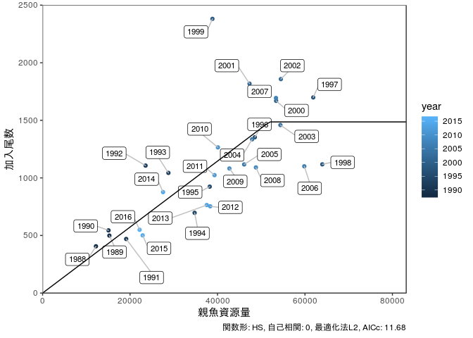

``` r
g2
```

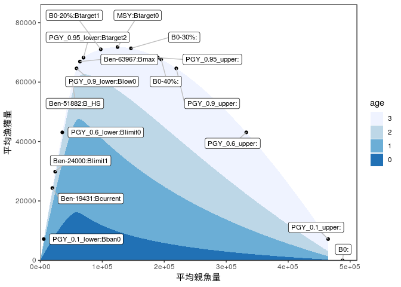

``` r
g3
```

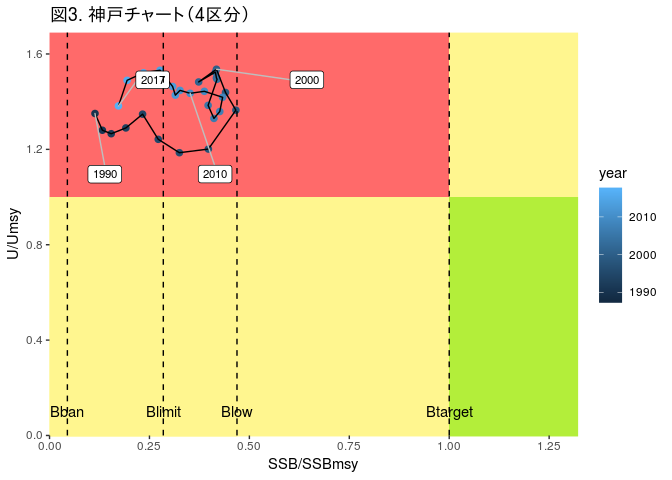

``` r
g4
```

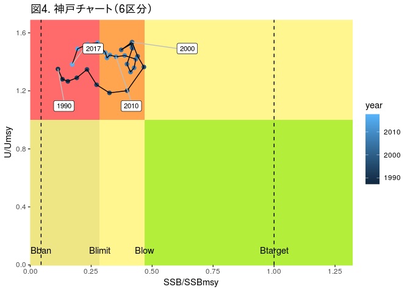

``` r
g5
```

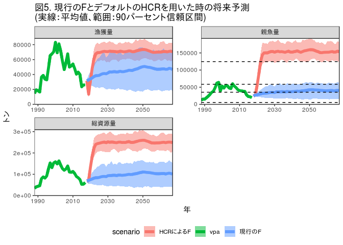
