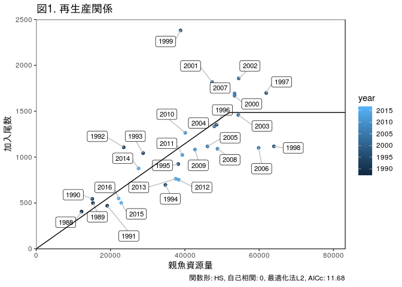

ステークホルダー会議1用の計算と結果のアウトプット
================
Momoko Ichinokawa
2019-02-23

rmdformats::readthedown: highlight: kate md\_extensions: -ascii\_identifiers

事前準備
========

詳細は <https://ichimomo.github.io/future-rvpa/future-doc-abc.html> をご参照ください \#\# データの読み込み

-   データの読み込み，RVPA関数の読み込みなど

``` r
# 関数の読み込み →
# warningまたは「警告」が出るかもしれませんが，その後動いていれば問題ありません
source("../../rvpa1.9.2.r")
source("../../future2.1.r")

# データの読み込み
caa <- read.csv("caa_pma.csv", row.names = 1)
waa <- read.csv("waa_pma.csv", row.names = 1)
maa <- read.csv("maa_pma.csv", row.names = 1)
dat <- data.handler(caa = caa, waa = waa, maa = maa, M = 0.5)
names(dat)
```

    [1] "caa"        "maa"        "waa"        "index"      "M"         
    [6] "maa.tune"   "waa.catch"  "catch.prop"

VPAによる資源量推定
-------------------

-   今後はvpa関数の返り値，res.pmaを使って将来予測計算をおこなっていくので，そのためにvpaを実施します．(この辺はあまり詳しく解説しません．)。
-   **設定ポイント:** vpa関数の引数fc.yearで指定した年数が今後current FのFとして扱われます。
-   [VPA結果を外部から読み込む場合](https://ichimomo.github.io/future-rvpa/future-doc-abc.html#vpa%E7%B5%90%E6%9E%9C%E3%82%92%E5%A4%96%E9%83%A8%E3%81%8B%E3%82%89%E8%AA%AD%E3%81%BF%E8%BE%BC%E3%82%80%E5%A0%B4%E5%90%88)
-   [再生産関係を仮定しない管理基準値の計算](https://ichimomo.github.io/future-rvpa/future-doc-abc.html#%E5%86%8D%E7%94%9F%E7%94%A3%E9%96%A2%E4%BF%82%E3%82%92%E4%BB%AE%E5%AE%9A%E3%81%97%E3%81%AA%E3%81%84%E7%AE%A1%E7%90%86%E5%9F%BA%E6%BA%96%E5%80%A4%E3%81%AE%E8%A8%88%E7%AE%97)

``` r
# VPAによる資源量推定
res.pma <- vpa(dat, fc.year = 2015:2017, tf.year = 2008:2010, term.F = "max", 
    stat.tf = "mean", Pope = TRUE, tune = FALSE, p.init = 1)
```

``` r
res.pma$Fc.at.age  # 将来予測やMSY計算で使うcurrent Fを確認してプロットする
```

            0         1         2         3 
    0.4838556 1.2749150 1.4877701 1.4877698 

``` r
plot(res.pma$Fc.at.age, type = "b", xlab = "Age", ylab = "F", ylim = c(0, max(res.pma$Fc.at.age)))
```


``` r
# 独自のFc.at.ageを使いたい場合は以下のようにここで指定する
# res.pma$Fc.at.age[] <- c(1,1,2,2)
```

再生産関係の推定
----------------

-   詳しい解説は[こちら](https://ichimomo.github.io/future-rvpa/future-doc-abc.html#%E5%86%8D%E7%94%9F%E7%94%A3%E9%96%A2%E4%BF%82%E3%81%AE%E6%8E%A8%E5%AE%9A)
-   上記を参考に、AICで比較したあと、フィットした再生産関係のプロットなどをみて、ちゃんと推定できてそうか確かめて下さい
-   [モデル診断](https://ichimomo.github.io/future-rvpa/SRR-guidline.html)も行って下さい。
-   **設定ポイント:** get.SRdata関数のyearsの引数で、再生産関係をフィットさせたい年を指定します。何も指定しないと全年のデータが使われます。
-   **設定ポイント:** ここで、将来予測で使う再生産関係を一つに決めます。

``` r
# VPA結果を使って再生産データを作る
SRdata <- get.SRdata(res.pma, years = 1988:2016)
head(SRdata)
```

    $year
     [1] 1988 1989 1990 1991 1992 1993 1994 1995 1996 1997 1998 1999 2000 2001
    [15] 2002 2003 2004 2005 2006 2007 2008 2009 2010 2011 2012 2013 2014 2015
    [29] 2016

    $SSB
     [1] 12199.02 15266.68 15072.03 19114.22 23544.42 28769.36 34764.44
     [8] 38219.49 48535.10 61891.08 63966.56 38839.78 53404.29 47322.39
    [15] 54485.00 54385.04 47917.14 46090.76 59847.97 53370.62 48781.20
    [22] 42719.39 40095.19 39311.04 38332.44 37547.09 27543.26 22881.37
    [29] 22184.28

    $R
     [1]  406.0086  498.9652  544.3007  469.6025 1106.8877 1043.4237  696.7049
     [8]  923.9567 1353.1790 1698.8457 1117.5454 2381.1352 1669.1381 1818.3638
    [15] 1858.0043 1458.9524 1334.9288 1116.9433 1100.4598 1693.9768 1090.7172
    [22] 1081.8343 1265.0456 1023.9650  753.1901  764.0987  876.6335  500.9416
    [29]  549.3746

``` r
## モデルのフィット(網羅的に試しています) 網羅的なパラメータ設定
SRmodel.list <- expand.grid(SR.rel = c("HS", "BH", "RI"), AR.type = c(0, 1), 
    L.type = c("L1", "L2"))
SR.list <- list()
for (i in 1:nrow(SRmodel.list)) {
    SR.list[[i]] <- fit.SR(SRdata, SR = SRmodel.list$SR.rel[i], method = SRmodel.list$L.type[i], 
        AR = SRmodel.list$AR.type[i], hessian = FALSE)
}

SRmodel.list$AICc <- sapply(SR.list, function(x) x$AICc)
SRmodel.list$delta.AIC <- SRmodel.list$AICc - min(SRmodel.list$AICc)
SR.list <- SR.list[order(SRmodel.list$AICc)]  # AICの小さい順に並べたもの
(SRmodel.list <- SRmodel.list[order(SRmodel.list$AICc), ])  # 結果
```

       SR.rel AR.type L.type     AICc delta.AIC
    7      HS       0     L2 11.68088 0.0000000
    9      RI       0     L2 12.30980 0.6289293
    8      BH       0     L2 12.35364 0.6727687
    2      BH       0     L1 13.79426 2.1133843
    3      RI       0     L1 13.87867 2.1977984
    5      BH       1     L1 14.09788 2.4170057
    6      RI       1     L1 14.10137 2.4204994
    10     HS       1     L2 14.32407 2.6431965
    1      HS       0     L1 14.75174 3.0708666
    12     RI       1     L2 14.99619 3.3153125
    11     BH       1     L2 15.05006 3.3691864
    4      HS       1     L1 15.68126 4.0003803

``` r
SRmodel_base <- SR.list[[1]]  # AIC最小モデルを今後使っていく
```

将来予測
--------

-   細かい設定の解説は[こちら](https://ichimomo.github.io/future-rvpa/future-doc-abc.html#%E5%B0%86%E6%9D%A5%E4%BA%88%E6%B8%AC)
-   自己相関を考慮する場合
-   Frecオプション（目標の年に指定した確率で漁獲する）
-   年齢別体重が資源尾数に影響される場合、などのオプションがあります
-   **設定ポイント:**　将来予測やMSY推定で使う生物パラメータをここで指定します（waa.year, maa.year, M.year）。ABC計算年（ABC.year）などの設定もここで。
-   これはFcurrentでうまく計算できるか試してみるための将来予測です
-   今後の管理基準値計算でもここで指定したオプションを使います
-   近年の加入の仮定(rec.new)や近年の漁獲量(pre.catch)を設定する場合にはここでちゃんと設定してください

``` r
future_Fcurrent <- future.vpa(res.pma,
                      multi=1,
                      nyear=50, # 将来予測の年数
                      start.year=2018, # 将来予測の開始年
                      N=5000, # 確率的計算の繰り返し回数
                      ABC.year=2019, # ABCを計算する年
                      waa.year=2015:2017, # 生物パラメータの参照年
                      maa.year=2015:2017,
                      M.year=2015:2017,
                      is.plot=TRUE, # 結果をプロットするかどうか
                      seed=1,
                      silent=FALSE,
                      recfunc=HS.recAR, # 再生産関係の関数
                      # recfuncに対する引数
                      rec.arg=list(a=SRmodel_base$pars$a,b=SRmodel_base$pars$b,
                                   rho=SRmodel_base$pars$rho, # ここではrho=0なので指定しなくてもOK
                                   sd=SRmodel_base$pars$sd,resid=SRmodel_base$resid))
```

    $ABC.year
    [1] 2019

    $Bban
    [1] 0

    $Blim
    [1] 0

    $F.sigma
    [1] 0

    $Frec
    NULL

    $HCR
    NULL

    $M
    NULL

    $M.year
    [1] 2015 2016 2017

    $N
    [1] 5000

    $Pope
    [1] TRUE

    $add.year
    [1] 0

    $beta
    NULL

    $currentF
    NULL

    $delta
    NULL

    $det.run
    [1] TRUE

    $eaa0
    NULL

    $faa0
    NULL

    $is.plot
    [1] TRUE

    $maa
    NULL

    $maa.year
    [1] 2015 2016 2017

    $multi
    [1] 1

    $multi.year
    [1] 1

    $naa0
    NULL

    $nyear
    [1] 50

    $outtype
    [1] "FULL"

    $plus.group
    [1] TRUE

    $pre.catch
    NULL

    $random.select
    NULL

    $rec.arg
    $rec.arg$a
    [1] 0.02864499

    $rec.arg$b
    [1] 51882.06

    $rec.arg$rho
    [1] 0

    $rec.arg$sd
    [1] 0.2624895

    $rec.arg$resid
     [1]  0.15003999  0.13188525  0.23168312 -0.15352429  0.49544035
     [6]  0.23597319 -0.35721137 -0.16965875 -0.02705374  0.13375295
    [11] -0.28506140  0.76090931  0.11611132  0.29373043  0.22330688
    [16] -0.01847747 -0.02781840 -0.16723995 -0.30046800  0.13088282
    [21] -0.24773256 -0.12321799  0.09662881 -0.09504603 -0.37695727
    [26] -0.34187713  0.10535290 -0.26881174 -0.14558152


    $rec.new
    NULL

    $recfunc
    function (ssb, vpares, rec.resample = NULL, rec.arg = list(a = 1000, 
        b = 1000, sd = 0.1, rho = 0, resid = 0)) 
    {
        rec0 <- ifelse(ssb > rec.arg$b, rec.arg$a * rec.arg$b, rec.arg$a * 
            ssb)
        rec <- rec0 * exp(rec.arg$rho * rec.arg$resid)
        rec <- rec * exp(rnorm(length(ssb), -0.5 * rec.arg$sd2^2, 
            rec.arg$sd))
        new.resid <- log(rec/rec0) + 0.5 * rec.arg$sd2^2
        return(list(rec = rec, rec.resample = new.resid))
    }

    $replace.rec.year
    [1] 2012

    $seed
    [1] 1

    $silent
    [1] FALSE

    $ssb0
    NULL

    $start.year
    [1] 2018

    $strategy
    [1] "F"

    $waa
    NULL

    $waa.catch
    NULL

    $waa.fun
    [1] FALSE

    $waa.year
    [1] 2015 2016 2017


MSY管理基準値の計算
-------------------

-   MSY管理基準値計算では，上記の将来予測において，Fcurrentの値に様々な乗数を乗じたF一定方策における平衡状態時の（世代時間×20年を`nyear`で指定します）資源量やそれに対応するF等を管理基準値として算出します
-   なので、ここまでのプロセスで、ABC計算のためにきちんとしたオプションを設定したfuture.vpaを実行しておいてください。その返り値`future_Fcurrent_test`をMSY計算では使っていきます
-   詳細な解説は[こちら](https://ichimomo.github.io/future-rvpa/future-doc-abc.html#msy%E7%AE%A1%E7%90%86%E5%9F%BA%E6%BA%96%E5%80%A4%E3%81%AE%E8%A8%88%E7%AE%97)
-   **設定ポイント:** オプションPGYやB0percentで、別の管理基準値も同時に計算できます。ここで計算された結果の中から、何をBtarget, Blimit, Bbanとして用いるかをチョイスし、それをrefs\_baseに入れておきます。

``` r
# MSY管理基準値の計算
MSY_base <- est.MSY(res.pma, # VPAの計算結果
                 future_Fcurrent$input, # 将来予測で使用した引数
                 resid.year=0, # ARありの場合、最近何年分の残差を平均するかをここで指定する。ARありの設定を反映させたい場合必ずここを１以上とすること（とりあえず１としておいてください）。
                 N=100, # 将来予測の年数，繰り返し回数
                 calc.yieldcurve=TRUE,
                 PGY=c(0.95,0.9,0.6,0.1), # 計算したいPGYレベル。上限と下限の両方が計算される
                 onlylower.pgy=FALSE, # TRUEにするとPGYレベルの上限は計算しない（計算時間の節約になる）
                 B0percent=c(0.2,0.3,0.4),
                 Bempirical=c(round(tail(colSums(res.pma$ssb),n=1)),
                              round(max(colSums(res.pma$ssb))),
                              24000, # 現行Blimit
                              SRmodel_base$pars$b) # HSの折れ点
                 ) # 計算したいB0%レベル
```

    Estimating MSY
    F multiplier= 0.4903466 
    Estimating PGY  95 %
    F multiplier= 0.3006464 
    F multiplier= 0.8322266 
    Estimating PGY  90 %
    F multiplier= 0.2442106 
    F multiplier= 0.9314554 
    Estimating PGY  60 %
    F multiplier= 0.1042389 
    F multiplier= 1.009078 
    Estimating PGY  10 %
    F multiplier= 0.01208144 
    F multiplier= 1.076094 
    Estimating B0  20 %
    F multiplier= 0.622057 
    Estimating B0  30 %
    F multiplier= 0.4132039 
    Estimating B0  40 %
    F multiplier= 0.289628 
    Estimating B empirical  19431 
    F multiplier= 1.037682 
    Estimating B empirical  63967 
    F multiplier= 0.8873748 
    Estimating B empirical  24000 
    F multiplier= 1.029399 
    Estimating B empirical  51882.06 
    F multiplier= 0.9647514 


``` r
# 結果の表示(tibbleという形式で表示されます)
(refs_all <- MSY_base$summary_tb)
```

    # A tibble: 34 x 13
       RP_name AR       SSB      B      U  Catch `Fref/Fcur` `SSB/SSB0`
       <chr>   <lgl>  <dbl>  <dbl>  <dbl>  <dbl>       <dbl>      <dbl>
     1 MSY     FALSE 1.25e5 2.21e5 0.325  71794.      0.490      0.256 
     2 B0      FALSE 4.88e5 5.93e5 0          0       0          1     
     3 PGY_0.… FALSE 1.90e5 2.89e5 0.236  68205.      0.301      0.389 
     4 PGY_0.… FALSE 6.97e4 1.60e5 0.427  68205.      0.832      0.143 
     5 PGY_0.… FALSE 2.19e5 3.20e5 0.202  64615.      0.244      0.450 
     6 PGY_0.… FALSE 5.85e4 1.44e5 0.447  64615.      0.931      0.120 
     7 PGY_0.… FALSE 3.32e5 4.36e5 0.0988 43080.      0.104      0.681 
     8 PGY_0.… FALSE 3.55e4 9.37e4 0.460  43074.      1.01       0.0728
     9 PGY_0.… FALSE 4.64e5 5.70e5 0.0126  7172.      0.0121     0.952 
    10 PGY_0.… FALSE 5.56e3 1.52e4 0.473   7175.      1.08       0.0114
    # ... with 24 more rows, and 5 more variables: Fref2Fcurrent <dbl>,
    #   F0 <dbl>, F1 <dbl>, F2 <dbl>, F3 <dbl>

``` r
# 結果の表示（全データをじっくり見たい場合)
View(refs_all)

# どの管理基準値をどのように定義するか、ここで指定します
refs_all$RP_definition <- NA
refs_all$RP_definition[refs_all$RP_name == "MSY" & refs_all$AR == FALSE] <- "Btarget0"  # RP_nameがMSYでARがなしのものをBtargetとする
refs_all$RP_definition[refs_all$RP_name == "B0-20%" & refs_all$AR == FALSE] <- "Btarget1"  # たとえばBtargetの代替値をいちおう示す場合
refs_all$RP_definition[refs_all$RP_name == "PGY_0.95_lower" & refs_all$AR == 
    FALSE] <- "Btarget2"
refs_all$RP_definition[refs_all$RP_name == "PGY_0.9_lower" & refs_all$AR == 
    FALSE] <- "Blow0"
refs_all$RP_definition[refs_all$RP_name == "PGY_0.6_lower" & refs_all$AR == 
    FALSE] <- "Blimit0"
refs_all$RP_definition[refs_all$RP_name == "PGY_0.1_lower" & refs_all$AR == 
    FALSE] <- "Bban0"
refs_all$RP_definition[refs_all$RP_name == "Ben-19431" & refs_all$AR == FALSE] <- "Bcurrent"
refs_all$RP_definition[refs_all$RP_name == "Ben-63967" & refs_all$AR == FALSE] <- "Bmax"
refs_all$RP_definition[refs_all$RP_name == "Ben-24000" & refs_all$AR == FALSE] <- "Blimit1"
refs_all$RP_definition[refs_all$RP_name == "Ben-51882" & refs_all$AR == FALSE] <- "B_HS"


refs_base <- refs_all %>% filter(!is.na(RP_definition)) %>% arrange(desc(SSB)) %>% 
    select(RP_definition, RP_name, SSB, Catch, U, Fref2Fcurrent)
```

レポート作成
============

-   ここからが本番です。以下のオブジェクトを使って、報告書を作っていきます。
-   res.pma(VPAの結果)
-   future\_Fcurrent(Fcurrentによる将来予測結果)
-   MSY\_base(MSYの計算結果)
-   refs\_all(計算した管理基準値)
-   refs\_base(選択した管理基準値)

1. 再生産関係式
---------------

-   1988 年から 1988（加入年） までの親子関係データを使って再生産関係を推定した(図1)
-   図1で仮定された再生産関係を用いて推定した漁獲量曲線と、様々な管理基準値を図2に示した。



2. 管理基準値
-------------

図2より、本系群における管理基準値の候補は以下のようなものが考えられる。それぞれの管理基準値に対応する親魚量、漁獲量、漁獲率(漁獲量/資源量)の平衡状態における平均値と現在の努力量への乗数を下表に示す。

-   目標管理基準値(Btarget0): **Bmsy**。過去最大親魚量の2倍となり、SSB&gt;SSB\_maxの範囲における不確実性が大きい懸念がある。
-   目標管理基準値(Btarget1)(代替値1): **漁獲がないときの親魚資源量の20%に相当する親魚量。**　MSYの90%以上の平均漁獲量を得られる親魚レベルは確保されている。米国では浮魚類のMSY代替値の下限としても利用されている。
-   目標管理基準値(Btarget2)(代替値2): **MSYの95%の平衡漁獲量を得るときの親魚資源量** MSYには至らないがMSYの95%の平均漁獲量を得られる親魚レベルである。
-   目標資源量の下限となる基準値(Blow): **MSYの90%の平衡漁獲量を得るときの親魚資源量**
-   限界資源量(Blimit0): **MSYの60%の平衡漁獲量を得るときの親魚資源量**
-   限界資源量(Blimit1): **今まで利用していたBlimit。**この水準ではMSYの50%以上の漁獲量が失われるため、Blimitとしては推奨できない。
-   禁漁資源量(Blow): **MSYの10%の平衡漁獲量を得るときの親魚資源量**

------------------------------------------------------------------------

その他、参考となる指標 - Bmax: 過去最大親魚量 - B\_HS: HS再生産関係の折れ点 - B\_current: 最近年の親魚量

<table class="table table-condensed">
<thead>
<tr>
<th style="text-align:right;">
管理基準値
</th>
<th style="text-align:right;">
親魚資源量
</th>
<th style="text-align:right;">
漁獲量
</th>
<th style="text-align:right;">
漁獲率
</th>
<th style="text-align:right;">
努力量の乗数
</th>
</tr>
</thead>
<tbody>
<tr>
<td style="text-align:right;">
Btarget0
</td>
<td style="text-align:right;">
<span style="display: inline-block; direction: rtl; border-radius: 4px; padding-right: 2px; background-color: olivedrab; width: 100.00%">125000</span>
</td>
<td style="text-align:right;">
<span style="display: inline-block; direction: rtl; border-radius: 4px; padding-right: 2px; background-color: steelblue; width: 100.00%">72000</span>
</td>
<td style="text-align:right;">
<span style="display: inline-block; direction: rtl; border-radius: 4px; padding-right: 2px; background-color: orange; width: 70.21%">0.33</span>
</td>
<td style="text-align:right;">
<span style="display: inline-block; direction: rtl; border-radius: 4px; padding-right: 2px; background-color: tomato; width: 45.37%">0.49</span>
</td>
</tr>
<tr>
<td style="text-align:right;">
Btarget1
</td>
<td style="text-align:right;">
<span style="display: inline-block; direction: rtl; border-radius: 4px; padding-right: 2px; background-color: olivedrab; width: 78.40%">98000</span>
</td>
<td style="text-align:right;">
<span style="display: inline-block; direction: rtl; border-radius: 4px; padding-right: 2px; background-color: steelblue; width: 98.61%">71000</span>
</td>
<td style="text-align:right;">
<span style="display: inline-block; direction: rtl; border-radius: 4px; padding-right: 2px; background-color: orange; width: 78.72%">0.37</span>
</td>
<td style="text-align:right;">
<span style="display: inline-block; direction: rtl; border-radius: 4px; padding-right: 2px; background-color: tomato; width: 57.41%">0.62</span>
</td>
</tr>
<tr>
<td style="text-align:right;">
Btarget2
</td>
<td style="text-align:right;">
<span style="display: inline-block; direction: rtl; border-radius: 4px; padding-right: 2px; background-color: olivedrab; width: 56.00%">70000</span>
</td>
<td style="text-align:right;">
<span style="display: inline-block; direction: rtl; border-radius: 4px; padding-right: 2px; background-color: steelblue; width: 94.44%">68000</span>
</td>
<td style="text-align:right;">
<span style="display: inline-block; direction: rtl; border-radius: 4px; padding-right: 2px; background-color: orange; width: 91.49%">0.43</span>
</td>
<td style="text-align:right;">
<span style="display: inline-block; direction: rtl; border-radius: 4px; padding-right: 2px; background-color: tomato; width: 76.85%">0.83</span>
</td>
</tr>
<tr>
<td style="text-align:right;">
Bmax
</td>
<td style="text-align:right;">
<span style="display: inline-block; direction: rtl; border-radius: 4px; padding-right: 2px; background-color: olivedrab; width: 51.20%">64000</span>
</td>
<td style="text-align:right;">
<span style="display: inline-block; direction: rtl; border-radius: 4px; padding-right: 2px; background-color: steelblue; width: 93.06%">67000</span>
</td>
<td style="text-align:right;">
<span style="display: inline-block; direction: rtl; border-radius: 4px; padding-right: 2px; background-color: orange; width: 93.62%">0.44</span>
</td>
<td style="text-align:right;">
<span style="display: inline-block; direction: rtl; border-radius: 4px; padding-right: 2px; background-color: tomato; width: 82.41%">0.89</span>
</td>
</tr>
<tr>
<td style="text-align:right;">
Blow0
</td>
<td style="text-align:right;">
<span style="display: inline-block; direction: rtl; border-radius: 4px; padding-right: 2px; background-color: olivedrab; width: 46.40%">58000</span>
</td>
<td style="text-align:right;">
<span style="display: inline-block; direction: rtl; border-radius: 4px; padding-right: 2px; background-color: steelblue; width: 90.28%">65000</span>
</td>
<td style="text-align:right;">
<span style="display: inline-block; direction: rtl; border-radius: 4px; padding-right: 2px; background-color: orange; width: 95.74%">0.45</span>
</td>
<td style="text-align:right;">
<span style="display: inline-block; direction: rtl; border-radius: 4px; padding-right: 2px; background-color: tomato; width: 86.11%">0.93</span>
</td>
</tr>
<tr>
<td style="text-align:right;">
B\_HS
</td>
<td style="text-align:right;">
<span style="display: inline-block; direction: rtl; border-radius: 4px; padding-right: 2px; background-color: olivedrab; width: 41.60%">52000</span>
</td>
<td style="text-align:right;">
<span style="display: inline-block; direction: rtl; border-radius: 4px; padding-right: 2px; background-color: steelblue; width: 83.33%">60000</span>
</td>
<td style="text-align:right;">
<span style="display: inline-block; direction: rtl; border-radius: 4px; padding-right: 2px; background-color: orange; width: 95.74%">0.45</span>
</td>
<td style="text-align:right;">
<span style="display: inline-block; direction: rtl; border-radius: 4px; padding-right: 2px; background-color: tomato; width: 88.89%">0.96</span>
</td>
</tr>
<tr>
<td style="text-align:right;">
Blimit0
</td>
<td style="text-align:right;">
<span style="display: inline-block; direction: rtl; border-radius: 4px; padding-right: 2px; background-color: olivedrab; width: 28.00%">35000</span>
</td>
<td style="text-align:right;">
<span style="display: inline-block; direction: rtl; border-radius: 4px; padding-right: 2px; background-color: steelblue; width: 59.72%">43000</span>
</td>
<td style="text-align:right;">
<span style="display: inline-block; direction: rtl; border-radius: 4px; padding-right: 2px; background-color: orange; width: 97.87%">0.46</span>
</td>
<td style="text-align:right;">
<span style="display: inline-block; direction: rtl; border-radius: 4px; padding-right: 2px; background-color: tomato; width: 93.52%">1.01</span>
</td>
</tr>
<tr>
<td style="text-align:right;">
Blimit1
</td>
<td style="text-align:right;">
<span style="display: inline-block; direction: rtl; border-radius: 4px; padding-right: 2px; background-color: olivedrab; width: 19.20%">24000</span>
</td>
<td style="text-align:right;">
<span style="display: inline-block; direction: rtl; border-radius: 4px; padding-right: 2px; background-color: steelblue; width: 41.67%">30000</span>
</td>
<td style="text-align:right;">
<span style="display: inline-block; direction: rtl; border-radius: 4px; padding-right: 2px; background-color: orange; width: 97.87%">0.46</span>
</td>
<td style="text-align:right;">
<span style="display: inline-block; direction: rtl; border-radius: 4px; padding-right: 2px; background-color: tomato; width: 95.37%">1.03</span>
</td>
</tr>
<tr>
<td style="text-align:right;">
Bcurrent
</td>
<td style="text-align:right;">
<span style="display: inline-block; direction: rtl; border-radius: 4px; padding-right: 2px; background-color: olivedrab; width: 15.20%">19000</span>
</td>
<td style="text-align:right;">
<span style="display: inline-block; direction: rtl; border-radius: 4px; padding-right: 2px; background-color: steelblue; width: 33.33%">24000</span>
</td>
<td style="text-align:right;">
<span style="display: inline-block; direction: rtl; border-radius: 4px; padding-right: 2px; background-color: orange; width: 97.87%">0.46</span>
</td>
<td style="text-align:right;">
<span style="display: inline-block; direction: rtl; border-radius: 4px; padding-right: 2px; background-color: tomato; width: 96.30%">1.04</span>
</td>
</tr>
<tr>
<td style="text-align:right;">
Bban0
</td>
<td style="text-align:right;">
<span style="display: inline-block; direction: rtl; border-radius: 4px; padding-right: 2px; background-color: olivedrab; width: 4.80%">6000</span>
</td>
<td style="text-align:right;">
<span style="display: inline-block; direction: rtl; border-radius: 4px; padding-right: 2px; background-color: steelblue; width: 9.72%">7000</span>
</td>
<td style="text-align:right;">
<span style="display: inline-block; direction: rtl; border-radius: 4px; padding-right: 2px; background-color: orange; width: 100.00%">0.47</span>
</td>
<td style="text-align:right;">
<span style="display: inline-block; direction: rtl; border-radius: 4px; padding-right: 2px; background-color: tomato; width: 100.00%">1.08</span>
</td>
</tr>
</tbody>
</table>
3. 神戸チャート
---------------

-   Btargetをベースとした4区分 

-   Blimit, Blowをベースとした6区分


4. HCRによる将来予測
--------------------

    $ABC.year
    [1] 2019

    $Bban
    [1] 0

    $Blim
    [1] 0

    $F.sigma
    [1] 0

    $Frec
    NULL

    $HCR
    $HCR$Blim
    [1] 35489.95

    $HCR$Bban
    [1] 5564.275

    $HCR$beta
    [1] 0.8


    $M
    NULL

    $M.year
    [1] 2015 2016 2017

    $N
    [1] 1000

    $Pope
    [1] TRUE

    $add.year
    [1] 1

    $beta
    NULL

    $currentF
    NULL

    $delta
    NULL

    $det.run
    [1] FALSE

    $eaa0
    NULL

    $faa0
    NULL

    $is.plot
    [1] TRUE

    $maa
    NULL

    $maa.year
    [1] 2015 2016 2017

    $multi
    [1] 0.4903466

    $multi.year
    [1] 1

    $naa0
    NULL

    $nyear
    [1] 30

    $outtype
    [1] "FULL"

    $plus.group
    [1] TRUE

    $pre.catch
    NULL

    $random.select
    NULL

    $rec.arg
    $rec.arg$a
    [1] 0.02864499

    $rec.arg$b
    [1] 51882.06

    $rec.arg$rho
    [1] 0

    $rec.arg$sd
    [1] 0.2624895

    $rec.arg$resid
     [1]  0.15003999  0.13188525  0.23168312 -0.15352429  0.49544035
     [6]  0.23597319 -0.35721137 -0.16965875 -0.02705374  0.13375295
    [11] -0.28506140  0.76090931  0.11611132  0.29373043  0.22330688
    [16] -0.01847747 -0.02781840 -0.16723995 -0.30046800  0.13088282
    [21] -0.24773256 -0.12321799  0.09662881 -0.09504603 -0.37695727
    [26] -0.34187713  0.10535290 -0.26881174 -0.14558152


    $rec.new
    NULL

    $recfunc
    function (ssb, vpares, rec.resample = NULL, rec.arg = list(a = 1000, 
        b = 1000, sd = 0.1, rho = 0, resid = 0)) 
    {
        rec0 <- ifelse(ssb > rec.arg$b, rec.arg$a * rec.arg$b, rec.arg$a * 
            ssb)
        rec <- rec0 * exp(rec.arg$rho * rec.arg$resid)
        rec <- rec * exp(rnorm(length(ssb), -0.5 * rec.arg$sd2^2, 
            rec.arg$sd))
        new.resid <- log(rec/rec0) + 0.5 * rec.arg$sd2^2
        return(list(rec = rec, rec.resample = new.resid))
    }
    <bytecode: 0x21152560>

    $replace.rec.year
    [1] 2012

    $seed
    [1] 1

    $silent
    [1] FALSE

    $ssb0
    NULL

    $start.year
    [1] 2018

    $strategy
    [1] "F"

    $waa
    NULL

    $waa.catch
    NULL

    $waa.fun
    [1] FALSE

    $waa.year
    [1] 2015 2016 2017


4. 代替管理基準値やさまざまなβを用いたときのパフォーマンス指標の比較
--------------------------------------------------------------------

-   平均漁獲量

<!-- -->

    4 HCR is calculated:  Btarget0-Blimit0-Bban0 Btarget0-Blimit1-Bban0 Btarget1-Blimit0-Bban0 Btarget1-Blimit1-Bban0 

<table class="table table-condensed">
<thead>
<tr>
<th style="text-align:right;">
HCR\_name
</th>
<th style="text-align:right;">
beta
</th>
<th style="text-align:right;">
2018
</th>
<th style="text-align:right;">
2019
</th>
<th style="text-align:right;">
2020
</th>
<th style="text-align:right;">
2021
</th>
<th style="text-align:right;">
2022
</th>
<th style="text-align:right;">
2023
</th>
<th style="text-align:right;">
2028
</th>
<th style="text-align:right;">
2038
</th>
</tr>
</thead>
<tbody>
<tr>
<td style="text-align:right;">
<span style="color: black">Btarget0-Blimit0-Bban0</span>
</td>
<td style="text-align:right;">
<span style="display: block; padding: 0 4px; border-radius: 4px; background-color: #0000ff">1.0</span>
</td>
<td style="text-align:right;">
<span style="display: inline-block; direction: rtl; border-radius: 4px; padding-right: 2px; background-color: steelblue; width: 43.06%">31000.0</span>
</td>
<td style="text-align:right;">
<span style="display: inline-block; direction: rtl; border-radius: 4px; padding-right: 2px; background-color: steelblue; width: 22.22%">16000.0</span>
</td>
<td style="text-align:right;">
<span style="display: inline-block; direction: rtl; border-radius: 4px; padding-right: 2px; background-color: steelblue; width: 50.00%">36000.0</span>
</td>
<td style="text-align:right;">
<span style="display: inline-block; direction: rtl; border-radius: 4px; padding-right: 2px; background-color: steelblue; width: 70.83%">51000.0</span>
</td>
<td style="text-align:right;">
<span style="display: inline-block; direction: rtl; border-radius: 4px; padding-right: 2px; background-color: steelblue; width: 87.50%">63000.0</span>
</td>
<td style="text-align:right;">
<span style="display: inline-block; direction: rtl; border-radius: 4px; padding-right: 2px; background-color: steelblue; width: 95.83%">69000.0</span>
</td>
<td style="text-align:right;">
<span style="display: inline-block; direction: rtl; border-radius: 4px; padding-right: 2px; background-color: steelblue; width: 98.61%">71000.0</span>
</td>
<td style="text-align:right;">
<span style="display: inline-block; direction: rtl; border-radius: 4px; padding-right: 2px; background-color: steelblue; width: 100.00%">72000.0</span>
</td>
</tr>
<tr>
<td style="text-align:right;">
<span style="color: black">Btarget0-Blimit0-Bban0</span>
</td>
<td style="text-align:right;">
<span style="display: block; padding: 0 4px; border-radius: 4px; background-color: #3333ff">0.9</span>
</td>
<td style="text-align:right;">
<span style="display: inline-block; direction: rtl; border-radius: 4px; padding-right: 2px; background-color: steelblue; width: 43.06%">31000.0</span>
</td>
<td style="text-align:right;">
<span style="display: inline-block; direction: rtl; border-radius: 4px; padding-right: 2px; background-color: steelblue; width: 20.83%">15000.0</span>
</td>
<td style="text-align:right;">
<span style="display: inline-block; direction: rtl; border-radius: 4px; padding-right: 2px; background-color: steelblue; width: 47.22%">34000.0</span>
</td>
<td style="text-align:right;">
<span style="display: inline-block; direction: rtl; border-radius: 4px; padding-right: 2px; background-color: steelblue; width: 68.06%">49000.0</span>
</td>
<td style="text-align:right;">
<span style="display: inline-block; direction: rtl; border-radius: 4px; padding-right: 2px; background-color: steelblue; width: 86.11%">62000.0</span>
</td>
<td style="text-align:right;">
<span style="display: inline-block; direction: rtl; border-radius: 4px; padding-right: 2px; background-color: steelblue; width: 94.44%">68000.0</span>
</td>
<td style="text-align:right;">
<span style="display: inline-block; direction: rtl; border-radius: 4px; padding-right: 2px; background-color: steelblue; width: 98.61%">71000.0</span>
</td>
<td style="text-align:right;">
<span style="display: inline-block; direction: rtl; border-radius: 4px; padding-right: 2px; background-color: steelblue; width: 98.61%">71000.0</span>
</td>
</tr>
<tr>
<td style="text-align:right;">
<span style="color: red">Btarget0-Blimit0-Bban0</span>
</td>
<td style="text-align:right;">
<span style="display: block; padding: 0 4px; border-radius: 4px; background-color: #6565ff">0.8</span>
</td>
<td style="text-align:right;">
<span style="display: inline-block; direction: rtl; border-radius: 4px; padding-right: 2px; background-color: steelblue; width: 43.06%">31000.0</span>
</td>
<td style="text-align:right;">
<span style="display: inline-block; direction: rtl; border-radius: 4px; padding-right: 2px; background-color: steelblue; width: 18.06%">13000.0</span>
</td>
<td style="text-align:right;">
<span style="display: inline-block; direction: rtl; border-radius: 4px; padding-right: 2px; background-color: steelblue; width: 44.44%">32000.0</span>
</td>
<td style="text-align:right;">
<span style="display: inline-block; direction: rtl; border-radius: 4px; padding-right: 2px; background-color: steelblue; width: 66.67%">48000.0</span>
</td>
<td style="text-align:right;">
<span style="display: inline-block; direction: rtl; border-radius: 4px; padding-right: 2px; background-color: steelblue; width: 83.33%">60000.0</span>
</td>
<td style="text-align:right;">
<span style="display: inline-block; direction: rtl; border-radius: 4px; padding-right: 2px; background-color: steelblue; width: 93.06%">67000.0</span>
</td>
<td style="text-align:right;">
<span style="display: inline-block; direction: rtl; border-radius: 4px; padding-right: 2px; background-color: steelblue; width: 98.61%">71000.0</span>
</td>
<td style="text-align:right;">
<span style="display: inline-block; direction: rtl; border-radius: 4px; padding-right: 2px; background-color: steelblue; width: 98.61%">71000.0</span>
</td>
</tr>
<tr>
<td style="text-align:right;">
<span style="color: black">Btarget0-Blimit0-Bban0</span>
</td>
<td style="text-align:right;">
<span style="display: block; padding: 0 4px; border-radius: 4px; background-color: #9999ff">0.7</span>
</td>
<td style="text-align:right;">
<span style="display: inline-block; direction: rtl; border-radius: 4px; padding-right: 2px; background-color: steelblue; width: 43.06%">31000.0</span>
</td>
<td style="text-align:right;">
<span style="display: inline-block; direction: rtl; border-radius: 4px; padding-right: 2px; background-color: steelblue; width: 16.67%">12000.0</span>
</td>
<td style="text-align:right;">
<span style="display: inline-block; direction: rtl; border-radius: 4px; padding-right: 2px; background-color: steelblue; width: 40.28%">29000.0</span>
</td>
<td style="text-align:right;">
<span style="display: inline-block; direction: rtl; border-radius: 4px; padding-right: 2px; background-color: steelblue; width: 62.50%">45000.0</span>
</td>
<td style="text-align:right;">
<span style="display: inline-block; direction: rtl; border-radius: 4px; padding-right: 2px; background-color: steelblue; width: 80.56%">58000.0</span>
</td>
<td style="text-align:right;">
<span style="display: inline-block; direction: rtl; border-radius: 4px; padding-right: 2px; background-color: steelblue; width: 91.67%">66000.0</span>
</td>
<td style="text-align:right;">
<span style="display: inline-block; direction: rtl; border-radius: 4px; padding-right: 2px; background-color: steelblue; width: 97.22%">70000.0</span>
</td>
<td style="text-align:right;">
<span style="display: inline-block; direction: rtl; border-radius: 4px; padding-right: 2px; background-color: steelblue; width: 97.22%">70000.0</span>
</td>
</tr>
<tr>
<td style="text-align:right;">
<span style="color: black">Btarget0-Blimit0-Bban0</span>
</td>
<td style="text-align:right;">
<span style="display: block; padding: 0 4px; border-radius: 4px; background-color: #ccccff">0.6</span>
</td>
<td style="text-align:right;">
<span style="display: inline-block; direction: rtl; border-radius: 4px; padding-right: 2px; background-color: steelblue; width: 43.06%">31000.0</span>
</td>
<td style="text-align:right;">
<span style="display: inline-block; direction: rtl; border-radius: 4px; padding-right: 2px; background-color: steelblue; width: 13.89%">10000.0</span>
</td>
<td style="text-align:right;">
<span style="display: inline-block; direction: rtl; border-radius: 4px; padding-right: 2px; background-color: steelblue; width: 37.50%">27000.0</span>
</td>
<td style="text-align:right;">
<span style="display: inline-block; direction: rtl; border-radius: 4px; padding-right: 2px; background-color: steelblue; width: 58.33%">42000.0</span>
</td>
<td style="text-align:right;">
<span style="display: inline-block; direction: rtl; border-radius: 4px; padding-right: 2px; background-color: steelblue; width: 76.39%">55000.0</span>
</td>
<td style="text-align:right;">
<span style="display: inline-block; direction: rtl; border-radius: 4px; padding-right: 2px; background-color: steelblue; width: 87.50%">63000.0</span>
</td>
<td style="text-align:right;">
<span style="display: inline-block; direction: rtl; border-radius: 4px; padding-right: 2px; background-color: steelblue; width: 94.44%">68000.0</span>
</td>
<td style="text-align:right;">
<span style="display: inline-block; direction: rtl; border-radius: 4px; padding-right: 2px; background-color: steelblue; width: 94.44%">68000.0</span>
</td>
</tr>
<tr>
<td style="text-align:right;">
<span style="color: black">Btarget0-Blimit0-Bban0</span>
</td>
<td style="text-align:right;">
<span style="display: block; padding: 0 4px; border-radius: 4px; background-color: #ffffff">0.5</span>
</td>
<td style="text-align:right;">
<span style="display: inline-block; direction: rtl; border-radius: 4px; padding-right: 2px; background-color: steelblue; width: 43.06%">31000.0</span>
</td>
<td style="text-align:right;">
<span style="display: inline-block; direction: rtl; border-radius: 4px; padding-right: 2px; background-color: steelblue; width: 12.50%">9000.0</span>
</td>
<td style="text-align:right;">
<span style="display: inline-block; direction: rtl; border-radius: 4px; padding-right: 2px; background-color: steelblue; width: 31.94%">23000.0</span>
</td>
<td style="text-align:right;">
<span style="display: inline-block; direction: rtl; border-radius: 4px; padding-right: 2px; background-color: steelblue; width: 52.78%">38000.0</span>
</td>
<td style="text-align:right;">
<span style="display: inline-block; direction: rtl; border-radius: 4px; padding-right: 2px; background-color: steelblue; width: 70.83%">51000.0</span>
</td>
<td style="text-align:right;">
<span style="display: inline-block; direction: rtl; border-radius: 4px; padding-right: 2px; background-color: steelblue; width: 81.94%">59000.0</span>
</td>
<td style="text-align:right;">
<span style="display: inline-block; direction: rtl; border-radius: 4px; padding-right: 2px; background-color: steelblue; width: 90.28%">65000.0</span>
</td>
<td style="text-align:right;">
<span style="display: inline-block; direction: rtl; border-radius: 4px; padding-right: 2px; background-color: steelblue; width: 90.28%">65000.0</span>
</td>
</tr>
<tr>
<td style="text-align:right;">
<span style="color: black">Btarget0-Blimit1-Bban0</span>
</td>
<td style="text-align:right;">
<span style="display: block; padding: 0 4px; border-radius: 4px; background-color: #0000ff">1.0</span>
</td>
<td style="text-align:right;">
<span style="display: inline-block; direction: rtl; border-radius: 4px; padding-right: 2px; background-color: steelblue; width: 43.06%">31000.0</span>
</td>
<td style="text-align:right;">
<span style="display: inline-block; direction: rtl; border-radius: 4px; padding-right: 2px; background-color: steelblue; width: 27.78%">20000.0</span>
</td>
<td style="text-align:right;">
<span style="display: inline-block; direction: rtl; border-radius: 4px; padding-right: 2px; background-color: steelblue; width: 44.44%">32000.0</span>
</td>
<td style="text-align:right;">
<span style="display: inline-block; direction: rtl; border-radius: 4px; padding-right: 2px; background-color: steelblue; width: 65.28%">47000.0</span>
</td>
<td style="text-align:right;">
<span style="display: inline-block; direction: rtl; border-radius: 4px; padding-right: 2px; background-color: steelblue; width: 83.33%">60000.0</span>
</td>
<td style="text-align:right;">
<span style="display: inline-block; direction: rtl; border-radius: 4px; padding-right: 2px; background-color: steelblue; width: 93.06%">67000.0</span>
</td>
<td style="text-align:right;">
<span style="display: inline-block; direction: rtl; border-radius: 4px; padding-right: 2px; background-color: steelblue; width: 98.61%">71000.0</span>
</td>
<td style="text-align:right;">
<span style="display: inline-block; direction: rtl; border-radius: 4px; padding-right: 2px; background-color: steelblue; width: 100.00%">72000.0</span>
</td>
</tr>
<tr>
<td style="text-align:right;">
<span style="color: black">Btarget0-Blimit1-Bban0</span>
</td>
<td style="text-align:right;">
<span style="display: block; padding: 0 4px; border-radius: 4px; background-color: #3333ff">0.9</span>
</td>
<td style="text-align:right;">
<span style="display: inline-block; direction: rtl; border-radius: 4px; padding-right: 2px; background-color: steelblue; width: 43.06%">31000.0</span>
</td>
<td style="text-align:right;">
<span style="display: inline-block; direction: rtl; border-radius: 4px; padding-right: 2px; background-color: steelblue; width: 26.39%">19000.0</span>
</td>
<td style="text-align:right;">
<span style="display: inline-block; direction: rtl; border-radius: 4px; padding-right: 2px; background-color: steelblue; width: 43.06%">31000.0</span>
</td>
<td style="text-align:right;">
<span style="display: inline-block; direction: rtl; border-radius: 4px; padding-right: 2px; background-color: steelblue; width: 63.89%">46000.0</span>
</td>
<td style="text-align:right;">
<span style="display: inline-block; direction: rtl; border-radius: 4px; padding-right: 2px; background-color: steelblue; width: 81.94%">59000.0</span>
</td>
<td style="text-align:right;">
<span style="display: inline-block; direction: rtl; border-radius: 4px; padding-right: 2px; background-color: steelblue; width: 93.06%">67000.0</span>
</td>
<td style="text-align:right;">
<span style="display: inline-block; direction: rtl; border-radius: 4px; padding-right: 2px; background-color: steelblue; width: 98.61%">71000.0</span>
</td>
<td style="text-align:right;">
<span style="display: inline-block; direction: rtl; border-radius: 4px; padding-right: 2px; background-color: steelblue; width: 98.61%">71000.0</span>
</td>
</tr>
<tr>
<td style="text-align:right;">
<span style="color: black">Btarget0-Blimit1-Bban0</span>
</td>
<td style="text-align:right;">
<span style="display: block; padding: 0 4px; border-radius: 4px; background-color: #6565ff">0.8</span>
</td>
<td style="text-align:right;">
<span style="display: inline-block; direction: rtl; border-radius: 4px; padding-right: 2px; background-color: steelblue; width: 43.06%">31000.0</span>
</td>
<td style="text-align:right;">
<span style="display: inline-block; direction: rtl; border-radius: 4px; padding-right: 2px; background-color: steelblue; width: 23.61%">17000.0</span>
</td>
<td style="text-align:right;">
<span style="display: inline-block; direction: rtl; border-radius: 4px; padding-right: 2px; background-color: steelblue; width: 40.28%">29000.0</span>
</td>
<td style="text-align:right;">
<span style="display: inline-block; direction: rtl; border-radius: 4px; padding-right: 2px; background-color: steelblue; width: 62.50%">45000.0</span>
</td>
<td style="text-align:right;">
<span style="display: inline-block; direction: rtl; border-radius: 4px; padding-right: 2px; background-color: steelblue; width: 80.56%">58000.0</span>
</td>
<td style="text-align:right;">
<span style="display: inline-block; direction: rtl; border-radius: 4px; padding-right: 2px; background-color: steelblue; width: 91.67%">66000.0</span>
</td>
<td style="text-align:right;">
<span style="display: inline-block; direction: rtl; border-radius: 4px; padding-right: 2px; background-color: steelblue; width: 98.61%">71000.0</span>
</td>
<td style="text-align:right;">
<span style="display: inline-block; direction: rtl; border-radius: 4px; padding-right: 2px; background-color: steelblue; width: 98.61%">71000.0</span>
</td>
</tr>
<tr>
<td style="text-align:right;">
<span style="color: black">Btarget0-Blimit1-Bban0</span>
</td>
<td style="text-align:right;">
<span style="display: block; padding: 0 4px; border-radius: 4px; background-color: #9999ff">0.7</span>
</td>
<td style="text-align:right;">
<span style="display: inline-block; direction: rtl; border-radius: 4px; padding-right: 2px; background-color: steelblue; width: 43.06%">31000.0</span>
</td>
<td style="text-align:right;">
<span style="display: inline-block; direction: rtl; border-radius: 4px; padding-right: 2px; background-color: steelblue; width: 20.83%">15000.0</span>
</td>
<td style="text-align:right;">
<span style="display: inline-block; direction: rtl; border-radius: 4px; padding-right: 2px; background-color: steelblue; width: 37.50%">27000.0</span>
</td>
<td style="text-align:right;">
<span style="display: inline-block; direction: rtl; border-radius: 4px; padding-right: 2px; background-color: steelblue; width: 59.72%">43000.0</span>
</td>
<td style="text-align:right;">
<span style="display: inline-block; direction: rtl; border-radius: 4px; padding-right: 2px; background-color: steelblue; width: 79.17%">57000.0</span>
</td>
<td style="text-align:right;">
<span style="display: inline-block; direction: rtl; border-radius: 4px; padding-right: 2px; background-color: steelblue; width: 90.28%">65000.0</span>
</td>
<td style="text-align:right;">
<span style="display: inline-block; direction: rtl; border-radius: 4px; padding-right: 2px; background-color: steelblue; width: 97.22%">70000.0</span>
</td>
<td style="text-align:right;">
<span style="display: inline-block; direction: rtl; border-radius: 4px; padding-right: 2px; background-color: steelblue; width: 97.22%">70000.0</span>
</td>
</tr>
<tr>
<td style="text-align:right;">
<span style="color: black">Btarget0-Blimit1-Bban0</span>
</td>
<td style="text-align:right;">
<span style="display: block; padding: 0 4px; border-radius: 4px; background-color: #ccccff">0.6</span>
</td>
<td style="text-align:right;">
<span style="display: inline-block; direction: rtl; border-radius: 4px; padding-right: 2px; background-color: steelblue; width: 43.06%">31000.0</span>
</td>
<td style="text-align:right;">
<span style="display: inline-block; direction: rtl; border-radius: 4px; padding-right: 2px; background-color: steelblue; width: 18.06%">13000.0</span>
</td>
<td style="text-align:right;">
<span style="display: inline-block; direction: rtl; border-radius: 4px; padding-right: 2px; background-color: steelblue; width: 34.72%">25000.0</span>
</td>
<td style="text-align:right;">
<span style="display: inline-block; direction: rtl; border-radius: 4px; padding-right: 2px; background-color: steelblue; width: 55.56%">40000.0</span>
</td>
<td style="text-align:right;">
<span style="display: inline-block; direction: rtl; border-radius: 4px; padding-right: 2px; background-color: steelblue; width: 75.00%">54000.0</span>
</td>
<td style="text-align:right;">
<span style="display: inline-block; direction: rtl; border-radius: 4px; padding-right: 2px; background-color: steelblue; width: 86.11%">62000.0</span>
</td>
<td style="text-align:right;">
<span style="display: inline-block; direction: rtl; border-radius: 4px; padding-right: 2px; background-color: steelblue; width: 94.44%">68000.0</span>
</td>
<td style="text-align:right;">
<span style="display: inline-block; direction: rtl; border-radius: 4px; padding-right: 2px; background-color: steelblue; width: 94.44%">68000.0</span>
</td>
</tr>
<tr>
<td style="text-align:right;">
<span style="color: black">Btarget0-Blimit1-Bban0</span>
</td>
<td style="text-align:right;">
<span style="display: block; padding: 0 4px; border-radius: 4px; background-color: #ffffff">0.5</span>
</td>
<td style="text-align:right;">
<span style="display: inline-block; direction: rtl; border-radius: 4px; padding-right: 2px; background-color: steelblue; width: 43.06%">31000.0</span>
</td>
<td style="text-align:right;">
<span style="display: inline-block; direction: rtl; border-radius: 4px; padding-right: 2px; background-color: steelblue; width: 15.28%">11000.0</span>
</td>
<td style="text-align:right;">
<span style="display: inline-block; direction: rtl; border-radius: 4px; padding-right: 2px; background-color: steelblue; width: 30.56%">22000.0</span>
</td>
<td style="text-align:right;">
<span style="display: inline-block; direction: rtl; border-radius: 4px; padding-right: 2px; background-color: steelblue; width: 51.39%">37000.0</span>
</td>
<td style="text-align:right;">
<span style="display: inline-block; direction: rtl; border-radius: 4px; padding-right: 2px; background-color: steelblue; width: 69.44%">50000.0</span>
</td>
<td style="text-align:right;">
<span style="display: inline-block; direction: rtl; border-radius: 4px; padding-right: 2px; background-color: steelblue; width: 80.56%">58000.0</span>
</td>
<td style="text-align:right;">
<span style="display: inline-block; direction: rtl; border-radius: 4px; padding-right: 2px; background-color: steelblue; width: 90.28%">65000.0</span>
</td>
<td style="text-align:right;">
<span style="display: inline-block; direction: rtl; border-radius: 4px; padding-right: 2px; background-color: steelblue; width: 90.28%">65000.0</span>
</td>
</tr>
<tr>
<td style="text-align:right;">
<span style="color: black">Btarget1-Blimit0-Bban0</span>
</td>
<td style="text-align:right;">
<span style="display: block; padding: 0 4px; border-radius: 4px; background-color: #0000ff">1.0</span>
</td>
<td style="text-align:right;">
<span style="display: inline-block; direction: rtl; border-radius: 4px; padding-right: 2px; background-color: steelblue; width: 43.06%">31000.0</span>
</td>
<td style="text-align:right;">
<span style="display: inline-block; direction: rtl; border-radius: 4px; padding-right: 2px; background-color: steelblue; width: 26.39%">19000.0</span>
</td>
<td style="text-align:right;">
<span style="display: inline-block; direction: rtl; border-radius: 4px; padding-right: 2px; background-color: steelblue; width: 54.17%">39000.0</span>
</td>
<td style="text-align:right;">
<span style="display: inline-block; direction: rtl; border-radius: 4px; padding-right: 2px; background-color: steelblue; width: 72.22%">52000.0</span>
</td>
<td style="text-align:right;">
<span style="display: inline-block; direction: rtl; border-radius: 4px; padding-right: 2px; background-color: steelblue; width: 87.50%">63000.0</span>
</td>
<td style="text-align:right;">
<span style="display: inline-block; direction: rtl; border-radius: 4px; padding-right: 2px; background-color: steelblue; width: 94.44%">68000.0</span>
</td>
<td style="text-align:right;">
<span style="display: inline-block; direction: rtl; border-radius: 4px; padding-right: 2px; background-color: steelblue; width: 98.61%">71000.0</span>
</td>
<td style="text-align:right;">
<span style="display: inline-block; direction: rtl; border-radius: 4px; padding-right: 2px; background-color: steelblue; width: 98.61%">71000.0</span>
</td>
</tr>
<tr>
<td style="text-align:right;">
<span style="color: black">Btarget1-Blimit0-Bban0</span>
</td>
<td style="text-align:right;">
<span style="display: block; padding: 0 4px; border-radius: 4px; background-color: #3333ff">0.9</span>
</td>
<td style="text-align:right;">
<span style="display: inline-block; direction: rtl; border-radius: 4px; padding-right: 2px; background-color: steelblue; width: 43.06%">31000.0</span>
</td>
<td style="text-align:right;">
<span style="display: inline-block; direction: rtl; border-radius: 4px; padding-right: 2px; background-color: steelblue; width: 25.00%">18000.0</span>
</td>
<td style="text-align:right;">
<span style="display: inline-block; direction: rtl; border-radius: 4px; padding-right: 2px; background-color: steelblue; width: 52.78%">38000.0</span>
</td>
<td style="text-align:right;">
<span style="display: inline-block; direction: rtl; border-radius: 4px; padding-right: 2px; background-color: steelblue; width: 72.22%">52000.0</span>
</td>
<td style="text-align:right;">
<span style="display: inline-block; direction: rtl; border-radius: 4px; padding-right: 2px; background-color: steelblue; width: 87.50%">63000.0</span>
</td>
<td style="text-align:right;">
<span style="display: inline-block; direction: rtl; border-radius: 4px; padding-right: 2px; background-color: steelblue; width: 95.83%">69000.0</span>
</td>
<td style="text-align:right;">
<span style="display: inline-block; direction: rtl; border-radius: 4px; padding-right: 2px; background-color: steelblue; width: 98.61%">71000.0</span>
</td>
<td style="text-align:right;">
<span style="display: inline-block; direction: rtl; border-radius: 4px; padding-right: 2px; background-color: steelblue; width: 98.61%">71000.0</span>
</td>
</tr>
<tr>
<td style="text-align:right;">
<span style="color: black">Btarget1-Blimit0-Bban0</span>
</td>
<td style="text-align:right;">
<span style="display: block; padding: 0 4px; border-radius: 4px; background-color: #6565ff">0.8</span>
</td>
<td style="text-align:right;">
<span style="display: inline-block; direction: rtl; border-radius: 4px; padding-right: 2px; background-color: steelblue; width: 43.06%">31000.0</span>
</td>
<td style="text-align:right;">
<span style="display: inline-block; direction: rtl; border-radius: 4px; padding-right: 2px; background-color: steelblue; width: 22.22%">16000.0</span>
</td>
<td style="text-align:right;">
<span style="display: inline-block; direction: rtl; border-radius: 4px; padding-right: 2px; background-color: steelblue; width: 50.00%">36000.0</span>
</td>
<td style="text-align:right;">
<span style="display: inline-block; direction: rtl; border-radius: 4px; padding-right: 2px; background-color: steelblue; width: 70.83%">51000.0</span>
</td>
<td style="text-align:right;">
<span style="display: inline-block; direction: rtl; border-radius: 4px; padding-right: 2px; background-color: steelblue; width: 87.50%">63000.0</span>
</td>
<td style="text-align:right;">
<span style="display: inline-block; direction: rtl; border-radius: 4px; padding-right: 2px; background-color: steelblue; width: 95.83%">69000.0</span>
</td>
<td style="text-align:right;">
<span style="display: inline-block; direction: rtl; border-radius: 4px; padding-right: 2px; background-color: steelblue; width: 98.61%">71000.0</span>
</td>
<td style="text-align:right;">
<span style="display: inline-block; direction: rtl; border-radius: 4px; padding-right: 2px; background-color: steelblue; width: 100.00%">72000.0</span>
</td>
</tr>
<tr>
<td style="text-align:right;">
<span style="color: black">Btarget1-Blimit0-Bban0</span>
</td>
<td style="text-align:right;">
<span style="display: block; padding: 0 4px; border-radius: 4px; background-color: #9999ff">0.7</span>
</td>
<td style="text-align:right;">
<span style="display: inline-block; direction: rtl; border-radius: 4px; padding-right: 2px; background-color: steelblue; width: 43.06%">31000.0</span>
</td>
<td style="text-align:right;">
<span style="display: inline-block; direction: rtl; border-radius: 4px; padding-right: 2px; background-color: steelblue; width: 20.83%">15000.0</span>
</td>
<td style="text-align:right;">
<span style="display: inline-block; direction: rtl; border-radius: 4px; padding-right: 2px; background-color: steelblue; width: 47.22%">34000.0</span>
</td>
<td style="text-align:right;">
<span style="display: inline-block; direction: rtl; border-radius: 4px; padding-right: 2px; background-color: steelblue; width: 68.06%">49000.0</span>
</td>
<td style="text-align:right;">
<span style="display: inline-block; direction: rtl; border-radius: 4px; padding-right: 2px; background-color: steelblue; width: 86.11%">62000.0</span>
</td>
<td style="text-align:right;">
<span style="display: inline-block; direction: rtl; border-radius: 4px; padding-right: 2px; background-color: steelblue; width: 94.44%">68000.0</span>
</td>
<td style="text-align:right;">
<span style="display: inline-block; direction: rtl; border-radius: 4px; padding-right: 2px; background-color: steelblue; width: 98.61%">71000.0</span>
</td>
<td style="text-align:right;">
<span style="display: inline-block; direction: rtl; border-radius: 4px; padding-right: 2px; background-color: steelblue; width: 98.61%">71000.0</span>
</td>
</tr>
<tr>
<td style="text-align:right;">
<span style="color: black">Btarget1-Blimit0-Bban0</span>
</td>
<td style="text-align:right;">
<span style="display: block; padding: 0 4px; border-radius: 4px; background-color: #ccccff">0.6</span>
</td>
<td style="text-align:right;">
<span style="display: inline-block; direction: rtl; border-radius: 4px; padding-right: 2px; background-color: steelblue; width: 43.06%">31000.0</span>
</td>
<td style="text-align:right;">
<span style="display: inline-block; direction: rtl; border-radius: 4px; padding-right: 2px; background-color: steelblue; width: 18.06%">13000.0</span>
</td>
<td style="text-align:right;">
<span style="display: inline-block; direction: rtl; border-radius: 4px; padding-right: 2px; background-color: steelblue; width: 43.06%">31000.0</span>
</td>
<td style="text-align:right;">
<span style="display: inline-block; direction: rtl; border-radius: 4px; padding-right: 2px; background-color: steelblue; width: 65.28%">47000.0</span>
</td>
<td style="text-align:right;">
<span style="display: inline-block; direction: rtl; border-radius: 4px; padding-right: 2px; background-color: steelblue; width: 83.33%">60000.0</span>
</td>
<td style="text-align:right;">
<span style="display: inline-block; direction: rtl; border-radius: 4px; padding-right: 2px; background-color: steelblue; width: 93.06%">67000.0</span>
</td>
<td style="text-align:right;">
<span style="display: inline-block; direction: rtl; border-radius: 4px; padding-right: 2px; background-color: steelblue; width: 97.22%">70000.0</span>
</td>
<td style="text-align:right;">
<span style="display: inline-block; direction: rtl; border-radius: 4px; padding-right: 2px; background-color: steelblue; width: 98.61%">71000.0</span>
</td>
</tr>
<tr>
<td style="text-align:right;">
<span style="color: black">Btarget1-Blimit0-Bban0</span>
</td>
<td style="text-align:right;">
<span style="display: block; padding: 0 4px; border-radius: 4px; background-color: #ffffff">0.5</span>
</td>
<td style="text-align:right;">
<span style="display: inline-block; direction: rtl; border-radius: 4px; padding-right: 2px; background-color: steelblue; width: 43.06%">31000.0</span>
</td>
<td style="text-align:right;">
<span style="display: inline-block; direction: rtl; border-radius: 4px; padding-right: 2px; background-color: steelblue; width: 15.28%">11000.0</span>
</td>
<td style="text-align:right;">
<span style="display: inline-block; direction: rtl; border-radius: 4px; padding-right: 2px; background-color: steelblue; width: 38.89%">28000.0</span>
</td>
<td style="text-align:right;">
<span style="display: inline-block; direction: rtl; border-radius: 4px; padding-right: 2px; background-color: steelblue; width: 59.72%">43000.0</span>
</td>
<td style="text-align:right;">
<span style="display: inline-block; direction: rtl; border-radius: 4px; padding-right: 2px; background-color: steelblue; width: 77.78%">56000.0</span>
</td>
<td style="text-align:right;">
<span style="display: inline-block; direction: rtl; border-radius: 4px; padding-right: 2px; background-color: steelblue; width: 88.89%">64000.0</span>
</td>
<td style="text-align:right;">
<span style="display: inline-block; direction: rtl; border-radius: 4px; padding-right: 2px; background-color: steelblue; width: 95.83%">69000.0</span>
</td>
<td style="text-align:right;">
<span style="display: inline-block; direction: rtl; border-radius: 4px; padding-right: 2px; background-color: steelblue; width: 95.83%">69000.0</span>
</td>
</tr>
<tr>
<td style="text-align:right;">
<span style="color: black">Btarget1-Blimit1-Bban0</span>
</td>
<td style="text-align:right;">
<span style="display: block; padding: 0 4px; border-radius: 4px; background-color: #0000ff">1.0</span>
</td>
<td style="text-align:right;">
<span style="display: inline-block; direction: rtl; border-radius: 4px; padding-right: 2px; background-color: steelblue; width: 43.06%">31000.0</span>
</td>
<td style="text-align:right;">
<span style="display: inline-block; direction: rtl; border-radius: 4px; padding-right: 2px; background-color: steelblue; width: 33.33%">24000.0</span>
</td>
<td style="text-align:right;">
<span style="display: inline-block; direction: rtl; border-radius: 4px; padding-right: 2px; background-color: steelblue; width: 47.22%">34000.0</span>
</td>
<td style="text-align:right;">
<span style="display: inline-block; direction: rtl; border-radius: 4px; padding-right: 2px; background-color: steelblue; width: 65.28%">47000.0</span>
</td>
<td style="text-align:right;">
<span style="display: inline-block; direction: rtl; border-radius: 4px; padding-right: 2px; background-color: steelblue; width: 80.56%">58000.0</span>
</td>
<td style="text-align:right;">
<span style="display: inline-block; direction: rtl; border-radius: 4px; padding-right: 2px; background-color: steelblue; width: 91.67%">66000.0</span>
</td>
<td style="text-align:right;">
<span style="display: inline-block; direction: rtl; border-radius: 4px; padding-right: 2px; background-color: steelblue; width: 98.61%">71000.0</span>
</td>
<td style="text-align:right;">
<span style="display: inline-block; direction: rtl; border-radius: 4px; padding-right: 2px; background-color: steelblue; width: 98.61%">71000.0</span>
</td>
</tr>
<tr>
<td style="text-align:right;">
<span style="color: black">Btarget1-Blimit1-Bban0</span>
</td>
<td style="text-align:right;">
<span style="display: block; padding: 0 4px; border-radius: 4px; background-color: #3333ff">0.9</span>
</td>
<td style="text-align:right;">
<span style="display: inline-block; direction: rtl; border-radius: 4px; padding-right: 2px; background-color: steelblue; width: 43.06%">31000.0</span>
</td>
<td style="text-align:right;">
<span style="display: inline-block; direction: rtl; border-radius: 4px; padding-right: 2px; background-color: steelblue; width: 30.56%">22000.0</span>
</td>
<td style="text-align:right;">
<span style="display: inline-block; direction: rtl; border-radius: 4px; padding-right: 2px; background-color: steelblue; width: 47.22%">34000.0</span>
</td>
<td style="text-align:right;">
<span style="display: inline-block; direction: rtl; border-radius: 4px; padding-right: 2px; background-color: steelblue; width: 65.28%">47000.0</span>
</td>
<td style="text-align:right;">
<span style="display: inline-block; direction: rtl; border-radius: 4px; padding-right: 2px; background-color: steelblue; width: 83.33%">60000.0</span>
</td>
<td style="text-align:right;">
<span style="display: inline-block; direction: rtl; border-radius: 4px; padding-right: 2px; background-color: steelblue; width: 93.06%">67000.0</span>
</td>
<td style="text-align:right;">
<span style="display: inline-block; direction: rtl; border-radius: 4px; padding-right: 2px; background-color: steelblue; width: 98.61%">71000.0</span>
</td>
<td style="text-align:right;">
<span style="display: inline-block; direction: rtl; border-radius: 4px; padding-right: 2px; background-color: steelblue; width: 98.61%">71000.0</span>
</td>
</tr>
<tr>
<td style="text-align:right;">
<span style="color: black">Btarget1-Blimit1-Bban0</span>
</td>
<td style="text-align:right;">
<span style="display: block; padding: 0 4px; border-radius: 4px; background-color: #6565ff">0.8</span>
</td>
<td style="text-align:right;">
<span style="display: inline-block; direction: rtl; border-radius: 4px; padding-right: 2px; background-color: steelblue; width: 43.06%">31000.0</span>
</td>
<td style="text-align:right;">
<span style="display: inline-block; direction: rtl; border-radius: 4px; padding-right: 2px; background-color: steelblue; width: 27.78%">20000.0</span>
</td>
<td style="text-align:right;">
<span style="display: inline-block; direction: rtl; border-radius: 4px; padding-right: 2px; background-color: steelblue; width: 44.44%">32000.0</span>
</td>
<td style="text-align:right;">
<span style="display: inline-block; direction: rtl; border-radius: 4px; padding-right: 2px; background-color: steelblue; width: 65.28%">47000.0</span>
</td>
<td style="text-align:right;">
<span style="display: inline-block; direction: rtl; border-radius: 4px; padding-right: 2px; background-color: steelblue; width: 83.33%">60000.0</span>
</td>
<td style="text-align:right;">
<span style="display: inline-block; direction: rtl; border-radius: 4px; padding-right: 2px; background-color: steelblue; width: 93.06%">67000.0</span>
</td>
<td style="text-align:right;">
<span style="display: inline-block; direction: rtl; border-radius: 4px; padding-right: 2px; background-color: steelblue; width: 98.61%">71000.0</span>
</td>
<td style="text-align:right;">
<span style="display: inline-block; direction: rtl; border-radius: 4px; padding-right: 2px; background-color: steelblue; width: 100.00%">72000.0</span>
</td>
</tr>
<tr>
<td style="text-align:right;">
<span style="color: black">Btarget1-Blimit1-Bban0</span>
</td>
<td style="text-align:right;">
<span style="display: block; padding: 0 4px; border-radius: 4px; background-color: #9999ff">0.7</span>
</td>
<td style="text-align:right;">
<span style="display: inline-block; direction: rtl; border-radius: 4px; padding-right: 2px; background-color: steelblue; width: 43.06%">31000.0</span>
</td>
<td style="text-align:right;">
<span style="display: inline-block; direction: rtl; border-radius: 4px; padding-right: 2px; background-color: steelblue; width: 25.00%">18000.0</span>
</td>
<td style="text-align:right;">
<span style="display: inline-block; direction: rtl; border-radius: 4px; padding-right: 2px; background-color: steelblue; width: 43.06%">31000.0</span>
</td>
<td style="text-align:right;">
<span style="display: inline-block; direction: rtl; border-radius: 4px; padding-right: 2px; background-color: steelblue; width: 63.89%">46000.0</span>
</td>
<td style="text-align:right;">
<span style="display: inline-block; direction: rtl; border-radius: 4px; padding-right: 2px; background-color: steelblue; width: 81.94%">59000.0</span>
</td>
<td style="text-align:right;">
<span style="display: inline-block; direction: rtl; border-radius: 4px; padding-right: 2px; background-color: steelblue; width: 93.06%">67000.0</span>
</td>
<td style="text-align:right;">
<span style="display: inline-block; direction: rtl; border-radius: 4px; padding-right: 2px; background-color: steelblue; width: 98.61%">71000.0</span>
</td>
<td style="text-align:right;">
<span style="display: inline-block; direction: rtl; border-radius: 4px; padding-right: 2px; background-color: steelblue; width: 98.61%">71000.0</span>
</td>
</tr>
<tr>
<td style="text-align:right;">
<span style="color: black">Btarget1-Blimit1-Bban0</span>
</td>
<td style="text-align:right;">
<span style="display: block; padding: 0 4px; border-radius: 4px; background-color: #ccccff">0.6</span>
</td>
<td style="text-align:right;">
<span style="display: inline-block; direction: rtl; border-radius: 4px; padding-right: 2px; background-color: steelblue; width: 43.06%">31000.0</span>
</td>
<td style="text-align:right;">
<span style="display: inline-block; direction: rtl; border-radius: 4px; padding-right: 2px; background-color: steelblue; width: 22.22%">16000.0</span>
</td>
<td style="text-align:right;">
<span style="display: inline-block; direction: rtl; border-radius: 4px; padding-right: 2px; background-color: steelblue; width: 40.28%">29000.0</span>
</td>
<td style="text-align:right;">
<span style="display: inline-block; direction: rtl; border-radius: 4px; padding-right: 2px; background-color: steelblue; width: 61.11%">44000.0</span>
</td>
<td style="text-align:right;">
<span style="display: inline-block; direction: rtl; border-radius: 4px; padding-right: 2px; background-color: steelblue; width: 80.56%">58000.0</span>
</td>
<td style="text-align:right;">
<span style="display: inline-block; direction: rtl; border-radius: 4px; padding-right: 2px; background-color: steelblue; width: 91.67%">66000.0</span>
</td>
<td style="text-align:right;">
<span style="display: inline-block; direction: rtl; border-radius: 4px; padding-right: 2px; background-color: steelblue; width: 97.22%">70000.0</span>
</td>
<td style="text-align:right;">
<span style="display: inline-block; direction: rtl; border-radius: 4px; padding-right: 2px; background-color: steelblue; width: 98.61%">71000.0</span>
</td>
</tr>
<tr>
<td style="text-align:right;">
<span style="color: black">Btarget1-Blimit1-Bban0</span>
</td>
<td style="text-align:right;">
<span style="display: block; padding: 0 4px; border-radius: 4px; background-color: #ffffff">0.5</span>
</td>
<td style="text-align:right;">
<span style="display: inline-block; direction: rtl; border-radius: 4px; padding-right: 2px; background-color: steelblue; width: 43.06%">31000.0</span>
</td>
<td style="text-align:right;">
<span style="display: inline-block; direction: rtl; border-radius: 4px; padding-right: 2px; background-color: steelblue; width: 19.44%">14000.0</span>
</td>
<td style="text-align:right;">
<span style="display: inline-block; direction: rtl; border-radius: 4px; padding-right: 2px; background-color: steelblue; width: 36.11%">26000.0</span>
</td>
<td style="text-align:right;">
<span style="display: inline-block; direction: rtl; border-radius: 4px; padding-right: 2px; background-color: steelblue; width: 56.94%">41000.0</span>
</td>
<td style="text-align:right;">
<span style="display: inline-block; direction: rtl; border-radius: 4px; padding-right: 2px; background-color: steelblue; width: 76.39%">55000.0</span>
</td>
<td style="text-align:right;">
<span style="display: inline-block; direction: rtl; border-radius: 4px; padding-right: 2px; background-color: steelblue; width: 87.50%">63000.0</span>
</td>
<td style="text-align:right;">
<span style="display: inline-block; direction: rtl; border-radius: 4px; padding-right: 2px; background-color: steelblue; width: 95.83%">69000.0</span>
</td>
<td style="text-align:right;">
<span style="display: inline-block; direction: rtl; border-radius: 4px; padding-right: 2px; background-color: steelblue; width: 95.83%">69000.0</span>
</td>
</tr>
</tbody>
</table>
-   目標資源量を上回る確率

<table class="table table-condensed">
<thead>
<tr>
<th style="text-align:right;">
HCR\_name
</th>
<th style="text-align:right;">
beta
</th>
<th style="text-align:right;">
2018
</th>
<th style="text-align:right;">
2019
</th>
<th style="text-align:right;">
2020
</th>
<th style="text-align:right;">
2021
</th>
<th style="text-align:right;">
2022
</th>
<th style="text-align:right;">
2023
</th>
<th style="text-align:right;">
2028
</th>
<th style="text-align:right;">
2038
</th>
</tr>
</thead>
<tbody>
<tr>
<td style="text-align:right;">
<span style="color: black">Btarget0-Blimit0-Bban0</span>
</td>
<td style="text-align:right;">
<span style="display: block; padding: 0 4px; border-radius: 4px; background-color: #0000ff">1.0</span>
</td>
<td style="text-align:right;">
<span style="display: inline-block; direction: rtl; border-radius: 4px; padding-right: 2px; background-color: olivedrab; width: 0.00%">0.0</span>
</td>
<td style="text-align:right;">
<span style="display: inline-block; direction: rtl; border-radius: 4px; padding-right: 2px; background-color: olivedrab; width: 0.00%">0.0</span>
</td>
<td style="text-align:right;">
<span style="display: inline-block; direction: rtl; border-radius: 4px; padding-right: 2px; background-color: olivedrab; width: 0.00%">0.0</span>
</td>
<td style="text-align:right;">
<span style="display: inline-block; direction: rtl; border-radius: 4px; padding-right: 2px; background-color: olivedrab; width: 0.00%">0.0</span>
</td>
<td style="text-align:right;">
<span style="display: inline-block; direction: rtl; border-radius: 4px; padding-right: 2px; background-color: olivedrab; width: 12.00%">12.0</span>
</td>
<td style="text-align:right;">
<span style="display: inline-block; direction: rtl; border-radius: 4px; padding-right: 2px; background-color: olivedrab; width: 33.00%">33.0</span>
</td>
<td style="text-align:right;">
<span style="display: inline-block; direction: rtl; border-radius: 4px; padding-right: 2px; background-color: olivedrab; width: 47.00%">47.0</span>
</td>
<td style="text-align:right;">
<span style="display: inline-block; direction: rtl; border-radius: 4px; padding-right: 2px; background-color: olivedrab; width: 47.00%">47.0</span>
</td>
</tr>
<tr>
<td style="text-align:right;">
<span style="color: black">Btarget0-Blimit0-Bban0</span>
</td>
<td style="text-align:right;">
<span style="display: block; padding: 0 4px; border-radius: 4px; background-color: #3333ff">0.9</span>
</td>
<td style="text-align:right;">
<span style="display: inline-block; direction: rtl; border-radius: 4px; padding-right: 2px; background-color: olivedrab; width: 0.00%">0.0</span>
</td>
<td style="text-align:right;">
<span style="display: inline-block; direction: rtl; border-radius: 4px; padding-right: 2px; background-color: olivedrab; width: 0.00%">0.0</span>
</td>
<td style="text-align:right;">
<span style="display: inline-block; direction: rtl; border-radius: 4px; padding-right: 2px; background-color: olivedrab; width: 0.00%">0.0</span>
</td>
<td style="text-align:right;">
<span style="display: inline-block; direction: rtl; border-radius: 4px; padding-right: 2px; background-color: olivedrab; width: 1.00%">1.0</span>
</td>
<td style="text-align:right;">
<span style="display: inline-block; direction: rtl; border-radius: 4px; padding-right: 2px; background-color: olivedrab; width: 24.00%">24.0</span>
</td>
<td style="text-align:right;">
<span style="display: inline-block; direction: rtl; border-radius: 4px; padding-right: 2px; background-color: olivedrab; width: 56.00%">56.0</span>
</td>
<td style="text-align:right;">
<span style="display: inline-block; direction: rtl; border-radius: 4px; padding-right: 2px; background-color: olivedrab; width: 73.00%">73.0</span>
</td>
<td style="text-align:right;">
<span style="display: inline-block; direction: rtl; border-radius: 4px; padding-right: 2px; background-color: olivedrab; width: 74.00%">74.0</span>
</td>
</tr>
<tr>
<td style="text-align:right;">
<span style="color: red">Btarget0-Blimit0-Bban0</span>
</td>
<td style="text-align:right;">
<span style="display: block; padding: 0 4px; border-radius: 4px; background-color: #6565ff">0.8</span>
</td>
<td style="text-align:right;">
<span style="display: inline-block; direction: rtl; border-radius: 4px; padding-right: 2px; background-color: olivedrab; width: 0.00%">0.0</span>
</td>
<td style="text-align:right;">
<span style="display: inline-block; direction: rtl; border-radius: 4px; padding-right: 2px; background-color: olivedrab; width: 0.00%">0.0</span>
</td>
<td style="text-align:right;">
<span style="display: inline-block; direction: rtl; border-radius: 4px; padding-right: 2px; background-color: olivedrab; width: 0.00%">0.0</span>
</td>
<td style="text-align:right;">
<span style="display: inline-block; direction: rtl; border-radius: 4px; padding-right: 2px; background-color: olivedrab; width: 2.00%">2.0</span>
</td>
<td style="text-align:right;">
<span style="display: inline-block; direction: rtl; border-radius: 4px; padding-right: 2px; background-color: olivedrab; width: 42.00%">42.0</span>
</td>
<td style="text-align:right;">
<span style="display: inline-block; direction: rtl; border-radius: 4px; padding-right: 2px; background-color: olivedrab; width: 79.00%">79.0</span>
</td>
<td style="text-align:right;">
<span style="display: inline-block; direction: rtl; border-radius: 4px; padding-right: 2px; background-color: olivedrab; width: 92.00%">92.0</span>
</td>
<td style="text-align:right;">
<span style="display: inline-block; direction: rtl; border-radius: 4px; padding-right: 2px; background-color: olivedrab; width: 92.00%">92.0</span>
</td>
</tr>
<tr>
<td style="text-align:right;">
<span style="color: black">Btarget0-Blimit0-Bban0</span>
</td>
<td style="text-align:right;">
<span style="display: block; padding: 0 4px; border-radius: 4px; background-color: #9999ff">0.7</span>
</td>
<td style="text-align:right;">
<span style="display: inline-block; direction: rtl; border-radius: 4px; padding-right: 2px; background-color: olivedrab; width: 0.00%">0.0</span>
</td>
<td style="text-align:right;">
<span style="display: inline-block; direction: rtl; border-radius: 4px; padding-right: 2px; background-color: olivedrab; width: 0.00%">0.0</span>
</td>
<td style="text-align:right;">
<span style="display: inline-block; direction: rtl; border-radius: 4px; padding-right: 2px; background-color: olivedrab; width: 0.00%">0.0</span>
</td>
<td style="text-align:right;">
<span style="display: inline-block; direction: rtl; border-radius: 4px; padding-right: 2px; background-color: olivedrab; width: 4.00%">4.0</span>
</td>
<td style="text-align:right;">
<span style="display: inline-block; direction: rtl; border-radius: 4px; padding-right: 2px; background-color: olivedrab; width: 64.00%">64.0</span>
</td>
<td style="text-align:right;">
<span style="display: inline-block; direction: rtl; border-radius: 4px; padding-right: 2px; background-color: olivedrab; width: 93.00%">93.0</span>
</td>
<td style="text-align:right;">
<span style="display: inline-block; direction: rtl; border-radius: 4px; padding-right: 2px; background-color: olivedrab; width: 99.00%">99.0</span>
</td>
<td style="text-align:right;">
<span style="display: inline-block; direction: rtl; border-radius: 4px; padding-right: 2px; background-color: olivedrab; width: 99.00%">99.0</span>
</td>
</tr>
<tr>
<td style="text-align:right;">
<span style="color: black">Btarget0-Blimit0-Bban0</span>
</td>
<td style="text-align:right;">
<span style="display: block; padding: 0 4px; border-radius: 4px; background-color: #ccccff">0.6</span>
</td>
<td style="text-align:right;">
<span style="display: inline-block; direction: rtl; border-radius: 4px; padding-right: 2px; background-color: olivedrab; width: 0.00%">0.0</span>
</td>
<td style="text-align:right;">
<span style="display: inline-block; direction: rtl; border-radius: 4px; padding-right: 2px; background-color: olivedrab; width: 0.00%">0.0</span>
</td>
<td style="text-align:right;">
<span style="display: inline-block; direction: rtl; border-radius: 4px; padding-right: 2px; background-color: olivedrab; width: 0.00%">0.0</span>
</td>
<td style="text-align:right;">
<span style="display: inline-block; direction: rtl; border-radius: 4px; padding-right: 2px; background-color: olivedrab; width: 9.00%">9.0</span>
</td>
<td style="text-align:right;">
<span style="display: inline-block; direction: rtl; border-radius: 4px; padding-right: 2px; background-color: olivedrab; width: 82.00%">82.0</span>
</td>
<td style="text-align:right;">
<span style="display: inline-block; direction: rtl; border-radius: 4px; padding-right: 2px; background-color: olivedrab; width: 99.00%">99.0</span>
</td>
<td style="text-align:right;">
<span style="display: inline-block; direction: rtl; border-radius: 4px; padding-right: 2px; background-color: olivedrab; width: 100.00%">100.0</span>
</td>
<td style="text-align:right;">
<span style="display: inline-block; direction: rtl; border-radius: 4px; padding-right: 2px; background-color: olivedrab; width: 100.00%">100.0</span>
</td>
</tr>
<tr>
<td style="text-align:right;">
<span style="color: black">Btarget0-Blimit0-Bban0</span>
</td>
<td style="text-align:right;">
<span style="display: block; padding: 0 4px; border-radius: 4px; background-color: #ffffff">0.5</span>
</td>
<td style="text-align:right;">
<span style="display: inline-block; direction: rtl; border-radius: 4px; padding-right: 2px; background-color: olivedrab; width: 0.00%">0.0</span>
</td>
<td style="text-align:right;">
<span style="display: inline-block; direction: rtl; border-radius: 4px; padding-right: 2px; background-color: olivedrab; width: 0.00%">0.0</span>
</td>
<td style="text-align:right;">
<span style="display: inline-block; direction: rtl; border-radius: 4px; padding-right: 2px; background-color: olivedrab; width: 0.00%">0.0</span>
</td>
<td style="text-align:right;">
<span style="display: inline-block; direction: rtl; border-radius: 4px; padding-right: 2px; background-color: olivedrab; width: 18.00%">18.0</span>
</td>
<td style="text-align:right;">
<span style="display: inline-block; direction: rtl; border-radius: 4px; padding-right: 2px; background-color: olivedrab; width: 93.00%">93.0</span>
</td>
<td style="text-align:right;">
<span style="display: inline-block; direction: rtl; border-radius: 4px; padding-right: 2px; background-color: olivedrab; width: 100.00%">100.0</span>
</td>
<td style="text-align:right;">
<span style="display: inline-block; direction: rtl; border-radius: 4px; padding-right: 2px; background-color: olivedrab; width: 100.00%">100.0</span>
</td>
<td style="text-align:right;">
<span style="display: inline-block; direction: rtl; border-radius: 4px; padding-right: 2px; background-color: olivedrab; width: 100.00%">100.0</span>
</td>
</tr>
<tr>
<td style="text-align:right;">
<span style="color: black">Btarget0-Blimit1-Bban0</span>
</td>
<td style="text-align:right;">
<span style="display: block; padding: 0 4px; border-radius: 4px; background-color: #0000ff">1.0</span>
</td>
<td style="text-align:right;">
<span style="display: inline-block; direction: rtl; border-radius: 4px; padding-right: 2px; background-color: olivedrab; width: 0.00%">0.0</span>
</td>
<td style="text-align:right;">
<span style="display: inline-block; direction: rtl; border-radius: 4px; padding-right: 2px; background-color: olivedrab; width: 0.00%">0.0</span>
</td>
<td style="text-align:right;">
<span style="display: inline-block; direction: rtl; border-radius: 4px; padding-right: 2px; background-color: olivedrab; width: 0.00%">0.0</span>
</td>
<td style="text-align:right;">
<span style="display: inline-block; direction: rtl; border-radius: 4px; padding-right: 2px; background-color: olivedrab; width: 0.00%">0.0</span>
</td>
<td style="text-align:right;">
<span style="display: inline-block; direction: rtl; border-radius: 4px; padding-right: 2px; background-color: olivedrab; width: 8.00%">8.0</span>
</td>
<td style="text-align:right;">
<span style="display: inline-block; direction: rtl; border-radius: 4px; padding-right: 2px; background-color: olivedrab; width: 28.00%">28.0</span>
</td>
<td style="text-align:right;">
<span style="display: inline-block; direction: rtl; border-radius: 4px; padding-right: 2px; background-color: olivedrab; width: 47.00%">47.0</span>
</td>
<td style="text-align:right;">
<span style="display: inline-block; direction: rtl; border-radius: 4px; padding-right: 2px; background-color: olivedrab; width: 47.00%">47.0</span>
</td>
</tr>
<tr>
<td style="text-align:right;">
<span style="color: black">Btarget0-Blimit1-Bban0</span>
</td>
<td style="text-align:right;">
<span style="display: block; padding: 0 4px; border-radius: 4px; background-color: #3333ff">0.9</span>
</td>
<td style="text-align:right;">
<span style="display: inline-block; direction: rtl; border-radius: 4px; padding-right: 2px; background-color: olivedrab; width: 0.00%">0.0</span>
</td>
<td style="text-align:right;">
<span style="display: inline-block; direction: rtl; border-radius: 4px; padding-right: 2px; background-color: olivedrab; width: 0.00%">0.0</span>
</td>
<td style="text-align:right;">
<span style="display: inline-block; direction: rtl; border-radius: 4px; padding-right: 2px; background-color: olivedrab; width: 0.00%">0.0</span>
</td>
<td style="text-align:right;">
<span style="display: inline-block; direction: rtl; border-radius: 4px; padding-right: 2px; background-color: olivedrab; width: 0.00%">0.0</span>
</td>
<td style="text-align:right;">
<span style="display: inline-block; direction: rtl; border-radius: 4px; padding-right: 2px; background-color: olivedrab; width: 17.00%">17.0</span>
</td>
<td style="text-align:right;">
<span style="display: inline-block; direction: rtl; border-radius: 4px; padding-right: 2px; background-color: olivedrab; width: 50.00%">50.0</span>
</td>
<td style="text-align:right;">
<span style="display: inline-block; direction: rtl; border-radius: 4px; padding-right: 2px; background-color: olivedrab; width: 73.00%">73.0</span>
</td>
<td style="text-align:right;">
<span style="display: inline-block; direction: rtl; border-radius: 4px; padding-right: 2px; background-color: olivedrab; width: 74.00%">74.0</span>
</td>
</tr>
<tr>
<td style="text-align:right;">
<span style="color: black">Btarget0-Blimit1-Bban0</span>
</td>
<td style="text-align:right;">
<span style="display: block; padding: 0 4px; border-radius: 4px; background-color: #6565ff">0.8</span>
</td>
<td style="text-align:right;">
<span style="display: inline-block; direction: rtl; border-radius: 4px; padding-right: 2px; background-color: olivedrab; width: 0.00%">0.0</span>
</td>
<td style="text-align:right;">
<span style="display: inline-block; direction: rtl; border-radius: 4px; padding-right: 2px; background-color: olivedrab; width: 0.00%">0.0</span>
</td>
<td style="text-align:right;">
<span style="display: inline-block; direction: rtl; border-radius: 4px; padding-right: 2px; background-color: olivedrab; width: 0.00%">0.0</span>
</td>
<td style="text-align:right;">
<span style="display: inline-block; direction: rtl; border-radius: 4px; padding-right: 2px; background-color: olivedrab; width: 1.00%">1.0</span>
</td>
<td style="text-align:right;">
<span style="display: inline-block; direction: rtl; border-radius: 4px; padding-right: 2px; background-color: olivedrab; width: 34.00%">34.0</span>
</td>
<td style="text-align:right;">
<span style="display: inline-block; direction: rtl; border-radius: 4px; padding-right: 2px; background-color: olivedrab; width: 74.00%">74.0</span>
</td>
<td style="text-align:right;">
<span style="display: inline-block; direction: rtl; border-radius: 4px; padding-right: 2px; background-color: olivedrab; width: 92.00%">92.0</span>
</td>
<td style="text-align:right;">
<span style="display: inline-block; direction: rtl; border-radius: 4px; padding-right: 2px; background-color: olivedrab; width: 92.00%">92.0</span>
</td>
</tr>
<tr>
<td style="text-align:right;">
<span style="color: black">Btarget0-Blimit1-Bban0</span>
</td>
<td style="text-align:right;">
<span style="display: block; padding: 0 4px; border-radius: 4px; background-color: #9999ff">0.7</span>
</td>
<td style="text-align:right;">
<span style="display: inline-block; direction: rtl; border-radius: 4px; padding-right: 2px; background-color: olivedrab; width: 0.00%">0.0</span>
</td>
<td style="text-align:right;">
<span style="display: inline-block; direction: rtl; border-radius: 4px; padding-right: 2px; background-color: olivedrab; width: 0.00%">0.0</span>
</td>
<td style="text-align:right;">
<span style="display: inline-block; direction: rtl; border-radius: 4px; padding-right: 2px; background-color: olivedrab; width: 0.00%">0.0</span>
</td>
<td style="text-align:right;">
<span style="display: inline-block; direction: rtl; border-radius: 4px; padding-right: 2px; background-color: olivedrab; width: 3.00%">3.0</span>
</td>
<td style="text-align:right;">
<span style="display: inline-block; direction: rtl; border-radius: 4px; padding-right: 2px; background-color: olivedrab; width: 55.00%">55.0</span>
</td>
<td style="text-align:right;">
<span style="display: inline-block; direction: rtl; border-radius: 4px; padding-right: 2px; background-color: olivedrab; width: 91.00%">91.0</span>
</td>
<td style="text-align:right;">
<span style="display: inline-block; direction: rtl; border-radius: 4px; padding-right: 2px; background-color: olivedrab; width: 99.00%">99.0</span>
</td>
<td style="text-align:right;">
<span style="display: inline-block; direction: rtl; border-radius: 4px; padding-right: 2px; background-color: olivedrab; width: 99.00%">99.0</span>
</td>
</tr>
<tr>
<td style="text-align:right;">
<span style="color: black">Btarget0-Blimit1-Bban0</span>
</td>
<td style="text-align:right;">
<span style="display: block; padding: 0 4px; border-radius: 4px; background-color: #ccccff">0.6</span>
</td>
<td style="text-align:right;">
<span style="display: inline-block; direction: rtl; border-radius: 4px; padding-right: 2px; background-color: olivedrab; width: 0.00%">0.0</span>
</td>
<td style="text-align:right;">
<span style="display: inline-block; direction: rtl; border-radius: 4px; padding-right: 2px; background-color: olivedrab; width: 0.00%">0.0</span>
</td>
<td style="text-align:right;">
<span style="display: inline-block; direction: rtl; border-radius: 4px; padding-right: 2px; background-color: olivedrab; width: 0.00%">0.0</span>
</td>
<td style="text-align:right;">
<span style="display: inline-block; direction: rtl; border-radius: 4px; padding-right: 2px; background-color: olivedrab; width: 7.00%">7.0</span>
</td>
<td style="text-align:right;">
<span style="display: inline-block; direction: rtl; border-radius: 4px; padding-right: 2px; background-color: olivedrab; width: 76.00%">76.0</span>
</td>
<td style="text-align:right;">
<span style="display: inline-block; direction: rtl; border-radius: 4px; padding-right: 2px; background-color: olivedrab; width: 98.00%">98.0</span>
</td>
<td style="text-align:right;">
<span style="display: inline-block; direction: rtl; border-radius: 4px; padding-right: 2px; background-color: olivedrab; width: 100.00%">100.0</span>
</td>
<td style="text-align:right;">
<span style="display: inline-block; direction: rtl; border-radius: 4px; padding-right: 2px; background-color: olivedrab; width: 100.00%">100.0</span>
</td>
</tr>
<tr>
<td style="text-align:right;">
<span style="color: black">Btarget0-Blimit1-Bban0</span>
</td>
<td style="text-align:right;">
<span style="display: block; padding: 0 4px; border-radius: 4px; background-color: #ffffff">0.5</span>
</td>
<td style="text-align:right;">
<span style="display: inline-block; direction: rtl; border-radius: 4px; padding-right: 2px; background-color: olivedrab; width: 0.00%">0.0</span>
</td>
<td style="text-align:right;">
<span style="display: inline-block; direction: rtl; border-radius: 4px; padding-right: 2px; background-color: olivedrab; width: 0.00%">0.0</span>
</td>
<td style="text-align:right;">
<span style="display: inline-block; direction: rtl; border-radius: 4px; padding-right: 2px; background-color: olivedrab; width: 0.00%">0.0</span>
</td>
<td style="text-align:right;">
<span style="display: inline-block; direction: rtl; border-radius: 4px; padding-right: 2px; background-color: olivedrab; width: 14.00%">14.0</span>
</td>
<td style="text-align:right;">
<span style="display: inline-block; direction: rtl; border-radius: 4px; padding-right: 2px; background-color: olivedrab; width: 90.00%">90.0</span>
</td>
<td style="text-align:right;">
<span style="display: inline-block; direction: rtl; border-radius: 4px; padding-right: 2px; background-color: olivedrab; width: 100.00%">100.0</span>
</td>
<td style="text-align:right;">
<span style="display: inline-block; direction: rtl; border-radius: 4px; padding-right: 2px; background-color: olivedrab; width: 100.00%">100.0</span>
</td>
<td style="text-align:right;">
<span style="display: inline-block; direction: rtl; border-radius: 4px; padding-right: 2px; background-color: olivedrab; width: 100.00%">100.0</span>
</td>
</tr>
<tr>
<td style="text-align:right;">
<span style="color: black">Btarget1-Blimit0-Bban0</span>
</td>
<td style="text-align:right;">
<span style="display: block; padding: 0 4px; border-radius: 4px; background-color: #0000ff">1.0</span>
</td>
<td style="text-align:right;">
<span style="display: inline-block; direction: rtl; border-radius: 4px; padding-right: 2px; background-color: olivedrab; width: 0.00%">0.0</span>
</td>
<td style="text-align:right;">
<span style="display: inline-block; direction: rtl; border-radius: 4px; padding-right: 2px; background-color: olivedrab; width: 0.00%">0.0</span>
</td>
<td style="text-align:right;">
<span style="display: inline-block; direction: rtl; border-radius: 4px; padding-right: 2px; background-color: olivedrab; width: 0.00%">0.0</span>
</td>
<td style="text-align:right;">
<span style="display: inline-block; direction: rtl; border-radius: 4px; padding-right: 2px; background-color: olivedrab; width: 1.00%">1.0</span>
</td>
<td style="text-align:right;">
<span style="display: inline-block; direction: rtl; border-radius: 4px; padding-right: 2px; background-color: olivedrab; width: 14.00%">14.0</span>
</td>
<td style="text-align:right;">
<span style="display: inline-block; direction: rtl; border-radius: 4px; padding-right: 2px; background-color: olivedrab; width: 34.00%">34.0</span>
</td>
<td style="text-align:right;">
<span style="display: inline-block; direction: rtl; border-radius: 4px; padding-right: 2px; background-color: olivedrab; width: 46.00%">46.0</span>
</td>
<td style="text-align:right;">
<span style="display: inline-block; direction: rtl; border-radius: 4px; padding-right: 2px; background-color: olivedrab; width: 46.00%">46.0</span>
</td>
</tr>
<tr>
<td style="text-align:right;">
<span style="color: black">Btarget1-Blimit0-Bban0</span>
</td>
<td style="text-align:right;">
<span style="display: block; padding: 0 4px; border-radius: 4px; background-color: #3333ff">0.9</span>
</td>
<td style="text-align:right;">
<span style="display: inline-block; direction: rtl; border-radius: 4px; padding-right: 2px; background-color: olivedrab; width: 0.00%">0.0</span>
</td>
<td style="text-align:right;">
<span style="display: inline-block; direction: rtl; border-radius: 4px; padding-right: 2px; background-color: olivedrab; width: 0.00%">0.0</span>
</td>
<td style="text-align:right;">
<span style="display: inline-block; direction: rtl; border-radius: 4px; padding-right: 2px; background-color: olivedrab; width: 0.00%">0.0</span>
</td>
<td style="text-align:right;">
<span style="display: inline-block; direction: rtl; border-radius: 4px; padding-right: 2px; background-color: olivedrab; width: 3.00%">3.0</span>
</td>
<td style="text-align:right;">
<span style="display: inline-block; direction: rtl; border-radius: 4px; padding-right: 2px; background-color: olivedrab; width: 31.00%">31.0</span>
</td>
<td style="text-align:right;">
<span style="display: inline-block; direction: rtl; border-radius: 4px; padding-right: 2px; background-color: olivedrab; width: 61.00%">61.0</span>
</td>
<td style="text-align:right;">
<span style="display: inline-block; direction: rtl; border-radius: 4px; padding-right: 2px; background-color: olivedrab; width: 75.00%">75.0</span>
</td>
<td style="text-align:right;">
<span style="display: inline-block; direction: rtl; border-radius: 4px; padding-right: 2px; background-color: olivedrab; width: 74.00%">74.0</span>
</td>
</tr>
<tr>
<td style="text-align:right;">
<span style="color: black">Btarget1-Blimit0-Bban0</span>
</td>
<td style="text-align:right;">
<span style="display: block; padding: 0 4px; border-radius: 4px; background-color: #6565ff">0.8</span>
</td>
<td style="text-align:right;">
<span style="display: inline-block; direction: rtl; border-radius: 4px; padding-right: 2px; background-color: olivedrab; width: 0.00%">0.0</span>
</td>
<td style="text-align:right;">
<span style="display: inline-block; direction: rtl; border-radius: 4px; padding-right: 2px; background-color: olivedrab; width: 0.00%">0.0</span>
</td>
<td style="text-align:right;">
<span style="display: inline-block; direction: rtl; border-radius: 4px; padding-right: 2px; background-color: olivedrab; width: 0.00%">0.0</span>
</td>
<td style="text-align:right;">
<span style="display: inline-block; direction: rtl; border-radius: 4px; padding-right: 2px; background-color: olivedrab; width: 6.00%">6.0</span>
</td>
<td style="text-align:right;">
<span style="display: inline-block; direction: rtl; border-radius: 4px; padding-right: 2px; background-color: olivedrab; width: 55.00%">55.0</span>
</td>
<td style="text-align:right;">
<span style="display: inline-block; direction: rtl; border-radius: 4px; padding-right: 2px; background-color: olivedrab; width: 85.00%">85.0</span>
</td>
<td style="text-align:right;">
<span style="display: inline-block; direction: rtl; border-radius: 4px; padding-right: 2px; background-color: olivedrab; width: 93.00%">93.0</span>
</td>
<td style="text-align:right;">
<span style="display: inline-block; direction: rtl; border-radius: 4px; padding-right: 2px; background-color: olivedrab; width: 93.00%">93.0</span>
</td>
</tr>
<tr>
<td style="text-align:right;">
<span style="color: black">Btarget1-Blimit0-Bban0</span>
</td>
<td style="text-align:right;">
<span style="display: block; padding: 0 4px; border-radius: 4px; background-color: #9999ff">0.7</span>
</td>
<td style="text-align:right;">
<span style="display: inline-block; direction: rtl; border-radius: 4px; padding-right: 2px; background-color: olivedrab; width: 0.00%">0.0</span>
</td>
<td style="text-align:right;">
<span style="display: inline-block; direction: rtl; border-radius: 4px; padding-right: 2px; background-color: olivedrab; width: 0.00%">0.0</span>
</td>
<td style="text-align:right;">
<span style="display: inline-block; direction: rtl; border-radius: 4px; padding-right: 2px; background-color: olivedrab; width: 0.00%">0.0</span>
</td>
<td style="text-align:right;">
<span style="display: inline-block; direction: rtl; border-radius: 4px; padding-right: 2px; background-color: olivedrab; width: 15.00%">15.0</span>
</td>
<td style="text-align:right;">
<span style="display: inline-block; direction: rtl; border-radius: 4px; padding-right: 2px; background-color: olivedrab; width: 79.00%">79.0</span>
</td>
<td style="text-align:right;">
<span style="display: inline-block; direction: rtl; border-radius: 4px; padding-right: 2px; background-color: olivedrab; width: 97.00%">97.0</span>
</td>
<td style="text-align:right;">
<span style="display: inline-block; direction: rtl; border-radius: 4px; padding-right: 2px; background-color: olivedrab; width: 99.00%">99.0</span>
</td>
<td style="text-align:right;">
<span style="display: inline-block; direction: rtl; border-radius: 4px; padding-right: 2px; background-color: olivedrab; width: 99.00%">99.0</span>
</td>
</tr>
<tr>
<td style="text-align:right;">
<span style="color: black">Btarget1-Blimit0-Bban0</span>
</td>
<td style="text-align:right;">
<span style="display: block; padding: 0 4px; border-radius: 4px; background-color: #ccccff">0.6</span>
</td>
<td style="text-align:right;">
<span style="display: inline-block; direction: rtl; border-radius: 4px; padding-right: 2px; background-color: olivedrab; width: 0.00%">0.0</span>
</td>
<td style="text-align:right;">
<span style="display: inline-block; direction: rtl; border-radius: 4px; padding-right: 2px; background-color: olivedrab; width: 0.00%">0.0</span>
</td>
<td style="text-align:right;">
<span style="display: inline-block; direction: rtl; border-radius: 4px; padding-right: 2px; background-color: olivedrab; width: 0.00%">0.0</span>
</td>
<td style="text-align:right;">
<span style="display: inline-block; direction: rtl; border-radius: 4px; padding-right: 2px; background-color: olivedrab; width: 29.00%">29.0</span>
</td>
<td style="text-align:right;">
<span style="display: inline-block; direction: rtl; border-radius: 4px; padding-right: 2px; background-color: olivedrab; width: 93.00%">93.0</span>
</td>
<td style="text-align:right;">
<span style="display: inline-block; direction: rtl; border-radius: 4px; padding-right: 2px; background-color: olivedrab; width: 100.00%">100.0</span>
</td>
<td style="text-align:right;">
<span style="display: inline-block; direction: rtl; border-radius: 4px; padding-right: 2px; background-color: olivedrab; width: 100.00%">100.0</span>
</td>
<td style="text-align:right;">
<span style="display: inline-block; direction: rtl; border-radius: 4px; padding-right: 2px; background-color: olivedrab; width: 100.00%">100.0</span>
</td>
</tr>
<tr>
<td style="text-align:right;">
<span style="color: black">Btarget1-Blimit0-Bban0</span>
</td>
<td style="text-align:right;">
<span style="display: block; padding: 0 4px; border-radius: 4px; background-color: #ffffff">0.5</span>
</td>
<td style="text-align:right;">
<span style="display: inline-block; direction: rtl; border-radius: 4px; padding-right: 2px; background-color: olivedrab; width: 0.00%">0.0</span>
</td>
<td style="text-align:right;">
<span style="display: inline-block; direction: rtl; border-radius: 4px; padding-right: 2px; background-color: olivedrab; width: 0.00%">0.0</span>
</td>
<td style="text-align:right;">
<span style="display: inline-block; direction: rtl; border-radius: 4px; padding-right: 2px; background-color: olivedrab; width: 0.00%">0.0</span>
</td>
<td style="text-align:right;">
<span style="display: inline-block; direction: rtl; border-radius: 4px; padding-right: 2px; background-color: olivedrab; width: 49.00%">49.0</span>
</td>
<td style="text-align:right;">
<span style="display: inline-block; direction: rtl; border-radius: 4px; padding-right: 2px; background-color: olivedrab; width: 98.00%">98.0</span>
</td>
<td style="text-align:right;">
<span style="display: inline-block; direction: rtl; border-radius: 4px; padding-right: 2px; background-color: olivedrab; width: 100.00%">100.0</span>
</td>
<td style="text-align:right;">
<span style="display: inline-block; direction: rtl; border-radius: 4px; padding-right: 2px; background-color: olivedrab; width: 100.00%">100.0</span>
</td>
<td style="text-align:right;">
<span style="display: inline-block; direction: rtl; border-radius: 4px; padding-right: 2px; background-color: olivedrab; width: 100.00%">100.0</span>
</td>
</tr>
<tr>
<td style="text-align:right;">
<span style="color: black">Btarget1-Blimit1-Bban0</span>
</td>
<td style="text-align:right;">
<span style="display: block; padding: 0 4px; border-radius: 4px; background-color: #0000ff">1.0</span>
</td>
<td style="text-align:right;">
<span style="display: inline-block; direction: rtl; border-radius: 4px; padding-right: 2px; background-color: olivedrab; width: 0.00%">0.0</span>
</td>
<td style="text-align:right;">
<span style="display: inline-block; direction: rtl; border-radius: 4px; padding-right: 2px; background-color: olivedrab; width: 0.00%">0.0</span>
</td>
<td style="text-align:right;">
<span style="display: inline-block; direction: rtl; border-radius: 4px; padding-right: 2px; background-color: olivedrab; width: 0.00%">0.0</span>
</td>
<td style="text-align:right;">
<span style="display: inline-block; direction: rtl; border-radius: 4px; padding-right: 2px; background-color: olivedrab; width: 1.00%">1.0</span>
</td>
<td style="text-align:right;">
<span style="display: inline-block; direction: rtl; border-radius: 4px; padding-right: 2px; background-color: olivedrab; width: 8.00%">8.0</span>
</td>
<td style="text-align:right;">
<span style="display: inline-block; direction: rtl; border-radius: 4px; padding-right: 2px; background-color: olivedrab; width: 26.00%">26.0</span>
</td>
<td style="text-align:right;">
<span style="display: inline-block; direction: rtl; border-radius: 4px; padding-right: 2px; background-color: olivedrab; width: 46.00%">46.0</span>
</td>
<td style="text-align:right;">
<span style="display: inline-block; direction: rtl; border-radius: 4px; padding-right: 2px; background-color: olivedrab; width: 46.00%">46.0</span>
</td>
</tr>
<tr>
<td style="text-align:right;">
<span style="color: black">Btarget1-Blimit1-Bban0</span>
</td>
<td style="text-align:right;">
<span style="display: block; padding: 0 4px; border-radius: 4px; background-color: #3333ff">0.9</span>
</td>
<td style="text-align:right;">
<span style="display: inline-block; direction: rtl; border-radius: 4px; padding-right: 2px; background-color: olivedrab; width: 0.00%">0.0</span>
</td>
<td style="text-align:right;">
<span style="display: inline-block; direction: rtl; border-radius: 4px; padding-right: 2px; background-color: olivedrab; width: 0.00%">0.0</span>
</td>
<td style="text-align:right;">
<span style="display: inline-block; direction: rtl; border-radius: 4px; padding-right: 2px; background-color: olivedrab; width: 0.00%">0.0</span>
</td>
<td style="text-align:right;">
<span style="display: inline-block; direction: rtl; border-radius: 4px; padding-right: 2px; background-color: olivedrab; width: 2.00%">2.0</span>
</td>
<td style="text-align:right;">
<span style="display: inline-block; direction: rtl; border-radius: 4px; padding-right: 2px; background-color: olivedrab; width: 20.00%">20.0</span>
</td>
<td style="text-align:right;">
<span style="display: inline-block; direction: rtl; border-radius: 4px; padding-right: 2px; background-color: olivedrab; width: 52.00%">52.0</span>
</td>
<td style="text-align:right;">
<span style="display: inline-block; direction: rtl; border-radius: 4px; padding-right: 2px; background-color: olivedrab; width: 75.00%">75.0</span>
</td>
<td style="text-align:right;">
<span style="display: inline-block; direction: rtl; border-radius: 4px; padding-right: 2px; background-color: olivedrab; width: 74.00%">74.0</span>
</td>
</tr>
<tr>
<td style="text-align:right;">
<span style="color: black">Btarget1-Blimit1-Bban0</span>
</td>
<td style="text-align:right;">
<span style="display: block; padding: 0 4px; border-radius: 4px; background-color: #6565ff">0.8</span>
</td>
<td style="text-align:right;">
<span style="display: inline-block; direction: rtl; border-radius: 4px; padding-right: 2px; background-color: olivedrab; width: 0.00%">0.0</span>
</td>
<td style="text-align:right;">
<span style="display: inline-block; direction: rtl; border-radius: 4px; padding-right: 2px; background-color: olivedrab; width: 0.00%">0.0</span>
</td>
<td style="text-align:right;">
<span style="display: inline-block; direction: rtl; border-radius: 4px; padding-right: 2px; background-color: olivedrab; width: 0.00%">0.0</span>
</td>
<td style="text-align:right;">
<span style="display: inline-block; direction: rtl; border-radius: 4px; padding-right: 2px; background-color: olivedrab; width: 4.00%">4.0</span>
</td>
<td style="text-align:right;">
<span style="display: inline-block; direction: rtl; border-radius: 4px; padding-right: 2px; background-color: olivedrab; width: 41.00%">41.0</span>
</td>
<td style="text-align:right;">
<span style="display: inline-block; direction: rtl; border-radius: 4px; padding-right: 2px; background-color: olivedrab; width: 79.00%">79.0</span>
</td>
<td style="text-align:right;">
<span style="display: inline-block; direction: rtl; border-radius: 4px; padding-right: 2px; background-color: olivedrab; width: 93.00%">93.0</span>
</td>
<td style="text-align:right;">
<span style="display: inline-block; direction: rtl; border-radius: 4px; padding-right: 2px; background-color: olivedrab; width: 93.00%">93.0</span>
</td>
</tr>
<tr>
<td style="text-align:right;">
<span style="color: black">Btarget1-Blimit1-Bban0</span>
</td>
<td style="text-align:right;">
<span style="display: block; padding: 0 4px; border-radius: 4px; background-color: #9999ff">0.7</span>
</td>
<td style="text-align:right;">
<span style="display: inline-block; direction: rtl; border-radius: 4px; padding-right: 2px; background-color: olivedrab; width: 0.00%">0.0</span>
</td>
<td style="text-align:right;">
<span style="display: inline-block; direction: rtl; border-radius: 4px; padding-right: 2px; background-color: olivedrab; width: 0.00%">0.0</span>
</td>
<td style="text-align:right;">
<span style="display: inline-block; direction: rtl; border-radius: 4px; padding-right: 2px; background-color: olivedrab; width: 0.00%">0.0</span>
</td>
<td style="text-align:right;">
<span style="display: inline-block; direction: rtl; border-radius: 4px; padding-right: 2px; background-color: olivedrab; width: 10.00%">10.0</span>
</td>
<td style="text-align:right;">
<span style="display: inline-block; direction: rtl; border-radius: 4px; padding-right: 2px; background-color: olivedrab; width: 67.00%">67.0</span>
</td>
<td style="text-align:right;">
<span style="display: inline-block; direction: rtl; border-radius: 4px; padding-right: 2px; background-color: olivedrab; width: 95.00%">95.0</span>
</td>
<td style="text-align:right;">
<span style="display: inline-block; direction: rtl; border-radius: 4px; padding-right: 2px; background-color: olivedrab; width: 99.00%">99.0</span>
</td>
<td style="text-align:right;">
<span style="display: inline-block; direction: rtl; border-radius: 4px; padding-right: 2px; background-color: olivedrab; width: 99.00%">99.0</span>
</td>
</tr>
<tr>
<td style="text-align:right;">
<span style="color: black">Btarget1-Blimit1-Bban0</span>
</td>
<td style="text-align:right;">
<span style="display: block; padding: 0 4px; border-radius: 4px; background-color: #ccccff">0.6</span>
</td>
<td style="text-align:right;">
<span style="display: inline-block; direction: rtl; border-radius: 4px; padding-right: 2px; background-color: olivedrab; width: 0.00%">0.0</span>
</td>
<td style="text-align:right;">
<span style="display: inline-block; direction: rtl; border-radius: 4px; padding-right: 2px; background-color: olivedrab; width: 0.00%">0.0</span>
</td>
<td style="text-align:right;">
<span style="display: inline-block; direction: rtl; border-radius: 4px; padding-right: 2px; background-color: olivedrab; width: 0.00%">0.0</span>
</td>
<td style="text-align:right;">
<span style="display: inline-block; direction: rtl; border-radius: 4px; padding-right: 2px; background-color: olivedrab; width: 22.00%">22.0</span>
</td>
<td style="text-align:right;">
<span style="display: inline-block; direction: rtl; border-radius: 4px; padding-right: 2px; background-color: olivedrab; width: 86.00%">86.0</span>
</td>
<td style="text-align:right;">
<span style="display: inline-block; direction: rtl; border-radius: 4px; padding-right: 2px; background-color: olivedrab; width: 99.00%">99.0</span>
</td>
<td style="text-align:right;">
<span style="display: inline-block; direction: rtl; border-radius: 4px; padding-right: 2px; background-color: olivedrab; width: 100.00%">100.0</span>
</td>
<td style="text-align:right;">
<span style="display: inline-block; direction: rtl; border-radius: 4px; padding-right: 2px; background-color: olivedrab; width: 100.00%">100.0</span>
</td>
</tr>
<tr>
<td style="text-align:right;">
<span style="color: black">Btarget1-Blimit1-Bban0</span>
</td>
<td style="text-align:right;">
<span style="display: block; padding: 0 4px; border-radius: 4px; background-color: #ffffff">0.5</span>
</td>
<td style="text-align:right;">
<span style="display: inline-block; direction: rtl; border-radius: 4px; padding-right: 2px; background-color: olivedrab; width: 0.00%">0.0</span>
</td>
<td style="text-align:right;">
<span style="display: inline-block; direction: rtl; border-radius: 4px; padding-right: 2px; background-color: olivedrab; width: 0.00%">0.0</span>
</td>
<td style="text-align:right;">
<span style="display: inline-block; direction: rtl; border-radius: 4px; padding-right: 2px; background-color: olivedrab; width: 0.00%">0.0</span>
</td>
<td style="text-align:right;">
<span style="display: inline-block; direction: rtl; border-radius: 4px; padding-right: 2px; background-color: olivedrab; width: 38.00%">38.0</span>
</td>
<td style="text-align:right;">
<span style="display: inline-block; direction: rtl; border-radius: 4px; padding-right: 2px; background-color: olivedrab; width: 96.00%">96.0</span>
</td>
<td style="text-align:right;">
<span style="display: inline-block; direction: rtl; border-radius: 4px; padding-right: 2px; background-color: olivedrab; width: 100.00%">100.0</span>
</td>
<td style="text-align:right;">
<span style="display: inline-block; direction: rtl; border-radius: 4px; padding-right: 2px; background-color: olivedrab; width: 100.00%">100.0</span>
</td>
<td style="text-align:right;">
<span style="display: inline-block; direction: rtl; border-radius: 4px; padding-right: 2px; background-color: olivedrab; width: 100.00%">100.0</span>
</td>
</tr>
</tbody>
</table>
-   Blowを上回る（高位水準になる）確率

<table class="table table-condensed">
<thead>
<tr>
<th style="text-align:right;">
HCR\_name
</th>
<th style="text-align:right;">
beta
</th>
<th style="text-align:right;">
2018
</th>
<th style="text-align:right;">
2019
</th>
<th style="text-align:right;">
2020
</th>
<th style="text-align:right;">
2021
</th>
<th style="text-align:right;">
2022
</th>
<th style="text-align:right;">
2023
</th>
<th style="text-align:right;">
2028
</th>
<th style="text-align:right;">
2038
</th>
</tr>
</thead>
<tbody>
<tr>
<td style="text-align:right;">
<span style="color: black">Btarget0-Blimit0-Bban0</span>
</td>
<td style="text-align:right;">
<span style="display: block; padding: 0 4px; border-radius: 4px; background-color: #0000ff">1.0</span>
</td>
<td style="text-align:right;">
<span style="display: inline-block; direction: rtl; border-radius: 4px; padding-right: 2px; background-color: olivedrab; width: 0.00%">0.0</span>
</td>
<td style="text-align:right;">
<span style="display: inline-block; direction: rtl; border-radius: 4px; padding-right: 2px; background-color: olivedrab; width: 0.00%">0.0</span>
</td>
<td style="text-align:right;">
<span style="display: inline-block; direction: rtl; border-radius: 4px; padding-right: 2px; background-color: olivedrab; width: 15.00%">15.0</span>
</td>
<td style="text-align:right;">
<span style="display: inline-block; direction: rtl; border-radius: 4px; padding-right: 2px; background-color: olivedrab; width: 88.00%">88.0</span>
</td>
<td style="text-align:right;">
<span style="display: inline-block; direction: rtl; border-radius: 4px; padding-right: 2px; background-color: olivedrab; width: 100.00%">100.0</span>
</td>
<td style="text-align:right;">
<span style="display: inline-block; direction: rtl; border-radius: 4px; padding-right: 2px; background-color: olivedrab; width: 100.00%">100.0</span>
</td>
<td style="text-align:right;">
<span style="display: inline-block; direction: rtl; border-radius: 4px; padding-right: 2px; background-color: olivedrab; width: 100.00%">100.0</span>
</td>
<td style="text-align:right;">
<span style="display: inline-block; direction: rtl; border-radius: 4px; padding-right: 2px; background-color: olivedrab; width: 100.00%">100.0</span>
</td>
</tr>
<tr>
<td style="text-align:right;">
<span style="color: black">Btarget0-Blimit0-Bban0</span>
</td>
<td style="text-align:right;">
<span style="display: block; padding: 0 4px; border-radius: 4px; background-color: #3333ff">0.9</span>
</td>
<td style="text-align:right;">
<span style="display: inline-block; direction: rtl; border-radius: 4px; padding-right: 2px; background-color: olivedrab; width: 0.00%">0.0</span>
</td>
<td style="text-align:right;">
<span style="display: inline-block; direction: rtl; border-radius: 4px; padding-right: 2px; background-color: olivedrab; width: 0.00%">0.0</span>
</td>
<td style="text-align:right;">
<span style="display: inline-block; direction: rtl; border-radius: 4px; padding-right: 2px; background-color: olivedrab; width: 21.00%">21.0</span>
</td>
<td style="text-align:right;">
<span style="display: inline-block; direction: rtl; border-radius: 4px; padding-right: 2px; background-color: olivedrab; width: 94.00%">94.0</span>
</td>
<td style="text-align:right;">
<span style="display: inline-block; direction: rtl; border-radius: 4px; padding-right: 2px; background-color: olivedrab; width: 100.00%">100.0</span>
</td>
<td style="text-align:right;">
<span style="display: inline-block; direction: rtl; border-radius: 4px; padding-right: 2px; background-color: olivedrab; width: 100.00%">100.0</span>
</td>
<td style="text-align:right;">
<span style="display: inline-block; direction: rtl; border-radius: 4px; padding-right: 2px; background-color: olivedrab; width: 100.00%">100.0</span>
</td>
<td style="text-align:right;">
<span style="display: inline-block; direction: rtl; border-radius: 4px; padding-right: 2px; background-color: olivedrab; width: 100.00%">100.0</span>
</td>
</tr>
<tr>
<td style="text-align:right;">
<span style="color: red">Btarget0-Blimit0-Bban0</span>
</td>
<td style="text-align:right;">
<span style="display: block; padding: 0 4px; border-radius: 4px; background-color: #6565ff">0.8</span>
</td>
<td style="text-align:right;">
<span style="display: inline-block; direction: rtl; border-radius: 4px; padding-right: 2px; background-color: olivedrab; width: 0.00%">0.0</span>
</td>
<td style="text-align:right;">
<span style="display: inline-block; direction: rtl; border-radius: 4px; padding-right: 2px; background-color: olivedrab; width: 0.00%">0.0</span>
</td>
<td style="text-align:right;">
<span style="display: inline-block; direction: rtl; border-radius: 4px; padding-right: 2px; background-color: olivedrab; width: 29.00%">29.0</span>
</td>
<td style="text-align:right;">
<span style="display: inline-block; direction: rtl; border-radius: 4px; padding-right: 2px; background-color: olivedrab; width: 97.00%">97.0</span>
</td>
<td style="text-align:right;">
<span style="display: inline-block; direction: rtl; border-radius: 4px; padding-right: 2px; background-color: olivedrab; width: 100.00%">100.0</span>
</td>
<td style="text-align:right;">
<span style="display: inline-block; direction: rtl; border-radius: 4px; padding-right: 2px; background-color: olivedrab; width: 100.00%">100.0</span>
</td>
<td style="text-align:right;">
<span style="display: inline-block; direction: rtl; border-radius: 4px; padding-right: 2px; background-color: olivedrab; width: 100.00%">100.0</span>
</td>
<td style="text-align:right;">
<span style="display: inline-block; direction: rtl; border-radius: 4px; padding-right: 2px; background-color: olivedrab; width: 100.00%">100.0</span>
</td>
</tr>
<tr>
<td style="text-align:right;">
<span style="color: black">Btarget0-Blimit0-Bban0</span>
</td>
<td style="text-align:right;">
<span style="display: block; padding: 0 4px; border-radius: 4px; background-color: #9999ff">0.7</span>
</td>
<td style="text-align:right;">
<span style="display: inline-block; direction: rtl; border-radius: 4px; padding-right: 2px; background-color: olivedrab; width: 0.00%">0.0</span>
</td>
<td style="text-align:right;">
<span style="display: inline-block; direction: rtl; border-radius: 4px; padding-right: 2px; background-color: olivedrab; width: 0.00%">0.0</span>
</td>
<td style="text-align:right;">
<span style="display: inline-block; direction: rtl; border-radius: 4px; padding-right: 2px; background-color: olivedrab; width: 37.00%">37.0</span>
</td>
<td style="text-align:right;">
<span style="display: inline-block; direction: rtl; border-radius: 4px; padding-right: 2px; background-color: olivedrab; width: 99.00%">99.0</span>
</td>
<td style="text-align:right;">
<span style="display: inline-block; direction: rtl; border-radius: 4px; padding-right: 2px; background-color: olivedrab; width: 100.00%">100.0</span>
</td>
<td style="text-align:right;">
<span style="display: inline-block; direction: rtl; border-radius: 4px; padding-right: 2px; background-color: olivedrab; width: 100.00%">100.0</span>
</td>
<td style="text-align:right;">
<span style="display: inline-block; direction: rtl; border-radius: 4px; padding-right: 2px; background-color: olivedrab; width: 100.00%">100.0</span>
</td>
<td style="text-align:right;">
<span style="display: inline-block; direction: rtl; border-radius: 4px; padding-right: 2px; background-color: olivedrab; width: 100.00%">100.0</span>
</td>
</tr>
<tr>
<td style="text-align:right;">
<span style="color: black">Btarget0-Blimit0-Bban0</span>
</td>
<td style="text-align:right;">
<span style="display: block; padding: 0 4px; border-radius: 4px; background-color: #ccccff">0.6</span>
</td>
<td style="text-align:right;">
<span style="display: inline-block; direction: rtl; border-radius: 4px; padding-right: 2px; background-color: olivedrab; width: 0.00%">0.0</span>
</td>
<td style="text-align:right;">
<span style="display: inline-block; direction: rtl; border-radius: 4px; padding-right: 2px; background-color: olivedrab; width: 0.00%">0.0</span>
</td>
<td style="text-align:right;">
<span style="display: inline-block; direction: rtl; border-radius: 4px; padding-right: 2px; background-color: olivedrab; width: 46.00%">46.0</span>
</td>
<td style="text-align:right;">
<span style="display: inline-block; direction: rtl; border-radius: 4px; padding-right: 2px; background-color: olivedrab; width: 100.00%">100.0</span>
</td>
<td style="text-align:right;">
<span style="display: inline-block; direction: rtl; border-radius: 4px; padding-right: 2px; background-color: olivedrab; width: 100.00%">100.0</span>
</td>
<td style="text-align:right;">
<span style="display: inline-block; direction: rtl; border-radius: 4px; padding-right: 2px; background-color: olivedrab; width: 100.00%">100.0</span>
</td>
<td style="text-align:right;">
<span style="display: inline-block; direction: rtl; border-radius: 4px; padding-right: 2px; background-color: olivedrab; width: 100.00%">100.0</span>
</td>
<td style="text-align:right;">
<span style="display: inline-block; direction: rtl; border-radius: 4px; padding-right: 2px; background-color: olivedrab; width: 100.00%">100.0</span>
</td>
</tr>
<tr>
<td style="text-align:right;">
<span style="color: black">Btarget0-Blimit0-Bban0</span>
</td>
<td style="text-align:right;">
<span style="display: block; padding: 0 4px; border-radius: 4px; background-color: #ffffff">0.5</span>
</td>
<td style="text-align:right;">
<span style="display: inline-block; direction: rtl; border-radius: 4px; padding-right: 2px; background-color: olivedrab; width: 0.00%">0.0</span>
</td>
<td style="text-align:right;">
<span style="display: inline-block; direction: rtl; border-radius: 4px; padding-right: 2px; background-color: olivedrab; width: 0.00%">0.0</span>
</td>
<td style="text-align:right;">
<span style="display: inline-block; direction: rtl; border-radius: 4px; padding-right: 2px; background-color: olivedrab; width: 55.00%">55.0</span>
</td>
<td style="text-align:right;">
<span style="display: inline-block; direction: rtl; border-radius: 4px; padding-right: 2px; background-color: olivedrab; width: 100.00%">100.0</span>
</td>
<td style="text-align:right;">
<span style="display: inline-block; direction: rtl; border-radius: 4px; padding-right: 2px; background-color: olivedrab; width: 100.00%">100.0</span>
</td>
<td style="text-align:right;">
<span style="display: inline-block; direction: rtl; border-radius: 4px; padding-right: 2px; background-color: olivedrab; width: 100.00%">100.0</span>
</td>
<td style="text-align:right;">
<span style="display: inline-block; direction: rtl; border-radius: 4px; padding-right: 2px; background-color: olivedrab; width: 100.00%">100.0</span>
</td>
<td style="text-align:right;">
<span style="display: inline-block; direction: rtl; border-radius: 4px; padding-right: 2px; background-color: olivedrab; width: 100.00%">100.0</span>
</td>
</tr>
<tr>
<td style="text-align:right;">
<span style="color: black">Btarget0-Blimit1-Bban0</span>
</td>
<td style="text-align:right;">
<span style="display: block; padding: 0 4px; border-radius: 4px; background-color: #0000ff">1.0</span>
</td>
<td style="text-align:right;">
<span style="display: inline-block; direction: rtl; border-radius: 4px; padding-right: 2px; background-color: olivedrab; width: 0.00%">0.0</span>
</td>
<td style="text-align:right;">
<span style="display: inline-block; direction: rtl; border-radius: 4px; padding-right: 2px; background-color: olivedrab; width: 0.00%">0.0</span>
</td>
<td style="text-align:right;">
<span style="display: inline-block; direction: rtl; border-radius: 4px; padding-right: 2px; background-color: olivedrab; width: 8.00%">8.0</span>
</td>
<td style="text-align:right;">
<span style="display: inline-block; direction: rtl; border-radius: 4px; padding-right: 2px; background-color: olivedrab; width: 72.00%">72.0</span>
</td>
<td style="text-align:right;">
<span style="display: inline-block; direction: rtl; border-radius: 4px; padding-right: 2px; background-color: olivedrab; width: 98.00%">98.0</span>
</td>
<td style="text-align:right;">
<span style="display: inline-block; direction: rtl; border-radius: 4px; padding-right: 2px; background-color: olivedrab; width: 100.00%">100.0</span>
</td>
<td style="text-align:right;">
<span style="display: inline-block; direction: rtl; border-radius: 4px; padding-right: 2px; background-color: olivedrab; width: 100.00%">100.0</span>
</td>
<td style="text-align:right;">
<span style="display: inline-block; direction: rtl; border-radius: 4px; padding-right: 2px; background-color: olivedrab; width: 100.00%">100.0</span>
</td>
</tr>
<tr>
<td style="text-align:right;">
<span style="color: black">Btarget0-Blimit1-Bban0</span>
</td>
<td style="text-align:right;">
<span style="display: block; padding: 0 4px; border-radius: 4px; background-color: #3333ff">0.9</span>
</td>
<td style="text-align:right;">
<span style="display: inline-block; direction: rtl; border-radius: 4px; padding-right: 2px; background-color: olivedrab; width: 0.00%">0.0</span>
</td>
<td style="text-align:right;">
<span style="display: inline-block; direction: rtl; border-radius: 4px; padding-right: 2px; background-color: olivedrab; width: 0.00%">0.0</span>
</td>
<td style="text-align:right;">
<span style="display: inline-block; direction: rtl; border-radius: 4px; padding-right: 2px; background-color: olivedrab; width: 12.00%">12.0</span>
</td>
<td style="text-align:right;">
<span style="display: inline-block; direction: rtl; border-radius: 4px; padding-right: 2px; background-color: olivedrab; width: 83.00%">83.0</span>
</td>
<td style="text-align:right;">
<span style="display: inline-block; direction: rtl; border-radius: 4px; padding-right: 2px; background-color: olivedrab; width: 100.00%">100.0</span>
</td>
<td style="text-align:right;">
<span style="display: inline-block; direction: rtl; border-radius: 4px; padding-right: 2px; background-color: olivedrab; width: 100.00%">100.0</span>
</td>
<td style="text-align:right;">
<span style="display: inline-block; direction: rtl; border-radius: 4px; padding-right: 2px; background-color: olivedrab; width: 100.00%">100.0</span>
</td>
<td style="text-align:right;">
<span style="display: inline-block; direction: rtl; border-radius: 4px; padding-right: 2px; background-color: olivedrab; width: 100.00%">100.0</span>
</td>
</tr>
<tr>
<td style="text-align:right;">
<span style="color: black">Btarget0-Blimit1-Bban0</span>
</td>
<td style="text-align:right;">
<span style="display: block; padding: 0 4px; border-radius: 4px; background-color: #6565ff">0.8</span>
</td>
<td style="text-align:right;">
<span style="display: inline-block; direction: rtl; border-radius: 4px; padding-right: 2px; background-color: olivedrab; width: 0.00%">0.0</span>
</td>
<td style="text-align:right;">
<span style="display: inline-block; direction: rtl; border-radius: 4px; padding-right: 2px; background-color: olivedrab; width: 0.00%">0.0</span>
</td>
<td style="text-align:right;">
<span style="display: inline-block; direction: rtl; border-radius: 4px; padding-right: 2px; background-color: olivedrab; width: 17.00%">17.0</span>
</td>
<td style="text-align:right;">
<span style="display: inline-block; direction: rtl; border-radius: 4px; padding-right: 2px; background-color: olivedrab; width: 91.00%">91.0</span>
</td>
<td style="text-align:right;">
<span style="display: inline-block; direction: rtl; border-radius: 4px; padding-right: 2px; background-color: olivedrab; width: 100.00%">100.0</span>
</td>
<td style="text-align:right;">
<span style="display: inline-block; direction: rtl; border-radius: 4px; padding-right: 2px; background-color: olivedrab; width: 100.00%">100.0</span>
</td>
<td style="text-align:right;">
<span style="display: inline-block; direction: rtl; border-radius: 4px; padding-right: 2px; background-color: olivedrab; width: 100.00%">100.0</span>
</td>
<td style="text-align:right;">
<span style="display: inline-block; direction: rtl; border-radius: 4px; padding-right: 2px; background-color: olivedrab; width: 100.00%">100.0</span>
</td>
</tr>
<tr>
<td style="text-align:right;">
<span style="color: black">Btarget0-Blimit1-Bban0</span>
</td>
<td style="text-align:right;">
<span style="display: block; padding: 0 4px; border-radius: 4px; background-color: #9999ff">0.7</span>
</td>
<td style="text-align:right;">
<span style="display: inline-block; direction: rtl; border-radius: 4px; padding-right: 2px; background-color: olivedrab; width: 0.00%">0.0</span>
</td>
<td style="text-align:right;">
<span style="display: inline-block; direction: rtl; border-radius: 4px; padding-right: 2px; background-color: olivedrab; width: 0.00%">0.0</span>
</td>
<td style="text-align:right;">
<span style="display: inline-block; direction: rtl; border-radius: 4px; padding-right: 2px; background-color: olivedrab; width: 23.00%">23.0</span>
</td>
<td style="text-align:right;">
<span style="display: inline-block; direction: rtl; border-radius: 4px; padding-right: 2px; background-color: olivedrab; width: 96.00%">96.0</span>
</td>
<td style="text-align:right;">
<span style="display: inline-block; direction: rtl; border-radius: 4px; padding-right: 2px; background-color: olivedrab; width: 100.00%">100.0</span>
</td>
<td style="text-align:right;">
<span style="display: inline-block; direction: rtl; border-radius: 4px; padding-right: 2px; background-color: olivedrab; width: 100.00%">100.0</span>
</td>
<td style="text-align:right;">
<span style="display: inline-block; direction: rtl; border-radius: 4px; padding-right: 2px; background-color: olivedrab; width: 100.00%">100.0</span>
</td>
<td style="text-align:right;">
<span style="display: inline-block; direction: rtl; border-radius: 4px; padding-right: 2px; background-color: olivedrab; width: 100.00%">100.0</span>
</td>
</tr>
<tr>
<td style="text-align:right;">
<span style="color: black">Btarget0-Blimit1-Bban0</span>
</td>
<td style="text-align:right;">
<span style="display: block; padding: 0 4px; border-radius: 4px; background-color: #ccccff">0.6</span>
</td>
<td style="text-align:right;">
<span style="display: inline-block; direction: rtl; border-radius: 4px; padding-right: 2px; background-color: olivedrab; width: 0.00%">0.0</span>
</td>
<td style="text-align:right;">
<span style="display: inline-block; direction: rtl; border-radius: 4px; padding-right: 2px; background-color: olivedrab; width: 0.00%">0.0</span>
</td>
<td style="text-align:right;">
<span style="display: inline-block; direction: rtl; border-radius: 4px; padding-right: 2px; background-color: olivedrab; width: 30.00%">30.0</span>
</td>
<td style="text-align:right;">
<span style="display: inline-block; direction: rtl; border-radius: 4px; padding-right: 2px; background-color: olivedrab; width: 99.00%">99.0</span>
</td>
<td style="text-align:right;">
<span style="display: inline-block; direction: rtl; border-radius: 4px; padding-right: 2px; background-color: olivedrab; width: 100.00%">100.0</span>
</td>
<td style="text-align:right;">
<span style="display: inline-block; direction: rtl; border-radius: 4px; padding-right: 2px; background-color: olivedrab; width: 100.00%">100.0</span>
</td>
<td style="text-align:right;">
<span style="display: inline-block; direction: rtl; border-radius: 4px; padding-right: 2px; background-color: olivedrab; width: 100.00%">100.0</span>
</td>
<td style="text-align:right;">
<span style="display: inline-block; direction: rtl; border-radius: 4px; padding-right: 2px; background-color: olivedrab; width: 100.00%">100.0</span>
</td>
</tr>
<tr>
<td style="text-align:right;">
<span style="color: black">Btarget0-Blimit1-Bban0</span>
</td>
<td style="text-align:right;">
<span style="display: block; padding: 0 4px; border-radius: 4px; background-color: #ffffff">0.5</span>
</td>
<td style="text-align:right;">
<span style="display: inline-block; direction: rtl; border-radius: 4px; padding-right: 2px; background-color: olivedrab; width: 0.00%">0.0</span>
</td>
<td style="text-align:right;">
<span style="display: inline-block; direction: rtl; border-radius: 4px; padding-right: 2px; background-color: olivedrab; width: 0.00%">0.0</span>
</td>
<td style="text-align:right;">
<span style="display: inline-block; direction: rtl; border-radius: 4px; padding-right: 2px; background-color: olivedrab; width: 40.00%">40.0</span>
</td>
<td style="text-align:right;">
<span style="display: inline-block; direction: rtl; border-radius: 4px; padding-right: 2px; background-color: olivedrab; width: 100.00%">100.0</span>
</td>
<td style="text-align:right;">
<span style="display: inline-block; direction: rtl; border-radius: 4px; padding-right: 2px; background-color: olivedrab; width: 100.00%">100.0</span>
</td>
<td style="text-align:right;">
<span style="display: inline-block; direction: rtl; border-radius: 4px; padding-right: 2px; background-color: olivedrab; width: 100.00%">100.0</span>
</td>
<td style="text-align:right;">
<span style="display: inline-block; direction: rtl; border-radius: 4px; padding-right: 2px; background-color: olivedrab; width: 100.00%">100.0</span>
</td>
<td style="text-align:right;">
<span style="display: inline-block; direction: rtl; border-radius: 4px; padding-right: 2px; background-color: olivedrab; width: 100.00%">100.0</span>
</td>
</tr>
<tr>
<td style="text-align:right;">
<span style="color: black">Btarget1-Blimit0-Bban0</span>
</td>
<td style="text-align:right;">
<span style="display: block; padding: 0 4px; border-radius: 4px; background-color: #0000ff">1.0</span>
</td>
<td style="text-align:right;">
<span style="display: inline-block; direction: rtl; border-radius: 4px; padding-right: 2px; background-color: olivedrab; width: 0.00%">0.0</span>
</td>
<td style="text-align:right;">
<span style="display: inline-block; direction: rtl; border-radius: 4px; padding-right: 2px; background-color: olivedrab; width: 0.00%">0.0</span>
</td>
<td style="text-align:right;">
<span style="display: inline-block; direction: rtl; border-radius: 4px; padding-right: 2px; background-color: olivedrab; width: 4.00%">4.0</span>
</td>
<td style="text-align:right;">
<span style="display: inline-block; direction: rtl; border-radius: 4px; padding-right: 2px; background-color: olivedrab; width: 59.00%">59.0</span>
</td>
<td style="text-align:right;">
<span style="display: inline-block; direction: rtl; border-radius: 4px; padding-right: 2px; background-color: olivedrab; width: 93.00%">93.0</span>
</td>
<td style="text-align:right;">
<span style="display: inline-block; direction: rtl; border-radius: 4px; padding-right: 2px; background-color: olivedrab; width: 99.00%">99.0</span>
</td>
<td style="text-align:right;">
<span style="display: inline-block; direction: rtl; border-radius: 4px; padding-right: 2px; background-color: olivedrab; width: 100.00%">100.0</span>
</td>
<td style="text-align:right;">
<span style="display: inline-block; direction: rtl; border-radius: 4px; padding-right: 2px; background-color: olivedrab; width: 100.00%">100.0</span>
</td>
</tr>
<tr>
<td style="text-align:right;">
<span style="color: black">Btarget1-Blimit0-Bban0</span>
</td>
<td style="text-align:right;">
<span style="display: block; padding: 0 4px; border-radius: 4px; background-color: #3333ff">0.9</span>
</td>
<td style="text-align:right;">
<span style="display: inline-block; direction: rtl; border-radius: 4px; padding-right: 2px; background-color: olivedrab; width: 0.00%">0.0</span>
</td>
<td style="text-align:right;">
<span style="display: inline-block; direction: rtl; border-radius: 4px; padding-right: 2px; background-color: olivedrab; width: 0.00%">0.0</span>
</td>
<td style="text-align:right;">
<span style="display: inline-block; direction: rtl; border-radius: 4px; padding-right: 2px; background-color: olivedrab; width: 8.00%">8.0</span>
</td>
<td style="text-align:right;">
<span style="display: inline-block; direction: rtl; border-radius: 4px; padding-right: 2px; background-color: olivedrab; width: 75.00%">75.0</span>
</td>
<td style="text-align:right;">
<span style="display: inline-block; direction: rtl; border-radius: 4px; padding-right: 2px; background-color: olivedrab; width: 98.00%">98.0</span>
</td>
<td style="text-align:right;">
<span style="display: inline-block; direction: rtl; border-radius: 4px; padding-right: 2px; background-color: olivedrab; width: 100.00%">100.0</span>
</td>
<td style="text-align:right;">
<span style="display: inline-block; direction: rtl; border-radius: 4px; padding-right: 2px; background-color: olivedrab; width: 100.00%">100.0</span>
</td>
<td style="text-align:right;">
<span style="display: inline-block; direction: rtl; border-radius: 4px; padding-right: 2px; background-color: olivedrab; width: 100.00%">100.0</span>
</td>
</tr>
<tr>
<td style="text-align:right;">
<span style="color: black">Btarget1-Blimit0-Bban0</span>
</td>
<td style="text-align:right;">
<span style="display: block; padding: 0 4px; border-radius: 4px; background-color: #6565ff">0.8</span>
</td>
<td style="text-align:right;">
<span style="display: inline-block; direction: rtl; border-radius: 4px; padding-right: 2px; background-color: olivedrab; width: 0.00%">0.0</span>
</td>
<td style="text-align:right;">
<span style="display: inline-block; direction: rtl; border-radius: 4px; padding-right: 2px; background-color: olivedrab; width: 0.00%">0.0</span>
</td>
<td style="text-align:right;">
<span style="display: inline-block; direction: rtl; border-radius: 4px; padding-right: 2px; background-color: olivedrab; width: 14.00%">14.0</span>
</td>
<td style="text-align:right;">
<span style="display: inline-block; direction: rtl; border-radius: 4px; padding-right: 2px; background-color: olivedrab; width: 87.00%">87.0</span>
</td>
<td style="text-align:right;">
<span style="display: inline-block; direction: rtl; border-radius: 4px; padding-right: 2px; background-color: olivedrab; width: 100.00%">100.0</span>
</td>
<td style="text-align:right;">
<span style="display: inline-block; direction: rtl; border-radius: 4px; padding-right: 2px; background-color: olivedrab; width: 100.00%">100.0</span>
</td>
<td style="text-align:right;">
<span style="display: inline-block; direction: rtl; border-radius: 4px; padding-right: 2px; background-color: olivedrab; width: 100.00%">100.0</span>
</td>
<td style="text-align:right;">
<span style="display: inline-block; direction: rtl; border-radius: 4px; padding-right: 2px; background-color: olivedrab; width: 100.00%">100.0</span>
</td>
</tr>
<tr>
<td style="text-align:right;">
<span style="color: black">Btarget1-Blimit0-Bban0</span>
</td>
<td style="text-align:right;">
<span style="display: block; padding: 0 4px; border-radius: 4px; background-color: #9999ff">0.7</span>
</td>
<td style="text-align:right;">
<span style="display: inline-block; direction: rtl; border-radius: 4px; padding-right: 2px; background-color: olivedrab; width: 0.00%">0.0</span>
</td>
<td style="text-align:right;">
<span style="display: inline-block; direction: rtl; border-radius: 4px; padding-right: 2px; background-color: olivedrab; width: 0.00%">0.0</span>
</td>
<td style="text-align:right;">
<span style="display: inline-block; direction: rtl; border-radius: 4px; padding-right: 2px; background-color: olivedrab; width: 22.00%">22.0</span>
</td>
<td style="text-align:right;">
<span style="display: inline-block; direction: rtl; border-radius: 4px; padding-right: 2px; background-color: olivedrab; width: 94.00%">94.0</span>
</td>
<td style="text-align:right;">
<span style="display: inline-block; direction: rtl; border-radius: 4px; padding-right: 2px; background-color: olivedrab; width: 100.00%">100.0</span>
</td>
<td style="text-align:right;">
<span style="display: inline-block; direction: rtl; border-radius: 4px; padding-right: 2px; background-color: olivedrab; width: 100.00%">100.0</span>
</td>
<td style="text-align:right;">
<span style="display: inline-block; direction: rtl; border-radius: 4px; padding-right: 2px; background-color: olivedrab; width: 100.00%">100.0</span>
</td>
<td style="text-align:right;">
<span style="display: inline-block; direction: rtl; border-radius: 4px; padding-right: 2px; background-color: olivedrab; width: 100.00%">100.0</span>
</td>
</tr>
<tr>
<td style="text-align:right;">
<span style="color: black">Btarget1-Blimit0-Bban0</span>
</td>
<td style="text-align:right;">
<span style="display: block; padding: 0 4px; border-radius: 4px; background-color: #ccccff">0.6</span>
</td>
<td style="text-align:right;">
<span style="display: inline-block; direction: rtl; border-radius: 4px; padding-right: 2px; background-color: olivedrab; width: 0.00%">0.0</span>
</td>
<td style="text-align:right;">
<span style="display: inline-block; direction: rtl; border-radius: 4px; padding-right: 2px; background-color: olivedrab; width: 0.00%">0.0</span>
</td>
<td style="text-align:right;">
<span style="display: inline-block; direction: rtl; border-radius: 4px; padding-right: 2px; background-color: olivedrab; width: 32.00%">32.0</span>
</td>
<td style="text-align:right;">
<span style="display: inline-block; direction: rtl; border-radius: 4px; padding-right: 2px; background-color: olivedrab; width: 98.00%">98.0</span>
</td>
<td style="text-align:right;">
<span style="display: inline-block; direction: rtl; border-radius: 4px; padding-right: 2px; background-color: olivedrab; width: 100.00%">100.0</span>
</td>
<td style="text-align:right;">
<span style="display: inline-block; direction: rtl; border-radius: 4px; padding-right: 2px; background-color: olivedrab; width: 100.00%">100.0</span>
</td>
<td style="text-align:right;">
<span style="display: inline-block; direction: rtl; border-radius: 4px; padding-right: 2px; background-color: olivedrab; width: 100.00%">100.0</span>
</td>
<td style="text-align:right;">
<span style="display: inline-block; direction: rtl; border-radius: 4px; padding-right: 2px; background-color: olivedrab; width: 100.00%">100.0</span>
</td>
</tr>
<tr>
<td style="text-align:right;">
<span style="color: black">Btarget1-Blimit0-Bban0</span>
</td>
<td style="text-align:right;">
<span style="display: block; padding: 0 4px; border-radius: 4px; background-color: #ffffff">0.5</span>
</td>
<td style="text-align:right;">
<span style="display: inline-block; direction: rtl; border-radius: 4px; padding-right: 2px; background-color: olivedrab; width: 0.00%">0.0</span>
</td>
<td style="text-align:right;">
<span style="display: inline-block; direction: rtl; border-radius: 4px; padding-right: 2px; background-color: olivedrab; width: 0.00%">0.0</span>
</td>
<td style="text-align:right;">
<span style="display: inline-block; direction: rtl; border-radius: 4px; padding-right: 2px; background-color: olivedrab; width: 42.00%">42.0</span>
</td>
<td style="text-align:right;">
<span style="display: inline-block; direction: rtl; border-radius: 4px; padding-right: 2px; background-color: olivedrab; width: 99.00%">99.0</span>
</td>
<td style="text-align:right;">
<span style="display: inline-block; direction: rtl; border-radius: 4px; padding-right: 2px; background-color: olivedrab; width: 100.00%">100.0</span>
</td>
<td style="text-align:right;">
<span style="display: inline-block; direction: rtl; border-radius: 4px; padding-right: 2px; background-color: olivedrab; width: 100.00%">100.0</span>
</td>
<td style="text-align:right;">
<span style="display: inline-block; direction: rtl; border-radius: 4px; padding-right: 2px; background-color: olivedrab; width: 100.00%">100.0</span>
</td>
<td style="text-align:right;">
<span style="display: inline-block; direction: rtl; border-radius: 4px; padding-right: 2px; background-color: olivedrab; width: 100.00%">100.0</span>
</td>
</tr>
<tr>
<td style="text-align:right;">
<span style="color: black">Btarget1-Blimit1-Bban0</span>
</td>
<td style="text-align:right;">
<span style="display: block; padding: 0 4px; border-radius: 4px; background-color: #0000ff">1.0</span>
</td>
<td style="text-align:right;">
<span style="display: inline-block; direction: rtl; border-radius: 4px; padding-right: 2px; background-color: olivedrab; width: 0.00%">0.0</span>
</td>
<td style="text-align:right;">
<span style="display: inline-block; direction: rtl; border-radius: 4px; padding-right: 2px; background-color: olivedrab; width: 0.00%">0.0</span>
</td>
<td style="text-align:right;">
<span style="display: inline-block; direction: rtl; border-radius: 4px; padding-right: 2px; background-color: olivedrab; width: 2.00%">2.0</span>
</td>
<td style="text-align:right;">
<span style="display: inline-block; direction: rtl; border-radius: 4px; padding-right: 2px; background-color: olivedrab; width: 35.00%">35.0</span>
</td>
<td style="text-align:right;">
<span style="display: inline-block; direction: rtl; border-radius: 4px; padding-right: 2px; background-color: olivedrab; width: 80.00%">80.0</span>
</td>
<td style="text-align:right;">
<span style="display: inline-block; direction: rtl; border-radius: 4px; padding-right: 2px; background-color: olivedrab; width: 96.00%">96.0</span>
</td>
<td style="text-align:right;">
<span style="display: inline-block; direction: rtl; border-radius: 4px; padding-right: 2px; background-color: olivedrab; width: 100.00%">100.0</span>
</td>
<td style="text-align:right;">
<span style="display: inline-block; direction: rtl; border-radius: 4px; padding-right: 2px; background-color: olivedrab; width: 100.00%">100.0</span>
</td>
</tr>
<tr>
<td style="text-align:right;">
<span style="color: black">Btarget1-Blimit1-Bban0</span>
</td>
<td style="text-align:right;">
<span style="display: block; padding: 0 4px; border-radius: 4px; background-color: #3333ff">0.9</span>
</td>
<td style="text-align:right;">
<span style="display: inline-block; direction: rtl; border-radius: 4px; padding-right: 2px; background-color: olivedrab; width: 0.00%">0.0</span>
</td>
<td style="text-align:right;">
<span style="display: inline-block; direction: rtl; border-radius: 4px; padding-right: 2px; background-color: olivedrab; width: 0.00%">0.0</span>
</td>
<td style="text-align:right;">
<span style="display: inline-block; direction: rtl; border-radius: 4px; padding-right: 2px; background-color: olivedrab; width: 4.00%">4.0</span>
</td>
<td style="text-align:right;">
<span style="display: inline-block; direction: rtl; border-radius: 4px; padding-right: 2px; background-color: olivedrab; width: 53.00%">53.0</span>
</td>
<td style="text-align:right;">
<span style="display: inline-block; direction: rtl; border-radius: 4px; padding-right: 2px; background-color: olivedrab; width: 92.00%">92.0</span>
</td>
<td style="text-align:right;">
<span style="display: inline-block; direction: rtl; border-radius: 4px; padding-right: 2px; background-color: olivedrab; width: 100.00%">100.0</span>
</td>
<td style="text-align:right;">
<span style="display: inline-block; direction: rtl; border-radius: 4px; padding-right: 2px; background-color: olivedrab; width: 100.00%">100.0</span>
</td>
<td style="text-align:right;">
<span style="display: inline-block; direction: rtl; border-radius: 4px; padding-right: 2px; background-color: olivedrab; width: 100.00%">100.0</span>
</td>
</tr>
<tr>
<td style="text-align:right;">
<span style="color: black">Btarget1-Blimit1-Bban0</span>
</td>
<td style="text-align:right;">
<span style="display: block; padding: 0 4px; border-radius: 4px; background-color: #6565ff">0.8</span>
</td>
<td style="text-align:right;">
<span style="display: inline-block; direction: rtl; border-radius: 4px; padding-right: 2px; background-color: olivedrab; width: 0.00%">0.0</span>
</td>
<td style="text-align:right;">
<span style="display: inline-block; direction: rtl; border-radius: 4px; padding-right: 2px; background-color: olivedrab; width: 0.00%">0.0</span>
</td>
<td style="text-align:right;">
<span style="display: inline-block; direction: rtl; border-radius: 4px; padding-right: 2px; background-color: olivedrab; width: 7.00%">7.0</span>
</td>
<td style="text-align:right;">
<span style="display: inline-block; direction: rtl; border-radius: 4px; padding-right: 2px; background-color: olivedrab; width: 70.00%">70.0</span>
</td>
<td style="text-align:right;">
<span style="display: inline-block; direction: rtl; border-radius: 4px; padding-right: 2px; background-color: olivedrab; width: 98.00%">98.0</span>
</td>
<td style="text-align:right;">
<span style="display: inline-block; direction: rtl; border-radius: 4px; padding-right: 2px; background-color: olivedrab; width: 100.00%">100.0</span>
</td>
<td style="text-align:right;">
<span style="display: inline-block; direction: rtl; border-radius: 4px; padding-right: 2px; background-color: olivedrab; width: 100.00%">100.0</span>
</td>
<td style="text-align:right;">
<span style="display: inline-block; direction: rtl; border-radius: 4px; padding-right: 2px; background-color: olivedrab; width: 100.00%">100.0</span>
</td>
</tr>
<tr>
<td style="text-align:right;">
<span style="color: black">Btarget1-Blimit1-Bban0</span>
</td>
<td style="text-align:right;">
<span style="display: block; padding: 0 4px; border-radius: 4px; background-color: #9999ff">0.7</span>
</td>
<td style="text-align:right;">
<span style="display: inline-block; direction: rtl; border-radius: 4px; padding-right: 2px; background-color: olivedrab; width: 0.00%">0.0</span>
</td>
<td style="text-align:right;">
<span style="display: inline-block; direction: rtl; border-radius: 4px; padding-right: 2px; background-color: olivedrab; width: 0.00%">0.0</span>
</td>
<td style="text-align:right;">
<span style="display: inline-block; direction: rtl; border-radius: 4px; padding-right: 2px; background-color: olivedrab; width: 12.00%">12.0</span>
</td>
<td style="text-align:right;">
<span style="display: inline-block; direction: rtl; border-radius: 4px; padding-right: 2px; background-color: olivedrab; width: 84.00%">84.0</span>
</td>
<td style="text-align:right;">
<span style="display: inline-block; direction: rtl; border-radius: 4px; padding-right: 2px; background-color: olivedrab; width: 100.00%">100.0</span>
</td>
<td style="text-align:right;">
<span style="display: inline-block; direction: rtl; border-radius: 4px; padding-right: 2px; background-color: olivedrab; width: 100.00%">100.0</span>
</td>
<td style="text-align:right;">
<span style="display: inline-block; direction: rtl; border-radius: 4px; padding-right: 2px; background-color: olivedrab; width: 100.00%">100.0</span>
</td>
<td style="text-align:right;">
<span style="display: inline-block; direction: rtl; border-radius: 4px; padding-right: 2px; background-color: olivedrab; width: 100.00%">100.0</span>
</td>
</tr>
<tr>
<td style="text-align:right;">
<span style="color: black">Btarget1-Blimit1-Bban0</span>
</td>
<td style="text-align:right;">
<span style="display: block; padding: 0 4px; border-radius: 4px; background-color: #ccccff">0.6</span>
</td>
<td style="text-align:right;">
<span style="display: inline-block; direction: rtl; border-radius: 4px; padding-right: 2px; background-color: olivedrab; width: 0.00%">0.0</span>
</td>
<td style="text-align:right;">
<span style="display: inline-block; direction: rtl; border-radius: 4px; padding-right: 2px; background-color: olivedrab; width: 0.00%">0.0</span>
</td>
<td style="text-align:right;">
<span style="display: inline-block; direction: rtl; border-radius: 4px; padding-right: 2px; background-color: olivedrab; width: 19.00%">19.0</span>
</td>
<td style="text-align:right;">
<span style="display: inline-block; direction: rtl; border-radius: 4px; padding-right: 2px; background-color: olivedrab; width: 93.00%">93.0</span>
</td>
<td style="text-align:right;">
<span style="display: inline-block; direction: rtl; border-radius: 4px; padding-right: 2px; background-color: olivedrab; width: 100.00%">100.0</span>
</td>
<td style="text-align:right;">
<span style="display: inline-block; direction: rtl; border-radius: 4px; padding-right: 2px; background-color: olivedrab; width: 100.00%">100.0</span>
</td>
<td style="text-align:right;">
<span style="display: inline-block; direction: rtl; border-radius: 4px; padding-right: 2px; background-color: olivedrab; width: 100.00%">100.0</span>
</td>
<td style="text-align:right;">
<span style="display: inline-block; direction: rtl; border-radius: 4px; padding-right: 2px; background-color: olivedrab; width: 100.00%">100.0</span>
</td>
</tr>
<tr>
<td style="text-align:right;">
<span style="color: black">Btarget1-Blimit1-Bban0</span>
</td>
<td style="text-align:right;">
<span style="display: block; padding: 0 4px; border-radius: 4px; background-color: #ffffff">0.5</span>
</td>
<td style="text-align:right;">
<span style="display: inline-block; direction: rtl; border-radius: 4px; padding-right: 2px; background-color: olivedrab; width: 0.00%">0.0</span>
</td>
<td style="text-align:right;">
<span style="display: inline-block; direction: rtl; border-radius: 4px; padding-right: 2px; background-color: olivedrab; width: 0.00%">0.0</span>
</td>
<td style="text-align:right;">
<span style="display: inline-block; direction: rtl; border-radius: 4px; padding-right: 2px; background-color: olivedrab; width: 28.00%">28.0</span>
</td>
<td style="text-align:right;">
<span style="display: inline-block; direction: rtl; border-radius: 4px; padding-right: 2px; background-color: olivedrab; width: 98.00%">98.0</span>
</td>
<td style="text-align:right;">
<span style="display: inline-block; direction: rtl; border-radius: 4px; padding-right: 2px; background-color: olivedrab; width: 100.00%">100.0</span>
</td>
<td style="text-align:right;">
<span style="display: inline-block; direction: rtl; border-radius: 4px; padding-right: 2px; background-color: olivedrab; width: 100.00%">100.0</span>
</td>
<td style="text-align:right;">
<span style="display: inline-block; direction: rtl; border-radius: 4px; padding-right: 2px; background-color: olivedrab; width: 100.00%">100.0</span>
</td>
<td style="text-align:right;">
<span style="display: inline-block; direction: rtl; border-radius: 4px; padding-right: 2px; background-color: olivedrab; width: 100.00%">100.0</span>
</td>
</tr>
</tbody>
</table>
-   Blimitを上回る確率

<table class="table table-condensed">
<thead>
<tr>
<th style="text-align:right;">
HCR\_name
</th>
<th style="text-align:right;">
beta
</th>
<th style="text-align:right;">
2018
</th>
<th style="text-align:right;">
2019
</th>
<th style="text-align:right;">
2020
</th>
<th style="text-align:right;">
2021
</th>
<th style="text-align:right;">
2022
</th>
<th style="text-align:right;">
2023
</th>
<th style="text-align:right;">
2028
</th>
<th style="text-align:right;">
2038
</th>
</tr>
</thead>
<tbody>
<tr>
<td style="text-align:right;">
<span style="color: black">Btarget0-Blimit0-Bban0</span>
</td>
<td style="text-align:right;">
<span style="display: block; padding: 0 4px; border-radius: 4px; background-color: #0000ff">1.0</span>
</td>
<td style="text-align:right;">
<span style="display: inline-block; direction: rtl; border-radius: 4px; padding-right: 2px; background-color: olivedrab; width: 0.00%">0.0</span>
</td>
<td style="text-align:right;">
<span style="display: inline-block; direction: rtl; border-radius: 4px; padding-right: 2px; background-color: olivedrab; width: 3.00%">3.0</span>
</td>
<td style="text-align:right;">
<span style="display: inline-block; direction: rtl; border-radius: 4px; padding-right: 2px; background-color: olivedrab; width: 99.00%">99.0</span>
</td>
<td style="text-align:right;">
<span style="display: inline-block; direction: rtl; border-radius: 4px; padding-right: 2px; background-color: olivedrab; width: 100.00%">100.0</span>
</td>
<td style="text-align:right;">
<span style="display: inline-block; direction: rtl; border-radius: 4px; padding-right: 2px; background-color: olivedrab; width: 100.00%">100.0</span>
</td>
<td style="text-align:right;">
<span style="display: inline-block; direction: rtl; border-radius: 4px; padding-right: 2px; background-color: olivedrab; width: 100.00%">100.0</span>
</td>
<td style="text-align:right;">
<span style="display: inline-block; direction: rtl; border-radius: 4px; padding-right: 2px; background-color: olivedrab; width: 100.00%">100.0</span>
</td>
<td style="text-align:right;">
<span style="display: inline-block; direction: rtl; border-radius: 4px; padding-right: 2px; background-color: olivedrab; width: 100.00%">100.0</span>
</td>
</tr>
<tr>
<td style="text-align:right;">
<span style="color: black">Btarget0-Blimit0-Bban0</span>
</td>
<td style="text-align:right;">
<span style="display: block; padding: 0 4px; border-radius: 4px; background-color: #3333ff">0.9</span>
</td>
<td style="text-align:right;">
<span style="display: inline-block; direction: rtl; border-radius: 4px; padding-right: 2px; background-color: olivedrab; width: 0.00%">0.0</span>
</td>
<td style="text-align:right;">
<span style="display: inline-block; direction: rtl; border-radius: 4px; padding-right: 2px; background-color: olivedrab; width: 3.00%">3.0</span>
</td>
<td style="text-align:right;">
<span style="display: inline-block; direction: rtl; border-radius: 4px; padding-right: 2px; background-color: olivedrab; width: 100.00%">100.0</span>
</td>
<td style="text-align:right;">
<span style="display: inline-block; direction: rtl; border-radius: 4px; padding-right: 2px; background-color: olivedrab; width: 100.00%">100.0</span>
</td>
<td style="text-align:right;">
<span style="display: inline-block; direction: rtl; border-radius: 4px; padding-right: 2px; background-color: olivedrab; width: 100.00%">100.0</span>
</td>
<td style="text-align:right;">
<span style="display: inline-block; direction: rtl; border-radius: 4px; padding-right: 2px; background-color: olivedrab; width: 100.00%">100.0</span>
</td>
<td style="text-align:right;">
<span style="display: inline-block; direction: rtl; border-radius: 4px; padding-right: 2px; background-color: olivedrab; width: 100.00%">100.0</span>
</td>
<td style="text-align:right;">
<span style="display: inline-block; direction: rtl; border-radius: 4px; padding-right: 2px; background-color: olivedrab; width: 100.00%">100.0</span>
</td>
</tr>
<tr>
<td style="text-align:right;">
<span style="color: red">Btarget0-Blimit0-Bban0</span>
</td>
<td style="text-align:right;">
<span style="display: block; padding: 0 4px; border-radius: 4px; background-color: #6565ff">0.8</span>
</td>
<td style="text-align:right;">
<span style="display: inline-block; direction: rtl; border-radius: 4px; padding-right: 2px; background-color: olivedrab; width: 0.00%">0.0</span>
</td>
<td style="text-align:right;">
<span style="display: inline-block; direction: rtl; border-radius: 4px; padding-right: 2px; background-color: olivedrab; width: 3.00%">3.0</span>
</td>
<td style="text-align:right;">
<span style="display: inline-block; direction: rtl; border-radius: 4px; padding-right: 2px; background-color: olivedrab; width: 100.00%">100.0</span>
</td>
<td style="text-align:right;">
<span style="display: inline-block; direction: rtl; border-radius: 4px; padding-right: 2px; background-color: olivedrab; width: 100.00%">100.0</span>
</td>
<td style="text-align:right;">
<span style="display: inline-block; direction: rtl; border-radius: 4px; padding-right: 2px; background-color: olivedrab; width: 100.00%">100.0</span>
</td>
<td style="text-align:right;">
<span style="display: inline-block; direction: rtl; border-radius: 4px; padding-right: 2px; background-color: olivedrab; width: 100.00%">100.0</span>
</td>
<td style="text-align:right;">
<span style="display: inline-block; direction: rtl; border-radius: 4px; padding-right: 2px; background-color: olivedrab; width: 100.00%">100.0</span>
</td>
<td style="text-align:right;">
<span style="display: inline-block; direction: rtl; border-radius: 4px; padding-right: 2px; background-color: olivedrab; width: 100.00%">100.0</span>
</td>
</tr>
<tr>
<td style="text-align:right;">
<span style="color: black">Btarget0-Blimit0-Bban0</span>
</td>
<td style="text-align:right;">
<span style="display: block; padding: 0 4px; border-radius: 4px; background-color: #9999ff">0.7</span>
</td>
<td style="text-align:right;">
<span style="display: inline-block; direction: rtl; border-radius: 4px; padding-right: 2px; background-color: olivedrab; width: 0.00%">0.0</span>
</td>
<td style="text-align:right;">
<span style="display: inline-block; direction: rtl; border-radius: 4px; padding-right: 2px; background-color: olivedrab; width: 3.00%">3.0</span>
</td>
<td style="text-align:right;">
<span style="display: inline-block; direction: rtl; border-radius: 4px; padding-right: 2px; background-color: olivedrab; width: 100.00%">100.0</span>
</td>
<td style="text-align:right;">
<span style="display: inline-block; direction: rtl; border-radius: 4px; padding-right: 2px; background-color: olivedrab; width: 100.00%">100.0</span>
</td>
<td style="text-align:right;">
<span style="display: inline-block; direction: rtl; border-radius: 4px; padding-right: 2px; background-color: olivedrab; width: 100.00%">100.0</span>
</td>
<td style="text-align:right;">
<span style="display: inline-block; direction: rtl; border-radius: 4px; padding-right: 2px; background-color: olivedrab; width: 100.00%">100.0</span>
</td>
<td style="text-align:right;">
<span style="display: inline-block; direction: rtl; border-radius: 4px; padding-right: 2px; background-color: olivedrab; width: 100.00%">100.0</span>
</td>
<td style="text-align:right;">
<span style="display: inline-block; direction: rtl; border-radius: 4px; padding-right: 2px; background-color: olivedrab; width: 100.00%">100.0</span>
</td>
</tr>
<tr>
<td style="text-align:right;">
<span style="color: black">Btarget0-Blimit0-Bban0</span>
</td>
<td style="text-align:right;">
<span style="display: block; padding: 0 4px; border-radius: 4px; background-color: #ccccff">0.6</span>
</td>
<td style="text-align:right;">
<span style="display: inline-block; direction: rtl; border-radius: 4px; padding-right: 2px; background-color: olivedrab; width: 0.00%">0.0</span>
</td>
<td style="text-align:right;">
<span style="display: inline-block; direction: rtl; border-radius: 4px; padding-right: 2px; background-color: olivedrab; width: 3.00%">3.0</span>
</td>
<td style="text-align:right;">
<span style="display: inline-block; direction: rtl; border-radius: 4px; padding-right: 2px; background-color: olivedrab; width: 100.00%">100.0</span>
</td>
<td style="text-align:right;">
<span style="display: inline-block; direction: rtl; border-radius: 4px; padding-right: 2px; background-color: olivedrab; width: 100.00%">100.0</span>
</td>
<td style="text-align:right;">
<span style="display: inline-block; direction: rtl; border-radius: 4px; padding-right: 2px; background-color: olivedrab; width: 100.00%">100.0</span>
</td>
<td style="text-align:right;">
<span style="display: inline-block; direction: rtl; border-radius: 4px; padding-right: 2px; background-color: olivedrab; width: 100.00%">100.0</span>
</td>
<td style="text-align:right;">
<span style="display: inline-block; direction: rtl; border-radius: 4px; padding-right: 2px; background-color: olivedrab; width: 100.00%">100.0</span>
</td>
<td style="text-align:right;">
<span style="display: inline-block; direction: rtl; border-radius: 4px; padding-right: 2px; background-color: olivedrab; width: 100.00%">100.0</span>
</td>
</tr>
<tr>
<td style="text-align:right;">
<span style="color: black">Btarget0-Blimit0-Bban0</span>
</td>
<td style="text-align:right;">
<span style="display: block; padding: 0 4px; border-radius: 4px; background-color: #ffffff">0.5</span>
</td>
<td style="text-align:right;">
<span style="display: inline-block; direction: rtl; border-radius: 4px; padding-right: 2px; background-color: olivedrab; width: 0.00%">0.0</span>
</td>
<td style="text-align:right;">
<span style="display: inline-block; direction: rtl; border-radius: 4px; padding-right: 2px; background-color: olivedrab; width: 3.00%">3.0</span>
</td>
<td style="text-align:right;">
<span style="display: inline-block; direction: rtl; border-radius: 4px; padding-right: 2px; background-color: olivedrab; width: 100.00%">100.0</span>
</td>
<td style="text-align:right;">
<span style="display: inline-block; direction: rtl; border-radius: 4px; padding-right: 2px; background-color: olivedrab; width: 100.00%">100.0</span>
</td>
<td style="text-align:right;">
<span style="display: inline-block; direction: rtl; border-radius: 4px; padding-right: 2px; background-color: olivedrab; width: 100.00%">100.0</span>
</td>
<td style="text-align:right;">
<span style="display: inline-block; direction: rtl; border-radius: 4px; padding-right: 2px; background-color: olivedrab; width: 100.00%">100.0</span>
</td>
<td style="text-align:right;">
<span style="display: inline-block; direction: rtl; border-radius: 4px; padding-right: 2px; background-color: olivedrab; width: 100.00%">100.0</span>
</td>
<td style="text-align:right;">
<span style="display: inline-block; direction: rtl; border-radius: 4px; padding-right: 2px; background-color: olivedrab; width: 100.00%">100.0</span>
</td>
</tr>
<tr>
<td style="text-align:right;">
<span style="color: black">Btarget0-Blimit1-Bban0</span>
</td>
<td style="text-align:right;">
<span style="display: block; padding: 0 4px; border-radius: 4px; background-color: #0000ff">1.0</span>
</td>
<td style="text-align:right;">
<span style="display: inline-block; direction: rtl; border-radius: 4px; padding-right: 2px; background-color: olivedrab; width: 100.00%">100.0</span>
</td>
<td style="text-align:right;">
<span style="display: inline-block; direction: rtl; border-radius: 4px; padding-right: 2px; background-color: olivedrab; width: 83.00%">83.0</span>
</td>
<td style="text-align:right;">
<span style="display: inline-block; direction: rtl; border-radius: 4px; padding-right: 2px; background-color: olivedrab; width: 100.00%">100.0</span>
</td>
<td style="text-align:right;">
<span style="display: inline-block; direction: rtl; border-radius: 4px; padding-right: 2px; background-color: olivedrab; width: 100.00%">100.0</span>
</td>
<td style="text-align:right;">
<span style="display: inline-block; direction: rtl; border-radius: 4px; padding-right: 2px; background-color: olivedrab; width: 100.00%">100.0</span>
</td>
<td style="text-align:right;">
<span style="display: inline-block; direction: rtl; border-radius: 4px; padding-right: 2px; background-color: olivedrab; width: 100.00%">100.0</span>
</td>
<td style="text-align:right;">
<span style="display: inline-block; direction: rtl; border-radius: 4px; padding-right: 2px; background-color: olivedrab; width: 100.00%">100.0</span>
</td>
<td style="text-align:right;">
<span style="display: inline-block; direction: rtl; border-radius: 4px; padding-right: 2px; background-color: olivedrab; width: 100.00%">100.0</span>
</td>
</tr>
<tr>
<td style="text-align:right;">
<span style="color: black">Btarget0-Blimit1-Bban0</span>
</td>
<td style="text-align:right;">
<span style="display: block; padding: 0 4px; border-radius: 4px; background-color: #3333ff">0.9</span>
</td>
<td style="text-align:right;">
<span style="display: inline-block; direction: rtl; border-radius: 4px; padding-right: 2px; background-color: olivedrab; width: 100.00%">100.0</span>
</td>
<td style="text-align:right;">
<span style="display: inline-block; direction: rtl; border-radius: 4px; padding-right: 2px; background-color: olivedrab; width: 83.00%">83.0</span>
</td>
<td style="text-align:right;">
<span style="display: inline-block; direction: rtl; border-radius: 4px; padding-right: 2px; background-color: olivedrab; width: 100.00%">100.0</span>
</td>
<td style="text-align:right;">
<span style="display: inline-block; direction: rtl; border-radius: 4px; padding-right: 2px; background-color: olivedrab; width: 100.00%">100.0</span>
</td>
<td style="text-align:right;">
<span style="display: inline-block; direction: rtl; border-radius: 4px; padding-right: 2px; background-color: olivedrab; width: 100.00%">100.0</span>
</td>
<td style="text-align:right;">
<span style="display: inline-block; direction: rtl; border-radius: 4px; padding-right: 2px; background-color: olivedrab; width: 100.00%">100.0</span>
</td>
<td style="text-align:right;">
<span style="display: inline-block; direction: rtl; border-radius: 4px; padding-right: 2px; background-color: olivedrab; width: 100.00%">100.0</span>
</td>
<td style="text-align:right;">
<span style="display: inline-block; direction: rtl; border-radius: 4px; padding-right: 2px; background-color: olivedrab; width: 100.00%">100.0</span>
</td>
</tr>
<tr>
<td style="text-align:right;">
<span style="color: black">Btarget0-Blimit1-Bban0</span>
</td>
<td style="text-align:right;">
<span style="display: block; padding: 0 4px; border-radius: 4px; background-color: #6565ff">0.8</span>
</td>
<td style="text-align:right;">
<span style="display: inline-block; direction: rtl; border-radius: 4px; padding-right: 2px; background-color: olivedrab; width: 100.00%">100.0</span>
</td>
<td style="text-align:right;">
<span style="display: inline-block; direction: rtl; border-radius: 4px; padding-right: 2px; background-color: olivedrab; width: 83.00%">83.0</span>
</td>
<td style="text-align:right;">
<span style="display: inline-block; direction: rtl; border-radius: 4px; padding-right: 2px; background-color: olivedrab; width: 100.00%">100.0</span>
</td>
<td style="text-align:right;">
<span style="display: inline-block; direction: rtl; border-radius: 4px; padding-right: 2px; background-color: olivedrab; width: 100.00%">100.0</span>
</td>
<td style="text-align:right;">
<span style="display: inline-block; direction: rtl; border-radius: 4px; padding-right: 2px; background-color: olivedrab; width: 100.00%">100.0</span>
</td>
<td style="text-align:right;">
<span style="display: inline-block; direction: rtl; border-radius: 4px; padding-right: 2px; background-color: olivedrab; width: 100.00%">100.0</span>
</td>
<td style="text-align:right;">
<span style="display: inline-block; direction: rtl; border-radius: 4px; padding-right: 2px; background-color: olivedrab; width: 100.00%">100.0</span>
</td>
<td style="text-align:right;">
<span style="display: inline-block; direction: rtl; border-radius: 4px; padding-right: 2px; background-color: olivedrab; width: 100.00%">100.0</span>
</td>
</tr>
<tr>
<td style="text-align:right;">
<span style="color: black">Btarget0-Blimit1-Bban0</span>
</td>
<td style="text-align:right;">
<span style="display: block; padding: 0 4px; border-radius: 4px; background-color: #9999ff">0.7</span>
</td>
<td style="text-align:right;">
<span style="display: inline-block; direction: rtl; border-radius: 4px; padding-right: 2px; background-color: olivedrab; width: 100.00%">100.0</span>
</td>
<td style="text-align:right;">
<span style="display: inline-block; direction: rtl; border-radius: 4px; padding-right: 2px; background-color: olivedrab; width: 83.00%">83.0</span>
</td>
<td style="text-align:right;">
<span style="display: inline-block; direction: rtl; border-radius: 4px; padding-right: 2px; background-color: olivedrab; width: 100.00%">100.0</span>
</td>
<td style="text-align:right;">
<span style="display: inline-block; direction: rtl; border-radius: 4px; padding-right: 2px; background-color: olivedrab; width: 100.00%">100.0</span>
</td>
<td style="text-align:right;">
<span style="display: inline-block; direction: rtl; border-radius: 4px; padding-right: 2px; background-color: olivedrab; width: 100.00%">100.0</span>
</td>
<td style="text-align:right;">
<span style="display: inline-block; direction: rtl; border-radius: 4px; padding-right: 2px; background-color: olivedrab; width: 100.00%">100.0</span>
</td>
<td style="text-align:right;">
<span style="display: inline-block; direction: rtl; border-radius: 4px; padding-right: 2px; background-color: olivedrab; width: 100.00%">100.0</span>
</td>
<td style="text-align:right;">
<span style="display: inline-block; direction: rtl; border-radius: 4px; padding-right: 2px; background-color: olivedrab; width: 100.00%">100.0</span>
</td>
</tr>
<tr>
<td style="text-align:right;">
<span style="color: black">Btarget0-Blimit1-Bban0</span>
</td>
<td style="text-align:right;">
<span style="display: block; padding: 0 4px; border-radius: 4px; background-color: #ccccff">0.6</span>
</td>
<td style="text-align:right;">
<span style="display: inline-block; direction: rtl; border-radius: 4px; padding-right: 2px; background-color: olivedrab; width: 100.00%">100.0</span>
</td>
<td style="text-align:right;">
<span style="display: inline-block; direction: rtl; border-radius: 4px; padding-right: 2px; background-color: olivedrab; width: 83.00%">83.0</span>
</td>
<td style="text-align:right;">
<span style="display: inline-block; direction: rtl; border-radius: 4px; padding-right: 2px; background-color: olivedrab; width: 100.00%">100.0</span>
</td>
<td style="text-align:right;">
<span style="display: inline-block; direction: rtl; border-radius: 4px; padding-right: 2px; background-color: olivedrab; width: 100.00%">100.0</span>
</td>
<td style="text-align:right;">
<span style="display: inline-block; direction: rtl; border-radius: 4px; padding-right: 2px; background-color: olivedrab; width: 100.00%">100.0</span>
</td>
<td style="text-align:right;">
<span style="display: inline-block; direction: rtl; border-radius: 4px; padding-right: 2px; background-color: olivedrab; width: 100.00%">100.0</span>
</td>
<td style="text-align:right;">
<span style="display: inline-block; direction: rtl; border-radius: 4px; padding-right: 2px; background-color: olivedrab; width: 100.00%">100.0</span>
</td>
<td style="text-align:right;">
<span style="display: inline-block; direction: rtl; border-radius: 4px; padding-right: 2px; background-color: olivedrab; width: 100.00%">100.0</span>
</td>
</tr>
<tr>
<td style="text-align:right;">
<span style="color: black">Btarget0-Blimit1-Bban0</span>
</td>
<td style="text-align:right;">
<span style="display: block; padding: 0 4px; border-radius: 4px; background-color: #ffffff">0.5</span>
</td>
<td style="text-align:right;">
<span style="display: inline-block; direction: rtl; border-radius: 4px; padding-right: 2px; background-color: olivedrab; width: 100.00%">100.0</span>
</td>
<td style="text-align:right;">
<span style="display: inline-block; direction: rtl; border-radius: 4px; padding-right: 2px; background-color: olivedrab; width: 83.00%">83.0</span>
</td>
<td style="text-align:right;">
<span style="display: inline-block; direction: rtl; border-radius: 4px; padding-right: 2px; background-color: olivedrab; width: 100.00%">100.0</span>
</td>
<td style="text-align:right;">
<span style="display: inline-block; direction: rtl; border-radius: 4px; padding-right: 2px; background-color: olivedrab; width: 100.00%">100.0</span>
</td>
<td style="text-align:right;">
<span style="display: inline-block; direction: rtl; border-radius: 4px; padding-right: 2px; background-color: olivedrab; width: 100.00%">100.0</span>
</td>
<td style="text-align:right;">
<span style="display: inline-block; direction: rtl; border-radius: 4px; padding-right: 2px; background-color: olivedrab; width: 100.00%">100.0</span>
</td>
<td style="text-align:right;">
<span style="display: inline-block; direction: rtl; border-radius: 4px; padding-right: 2px; background-color: olivedrab; width: 100.00%">100.0</span>
</td>
<td style="text-align:right;">
<span style="display: inline-block; direction: rtl; border-radius: 4px; padding-right: 2px; background-color: olivedrab; width: 100.00%">100.0</span>
</td>
</tr>
<tr>
<td style="text-align:right;">
<span style="color: black">Btarget1-Blimit0-Bban0</span>
</td>
<td style="text-align:right;">
<span style="display: block; padding: 0 4px; border-radius: 4px; background-color: #0000ff">1.0</span>
</td>
<td style="text-align:right;">
<span style="display: inline-block; direction: rtl; border-radius: 4px; padding-right: 2px; background-color: olivedrab; width: 0.00%">0.0</span>
</td>
<td style="text-align:right;">
<span style="display: inline-block; direction: rtl; border-radius: 4px; padding-right: 2px; background-color: olivedrab; width: 3.00%">3.0</span>
</td>
<td style="text-align:right;">
<span style="display: inline-block; direction: rtl; border-radius: 4px; padding-right: 2px; background-color: olivedrab; width: 96.00%">96.0</span>
</td>
<td style="text-align:right;">
<span style="display: inline-block; direction: rtl; border-radius: 4px; padding-right: 2px; background-color: olivedrab; width: 100.00%">100.0</span>
</td>
<td style="text-align:right;">
<span style="display: inline-block; direction: rtl; border-radius: 4px; padding-right: 2px; background-color: olivedrab; width: 100.00%">100.0</span>
</td>
<td style="text-align:right;">
<span style="display: inline-block; direction: rtl; border-radius: 4px; padding-right: 2px; background-color: olivedrab; width: 100.00%">100.0</span>
</td>
<td style="text-align:right;">
<span style="display: inline-block; direction: rtl; border-radius: 4px; padding-right: 2px; background-color: olivedrab; width: 100.00%">100.0</span>
</td>
<td style="text-align:right;">
<span style="display: inline-block; direction: rtl; border-radius: 4px; padding-right: 2px; background-color: olivedrab; width: 100.00%">100.0</span>
</td>
</tr>
<tr>
<td style="text-align:right;">
<span style="color: black">Btarget1-Blimit0-Bban0</span>
</td>
<td style="text-align:right;">
<span style="display: block; padding: 0 4px; border-radius: 4px; background-color: #3333ff">0.9</span>
</td>
<td style="text-align:right;">
<span style="display: inline-block; direction: rtl; border-radius: 4px; padding-right: 2px; background-color: olivedrab; width: 0.00%">0.0</span>
</td>
<td style="text-align:right;">
<span style="display: inline-block; direction: rtl; border-radius: 4px; padding-right: 2px; background-color: olivedrab; width: 3.00%">3.0</span>
</td>
<td style="text-align:right;">
<span style="display: inline-block; direction: rtl; border-radius: 4px; padding-right: 2px; background-color: olivedrab; width: 98.00%">98.0</span>
</td>
<td style="text-align:right;">
<span style="display: inline-block; direction: rtl; border-radius: 4px; padding-right: 2px; background-color: olivedrab; width: 100.00%">100.0</span>
</td>
<td style="text-align:right;">
<span style="display: inline-block; direction: rtl; border-radius: 4px; padding-right: 2px; background-color: olivedrab; width: 100.00%">100.0</span>
</td>
<td style="text-align:right;">
<span style="display: inline-block; direction: rtl; border-radius: 4px; padding-right: 2px; background-color: olivedrab; width: 100.00%">100.0</span>
</td>
<td style="text-align:right;">
<span style="display: inline-block; direction: rtl; border-radius: 4px; padding-right: 2px; background-color: olivedrab; width: 100.00%">100.0</span>
</td>
<td style="text-align:right;">
<span style="display: inline-block; direction: rtl; border-radius: 4px; padding-right: 2px; background-color: olivedrab; width: 100.00%">100.0</span>
</td>
</tr>
<tr>
<td style="text-align:right;">
<span style="color: black">Btarget1-Blimit0-Bban0</span>
</td>
<td style="text-align:right;">
<span style="display: block; padding: 0 4px; border-radius: 4px; background-color: #6565ff">0.8</span>
</td>
<td style="text-align:right;">
<span style="display: inline-block; direction: rtl; border-radius: 4px; padding-right: 2px; background-color: olivedrab; width: 0.00%">0.0</span>
</td>
<td style="text-align:right;">
<span style="display: inline-block; direction: rtl; border-radius: 4px; padding-right: 2px; background-color: olivedrab; width: 3.00%">3.0</span>
</td>
<td style="text-align:right;">
<span style="display: inline-block; direction: rtl; border-radius: 4px; padding-right: 2px; background-color: olivedrab; width: 99.00%">99.0</span>
</td>
<td style="text-align:right;">
<span style="display: inline-block; direction: rtl; border-radius: 4px; padding-right: 2px; background-color: olivedrab; width: 100.00%">100.0</span>
</td>
<td style="text-align:right;">
<span style="display: inline-block; direction: rtl; border-radius: 4px; padding-right: 2px; background-color: olivedrab; width: 100.00%">100.0</span>
</td>
<td style="text-align:right;">
<span style="display: inline-block; direction: rtl; border-radius: 4px; padding-right: 2px; background-color: olivedrab; width: 100.00%">100.0</span>
</td>
<td style="text-align:right;">
<span style="display: inline-block; direction: rtl; border-radius: 4px; padding-right: 2px; background-color: olivedrab; width: 100.00%">100.0</span>
</td>
<td style="text-align:right;">
<span style="display: inline-block; direction: rtl; border-radius: 4px; padding-right: 2px; background-color: olivedrab; width: 100.00%">100.0</span>
</td>
</tr>
<tr>
<td style="text-align:right;">
<span style="color: black">Btarget1-Blimit0-Bban0</span>
</td>
<td style="text-align:right;">
<span style="display: block; padding: 0 4px; border-radius: 4px; background-color: #9999ff">0.7</span>
</td>
<td style="text-align:right;">
<span style="display: inline-block; direction: rtl; border-radius: 4px; padding-right: 2px; background-color: olivedrab; width: 0.00%">0.0</span>
</td>
<td style="text-align:right;">
<span style="display: inline-block; direction: rtl; border-radius: 4px; padding-right: 2px; background-color: olivedrab; width: 3.00%">3.0</span>
</td>
<td style="text-align:right;">
<span style="display: inline-block; direction: rtl; border-radius: 4px; padding-right: 2px; background-color: olivedrab; width: 100.00%">100.0</span>
</td>
<td style="text-align:right;">
<span style="display: inline-block; direction: rtl; border-radius: 4px; padding-right: 2px; background-color: olivedrab; width: 100.00%">100.0</span>
</td>
<td style="text-align:right;">
<span style="display: inline-block; direction: rtl; border-radius: 4px; padding-right: 2px; background-color: olivedrab; width: 100.00%">100.0</span>
</td>
<td style="text-align:right;">
<span style="display: inline-block; direction: rtl; border-radius: 4px; padding-right: 2px; background-color: olivedrab; width: 100.00%">100.0</span>
</td>
<td style="text-align:right;">
<span style="display: inline-block; direction: rtl; border-radius: 4px; padding-right: 2px; background-color: olivedrab; width: 100.00%">100.0</span>
</td>
<td style="text-align:right;">
<span style="display: inline-block; direction: rtl; border-radius: 4px; padding-right: 2px; background-color: olivedrab; width: 100.00%">100.0</span>
</td>
</tr>
<tr>
<td style="text-align:right;">
<span style="color: black">Btarget1-Blimit0-Bban0</span>
</td>
<td style="text-align:right;">
<span style="display: block; padding: 0 4px; border-radius: 4px; background-color: #ccccff">0.6</span>
</td>
<td style="text-align:right;">
<span style="display: inline-block; direction: rtl; border-radius: 4px; padding-right: 2px; background-color: olivedrab; width: 0.00%">0.0</span>
</td>
<td style="text-align:right;">
<span style="display: inline-block; direction: rtl; border-radius: 4px; padding-right: 2px; background-color: olivedrab; width: 3.00%">3.0</span>
</td>
<td style="text-align:right;">
<span style="display: inline-block; direction: rtl; border-radius: 4px; padding-right: 2px; background-color: olivedrab; width: 100.00%">100.0</span>
</td>
<td style="text-align:right;">
<span style="display: inline-block; direction: rtl; border-radius: 4px; padding-right: 2px; background-color: olivedrab; width: 100.00%">100.0</span>
</td>
<td style="text-align:right;">
<span style="display: inline-block; direction: rtl; border-radius: 4px; padding-right: 2px; background-color: olivedrab; width: 100.00%">100.0</span>
</td>
<td style="text-align:right;">
<span style="display: inline-block; direction: rtl; border-radius: 4px; padding-right: 2px; background-color: olivedrab; width: 100.00%">100.0</span>
</td>
<td style="text-align:right;">
<span style="display: inline-block; direction: rtl; border-radius: 4px; padding-right: 2px; background-color: olivedrab; width: 100.00%">100.0</span>
</td>
<td style="text-align:right;">
<span style="display: inline-block; direction: rtl; border-radius: 4px; padding-right: 2px; background-color: olivedrab; width: 100.00%">100.0</span>
</td>
</tr>
<tr>
<td style="text-align:right;">
<span style="color: black">Btarget1-Blimit0-Bban0</span>
</td>
<td style="text-align:right;">
<span style="display: block; padding: 0 4px; border-radius: 4px; background-color: #ffffff">0.5</span>
</td>
<td style="text-align:right;">
<span style="display: inline-block; direction: rtl; border-radius: 4px; padding-right: 2px; background-color: olivedrab; width: 0.00%">0.0</span>
</td>
<td style="text-align:right;">
<span style="display: inline-block; direction: rtl; border-radius: 4px; padding-right: 2px; background-color: olivedrab; width: 3.00%">3.0</span>
</td>
<td style="text-align:right;">
<span style="display: inline-block; direction: rtl; border-radius: 4px; padding-right: 2px; background-color: olivedrab; width: 100.00%">100.0</span>
</td>
<td style="text-align:right;">
<span style="display: inline-block; direction: rtl; border-radius: 4px; padding-right: 2px; background-color: olivedrab; width: 100.00%">100.0</span>
</td>
<td style="text-align:right;">
<span style="display: inline-block; direction: rtl; border-radius: 4px; padding-right: 2px; background-color: olivedrab; width: 100.00%">100.0</span>
</td>
<td style="text-align:right;">
<span style="display: inline-block; direction: rtl; border-radius: 4px; padding-right: 2px; background-color: olivedrab; width: 100.00%">100.0</span>
</td>
<td style="text-align:right;">
<span style="display: inline-block; direction: rtl; border-radius: 4px; padding-right: 2px; background-color: olivedrab; width: 100.00%">100.0</span>
</td>
<td style="text-align:right;">
<span style="display: inline-block; direction: rtl; border-radius: 4px; padding-right: 2px; background-color: olivedrab; width: 100.00%">100.0</span>
</td>
</tr>
<tr>
<td style="text-align:right;">
<span style="color: black">Btarget1-Blimit1-Bban0</span>
</td>
<td style="text-align:right;">
<span style="display: block; padding: 0 4px; border-radius: 4px; background-color: #0000ff">1.0</span>
</td>
<td style="text-align:right;">
<span style="display: inline-block; direction: rtl; border-radius: 4px; padding-right: 2px; background-color: olivedrab; width: 100.00%">100.0</span>
</td>
<td style="text-align:right;">
<span style="display: inline-block; direction: rtl; border-radius: 4px; padding-right: 2px; background-color: olivedrab; width: 83.00%">83.0</span>
</td>
<td style="text-align:right;">
<span style="display: inline-block; direction: rtl; border-radius: 4px; padding-right: 2px; background-color: olivedrab; width: 100.00%">100.0</span>
</td>
<td style="text-align:right;">
<span style="display: inline-block; direction: rtl; border-radius: 4px; padding-right: 2px; background-color: olivedrab; width: 100.00%">100.0</span>
</td>
<td style="text-align:right;">
<span style="display: inline-block; direction: rtl; border-radius: 4px; padding-right: 2px; background-color: olivedrab; width: 100.00%">100.0</span>
</td>
<td style="text-align:right;">
<span style="display: inline-block; direction: rtl; border-radius: 4px; padding-right: 2px; background-color: olivedrab; width: 100.00%">100.0</span>
</td>
<td style="text-align:right;">
<span style="display: inline-block; direction: rtl; border-radius: 4px; padding-right: 2px; background-color: olivedrab; width: 100.00%">100.0</span>
</td>
<td style="text-align:right;">
<span style="display: inline-block; direction: rtl; border-radius: 4px; padding-right: 2px; background-color: olivedrab; width: 100.00%">100.0</span>
</td>
</tr>
<tr>
<td style="text-align:right;">
<span style="color: black">Btarget1-Blimit1-Bban0</span>
</td>
<td style="text-align:right;">
<span style="display: block; padding: 0 4px; border-radius: 4px; background-color: #3333ff">0.9</span>
</td>
<td style="text-align:right;">
<span style="display: inline-block; direction: rtl; border-radius: 4px; padding-right: 2px; background-color: olivedrab; width: 100.00%">100.0</span>
</td>
<td style="text-align:right;">
<span style="display: inline-block; direction: rtl; border-radius: 4px; padding-right: 2px; background-color: olivedrab; width: 83.00%">83.0</span>
</td>
<td style="text-align:right;">
<span style="display: inline-block; direction: rtl; border-radius: 4px; padding-right: 2px; background-color: olivedrab; width: 100.00%">100.0</span>
</td>
<td style="text-align:right;">
<span style="display: inline-block; direction: rtl; border-radius: 4px; padding-right: 2px; background-color: olivedrab; width: 100.00%">100.0</span>
</td>
<td style="text-align:right;">
<span style="display: inline-block; direction: rtl; border-radius: 4px; padding-right: 2px; background-color: olivedrab; width: 100.00%">100.0</span>
</td>
<td style="text-align:right;">
<span style="display: inline-block; direction: rtl; border-radius: 4px; padding-right: 2px; background-color: olivedrab; width: 100.00%">100.0</span>
</td>
<td style="text-align:right;">
<span style="display: inline-block; direction: rtl; border-radius: 4px; padding-right: 2px; background-color: olivedrab; width: 100.00%">100.0</span>
</td>
<td style="text-align:right;">
<span style="display: inline-block; direction: rtl; border-radius: 4px; padding-right: 2px; background-color: olivedrab; width: 100.00%">100.0</span>
</td>
</tr>
<tr>
<td style="text-align:right;">
<span style="color: black">Btarget1-Blimit1-Bban0</span>
</td>
<td style="text-align:right;">
<span style="display: block; padding: 0 4px; border-radius: 4px; background-color: #6565ff">0.8</span>
</td>
<td style="text-align:right;">
<span style="display: inline-block; direction: rtl; border-radius: 4px; padding-right: 2px; background-color: olivedrab; width: 100.00%">100.0</span>
</td>
<td style="text-align:right;">
<span style="display: inline-block; direction: rtl; border-radius: 4px; padding-right: 2px; background-color: olivedrab; width: 83.00%">83.0</span>
</td>
<td style="text-align:right;">
<span style="display: inline-block; direction: rtl; border-radius: 4px; padding-right: 2px; background-color: olivedrab; width: 100.00%">100.0</span>
</td>
<td style="text-align:right;">
<span style="display: inline-block; direction: rtl; border-radius: 4px; padding-right: 2px; background-color: olivedrab; width: 100.00%">100.0</span>
</td>
<td style="text-align:right;">
<span style="display: inline-block; direction: rtl; border-radius: 4px; padding-right: 2px; background-color: olivedrab; width: 100.00%">100.0</span>
</td>
<td style="text-align:right;">
<span style="display: inline-block; direction: rtl; border-radius: 4px; padding-right: 2px; background-color: olivedrab; width: 100.00%">100.0</span>
</td>
<td style="text-align:right;">
<span style="display: inline-block; direction: rtl; border-radius: 4px; padding-right: 2px; background-color: olivedrab; width: 100.00%">100.0</span>
</td>
<td style="text-align:right;">
<span style="display: inline-block; direction: rtl; border-radius: 4px; padding-right: 2px; background-color: olivedrab; width: 100.00%">100.0</span>
</td>
</tr>
<tr>
<td style="text-align:right;">
<span style="color: black">Btarget1-Blimit1-Bban0</span>
</td>
<td style="text-align:right;">
<span style="display: block; padding: 0 4px; border-radius: 4px; background-color: #9999ff">0.7</span>
</td>
<td style="text-align:right;">
<span style="display: inline-block; direction: rtl; border-radius: 4px; padding-right: 2px; background-color: olivedrab; width: 100.00%">100.0</span>
</td>
<td style="text-align:right;">
<span style="display: inline-block; direction: rtl; border-radius: 4px; padding-right: 2px; background-color: olivedrab; width: 83.00%">83.0</span>
</td>
<td style="text-align:right;">
<span style="display: inline-block; direction: rtl; border-radius: 4px; padding-right: 2px; background-color: olivedrab; width: 100.00%">100.0</span>
</td>
<td style="text-align:right;">
<span style="display: inline-block; direction: rtl; border-radius: 4px; padding-right: 2px; background-color: olivedrab; width: 100.00%">100.0</span>
</td>
<td style="text-align:right;">
<span style="display: inline-block; direction: rtl; border-radius: 4px; padding-right: 2px; background-color: olivedrab; width: 100.00%">100.0</span>
</td>
<td style="text-align:right;">
<span style="display: inline-block; direction: rtl; border-radius: 4px; padding-right: 2px; background-color: olivedrab; width: 100.00%">100.0</span>
</td>
<td style="text-align:right;">
<span style="display: inline-block; direction: rtl; border-radius: 4px; padding-right: 2px; background-color: olivedrab; width: 100.00%">100.0</span>
</td>
<td style="text-align:right;">
<span style="display: inline-block; direction: rtl; border-radius: 4px; padding-right: 2px; background-color: olivedrab; width: 100.00%">100.0</span>
</td>
</tr>
<tr>
<td style="text-align:right;">
<span style="color: black">Btarget1-Blimit1-Bban0</span>
</td>
<td style="text-align:right;">
<span style="display: block; padding: 0 4px; border-radius: 4px; background-color: #ccccff">0.6</span>
</td>
<td style="text-align:right;">
<span style="display: inline-block; direction: rtl; border-radius: 4px; padding-right: 2px; background-color: olivedrab; width: 100.00%">100.0</span>
</td>
<td style="text-align:right;">
<span style="display: inline-block; direction: rtl; border-radius: 4px; padding-right: 2px; background-color: olivedrab; width: 83.00%">83.0</span>
</td>
<td style="text-align:right;">
<span style="display: inline-block; direction: rtl; border-radius: 4px; padding-right: 2px; background-color: olivedrab; width: 100.00%">100.0</span>
</td>
<td style="text-align:right;">
<span style="display: inline-block; direction: rtl; border-radius: 4px; padding-right: 2px; background-color: olivedrab; width: 100.00%">100.0</span>
</td>
<td style="text-align:right;">
<span style="display: inline-block; direction: rtl; border-radius: 4px; padding-right: 2px; background-color: olivedrab; width: 100.00%">100.0</span>
</td>
<td style="text-align:right;">
<span style="display: inline-block; direction: rtl; border-radius: 4px; padding-right: 2px; background-color: olivedrab; width: 100.00%">100.0</span>
</td>
<td style="text-align:right;">
<span style="display: inline-block; direction: rtl; border-radius: 4px; padding-right: 2px; background-color: olivedrab; width: 100.00%">100.0</span>
</td>
<td style="text-align:right;">
<span style="display: inline-block; direction: rtl; border-radius: 4px; padding-right: 2px; background-color: olivedrab; width: 100.00%">100.0</span>
</td>
</tr>
<tr>
<td style="text-align:right;">
<span style="color: black">Btarget1-Blimit1-Bban0</span>
</td>
<td style="text-align:right;">
<span style="display: block; padding: 0 4px; border-radius: 4px; background-color: #ffffff">0.5</span>
</td>
<td style="text-align:right;">
<span style="display: inline-block; direction: rtl; border-radius: 4px; padding-right: 2px; background-color: olivedrab; width: 100.00%">100.0</span>
</td>
<td style="text-align:right;">
<span style="display: inline-block; direction: rtl; border-radius: 4px; padding-right: 2px; background-color: olivedrab; width: 83.00%">83.0</span>
</td>
<td style="text-align:right;">
<span style="display: inline-block; direction: rtl; border-radius: 4px; padding-right: 2px; background-color: olivedrab; width: 100.00%">100.0</span>
</td>
<td style="text-align:right;">
<span style="display: inline-block; direction: rtl; border-radius: 4px; padding-right: 2px; background-color: olivedrab; width: 100.00%">100.0</span>
</td>
<td style="text-align:right;">
<span style="display: inline-block; direction: rtl; border-radius: 4px; padding-right: 2px; background-color: olivedrab; width: 100.00%">100.0</span>
</td>
<td style="text-align:right;">
<span style="display: inline-block; direction: rtl; border-radius: 4px; padding-right: 2px; background-color: olivedrab; width: 100.00%">100.0</span>
</td>
<td style="text-align:right;">
<span style="display: inline-block; direction: rtl; border-radius: 4px; padding-right: 2px; background-color: olivedrab; width: 100.00%">100.0</span>
</td>
<td style="text-align:right;">
<span style="display: inline-block; direction: rtl; border-radius: 4px; padding-right: 2px; background-color: olivedrab; width: 100.00%">100.0</span>
</td>
</tr>
</tbody>
</table>
