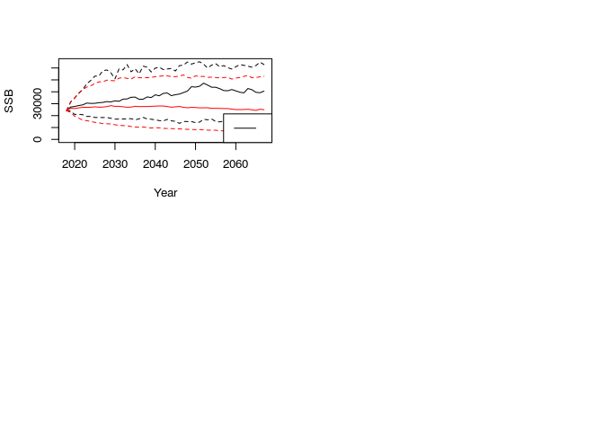
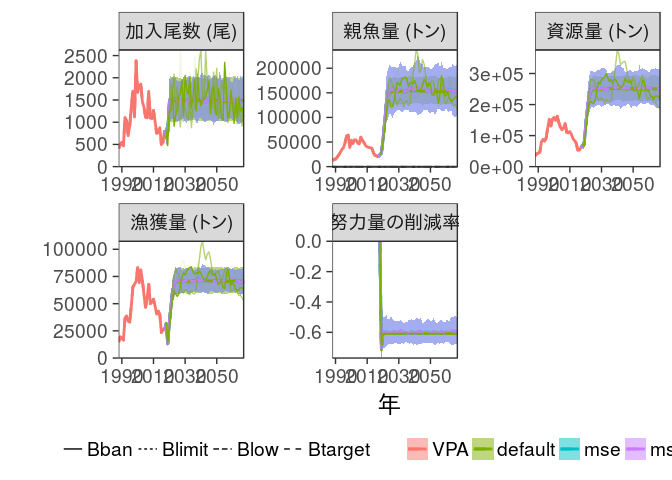
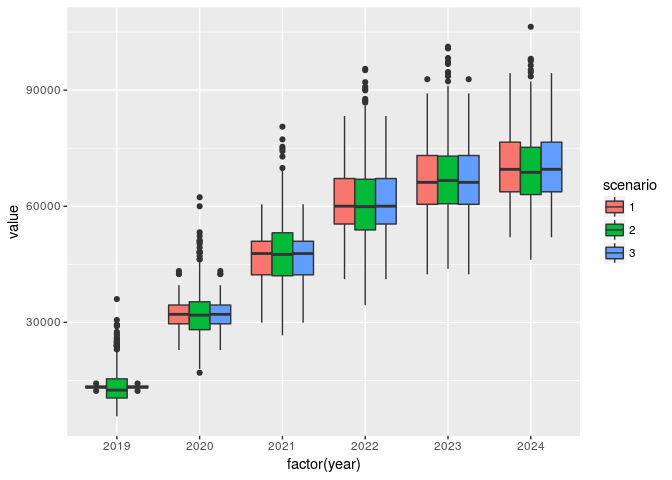

small MSE
================
Momoko Ichinokawa
2019-04-03

``` r
## Global options
library(rmarkdown)
library(knitr)
options(max.print="75")
opts_chunk$set(#echo=FALSE,
               prompt=FALSE,
               tidy=TRUE,
               comment=NA,
               message=FALSE,
               warning=FALSE)
```

# future.rvpaで簡易MSE

## 事前準備

``` r
# 関数の読み込み →
# warningまたは「警告」が出るかもしれませんが，その後動いていれば問題ありません
source("../../rvpa1.9.2.r")
source("../../future2.1.r")
source("../../utilities.r", encoding = "UTF-8")  # ggplotを使ったグラフ作成用の関数
source("future-diff.r")
library(tidyverse)  # うまくインストールできない場合、最新のRを使ってください
caa <- read.csv("../make_report1/caa_pma.csv", row.names = 1)
waa <- read.csv("../make_report1/waa_pma.csv", row.names = 1)
maa <- read.csv("../make_report1/maa_pma.csv", row.names = 1)
dat <- data.handler(caa = caa, waa = waa, maa = maa, M = 0.5)
names(dat)
```

    [1] "caa"        "maa"        "waa"        "index"      "M"         
    [6] "maa.tune"   "waa.catch"  "catch.prop"

``` r
# VPAによる資源量推定
res.pma <- vpa(dat, fc.year = 2015:2017, tf.year = 2008:2010, term.F = "max", 
    stat.tf = "mean", Pope = TRUE, tune = FALSE, p.init = 1)
# VPA結果を使って再生産データを作る
SRdata <- get.SRdata(res.pma, years = 1988:2016)
head(SRdata)
```

    $year
     [1] 1988 1989 1990 1991 1992 1993 1994 1995 1996 1997 1998 1999 2000 2001
    [15] 2002 2003 2004 2005 2006 2007 2008 2009 2010 2011 2012 2013 2014 2015
    [29] 2016
    
    $SSB
     [1] 12199.02 15266.68 15072.03 19114.22 23544.42 28769.36 34764.44
     [8] 38219.49 48535.10 61891.08 63966.56 38839.78 53404.29 47322.39
    [15] 54485.00 54385.04 47917.14 46090.76 59847.97 53370.62 48781.20
    [22] 42719.39 40095.19 39311.04 38332.44 37547.09 27543.26 22881.37
    [29] 22184.28
    
    $R
     [1]  406.0086  498.9652  544.3007  469.6025 1106.8877 1043.4237  696.7049
     [8]  923.9567 1353.1790 1698.8457 1117.5454 2381.1352 1669.1381 1818.3638
    [15] 1858.0043 1458.9524 1334.9288 1116.9433 1100.4598 1693.9768 1090.7172
    [22] 1081.8343 1265.0456 1023.9650  753.1901  764.0987  876.6335  500.9416
    [29]  549.3746

## 再生産モデルのフィット

``` r
# 網羅的なパラメータ設定
SRmodel.list <- expand.grid(SR.rel = c("HS", "BH", "RI"), AR.type = c(0, 1), 
    L.type = c("L1", "L2"))
SR.list <- list()
for (i in 1:nrow(SRmodel.list)) {
    SR.list[[i]] <- fit.SR(SRdata, SR = SRmodel.list$SR.rel[i], method = SRmodel.list$L.type[i], 
        AR = SRmodel.list$AR.type[i], hessian = FALSE)
}

SRmodel.list$AICc <- sapply(SR.list, function(x) x$AICc)
SRmodel.list$delta.AIC <- SRmodel.list$AICc - min(SRmodel.list$AICc)
SR.list <- SR.list[order(SRmodel.list$AICc)]  # AICの小さい順に並べたもの
(SRmodel.list <- SRmodel.list[order(SRmodel.list$AICc), ])  # 結果
```

``` 
   SR.rel AR.type L.type     AICc delta.AIC
7      HS       0     L2 11.68088 0.0000000
9      RI       0     L2 12.30980 0.6289293
8      BH       0     L2 12.35364 0.6727687
2      BH       0     L1 13.79426 2.1133843
3      RI       0     L1 13.87867 2.1977984
5      BH       1     L1 14.09788 2.4170057
6      RI       1     L1 14.10137 2.4204994
10     HS       1     L2 14.32407 2.6431965
1      HS       0     L1 14.75174 3.0708666
12     RI       1     L2 14.99619 3.3153125
11     BH       1     L2 15.05006 3.3691864
4      HS       1     L1 15.68126 4.0003803
```

``` r
# HSのうちR0が低いケース（12番）とAIC最小ケースとの比較
plot(SR.list[[1]]$pred, type = "l", ylim = c(0, 2000))
points(SR.list[[12]]$pred, type = "l", col = 2)
```

<!-- -->

``` r
SRmodel.base <- SR.list[[1]]  # AIC最小モデルを今後使っていく
SRmodel.R1 <- SR.list[[12]]  # 別の加入シナリオ
```

## 将来予測の実施

``` r
future.Fcurrent <- future.vpa(res.pma,
                      multi=1,
                      nyear=50, # 将来予測の年数
                      start.year=2018, # 将来予測の開始年
                      N=100, # 確率的計算の繰り返し回数=>実際の計算では1000~5000回くらいやってください
                      ABC.year=2019, # ABCを計算する年
                      waa.year=2015:2017, # 生物パラメータの参照年
                      maa.year=2015:2017,
                      M.year=2015:2017,
                      is.plot=TRUE, # 結果をプロットするかどうか
                      seed=1,
                      silent=TRUE,
                      recfunc=HS.recAR, # 再生産関係の関数
                      # recfuncに対する引数
                      rec.arg=list(a=SRmodel.base$pars$a,b=SRmodel.base$pars$b,
                                   rho=SRmodel.base$pars$rho, # ここではrho=0なので指定しなくてもOK
                                   sd=SRmodel.base$pars$sd,resid=SRmodel.base$resid))
```

<!-- -->

``` r
future.Fcurrent_R1 <- future.vpa(res.pma,
                      multi=1,
                      nyear=50, # 将来予測の年数
                      start.year=2018, # 将来予測の開始年
                      N=1000, # 確率的計算の繰り返し回数=>実際の計算では1000~5000回くらいやってください
                      ABC.year=2019, # ABCを計算する年
                      waa.year=2015:2017, # 生物パラメータの参照年
                      maa.year=2015:2017,
                      M.year=2015:2017,
                      is.plot=TRUE, # 結果をプロットするかどうか
                      seed=1,
                      silent=TRUE,
                      recfunc=HS.recAR, # 再生産関係の関数
                      # recfuncに対する引数
                      rec.arg=list(a=SRmodel.R1$pars$a,b=SRmodel.R1$pars$b,
                                   rho=SRmodel.R1$pars$rho, # ここではrho=0なので指定しなくてもOK
                                   sd=SRmodel.R1$pars$sd,resid=SRmodel.R1$resid))
```

<!-- -->

``` r
plot.futures(list(future.Fcurrent,future.Fcurrent_R1))
```

<!-- -->

## MSY管理基準値の計算;

``` r
# MSYはbase caseのシナリオをもとにする
MSY.base <- est.MSY(res.pma, # VPAの計算結果
                 future.Fcurrent$input, # 将来予測で使用した引数
                 resid.year=0, 
                 N=100, # 確率的計算の繰り返し回数=>実際の計算では1000~5000回くらいやってください
                 calc.yieldcurve=TRUE,
                 PGY=c(0.6,0.1), # 計算したいPGYレベル。上限と下限の両方が計算される
                 onlylower.pgy=TRUE, # TRUEにするとPGYレベルの上限は計算しない（計算時間の節約になる）
                 B0percent=NULL,
                 Bempirical=NULL
                 ) 
```

    Estimating MSY
    F multiplier= 0.4903466 
    Estimating PGY  60 %
    F multiplier= 1.009095 
    Estimating PGY  10 %
    F multiplier= 1.076097 

<!-- -->

``` r
refs.all <- MSY.base$summary_tb
refs.base <- refs.all %>%
    dplyr::filter(!is.na(RP.definition)) %>% # RP.definitionがNAでないものを抽出
    arrange(desc(SSB)) %>% # SSBを大きい順に並び替え
    select(RP.definition,RP_name,SSB,SSB2SSB0,Catch,Catch.CV,U,Fref2Fcurrent) #　列を並び替え
```

## 簡易MSEの実施

``` r
# 通常の将来予測（デフォルトHCR）
input.abc <- future.Fcurrent$input  # Fcurrentにおける将来予測の引数をベースに将来予測します
input.abc$multi <- derive_RP_value(refs.base, "Btarget0")$Fref2Fcurrent  # currentFへの乗数を'Btarget0'で指定した値に
input.abc$silent <- TRUE
input.abc$HCR <- list(Blim = derive_RP_value(refs.base, "Blimit0")$SSB, Bban = derive_RP_value(refs.base, 
    "Bban0")$SSB, beta = 0.8, year.lag = 0)  # BlimitはBlimit0, BbanはBban0の値
input.abc$N <- 1000
future.default <- do.call(future.vpa, input.abc)  # デフォルトルールの結果→図示などに使う
```

<!-- -->

``` r
# 簡易MSEによる将来予測(加入の仮定はベースケースと同じ)
source("future-diff.r")
input.mse <- input.abc
input.mse$N <- 100
input.mse$use.MSE <- TRUE  # use.MSEをTRUEにする
input.mse$is.plot <- FALSE
future.mse <- do.call(future.vpa, input.mse)

# 異なる加入の仮定を使う場合 MSE.optionsに入れる
# !!use.MSEオプションで、ARありバージョンには十分対応していない→今後の課題!!
input.mse_R1 <- input.mse
input.mse_R1$MSE.options$recfunc <- future.Fcurrent_R1$recfunc
input.mse_R1$MSE.options$rec.arg <- future.Fcurrent_R1$rec.arg
input.mse_R1$N <- 100
future.mse_R1 <- do.call(future.vpa, input.mse)


# 結果の比較
plot_futures(res.pma, list(future.default, future.mse, future.mse_R1), future.name = c("default", 
    "mse", "mse_R1"))
```

<!-- -->

``` r
# 直近の漁獲量の比較
all.table <- purrr::map_dfr(list(future.mse, future.default, future.mse_R1), 
    convert_future_table, .id = "scenario")
all.table %>% dplyr::filter(stat == "catch", year < 2025, year > 2018) %>% ggplot() + 
    geom_boxplot(aes(x = factor(year), y = value, fill = scenario))
```

<!-- -->
